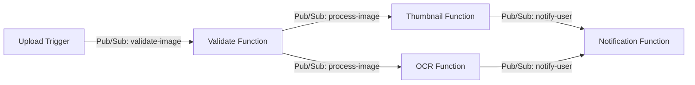

# How to Chain Multiple Cloud Functions Together Using Pub/Sub for a Processing Pipeline

Author: [nawazdhandala](https://www.github.com/nawazdhandala)

Tags: GCP, Cloud Functions, Pub/Sub, Serverless, Data Pipeline

Description: Learn how to build a multi-step serverless processing pipeline by chaining Cloud Functions through Google Cloud Pub/Sub topics for reliable event-driven workflows.

---

Building data processing pipelines used to mean running always-on servers, managing message queues, and dealing with the complexity of distributed systems. With Cloud Functions and Pub/Sub, you can wire together a pipeline where each step is an independent function that triggers automatically when the previous step publishes a message. Each function scales independently, you pay only for what you use, and Pub/Sub handles the reliability layer.

I have been running this pattern in production for about two years now, and it works surprisingly well for most ETL and event processing workloads. Let me walk through how to set it up from scratch.

## The Pipeline Architecture

Let us say we are building an image processing pipeline. A user uploads an image, and we need to:

1. Validate the image format and size
2. Generate a thumbnail
3. Run OCR (text extraction)
4. Store the results and notify the user

Each step is a separate Cloud Function, and they communicate through Pub/Sub topics.



## Creating the Pub/Sub Topics

First, create the topics that will connect your functions. Think of each topic as a stage boundary in your pipeline.

```bash
# Create topics for each pipeline stage
gcloud pubsub topics create validate-image
gcloud pubsub topics create process-image
gcloud pubsub topics create notify-user

# Optionally create dead-letter topics for failed messages
gcloud pubsub topics create validate-image-deadletter
gcloud pubsub topics create process-image-deadletter
```

## Step 1: The Validation Function

This function triggers when a new image is uploaded to Cloud Storage. It checks the file, and if valid, publishes a message to kick off the next stage.

```javascript
// validate/index.js
const { PubSub } = require("@google-cloud/pubsub");
const { Storage } = require("@google-cloud/storage");

const pubsub = new PubSub();
const storage = new Storage();

// Allowed image types and max size (10MB)
const ALLOWED_TYPES = ["image/jpeg", "image/png", "image/webp"];
const MAX_SIZE = 10 * 1024 * 1024;

exports.validateImage = async (event, context) => {
  const bucket = event.bucket;
  const fileName = event.name;

  console.log(`Validating: gs://${bucket}/${fileName}`);

  // Get file metadata to check type and size
  const [metadata] = await storage
    .bucket(bucket)
    .file(fileName)
    .getMetadata();

  const contentType = metadata.contentType;
  const size = parseInt(metadata.size, 10);

  // Validate the image
  if (!ALLOWED_TYPES.includes(contentType)) {
    console.error(`Rejected: invalid content type ${contentType}`);
    return;
  }

  if (size > MAX_SIZE) {
    console.error(`Rejected: file too large (${size} bytes)`);
    return;
  }

  // Validation passed - publish to the next stage
  const message = {
    bucket: bucket,
    fileName: fileName,
    contentType: contentType,
    size: size,
    uploadedAt: new Date().toISOString(),
    pipelineId: context.eventId, // Use event ID as pipeline trace ID
  };

  await pubsub
    .topic("process-image")
    .publishMessage({ json: message });

  console.log(`Validation passed, published to process-image topic`);
};
```

Deploy it with a Cloud Storage trigger.

```bash
# Deploy the validation function triggered by file uploads
gcloud functions deploy validateImage \
  --runtime nodejs18 \
  --trigger-resource my-upload-bucket \
  --trigger-event google.storage.object.finalize \
  --region us-central1 \
  --source ./validate
```

## Step 2: The Thumbnail Function

This function subscribes to the `process-image` topic and generates a thumbnail.

```javascript
// thumbnail/index.js
const { PubSub } = require("@google-cloud/pubsub");
const { Storage } = require("@google-cloud/storage");
const sharp = require("sharp");

const pubsub = new PubSub();
const storage = new Storage();

exports.generateThumbnail = async (message, context) => {
  // Parse the Pub/Sub message payload
  const data = JSON.parse(Buffer.from(message.data, "base64").toString());

  const { bucket, fileName, pipelineId } = data;
  console.log(`[${pipelineId}] Generating thumbnail for ${fileName}`);

  // Download the original image
  const [imageBuffer] = await storage
    .bucket(bucket)
    .file(fileName)
    .download();

  // Generate a 200x200 thumbnail using sharp
  const thumbnailBuffer = await sharp(imageBuffer)
    .resize(200, 200, { fit: "cover" })
    .jpeg({ quality: 80 })
    .toBuffer();

  // Upload the thumbnail to the thumbnails bucket
  const thumbnailName = `thumb_${fileName}`;
  await storage
    .bucket("my-thumbnails-bucket")
    .file(thumbnailName)
    .save(thumbnailBuffer, { contentType: "image/jpeg" });

  // Publish completion message for the notification stage
  await pubsub.topic("notify-user").publishMessage({
    json: {
      pipelineId: pipelineId,
      step: "thumbnail",
      status: "complete",
      originalFile: fileName,
      thumbnailFile: thumbnailName,
    },
  });

  console.log(`[${pipelineId}] Thumbnail generated: ${thumbnailName}`);
};
```

```bash
# Deploy the thumbnail function triggered by Pub/Sub
gcloud functions deploy generateThumbnail \
  --runtime nodejs18 \
  --trigger-topic process-image \
  --region us-central1 \
  --memory 512MB \
  --timeout 120s \
  --source ./thumbnail
```

## Step 3: The OCR Function

This function also subscribes to `process-image`, running in parallel with the thumbnail function.

```javascript
// ocr/index.js
const { PubSub } = require("@google-cloud/pubsub");
const vision = require("@google-cloud/vision");

const pubsub = new PubSub();
const visionClient = new vision.ImageAnnotatorClient();

exports.extractText = async (message, context) => {
  const data = JSON.parse(Buffer.from(message.data, "base64").toString());

  const { bucket, fileName, pipelineId } = data;
  console.log(`[${pipelineId}] Running OCR on ${fileName}`);

  // Use Cloud Vision API to extract text from the image
  const [result] = await visionClient.textDetection(
    `gs://${bucket}/${fileName}`
  );

  const detections = result.textAnnotations;
  const extractedText = detections.length > 0
    ? detections[0].description
    : "";

  // Publish results to the notification topic
  await pubsub.topic("notify-user").publishMessage({
    json: {
      pipelineId: pipelineId,
      step: "ocr",
      status: "complete",
      originalFile: fileName,
      extractedText: extractedText.substring(0, 1000), // Truncate for message size limits
      textLength: extractedText.length,
    },
  });

  console.log(`[${pipelineId}] OCR complete, found ${extractedText.length} chars`);
};
```

```bash
# Deploy the OCR function - also triggered by the same Pub/Sub topic
gcloud functions deploy extractText \
  --runtime nodejs18 \
  --trigger-topic process-image \
  --region us-central1 \
  --memory 1024MB \
  --timeout 300s \
  --source ./ocr
```

## Step 4: The Notification Function

This function collects results from previous stages and notifies the user.

```javascript
// notify/index.js
const { Firestore } = require("@google-cloud/firestore");
const firestore = new Firestore();

exports.notifyUser = async (message, context) => {
  const data = JSON.parse(Buffer.from(message.data, "base64").toString());
  const { pipelineId, step, status } = data;

  console.log(`[${pipelineId}] Received ${step} result: ${status}`);

  // Store each step's result in Firestore, keyed by pipeline ID
  await firestore
    .collection("pipeline-results")
    .doc(pipelineId)
    .set({ [step]: data }, { merge: true });

  // Check if all steps are complete
  const doc = await firestore
    .collection("pipeline-results")
    .doc(pipelineId)
    .get();

  const results = doc.data();
  const allComplete = results.thumbnail && results.ocr;

  if (allComplete) {
    console.log(`[${pipelineId}] All steps complete, sending notification`);
    // Send notification (email, webhook, etc.)
  }
};
```

## Error Handling with Dead-Letter Topics

Pub/Sub supports dead-letter topics, which catch messages that fail processing after a configured number of retries.

```bash
# Create a subscription with dead-letter handling
# (Cloud Functions auto-creates subscriptions, but you can configure them)
gcloud pubsub subscriptions update \
  gcf-process-image-us-central1-generateThumbnail \
  --dead-letter-topic process-image-deadletter \
  --max-delivery-attempts 5
```

## Message Ordering and Idempotency

Two critical things to keep in mind when chaining functions through Pub/Sub:

1. **Messages can be delivered more than once.** Pub/Sub guarantees at-least-once delivery, not exactly-once. Always design your functions to be idempotent - processing the same message twice should produce the same result.

2. **Message ordering is not guaranteed by default.** If ordering matters, use Pub/Sub ordering keys. But for most pipeline patterns where each stage is independent, ordering does not matter.

## Monitoring the Pipeline

Use the pipeline ID we pass through each message to trace a single item through the entire pipeline.

```bash
# Search logs for a specific pipeline run
gcloud logging read 'textPayload:"PIPELINE_ID_HERE"' \
  --limit 50 \
  --format "table(timestamp, resource.labels.function_name, textPayload)"
```

## Wrapping Up

Chaining Cloud Functions through Pub/Sub gives you a serverless processing pipeline where each step is independently deployable, scalable, and monitorable. The pattern works well for ETL workloads, media processing, event-driven workflows, and any scenario where you can decompose a process into discrete steps. Just remember to make each function idempotent, include a correlation ID for tracing, and configure dead-letter topics for messages that repeatedly fail. With those practices in place, you get a reliable pipeline without managing any infrastructure.
