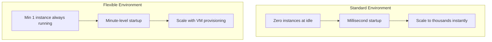

# How to Choose Between App Engine Standard and Flexible Environment for Your Application

Author: [nawazdhandala](https://www.github.com/nawazdhandala)

Tags: GCP, App Engine, App Engine Standard, App Engine Flexible, Serverless, PaaS

Description: A detailed comparison of App Engine Standard and Flexible environments to help you choose the right one based on your application's language, scaling, and infrastructure needs.

---

App Engine has been around since 2008, making it one of the oldest Platform-as-a-Service offerings in the cloud. It lets you deploy applications without managing servers, handling scaling, or worrying about infrastructure. But Google offers two flavors - Standard and Flexible - and picking the wrong one can lead to unexpected costs, cold start issues, or missing features.

Let me break down the differences so you can make an informed choice.

## The Short Version

App Engine Standard runs your application in a sandboxed environment with fast scaling and a generous free tier. App Engine Flexible runs your application in Docker containers on Compute Engine VMs, giving you more control and supporting any runtime.

If you are building a web application in Python, Java, Go, PHP, Node.js, or Ruby and want fast scaling with minimal cost, start with Standard. If you need custom runtimes, native dependencies, or long-running background processes, go with Flexible.

## Scaling Behavior

This is where the two environments differ the most.

**Standard** scales to zero. When nobody is using your application, Google spins down all instances and you pay nothing. When traffic arrives, new instances spin up in milliseconds (for most runtimes). This makes it ideal for applications with variable or unpredictable traffic.

**Flexible** never scales to zero. You always have at least one instance running, even with zero traffic. Instances take minutes to start (because they are full VMs). But once running, Flexible provides more consistent performance with no cold starts.



## Supported Runtimes

**Standard** supports specific runtime versions:

- Python 3.7-3.12
- Java 8, 11, 17, 21
- Go 1.12-1.22
- Node.js 12-20
- PHP 7.4-8.3
- Ruby 2.7-3.2

You must use one of these runtimes. Custom Docker images are not supported in Standard.

**Flexible** supports:

- All the Standard runtimes, plus
- Any language via custom Docker images
- .NET, Rust, Elixir, or anything else that runs in a container

If your application uses a language not in the Standard list, Flexible is your only option.

## Cost Comparison

This is where people get surprised.

**Standard** has a free tier that includes 28 instance-hours per day of F1 instances. For a small application with moderate traffic, this can mean zero cost. Beyond the free tier, you pay per instance-hour, with granular billing at the instance level.

**Flexible** has no free tier. You pay for the Compute Engine VMs running your instances, and since at least one instance is always running, the minimum monthly cost is roughly $30-40 for the smallest configuration.

Here is a rough comparison for a web application handling 100 requests per day:

| | Standard | Flexible |
|---|---|---|
| Monthly cost | $0 (free tier) | $30-40+ |
| Scale to zero | Yes | No |
| Min instances | 0 | 1 |

For a high-traffic application handling millions of requests:

| | Standard | Flexible |
|---|---|---|
| Per-request cost | Lower | Higher |
| Instance flexibility | Limited | High |
| Custom runtime | No | Yes |

## Instance Configuration

**Standard** offers predefined instance classes:

- F1 (default): 128MB memory, 600MHz CPU
- F2: 256MB memory, 1.2GHz CPU
- F4: 512MB memory, 2.4GHz CPU
- F4_1G: 1024MB memory, 2.4GHz CPU

These are lightweight but limited. If your application needs more than 1GB of memory, Standard is not going to work.

**Flexible** lets you configure the VM resources:

```yaml
# app.yaml for Flexible environment with custom resources
runtime: custom
env: flex

resources:
  cpu: 2
  memory_gb: 4
  disk_size_gb: 20

automatic_scaling:
  min_num_instances: 1
  max_num_instances: 10
  cpu_utilization:
    target_utilization: 0.65
```

You can go up to 96 vCPUs and several hundred GB of memory with Flexible.

## Networking

**Standard** has limited networking options. Your application can make outbound HTTP requests but cannot open raw TCP sockets (in first-generation runtimes). Second-generation runtimes (Python 3, Java 11+, etc.) have fewer restrictions.

**Flexible** runs on regular Compute Engine VMs, so it has full networking capabilities. You can place instances in a specific VPC, assign internal IPs, and use Shared VPC. This is important if your application needs to communicate with resources in a private network.

```yaml
# app.yaml - Flexible environment with VPC network configuration
runtime: custom
env: flex

network:
  name: my-vpc
  subnetwork_name: my-subnet
  instance_ip_mode: INTERNAL  # No public IP
```

## Background Processing

**Standard** has strict request deadlines:

- HTTP requests must complete within 60 seconds (10 minutes for task queue requests)
- Background threads are terminated when the request completes

**Flexible** allows:

- Request timeouts up to 60 minutes
- Long-running background processes
- WebSocket connections

If you need to process video, run ML inference, or handle any request that takes more than 60 seconds, Flexible is the better choice.

## Local Development

**Standard** works with the local development server that simulates the App Engine environment:

```bash
# Run Standard environment locally
dev_appserver.py app.yaml
```

**Flexible** runs in Docker, so local development means running your container:

```bash
# Build and run Flexible environment locally
docker build -t my-app .
docker run -p 8080:8080 my-app
```

## Deployment

Both environments use the same deployment command:

```bash
# Deploy to App Engine (works for both Standard and Flexible)
gcloud app deploy app.yaml
```

But the deployment experience differs. Standard deployments typically take 30-60 seconds. Flexible deployments take 5-15 minutes because they build a Docker image and provision VMs.

## When to Choose Standard

Choose Standard when:

- Your application uses a supported runtime without native dependencies
- You want to scale to zero and pay nothing during idle periods
- Your traffic is spiky and you need fast scaling
- Request processing completes within 60 seconds
- You want the lowest possible cost for small to medium applications
- Cold starts are acceptable (or you use min_instances to avoid them)

## When to Choose Flexible

Choose Flexible when:

- You need a custom runtime or language not supported by Standard
- Your application requires native libraries or system packages
- Request processing takes more than 60 seconds
- You need more than 1GB of memory per instance
- You need WebSocket support
- Your application needs to run in a specific VPC
- You need SSH access to the underlying instances for debugging

## Can You Use Both?

Yes. App Engine supports multiple services, and each service can use a different environment. You might run your main web application on Standard for cost efficiency and a media processing service on Flexible for the custom runtime and longer request timeouts.

```yaml
# web-service/app.yaml - Standard environment for the web frontend
runtime: python312
service: default

automatic_scaling:
  min_instances: 0
  max_instances: 10
```

```yaml
# processor-service/app.yaml - Flexible environment for background processing
runtime: custom
env: flex
service: processor

automatic_scaling:
  min_num_instances: 1
  max_num_instances: 5
```

## The Migration Path

Starting with Standard and migrating to Flexible later is straightforward because they use the same routing, deployment, and service model. Going the other direction (Flexible to Standard) can be harder if you depend on Flexible-specific features.

My recommendation: start with Standard unless you have a specific reason to use Flexible. Standard is cheaper, scales faster, and has less operational overhead. Move individual services to Flexible when you hit Standard's limitations, and keep everything else on Standard.

App Engine remains one of the simplest ways to deploy applications to the cloud. Choosing the right environment up front saves you from unexpected bills and awkward migrations later.
