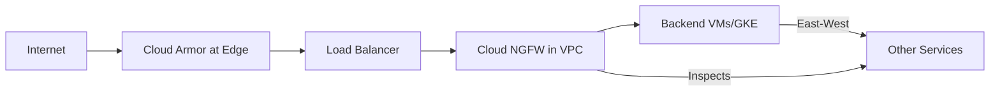

# How to Choose Between Cloud Armor Security Policies and Cloud NGFW for Web Application Protection

Author: [nawazdhandala](https://www.github.com/nawazdhandala)

Tags: GCP, Cloud Armor, Cloud NGFW, Security, Firewall

Description: Understand when to use Cloud Armor security policies versus Cloud Next-Generation Firewall for protecting web applications on Google Cloud.

---

Google Cloud offers two distinct security products that can protect your web applications: Cloud Armor, which operates at the edge with the load balancer, and Cloud NGFW (Next-Generation Firewall), which provides deep packet inspection within your VPC. They sound similar on the surface but operate at different layers of the network stack and complement each other rather than compete. Understanding where each one fits is important for building a solid security posture on GCP.

## Cloud Armor Security Policies

Cloud Armor attaches to Google's Global External HTTP(S) Load Balancer. It inspects incoming HTTP/HTTPS requests at Google's edge network before they reach your backend services. Security policies define rules that allow, deny, rate-limit, or redirect traffic based on various attributes.

```bash
# Create a Cloud Armor security policy
gcloud compute security-policies create web-app-policy \
  --description "Protection for web application"

# Block common web attacks using pre-configured WAF rules
gcloud compute security-policies rules create 1000 \
  --security-policy web-app-policy \
  --expression "evaluatePreconfiguredExpr('sqli-v33-stable')" \
  --action deny-403

gcloud compute security-policies rules create 1001 \
  --security-policy web-app-policy \
  --expression "evaluatePreconfiguredExpr('xss-v33-stable')" \
  --action deny-403

gcloud compute security-policies rules create 1002 \
  --security-policy web-app-policy \
  --expression "evaluatePreconfiguredExpr('rce-v33-stable')" \
  --action deny-403

# Add rate limiting to prevent abuse
gcloud compute security-policies rules create 900 \
  --security-policy web-app-policy \
  --expression "true" \
  --action throttle \
  --rate-limit-threshold-count 200 \
  --rate-limit-threshold-interval-sec 60 \
  --conform-action allow \
  --exceed-action deny-429 \
  --enforce-on-key IP

# Apply the policy to your backend service
gcloud compute backend-services update my-web-backend \
  --security-policy web-app-policy --global
```

**What Cloud Armor does well:**

- Layer 7 (HTTP) inspection and filtering
- DDoS mitigation at Google's network edge
- WAF rules based on OWASP Core Rule Set
- Geographic access controls
- Rate limiting per IP, per header, or per path
- Adaptive Protection with ML-based threat detection
- Bot management with reCAPTCHA integration

**What Cloud Armor does not do:**

- Inspect non-HTTP traffic (TCP, UDP, ICMP)
- Inspect east-west traffic between services within the VPC
- Deep packet inspection of encrypted payloads beyond TLS termination at the load balancer
- Intrusion detection for network-layer attacks

## Cloud NGFW (Next-Generation Firewall)

Cloud NGFW operates within your VPC at the network layer. It provides stateful inspection, intrusion prevention, and threat detection for traffic flowing between VMs, between subnets, and between your VPC and the internet. It goes beyond basic VPC firewall rules by understanding application protocols and detecting malicious patterns in network traffic.

Cloud NGFW comes in tiers:

- **Cloud NGFW Essentials** - basic L3/L4 firewall with firewall policies
- **Cloud NGFW Standard** - adds FQDN-based rules and geo-based filtering
- **Cloud NGFW Enterprise** - adds intrusion prevention (IPS), TLS inspection, and threat detection powered by Palo Alto Networks

```bash
# Create a firewall policy for Cloud NGFW
gcloud compute network-firewall-policies create my-ngfw-policy \
  --global \
  --description "NGFW policy for web tier"

# Create a rule using FQDN filtering (Standard tier)
gcloud compute network-firewall-policies rules create 100 \
  --firewall-policy my-ngfw-policy \
  --direction EGRESS \
  --action allow \
  --dest-fqdns "api.stripe.com,*.googleapis.com" \
  --layer4-configs tcp:443 \
  --global-firewall-policy

# Create a rule to block traffic from specific threat categories (Enterprise)
gcloud compute network-firewall-policies rules create 200 \
  --firewall-policy my-ngfw-policy \
  --direction INGRESS \
  --action deny \
  --src-threat-intelligences iplist-known-malicious-ips \
  --layer4-configs tcp:0-65535 \
  --global-firewall-policy

# Associate the policy with your VPC network
gcloud compute network-firewall-policies associations create \
  --firewall-policy my-ngfw-policy \
  --network my-vpc \
  --global-firewall-policy
```

For Enterprise tier with IPS enabled:

```bash
# Create a security profile for intrusion prevention
gcloud network-security security-profiles create my-ips-profile \
  --type THREAT_PREVENTION \
  --location global

# Create a security profile group
gcloud network-security security-profile-groups create my-security-group \
  --threat-prevention-profile my-ips-profile \
  --location global

# Create a firewall rule that uses the security profile for IPS
gcloud compute network-firewall-policies rules create 300 \
  --firewall-policy my-ngfw-policy \
  --direction INGRESS \
  --action apply_security_profile_group \
  --security-profile-group my-security-group \
  --layer4-configs tcp:80,tcp:443 \
  --global-firewall-policy
```

**What Cloud NGFW does well:**

- Layer 3/4 network traffic filtering
- Intrusion Prevention System (IPS) with threat signatures
- TLS inspection for encrypted traffic analysis
- FQDN-based egress filtering (control which domains your VMs can reach)
- East-west traffic inspection between services
- Threat intelligence integration
- Works for all protocols, not just HTTP

**What Cloud NGFW does not do:**

- WAF-style HTTP request inspection (SQL injection, XSS patterns in HTTP bodies)
- DDoS mitigation at the network edge
- Rate limiting based on HTTP request attributes
- Bot detection and CAPTCHA challenges

## The Key Difference

Cloud Armor is a WAF - it understands HTTP and inspects web requests for application-layer attacks. Cloud NGFW is a network firewall - it understands network protocols and inspects packets for network-layer threats.

Think of it this way:

- Cloud Armor asks: "Is this HTTP request malicious?"
- Cloud NGFW asks: "Is this network traffic malicious?"

They operate at different points in the traffic flow:



## When to Use Each

**Use Cloud Armor when:**

1. You need to protect HTTP/HTTPS endpoints from web application attacks
2. DDoS protection at the edge is required
3. You want WAF rules for SQL injection, XSS, and similar web attacks
4. Rate limiting based on HTTP attributes is needed
5. Geographic access restrictions for web traffic

**Use Cloud NGFW when:**

1. You need to control network traffic between internal services
2. Intrusion prevention for network-level threats is required
3. You need TLS inspection for encrypted east-west traffic
4. FQDN-based egress filtering is needed (e.g., only allow VMs to reach specific domains)
5. You must inspect non-HTTP traffic (database connections, custom protocols)

## Using Both Together

For comprehensive protection, use both. Cloud Armor handles the perimeter defense at the HTTP layer, while Cloud NGFW provides defense in depth within the VPC.

A typical layered architecture:

1. **Cloud Armor** blocks web attacks, rate limits abusive clients, and mitigates DDoS at the edge
2. **Cloud NGFW** inspects traffic between services, prevents lateral movement, blocks known malicious IPs, and provides IPS for internal traffic
3. **VPC firewall rules** provide basic allow/deny at the instance level as a last line of defense

This defense-in-depth approach means that even if an attacker bypasses one layer, the next layer provides additional protection.

## Cost Considerations

Cloud Armor Standard tier is included with the load balancer. Cloud Armor Managed Protection Plus costs $3,000/month. Cloud NGFW pricing depends on the tier - Essentials is free (basic firewall rules), Standard adds per-rule costs, and Enterprise (with IPS) charges based on traffic volume inspected.

For most web applications, starting with Cloud Armor for edge protection and Cloud NGFW Essentials for internal segmentation covers the fundamentals without significant cost.

## Recommendation

Deploy Cloud Armor for every public-facing web application on GCP. It is the first line of defense and the simplest to set up. Then layer on Cloud NGFW based on your internal security requirements. If you handle sensitive data, regulated workloads, or need to demonstrate defense-in-depth for compliance, Cloud NGFW Enterprise with IPS is worth the investment.
