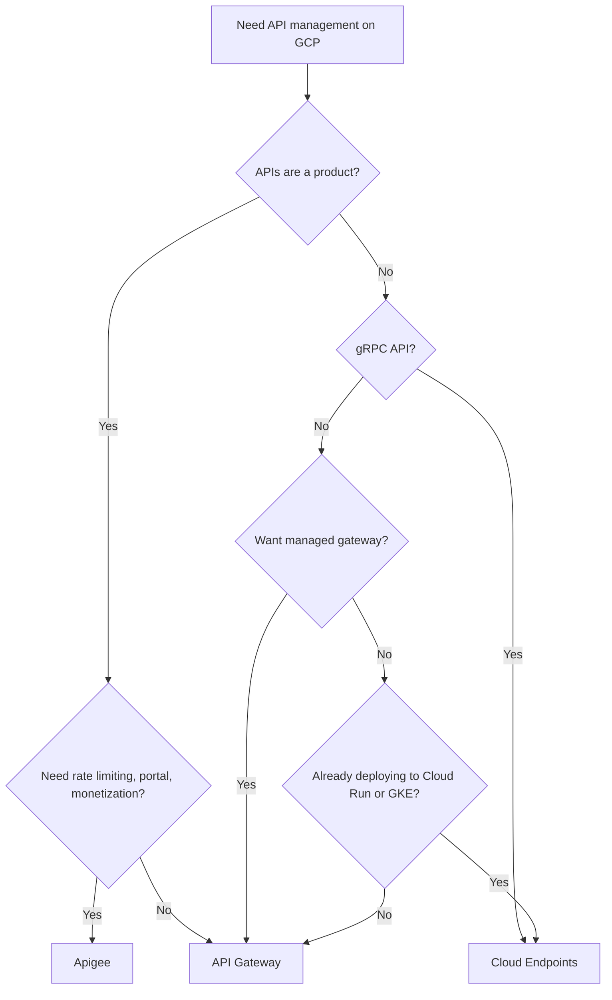

# How to Choose Between Cloud Endpoints Apigee and API Gateway for API Management on GCP

Author: [nawazdhandala](https://www.github.com/nawazdhandala)

Tags: GCP, Cloud Endpoints, Apigee, API Gateway, API Management, APIs

Description: A clear comparison of Google Cloud's three API management options to help you pick the right one for your API strategy and budget.

---

Google Cloud has three API management products: Cloud Endpoints, API Gateway, and Apigee. Having three options for what seems like the same problem is confusing, and the naming does not help. Each product targets a different use case and level of sophistication. Here is how to sort them out.

## The Three Products

**Cloud Endpoints** is a lightweight API management proxy based on the Extensible Service Proxy (ESP). It sits in front of your API, handles authentication, and provides monitoring. You deploy ESP alongside your application.

**API Gateway** is a fully managed API gateway service. You upload an OpenAPI spec, and Google provisions a managed gateway. No infrastructure to deploy or manage.

**Apigee** is a full-featured API management platform for enterprises. It includes API proxying, developer portals, monetization, analytics, and extensive policy capabilities.

Think of it as a progression: Cloud Endpoints is basic, API Gateway is intermediate, and Apigee is the enterprise solution.

## Feature Comparison

| Feature | Cloud Endpoints | API Gateway | Apigee |
|---------|----------------|-------------|--------|
| Deployment model | Sidecar proxy (ESP) | Fully managed | Managed or hybrid |
| API definition | OpenAPI 2.0 | OpenAPI 2.0 | OpenAPI, gRPC, SOAP |
| Authentication | API keys, JWT, Firebase Auth, Google ID | API keys, JWT, Google ID | API keys, OAuth 2.0, JWT, SAML |
| Rate limiting | No | No | Yes (Spike Arrest, Quota) |
| Request/response transformation | No | No | Yes (extensive policies) |
| Developer portal | No | No | Yes (built-in) |
| Analytics | Cloud Monitoring integration | Cloud Monitoring integration | Built-in advanced analytics |
| Monetization | No | No | Yes |
| Caching | No | No | Yes |
| Custom policies | No | No | Yes (JavaScript, Python, Java) |
| Cost | Free (you pay for compute) | $3.50 per million calls | Starts at ~$500/month |
| Best for | Internal APIs, gRPC | Simple public APIs | Enterprise API programs |

## Cloud Endpoints - The Lightweight Option

Cloud Endpoints works by deploying the Extensible Service Proxy (ESP or ESPv2) as a sidecar container alongside your application. It validates API keys, verifies JWT tokens, and sends telemetry to Cloud Monitoring.

### When to Use Cloud Endpoints

- Internal APIs between microservices
- gRPC services that need API management
- You want API monitoring without the cost of a full API gateway
- Your backend runs on Cloud Run, GKE, or Compute Engine

```yaml
# OpenAPI spec for Cloud Endpoints
swagger: "2.0"
info:
  title: "My API"
  version: "1.0.0"
host: "my-api-xxx.run.app"
basePath: "/"
schemes:
  - "https"
paths:
  /users:
    get:
      summary: "List users"
      operationId: "listUsers"
      produces:
        - "application/json"
      # Require an API key for this endpoint
      security:
        - api_key: []
      responses:
        200:
          description: "Success"
  /users/{id}:
    get:
      summary: "Get a user"
      operationId: "getUser"
      parameters:
        - name: id
          in: path
          required: true
          type: string
      security:
        - api_key: []
      responses:
        200:
          description: "Success"
securityDefinitions:
  api_key:
    type: "apiKey"
    name: "key"
    in: "query"
```

Deploy it with Cloud Run:

```bash
# Deploy the API configuration
gcloud endpoints services deploy openapi-spec.yaml

# Deploy your backend with ESP as a sidecar on Cloud Run
gcloud run deploy my-api \
    --image=gcr.io/my-project/my-api:latest \
    --region=us-central1 \
    --set-env-vars="ESPv2_ARGS=--cors_preset=basic"

# Or use the ESPv2 container as a separate service
gcloud run deploy esp-proxy \
    --image=gcr.io/endpoints-release/endpoints-runtime-serverless:2 \
    --set-env-vars="ENDPOINTS_SERVICE_NAME=my-api-xxx.run.app" \
    --region=us-central1
```

### Cloud Endpoints Limitations

- No rate limiting or quota management
- No request/response transformation
- No developer portal
- Limited to API key and JWT authentication
- You must deploy and manage the ESP proxy yourself

## API Gateway - The Managed Middle Ground

API Gateway is fully managed. You upload an OpenAPI spec, and Google creates a gateway endpoint. No proxy to deploy, no infrastructure to manage.

### When to Use API Gateway

- Simple public APIs that need authentication and monitoring
- Serverless backends on Cloud Functions or Cloud Run
- You want a managed gateway without Apigee's complexity or cost
- APIs that need basic security but not advanced features

```yaml
# OpenAPI spec for API Gateway
swagger: "2.0"
info:
  title: "Orders API"
  version: "1.0.0"
schemes:
  - "https"
produces:
  - "application/json"
paths:
  /orders:
    get:
      summary: "List orders"
      operationId: "listOrders"
      # Route to a Cloud Function backend
      x-google-backend:
        address: https://us-central1-my-project.cloudfunctions.net/list-orders
      security:
        - api_key: []
      responses:
        200:
          description: "Success"
    post:
      summary: "Create an order"
      operationId: "createOrder"
      x-google-backend:
        address: https://us-central1-my-project.cloudfunctions.net/create-order
      security:
        - google_id_token:
            - "https://my-api.example.com"
      responses:
        201:
          description: "Created"
securityDefinitions:
  api_key:
    type: "apiKey"
    name: "x-api-key"
    in: "header"
  google_id_token:
    authorizationUrl: ""
    flow: "implicit"
    type: "oauth2"
    x-google-issuer: "https://accounts.google.com"
    x-google-jwks_uri: "https://www.googleapis.com/oauth2/v3/certs"
    x-google-audiences: "https://my-api.example.com"
```

Deploy the API Gateway:

```bash
# Create the API
gcloud api-gateway apis create orders-api

# Create an API config from the OpenAPI spec
gcloud api-gateway api-configs create orders-config \
    --api=orders-api \
    --openapi-spec=openapi-spec.yaml

# Create the gateway
gcloud api-gateway gateways create orders-gateway \
    --api=orders-api \
    --api-config=orders-config \
    --location=us-central1

# Get the gateway URL
gcloud api-gateway gateways describe orders-gateway \
    --location=us-central1 \
    --format="get(defaultHostname)"
```

### API Gateway Limitations

- No rate limiting or quota management
- No request/response transformation
- No developer portal
- Limited routing capabilities
- Cannot inspect or modify request/response bodies

## Apigee - The Enterprise Platform

Apigee is a complete API management platform. It is what you use when APIs are a product, not just an implementation detail.

### When to Use Apigee

- APIs are a product (external developer programs)
- You need rate limiting, quota management, and monetization
- Complex API policies (request transformation, caching, mediation)
- You want a developer portal for API consumers
- Enterprise compliance requirements
- Multi-cloud API management

```bash
# Apigee setup is more involved - typically done through the UI or Terraform
# Here is a Terraform example

# Create an Apigee organization
resource "google_apigee_organization" "org" {
  project_id = "my-project"
  analytics_region = "us-central1"
  authorized_network = google_compute_network.apigee_network.id
}

# Create an environment
resource "google_apigee_environment" "env" {
  org_id = google_apigee_organization.org.id
  name   = "prod"
}
```

An Apigee proxy with rate limiting and caching:

```xml
<!-- Apigee proxy configuration with policies -->
<!-- ProxyEndpoint handles incoming requests -->
<?xml version="1.0" encoding="UTF-8" standalone="yes"?>
<ProxyEndpoint name="default">
    <PreFlow name="PreFlow">
        <Request>
            <!-- Verify the API key -->
            <Step><Name>VA-VerifyApiKey</Name></Step>
            <!-- Apply rate limiting -->
            <Step><Name>SA-SpikeArrest</Name></Step>
            <!-- Check developer quota -->
            <Step><Name>Q-DeveloperQuota</Name></Step>
        </Request>
    </PreFlow>
    <Flows>
        <Flow name="GetOrders">
            <Condition>(proxy.pathsuffix MatchesPath "/orders") and (request.verb = "GET")</Condition>
            <Response>
                <!-- Cache the response for 5 minutes -->
                <Step><Name>RC-ResponseCache</Name></Step>
            </Response>
        </Flow>
    </Flows>
    <RouteRule name="default">
        <TargetEndpoint>default</TargetEndpoint>
    </RouteRule>
</ProxyEndpoint>
```

### Apigee Strengths

- Full API lifecycle management
- Advanced security policies
- Built-in analytics and developer portal
- Monetization for API products
- API versioning and revision management
- Custom policies with JavaScript, Python, or Java

### Apigee Limitations

- Expensive (minimum ~$500/month for pay-as-you-go)
- Complex to set up and learn
- Overkill for internal-only APIs
- Setup and provisioning takes time

## Decision Flow



## Cost Summary

| Service | Pricing Model | Estimated Cost (1M calls/month) |
|---------|--------------|-------------------------------|
| Cloud Endpoints | Free (compute costs only) | $0 (plus backend compute) |
| API Gateway | $3.50 per million calls | ~$3.50 |
| Apigee (pay-as-you-go) | Base fee + per call | ~$500+ |
| Apigee (subscription) | Annual contract | ~$10,000+/year |

## Practical Guidance

If you are building internal microservices and just need authentication and monitoring: **Cloud Endpoints**. It is free and gets the job done.

If you have a straightforward public API and want a managed gateway without managing proxies: **API Gateway**. It is cheap and simple.

If APIs are a revenue center, you have external developers consuming your APIs, or you need advanced security and traffic management: **Apigee**. The cost is justified when APIs generate business value.

Do not choose Apigee just because it has more features. The operational complexity and cost are significant. Start simple and upgrade when you genuinely need the capabilities.
