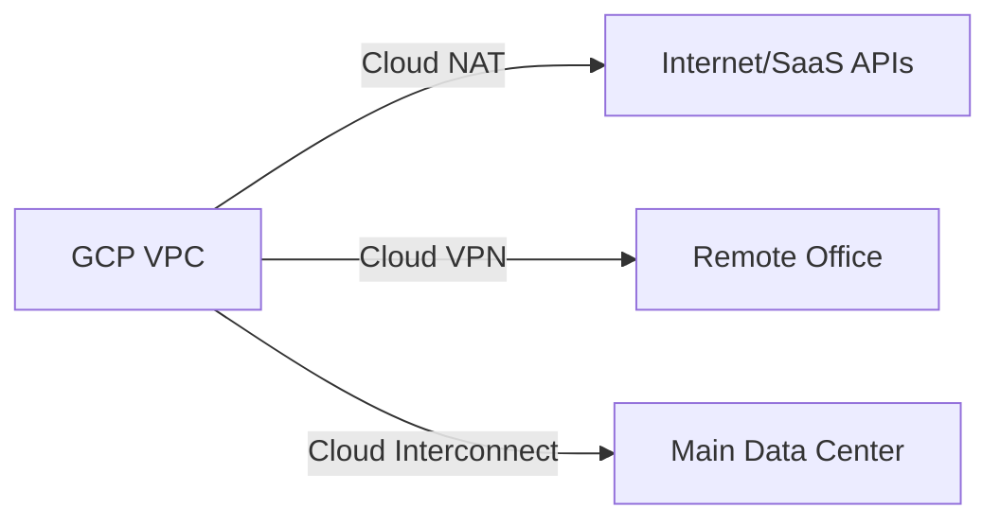

# How to Choose Between Cloud NAT Cloud VPN and Cloud Interconnect for Network Egress

Author: [nawazdhandala](https://www.github.com/nawazdhandala)

Tags: GCP, Cloud NAT, Cloud VPN, Cloud Interconnect, Networking

Description: A practical comparison of Cloud NAT, Cloud VPN, and Cloud Interconnect to help you select the right network egress strategy on Google Cloud.

---

Network egress on Google Cloud Platform is one of those topics that seems straightforward until you realize there are multiple ways to get traffic out of your VPC, and each has different cost profiles, performance characteristics, and use cases. Cloud NAT, Cloud VPN, and Cloud Interconnect all handle outbound traffic, but they solve fundamentally different problems. Let me walk through when each one makes sense.

## Cloud NAT - Internet Access Without Public IPs

Cloud NAT provides outbound internet connectivity for VM instances and GKE pods that do not have external IP addresses. It translates private IP addresses to public IP addresses so your resources can reach the internet while remaining inaccessible from the outside.

Think of Cloud NAT as your default internet gateway for private workloads. It is not about connecting to on-premises infrastructure or creating encrypted tunnels - it is simply about letting private resources reach the public internet.

```bash
# Create a Cloud Router (required for Cloud NAT)
gcloud compute routers create my-router \
  --network my-vpc \
  --region us-central1

# Create a Cloud NAT gateway using automatic IP allocation
gcloud compute routers nats create my-nat-gateway \
  --router my-router \
  --region us-central1 \
  --auto-allocate-nat-external-ips \
  --nat-all-subnet-ip-ranges

# Or use manual IP allocation for predictable egress IPs
gcloud compute addresses create nat-ip-1 --region us-central1

gcloud compute routers nats create my-nat-gateway \
  --router my-router \
  --region us-central1 \
  --nat-external-ip-pool nat-ip-1 \
  --nat-all-subnet-ip-ranges
```

**When to use Cloud NAT:**

- Your VMs or GKE pods need to download packages, call external APIs, or reach SaaS services
- You want to avoid assigning public IPs to individual instances for security reasons
- You need predictable egress IPs for allowlisting with external services
- You want to enforce that all internet access goes through a controlled gateway

**Cloud NAT does not help with:**

- Connecting to on-premises networks
- Providing encrypted tunnels between sites
- Handling inbound traffic from the internet

## Cloud VPN - Encrypted Tunnels to Other Networks

Cloud VPN creates IPsec encrypted tunnels between your GCP VPC and another network, whether that is an on-premises data center, another cloud provider, or a remote office. Traffic flows through the public internet but is encrypted end-to-end.

GCP offers two types of Cloud VPN:

- **HA VPN** - the recommended option, provides 99.99% SLA with two tunnels
- **Classic VPN** - older option with a single tunnel and 99.9% SLA

```bash
# Create an HA VPN gateway
gcloud compute vpn-gateways create my-ha-vpn \
  --network my-vpc \
  --region us-central1

# Create an external VPN gateway (representing the on-premises device)
gcloud compute external-vpn-gateways create my-peer-gateway \
  --interfaces 0=203.0.113.1,1=203.0.113.2

# Create a Cloud Router for dynamic routing
gcloud compute routers create vpn-router \
  --network my-vpc \
  --region us-central1 \
  --asn 65001

# Create VPN tunnels
gcloud compute vpn-tunnels create tunnel-0 \
  --vpn-gateway my-ha-vpn \
  --peer-external-gateway my-peer-gateway \
  --peer-external-gateway-interface 0 \
  --region us-central1 \
  --ike-version 2 \
  --shared-secret "your-secret-key" \
  --router vpn-router \
  --vpn-gateway-interface 0

# Configure BGP session on the Cloud Router
gcloud compute routers add-interface vpn-router \
  --interface-name tunnel-0-iface \
  --vpn-tunnel tunnel-0 \
  --ip-address 169.254.0.1 \
  --mask-length 30 \
  --region us-central1

gcloud compute routers add-bgp-peer vpn-router \
  --peer-name peer-0 \
  --interface tunnel-0-iface \
  --peer-ip-address 169.254.0.2 \
  --peer-asn 65002 \
  --region us-central1
```

**When to use Cloud VPN:**

- You need to connect GCP to an on-premises data center or another cloud
- Traffic volumes are moderate (up to 3 Gbps per tunnel, multiple tunnels possible)
- You need encryption for data in transit
- You want a quick setup without physical infrastructure changes
- Budget is a consideration - VPN is much cheaper than Interconnect

**Cloud VPN limitations:**

- Throughput is limited by tunnel capacity (3 Gbps per tunnel)
- Traffic traverses the public internet, so latency can vary
- Not suitable for latency-sensitive workloads that need consistent sub-millisecond performance

## Cloud Interconnect - Dedicated Private Connectivity

Cloud Interconnect provides a direct physical connection between your on-premises network and Google's network. Traffic does not traverse the public internet at all. There are two options:

- **Dedicated Interconnect** - a physical cross-connect at a Google colocation facility (10 Gbps or 100 Gbps per link)
- **Partner Interconnect** - connectivity through a supported service provider (50 Mbps to 50 Gbps)

```bash
# List available colocation facilities for Dedicated Interconnect
gcloud compute interconnects locations list

# Create an Interconnect attachment (VLAN attachment)
gcloud compute interconnects attachments dedicated create my-attachment \
  --router my-router \
  --interconnect my-interconnect \
  --region us-central1 \
  --bandwidth 10g

# Configure the Cloud Router with a BGP session for the attachment
gcloud compute routers add-interface my-router \
  --interface-name attachment-iface \
  --interconnect-attachment my-attachment \
  --ip-address 169.254.100.1 \
  --mask-length 29 \
  --region us-central1
```

**When to use Cloud Interconnect:**

- You transfer large volumes of data between on-premises and GCP (terabytes per day)
- You need consistent, predictable low latency
- You want to avoid internet egress charges (Interconnect has lower egress pricing)
- Compliance requires that data never traverse the public internet
- You need high bandwidth (10 Gbps to 200 Gbps with link aggregation)

**Cloud Interconnect considerations:**

- Dedicated Interconnect requires physical presence at a colocation facility
- Setup takes weeks to months for Dedicated, days for Partner
- Higher base cost than VPN
- Minimum commitment periods for some configurations

## Comparison Table

| Feature | Cloud NAT | Cloud VPN | Cloud Interconnect |
|---------|-----------|-----------|-------------------|
| Purpose | Internet egress | Site-to-site tunnel | Private dedicated link |
| Encryption | N/A | IPsec (built-in) | Optional (MACsec) |
| Bandwidth | Scales with instances | 3 Gbps per tunnel | 10-200 Gbps |
| Latency | Internet latency | Internet latency | Low, consistent |
| Setup time | Minutes | Hours | Days to months |
| Monthly cost | ~$0.045/hr + data | ~$0.075/hr + data | $1,700+/month |
| Egress pricing | Standard internet | Standard internet | Reduced rates |
| Use case | Internet access | Hybrid connectivity | High-volume hybrid |

## Combining These Services

These services are not mutually exclusive. A typical hybrid architecture uses all three:

- **Cloud NAT** for GKE pods and VMs that need to reach the public internet
- **Cloud VPN** as a backup path or for connecting to smaller remote offices
- **Cloud Interconnect** as the primary high-bandwidth link to the main data center



## Cost Optimization Tips

1. **Use Cloud NAT with private GKE clusters** to avoid paying for external IPs on every node
2. **Size your VPN tunnels** based on actual throughput needs - you pay per tunnel hour
3. **If your monthly egress through VPN exceeds a few terabytes**, calculate whether Interconnect would be cheaper due to reduced egress rates
4. **Use Partner Interconnect** if you need Interconnect-level performance but cannot justify a Dedicated connection

## The Decision Path

Start by asking: where does the traffic need to go?

- **To the public internet** - Cloud NAT
- **To on-premises, low to moderate volume** - Cloud VPN
- **To on-premises, high volume or latency-sensitive** - Cloud Interconnect
- **To another cloud provider** - Cloud VPN (or Cross-Cloud Interconnect for high volume)

The answer is usually straightforward once you frame the question correctly.
