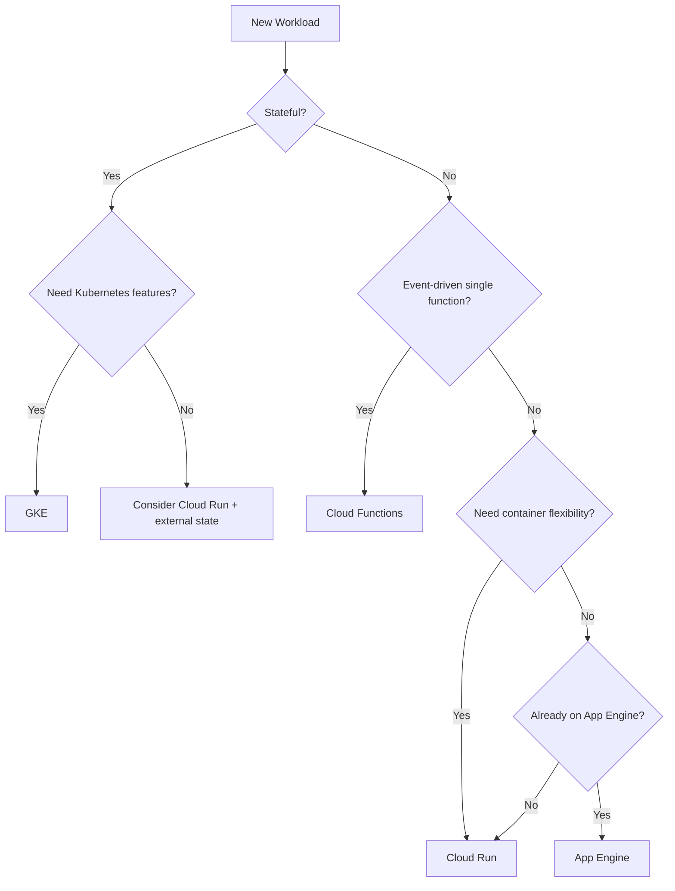

# How to Choose Between Cloud Run Cloud Functions App Engine and GKE for Your Workload

Author: [nawazdhandala](https://www.github.com/nawazdhandala)

Tags: GCP, Cloud Run, Cloud Functions, App Engine, GKE, Serverless, Kubernetes

Description: A practical comparison of GCP compute options to help you pick the right platform for your workload based on real-world requirements.

---

Google Cloud gives you at least four solid options for running application workloads: Cloud Run, Cloud Functions, App Engine, and GKE. Each one works, and you can build production systems on any of them. But picking the wrong one means you end up fighting the platform instead of working with it. This guide breaks down when each option makes sense, based on workload characteristics rather than marketing bullet points.

## The Quick Decision Framework

Before going deep, here is a fast way to narrow it down:

- **Cloud Functions**: You need to run small pieces of code in response to events. No long-running processes. Think webhook handlers, file processing triggers, Pub/Sub message handlers.
- **Cloud Run**: You have a containerized application or API. It can be stateless. You want automatic scaling including scale-to-zero. This is the default choice for most new projects.
- **App Engine**: You want a PaaS with managed deployment, traffic splitting, and versioning. Your app fits a standard runtime (Python, Node, Go, Java, etc.). You do not want to think about containers.
- **GKE**: You need full Kubernetes. You have complex networking, stateful workloads, GPUs, specific scheduling needs, or you are running many microservices that benefit from a shared platform.

## Cloud Functions - Event-Driven Glue Code

Cloud Functions is Google's function-as-a-service offering. You deploy a single function, and it runs in response to HTTP requests or cloud events.

**Best for**:
- Lightweight event handlers (Pub/Sub triggers, Cloud Storage file uploads, Firestore changes)
- Webhook endpoints
- Scheduled tasks (with Cloud Scheduler)
- Glue code between services

**Limitations**:
- Maximum execution time of 60 minutes (2nd gen)
- Limited concurrency control
- Cold starts can add latency
- Not great for complex applications with multiple endpoints

Here is what a typical Cloud Functions deployment looks like:

```python
# A Cloud Function triggered by Pub/Sub messages
# Processes uploaded images and stores thumbnails
import functions_framework
from google.cloud import storage
from PIL import Image
import io

@functions_framework.cloud_event
def process_image(cloud_event):
    """Triggered when a message is published to the Pub/Sub topic."""
    data = cloud_event.data
    bucket_name = data["message"]["attributes"]["bucket"]
    file_name = data["message"]["attributes"]["name"]

    # Download the original image
    client = storage.Client()
    bucket = client.bucket(bucket_name)
    blob = bucket.blob(file_name)
    image_data = blob.download_as_bytes()

    # Create a thumbnail
    image = Image.open(io.BytesIO(image_data))
    image.thumbnail((200, 200))

    # Upload the thumbnail
    output = io.BytesIO()
    image.save(output, format='JPEG')
    thumb_blob = bucket.blob(f"thumbnails/{file_name}")
    thumb_blob.upload_from_string(output.getvalue(), content_type='image/jpeg')
```

```bash
# Deploy the function
gcloud functions deploy process-image \
    --gen2 \
    --runtime=python311 \
    --region=us-central1 \
    --trigger-topic=image-uploads \
    --memory=512MB \
    --timeout=120s
```

## Cloud Run - The Default Choice for Most Workloads

Cloud Run takes container images and runs them as services. It handles scaling, HTTPS, and load balancing. It scales to zero when idle and scales up quickly under load.

**Best for**:
- Web APIs and microservices
- Web applications (backends and some frontends)
- gRPC services
- Background job processing (Cloud Run jobs)
- Anything that fits in a container and is stateless

**Limitations**:
- Stateless by design (no local persistent storage between requests)
- Maximum request timeout of 60 minutes
- No GPU support (as of early 2026)
- WebSocket connections limited to 60 minutes

```dockerfile
# Dockerfile for a typical Cloud Run service
FROM python:3.11-slim

WORKDIR /app
COPY requirements.txt .
RUN pip install --no-cache-dir -r requirements.txt
COPY . .

# Cloud Run sets the PORT environment variable
CMD ["gunicorn", "--bind", "0.0.0.0:8080", "--workers", "4", "app:app"]
```

```bash
# Deploy to Cloud Run
gcloud run deploy my-api \
    --source=. \
    --region=us-central1 \
    --allow-unauthenticated \
    --min-instances=1 \
    --max-instances=100 \
    --memory=512Mi \
    --cpu=1
```

Cloud Run is the best starting point for most new projects because it offers the simplicity of serverless with the flexibility of containers. If your workload outgrows Cloud Run, moving to GKE is a natural progression since you already have containerized code.

## App Engine - The Original PaaS

App Engine has been around since 2008. It comes in two flavors: Standard (sandboxed runtimes, fast scaling, scale-to-zero) and Flexible (custom runtimes on VMs, slower scaling).

**Best for**:
- Traditional web applications
- Teams that want automatic versioning and traffic splitting built in
- Projects that benefit from App Engine's structured environment (memcache, task queues, cron)
- Legacy applications already on App Engine

**Limitations**:
- One App Engine app per project (this is the big one)
- Standard environment has limited runtime support
- Flexible environment is slower to scale and does not scale to zero
- Vendor lock-in with some App Engine-specific APIs

```yaml
# app.yaml for App Engine Standard
runtime: python311
instance_class: F2

automatic_scaling:
  min_instances: 1
  max_instances: 10
  target_cpu_utilization: 0.65

env_variables:
  DATABASE_URL: "postgresql://user:pass@/dbname?host=/cloudsql/project:region:instance"
```

```bash
# Deploy to App Engine
gcloud app deploy

# Split traffic between versions for canary deployments
gcloud app services set-traffic default \
    --splits=v1=90,v2=10
```

Honestly, for new projects, Cloud Run is usually a better choice than App Engine. The one-app-per-project limitation alone is a significant constraint. But if you already have App Engine workloads, there is no rush to migrate off.

## GKE - Full Kubernetes Control

Google Kubernetes Engine is managed Kubernetes. You get the full Kubernetes API, ecosystem tools, and operational model.

**Best for**:
- Complex microservice architectures (10+ services)
- Workloads requiring GPUs
- Stateful applications (databases, message queues)
- Applications needing specific networking (service mesh, network policies)
- Teams already invested in Kubernetes tooling
- Multi-cloud or hybrid deployments

**Limitations**:
- Operational complexity (even with Autopilot)
- Higher base cost (cluster management fee + node costs)
- Steeper learning curve
- Overkill for simple applications

```yaml
# A typical Kubernetes deployment on GKE
apiVersion: apps/v1
kind: Deployment
metadata:
  name: my-api
spec:
  replicas: 3
  selector:
    matchLabels:
      app: my-api
  template:
    metadata:
      labels:
        app: my-api
    spec:
      containers:
        - name: my-api
          image: gcr.io/my-project/my-api:latest
          ports:
            - containerPort: 8080
          resources:
            requests:
              cpu: "250m"
              memory: "256Mi"
            limits:
              cpu: "500m"
              memory: "512Mi"
          # Health checks for rolling updates
          readinessProbe:
            httpGet:
              path: /health
              port: 8080
            initialDelaySeconds: 5
          livenessProbe:
            httpGet:
              path: /health
              port: 8080
            initialDelaySeconds: 10
```

## Decision Matrix

Here is a more detailed comparison to help with specific requirements:



| Requirement | Cloud Functions | Cloud Run | App Engine | GKE |
|-------------|----------------|-----------|------------|-----|
| Scale to zero | Yes | Yes | Standard only | No |
| Custom containers | No (2nd gen: yes) | Yes | Flexible only | Yes |
| GPU support | No | No | No | Yes |
| WebSockets | Limited | Yes (60 min) | Yes | Yes |
| gRPC | No | Yes | No | Yes |
| Min latency | Higher (cold start) | Low | Low | Lowest |
| Ops overhead | None | None | Low | High |
| Cost at zero traffic | $0 | $0 | $0 (Std) | Cluster fee |
| Max request duration | 60 min | 60 min | Varies | Unlimited |

## Cost Comparison

Costs vary wildly by workload pattern. Here are rough guidelines:

- **Bursty, low-traffic**: Cloud Functions or Cloud Run (pay per invocation/request)
- **Steady moderate traffic**: Cloud Run with min instances, or App Engine Standard
- **High sustained traffic**: GKE (more cost-efficient at scale due to reserved capacity)
- **Idle most of the time**: Cloud Functions or Cloud Run (scale-to-zero means zero cost when idle)

## My Recommendation

If you are starting a new project and do not have strong opinions yet, start with **Cloud Run**. It gives you the best balance of simplicity, flexibility, and cost efficiency. You can always move to GKE later if you outgrow it, and your code is already containerized so the transition is smooth. Use Cloud Functions for event-driven glue code alongside your Cloud Run services. Reserve GKE for when you genuinely need Kubernetes capabilities.
