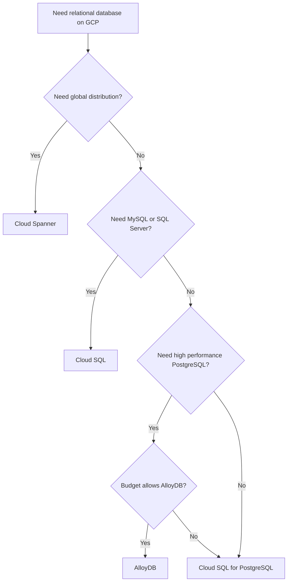

# How to Choose Between Cloud SQL Cloud Spanner and AlloyDB for Your Database Workload

Author: [nawazdhandala](https://www.github.com/nawazdhandala)

Tags: GCP, Cloud SQL, Cloud Spanner, AlloyDB, Database, PostgreSQL, MySQL

Description: A practical comparison of Google Cloud's managed relational database options to help you select the right one for your workload characteristics.

---

Google Cloud offers three managed relational database services, and picking the right one matters because migrating between them later is painful. Cloud SQL is the general-purpose workhorse. Cloud Spanner is the globally distributed option. AlloyDB is the high-performance PostgreSQL-compatible option. Each one targets a different set of requirements, and understanding those requirements upfront saves you from costly re-architecture down the road.

## The Short Version

- **Cloud SQL**: You need MySQL, PostgreSQL, or SQL Server with standard performance. Budget-conscious. Workload fits in a single region. Up to 128 vCPUs and 864 GB RAM.
- **Cloud Spanner**: You need global distribution, strong consistency across regions, and virtually unlimited horizontal scaling. You can accept a non-standard SQL dialect (GoogleSQL) or use the PostgreSQL interface.
- **AlloyDB**: You need PostgreSQL compatibility with much higher performance than Cloud SQL for PostgreSQL. Heavy transactional and analytical workloads. Single-region is fine.

## Cloud SQL - The Standard Choice

Cloud SQL is managed MySQL, PostgreSQL, or SQL Server. It handles backups, replication, patching, and failover. It is the closest thing to running your own database server without actually managing the infrastructure.

**Strengths**:
- Supports MySQL, PostgreSQL, and SQL Server
- Simple pricing model
- Easy to set up and manage
- Read replicas for read scaling
- High availability with regional failover
- Familiar tools and ORMs work without changes

**Limitations**:
- Single-region only (read replicas can be cross-region)
- Maximum instance size caps at 128 vCPUs
- No horizontal write scaling
- Performance ceiling on heavy workloads

Here is a typical Cloud SQL setup:

```bash
# Create a Cloud SQL PostgreSQL instance with high availability
gcloud sql instances create my-db \
    --database-version=POSTGRES_15 \
    --tier=db-custom-4-16384 \
    --region=us-central1 \
    --availability-type=REGIONAL \
    --storage-type=SSD \
    --storage-size=100GB \
    --storage-auto-increase \
    --backup-start-time=02:00 \
    --enable-point-in-time-recovery

# Create a read replica for read scaling
gcloud sql instances create my-db-replica \
    --master-instance-name=my-db \
    --tier=db-custom-4-16384 \
    --region=us-central1
```

**Best for**: Most web applications, SaaS products with moderate database needs, applications that fit within a single region, teams that want standard database behavior without surprises.

## Cloud Spanner - Global Scale

Cloud Spanner is a globally distributed relational database that provides strong consistency across regions. It scales horizontally by adding nodes, and it can handle millions of operations per second.

**Strengths**:
- Global distribution with strong consistency
- Horizontal scaling for both reads and writes
- 99.999% availability SLA (multi-region)
- Automatic sharding
- ACID transactions across shards and regions

**Limitations**:
- Expensive (starts at around $0.90/node-hour for regional, higher for multi-region)
- Schema design requires careful attention to avoid hotspots
- GoogleSQL dialect has some differences from standard SQL
- PostgreSQL interface available but not 100% compatible
- ORMs may not fully support Spanner's features

Spanner requires you to think about primary key design to avoid hotspots:

```sql
-- Bad: Sequential primary key creates a hotspot
-- All new writes go to the same shard
CREATE TABLE orders (
    order_id INT64 NOT NULL,
    customer_id INT64,
    order_date TIMESTAMP,
    total NUMERIC
) PRIMARY KEY (order_id);

-- Good: UUID or composite key distributes writes
-- Writes spread evenly across shards
CREATE TABLE orders (
    order_id STRING(36) NOT NULL DEFAULT (GENERATE_UUID()),
    customer_id INT64 NOT NULL,
    order_date TIMESTAMP NOT NULL,
    total NUMERIC
) PRIMARY KEY (order_id);

-- Alternative: Use interleaved tables for parent-child relationships
-- This co-locates related data for efficient joins
CREATE TABLE customers (
    customer_id INT64 NOT NULL
) PRIMARY KEY (customer_id);

CREATE TABLE orders (
    customer_id INT64 NOT NULL,
    order_id STRING(36) NOT NULL DEFAULT (GENERATE_UUID()),
    order_date TIMESTAMP,
    total NUMERIC
) PRIMARY KEY (customer_id, order_id),
  INTERLEAVE IN PARENT customers ON DELETE CASCADE;
```

```bash
# Create a Cloud Spanner instance
gcloud spanner instances create my-spanner \
    --config=regional-us-central1 \
    --processing-units=1000 \
    --description="Production database"

# Create a database
gcloud spanner databases create my-database \
    --instance=my-spanner
```

**Best for**: Multi-region applications requiring strong consistency, financial systems that need distributed ACID transactions, gaming backends with global user bases, applications that will grow beyond what a single database instance can handle.

## AlloyDB - High-Performance PostgreSQL

AlloyDB is Google's PostgreSQL-compatible database designed for high-performance transactional and analytical workloads. It uses a disaggregated storage and compute architecture with an intelligent caching layer.

**Strengths**:
- 4x faster than standard Cloud SQL for PostgreSQL for transactional workloads (Google's claim)
- 100x faster for analytical queries (Google's claim, using columnar engine)
- Full PostgreSQL compatibility (extensions, tools, ORMs)
- Disaggregated storage - storage scales independently of compute
- Built-in columnar engine for analytics
- Machine learning integration for adaptive caching

**Limitations**:
- PostgreSQL only (no MySQL or SQL Server)
- Single-region (cross-region replicas available)
- Higher cost than Cloud SQL
- No free tier or small instance options
- Relatively newer service (less community documentation)

```bash
# Create an AlloyDB cluster
gcloud alloydb clusters create my-alloydb-cluster \
    --region=us-central1 \
    --password=your-secure-password \
    --network=default

# Create the primary instance
gcloud alloydb instances create my-alloydb-primary \
    --cluster=my-alloydb-cluster \
    --region=us-central1 \
    --instance-type=PRIMARY \
    --cpu-count=4

# Create a read pool for read scaling
gcloud alloydb instances create my-alloydb-read-pool \
    --cluster=my-alloydb-cluster \
    --region=us-central1 \
    --instance-type=READ_POOL \
    --cpu-count=4 \
    --read-pool-node-count=2
```

AlloyDB's columnar engine is a standout feature. It automatically identifies columns that benefit from columnar storage and creates in-memory columnar representations:

```sql
-- Enable the columnar engine on specific tables for analytical queries
-- AlloyDB handles this automatically, but you can also set it explicitly
ALTER TABLE sales_data SET (google_columnar_engine.enabled = true);

-- Analytical queries on these tables run much faster
-- because they use the columnar engine instead of row-based storage
SELECT
    DATE_TRUNC('month', sale_date) as month,
    region,
    SUM(amount) as total_sales,
    COUNT(*) as transaction_count
FROM sales_data
WHERE sale_date >= '2025-01-01'
GROUP BY month, region
ORDER BY month, total_sales DESC;
```

**Best for**: Applications needing PostgreSQL with higher performance than Cloud SQL, workloads that mix OLTP and OLAP (transactional and analytical), applications with heavy read workloads that benefit from read pools, teams migrating from self-managed PostgreSQL who want a managed service with better performance.

## Detailed Comparison

| Feature | Cloud SQL | Cloud Spanner | AlloyDB |
|---------|-----------|---------------|---------|
| Engines | MySQL, PG, SQL Server | GoogleSQL, PG interface | PostgreSQL |
| Max storage | 64 TB | Unlimited | 128 TB |
| Max vCPUs | 128 | Scales with nodes | 128 per instance |
| Horizontal write scaling | No | Yes | No |
| Multi-region writes | No | Yes | No |
| Scale to zero | No | Yes (with autoscaler) | No |
| Availability SLA | 99.95% | 99.999% (multi-region) | 99.99% |
| Starting cost (monthly) | ~$50 | ~$650 | ~$350 |
| PostgreSQL compatible | Yes | Partial | Yes |
| Connection method | Cloud SQL Proxy, IP | Client libraries | Cloud SQL Proxy, IP |

## Decision Flow

Here is how I think about the decision:



## Real-World Scenarios

**Startup building a SaaS product**: Start with Cloud SQL. It is the cheapest, simplest option and handles most workloads well. Migrate to AlloyDB if you hit performance limits.

**E-commerce platform expanding globally**: Cloud Spanner for the core transaction database (inventory, orders) where consistency matters across regions. Cloud SQL or AlloyDB for regional services that do not need global consistency.

**Enterprise migrating from Oracle**: AlloyDB is the best fit. It gives you PostgreSQL compatibility (many Oracle-to-PostgreSQL migration tools exist) with enterprise-grade performance.

**Analytics-heavy application**: AlloyDB's columnar engine makes it a strong choice if you need a single database for both transactions and analytics. Otherwise, use Cloud SQL for transactions and BigQuery for analytics.

## Conclusion

Cloud SQL is the safe default for most workloads. Cloud Spanner is for when you genuinely need global scale and strong consistency. AlloyDB is for when you need PostgreSQL but Cloud SQL is not fast enough. Do not choose Cloud Spanner or AlloyDB just because they sound impressive - the extra cost and complexity are only justified when you actually need their specific capabilities.
