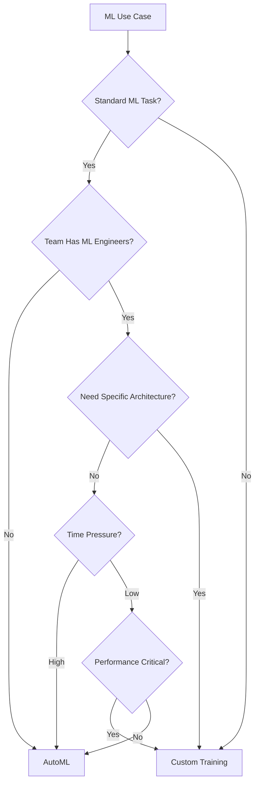

# How to Choose Between Custom Training and AutoML on Vertex AI for Your Use Case

Author: [nawazdhandala](https://www.github.com/nawazdhandala)

Tags: GCP, Vertex AI, AutoML, Custom Training, Machine Learning, MLOps, Google Cloud

Description: A practical comparison of AutoML and custom training on Vertex AI to help you pick the right approach for your machine learning use case.

---

Vertex AI gives you two paths to a trained model: AutoML, where the platform handles model architecture selection and hyperparameter tuning automatically, and custom training, where you write your own training code and control every detail. Choosing wrong costs you time either way - AutoML when you need custom architectures, or custom training when AutoML would have gotten you to production in a fraction of the time. This post breaks down when to use each approach based on real-world criteria.

## The Quick Decision Framework

Before diving into details, here is the short version:

**Use AutoML when:**
- Your data fits a standard ML task (classification, regression, object detection, NER, forecasting)
- You want a model in production within days, not months
- Your team has limited ML engineering expertise
- You need a strong baseline quickly

**Use custom training when:**
- You need a specific model architecture (transformers, GNNs, custom losses)
- Your task does not fit standard ML categories
- You need fine-grained control over training (custom data augmentation, multi-task learning)
- You are optimizing for extreme performance requirements



## AutoML: What It Actually Does

AutoML is not a single model. Behind the scenes, it runs a neural architecture search (NAS) that evaluates hundreds of model configurations on your data and picks the best one. For tabular data, it tries gradient boosted trees, neural networks, and ensembles. For images, it searches through variations of EfficientNet and similar architectures.

Here is what a typical AutoML workflow looks like:

```python
from google.cloud import aiplatform

aiplatform.init(project="your-project-id", location="us-central1")

# For tabular classification - AutoML handles everything
dataset = aiplatform.TabularDataset.create(
    display_name="churn-prediction-data",
    bq_source="bq://your-project.ml_data.customer_features",
)

# One call to train - AutoML picks the best algorithm
job = aiplatform.AutoMLTabularTrainingJob(
    display_name="churn-prediction-automl",
    optimization_prediction_type="classification",
    optimization_objective="maximize-au-prc",
)

model = job.run(
    dataset=dataset,
    target_column="churned",
    budget_milli_node_hours=1000,
    model_display_name="churn-model-automl",
)

# Deploy with one call
endpoint = model.deploy(
    machine_type="n1-standard-2",
    min_replica_count=1,
    max_replica_count=5,
)
```

That is it. No feature engineering decisions, no hyperparameter grids, no training loops. AutoML handles all of it.

## Custom Training: Full Control

Custom training means writing your own training code and running it on Vertex AI's managed infrastructure. You bring the model architecture, training loop, and evaluation logic:

```python
# custom_training_job.py - Example custom training setup
from google.cloud import aiplatform

aiplatform.init(project="your-project-id", location="us-central1")

# Custom training with your own container
job = aiplatform.CustomContainerTrainingJob(
    display_name="churn-prediction-custom",
    container_uri="gcr.io/your-project-id/churn-model-trainer:latest",
    model_serving_container_image_uri="gcr.io/cloud-aiplatform/prediction/tf2-cpu.2-12:latest",
)

# You control GPU type, machine specs, everything
model = job.run(
    replica_count=1,
    machine_type="n1-standard-8",
    accelerator_type="NVIDIA_TESLA_T4",
    accelerator_count=1,
    model_display_name="churn-model-custom",
    args=[
        "--epochs=50",
        "--batch-size=256",
        "--learning-rate=0.001",
        "--data-path=gs://your-bucket/training-data/",
    ],
)
```

And inside your training container, you write the actual training logic:

```python
# trainer/train.py - Your custom training code
import tensorflow as tf
import argparse

def build_model(input_dim):
    """Custom model architecture with attention layers."""
    inputs = tf.keras.Input(shape=(input_dim,))
    # Your custom architecture here
    x = tf.keras.layers.Dense(256, activation='relu')(inputs)
    x = tf.keras.layers.Dropout(0.3)(x)
    x = tf.keras.layers.Dense(128, activation='relu')(x)
    # Custom attention mechanism
    attention = tf.keras.layers.Dense(128, activation='sigmoid')(x)
    x = tf.keras.layers.Multiply()([x, attention])
    x = tf.keras.layers.Dense(64, activation='relu')(x)
    outputs = tf.keras.layers.Dense(1, activation='sigmoid')(x)

    model = tf.keras.Model(inputs=inputs, outputs=outputs)
    return model

def train(args):
    # Load data, build model, train, evaluate - you control everything
    model = build_model(input_dim=50)
    model.compile(
        optimizer=tf.keras.optimizers.Adam(learning_rate=args.learning_rate),
        loss='binary_crossentropy',
        metrics=['accuracy', tf.keras.metrics.AUC(name='auc')],
    )
    # ... training loop with your custom logic
```

## Detailed Comparison

### Data Requirements

**AutoML**: Works well with as few as 1,000 rows for tabular data and 100 images per class for vision tasks. It applies its own data augmentation and handles class imbalance automatically.

**Custom training**: You decide the minimum viable dataset size. You implement your own data augmentation, sampling strategies, and preprocessing pipelines.

### Time to Production

**AutoML**: Hours to days. Training takes 1-8 hours depending on data size. No code to write beyond the SDK calls. Model is deployment-ready immediately.

**Custom training**: Weeks to months. You need to write training code, set up experiment tracking, tune hyperparameters, debug convergence issues, and build serving infrastructure.

### Model Performance

**AutoML**: Generally produces strong models that are hard to beat without significant ML expertise. For standard tasks, AutoML often matches or exceeds what a junior ML engineer would build.

**Custom training**: Higher performance ceiling, but only if you have the expertise to reach it. A poorly implemented custom model will underperform AutoML every time.

### Cost

**AutoML**: Training costs are fixed by the node-hour budget you set. Prediction costs depend on the deployed machine type. You pay more per prediction than a highly optimized custom model.

**Custom training**: Lower per-prediction costs with optimized models (smaller architectures, quantization, distillation). But engineering time is the hidden cost that usually dominates.

### Explainability

**AutoML**: Provides feature importance scores automatically. Vertex AI Explainable AI works out of the box with AutoML models.

**Custom training**: You can implement any explainability method you want (SHAP, LIME, attention visualization), but you have to build it yourself.

## Hybrid Approach: Start with AutoML, Graduate to Custom

The most pragmatic approach is to use AutoML as your baseline:

```python
# Phase 1: Get a strong baseline with AutoML
automl_model = train_automl_model(dataset)
automl_metrics = evaluate(automl_model)

# Phase 2: Only invest in custom training if AutoML is not good enough
if automl_metrics["auc"] < target_auc:
    # Now you know the bar you need to beat
    custom_model = train_custom_model(dataset)
    custom_metrics = evaluate(custom_model)

    if custom_metrics["auc"] > automl_metrics["auc"]:
        deploy(custom_model)
    else:
        deploy(automl_model)  # AutoML was better - ship it
else:
    deploy(automl_model)  # AutoML met the target - ship it
```

This gives you a production model fast with AutoML while you develop and validate a custom approach in parallel. Only switch to custom training when you can demonstrate a meaningful improvement.

## Real-World Decision Examples

**Fraud detection on structured transaction data**: Start with AutoML Tables. It handles tabular data exceptionally well, including class imbalance. Only move to custom training if you need real-time feature computation or custom loss functions for your specific false-positive cost structure.

**Medical image classification**: AutoML Vision for initial prototype and clinical validation. Move to custom training (e.g., fine-tuned DenseNet with domain-specific augmentation) when you need to optimize for specific imaging modalities or regulatory requirements.

**Recommendation systems**: Custom training from the start. Recommendation architectures (two-tower models, sequential models) do not fit AutoML's standard task categories.

**Document classification**: AutoML Text for most cases. Custom training only if you need multi-label classification with hierarchical categories or domain-specific tokenization.

## Monitoring Both Approaches

Regardless of which approach you choose, monitor model performance in production. Use Vertex AI Model Monitoring for data drift and prediction drift detection, and use OneUptime to monitor the serving infrastructure - endpoint availability, prediction latency, and error rates.

## Summary

AutoML is not a shortcut for lazy teams - it is a smart default that lets you focus engineering effort where it matters most. Use AutoML for standard tasks and when time-to-production is critical. Use custom training when your problem requires specific architectures or when you have proven that AutoML's accuracy is not sufficient. The hybrid approach of starting with AutoML and graduating to custom training when justified by data gives you the best of both worlds.
