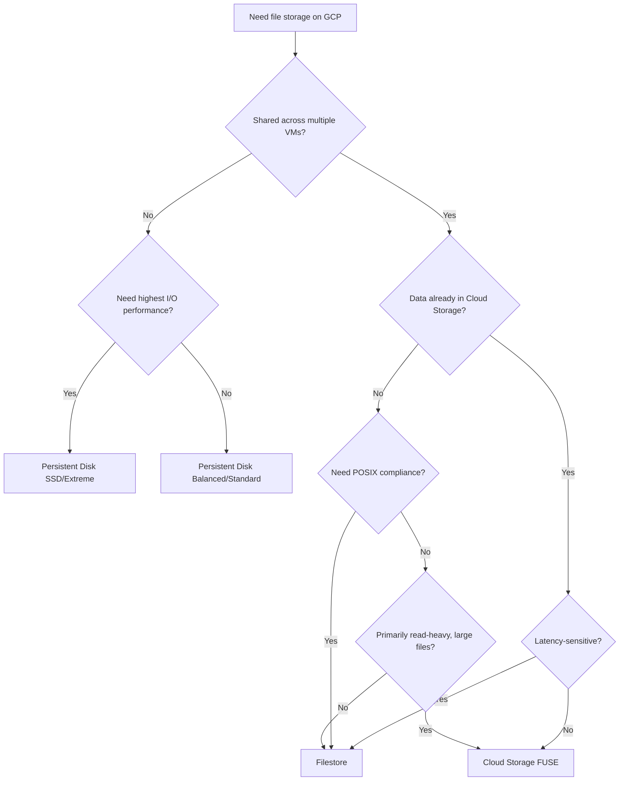

# How to Choose Between Filestore Cloud Storage FUSE and Persistent Disks for File Storage on GCP

Author: [nawazdhandala](https://www.github.com/nawazdhandala)

Tags: GCP, Filestore, Cloud Storage FUSE, Persistent Disks, File Storage, NFS

Description: A practical comparison of Filestore, Cloud Storage FUSE, and Persistent Disks to help you pick the right file storage option on Google Cloud.

---

Google Cloud offers multiple ways to store files: Persistent Disks (block storage), Filestore (managed NFS), and Cloud Storage FUSE (object storage mounted as a filesystem). Each serves a different purpose, and picking the wrong one leads to performance problems or unnecessary cost. This guide breaks down when each option makes sense.

## Quick Overview

**Persistent Disks** are block storage volumes that you attach to Compute Engine VMs or GKE nodes. Think of them like virtual hard drives. They come in HDD, SSD, and extreme performance tiers.

**Filestore** is a managed NFS (Network File System) service. Multiple VMs can mount the same Filestore instance simultaneously. It is a shared filesystem.

**Cloud Storage FUSE** is an adapter that lets you mount a Cloud Storage bucket as a local filesystem. It translates filesystem operations into Cloud Storage API calls.

| Feature | Persistent Disk | Filestore | Cloud Storage FUSE |
|---------|----------------|-----------|-------------------|
| Type | Block storage | NFS (shared file) | Object storage adapter |
| Multi-VM access | Read-only (multi-attach) | Yes (read/write) | Yes (read/write) |
| Max size | 64 TB | 100 TB (Enterprise) | Unlimited |
| Performance | Very high | High | Variable |
| Latency | Sub-millisecond | Low milliseconds | Higher (API calls) |
| Pricing model | Per GB provisioned | Per GB provisioned | Per GB stored + operations |
| POSIX compliant | Yes (with filesystem) | Yes | Partial |
| Snapshots | Yes | Yes | N/A (versioning) |
| Best for | Single-VM storage, databases | Shared file access, NFS workloads | Large data access, ML training |

## Persistent Disks - The Default Block Storage

Persistent Disks are the standard storage for VMs. Every Compute Engine instance has at least one. They are durable, snapshotable, and available in different performance tiers.

### When to Use Persistent Disks

- Boot disks for VMs
- Database storage (MySQL, PostgreSQL, MongoDB)
- Application storage that does not need sharing between VMs
- Workloads that need consistent, low-latency block I/O

```bash
# Create a high-performance SSD persistent disk
gcloud compute disks create my-ssd-disk \
    --size=500GB \
    --type=pd-ssd \
    --zone=us-central1-a

# Attach it to a VM
gcloud compute instances attach-disk my-vm \
    --disk=my-ssd-disk \
    --zone=us-central1-a

# On the VM, format and mount the disk
# (Run these commands on the VM via SSH)
# sudo mkfs.ext4 -m 0 -E lazy_itable_init=0 /dev/sdb
# sudo mkdir -p /mnt/data
# sudo mount /dev/sdb /mnt/data
```

### Persistent Disk Tiers

Choose the tier based on your I/O requirements:

```bash
# Standard HDD - cheapest, good for bulk storage
# $0.040 per GB/month, up to 7,500 read IOPS
gcloud compute disks create bulk-storage \
    --size=1000GB \
    --type=pd-standard \
    --zone=us-central1-a

# Balanced SSD - good price/performance ratio
# $0.100 per GB/month, up to 80,000 read IOPS
gcloud compute disks create app-storage \
    --size=500GB \
    --type=pd-balanced \
    --zone=us-central1-a

# Performance SSD - highest performance
# $0.170 per GB/month, up to 100,000 read IOPS
gcloud compute disks create db-storage \
    --size=500GB \
    --type=pd-ssd \
    --zone=us-central1-a

# Extreme - for the most demanding workloads (SAP HANA, large databases)
# Provisioned IOPS up to 120,000
gcloud compute disks create extreme-storage \
    --size=500GB \
    --type=pd-extreme \
    --provisioned-iops=50000 \
    --zone=us-central1-a
```

### Limitations

- Single-VM read-write attach (multi-attach is read-only)
- Zonal resource - tied to a specific zone
- Maximum 64 TB per disk
- Resizing requires no downtime but cannot shrink

## Filestore - Shared NFS

Filestore provides managed NFS file shares. Multiple VMs, GKE pods, or other clients can mount the same share simultaneously with read-write access.

### When to Use Filestore

- Shared file storage for multiple VMs or containers
- Content management systems that need shared media storage
- Legacy applications that require NFS mounts
- GKE workloads needing ReadWriteMany persistent volumes
- Home directories for development environments

```bash
# Create a Filestore instance
gcloud filestore instances create shared-files \
    --zone=us-central1-a \
    --tier=BASIC_SSD \
    --file-share=name=vol1,capacity=1TB \
    --network=name=default

# Get the IP address of the Filestore instance
gcloud filestore instances describe shared-files \
    --zone=us-central1-a \
    --format="get(networks[0].ipAddresses[0])"
```

Mount it from any VM in the same VPC:

```bash
# Install NFS client on the VM
sudo apt-get install -y nfs-common

# Mount the Filestore share
sudo mkdir -p /mnt/shared
sudo mount 10.0.0.2:/vol1 /mnt/shared

# Add to /etc/fstab for persistence across reboots
echo "10.0.0.2:/vol1 /mnt/shared nfs defaults 0 0" | sudo tee -a /etc/fstab
```

For GKE, use a PersistentVolume with the NFS driver:

```yaml
# GKE PersistentVolume pointing to Filestore
apiVersion: v1
kind: PersistentVolume
metadata:
  name: filestore-pv
spec:
  capacity:
    storage: 1Ti
  accessModes:
    - ReadWriteMany  # Multiple pods can write simultaneously
  nfs:
    server: 10.0.0.2
    path: /vol1
---
apiVersion: v1
kind: PersistentVolumeClaim
metadata:
  name: filestore-pvc
spec:
  accessModes:
    - ReadWriteMany
  resources:
    requests:
      storage: 1Ti
  volumeName: filestore-pv
```

### Filestore Tiers

```bash
# Basic HDD - cheapest, for non-latency-sensitive workloads
# Minimum 1 TB, ~$0.20/GB/month
gcloud filestore instances create basic-share \
    --tier=BASIC_HDD \
    --file-share=name=vol1,capacity=1TB

# Basic SSD - better performance
# Minimum 2.5 TB, ~$0.30/GB/month
gcloud filestore instances create ssd-share \
    --tier=BASIC_SSD \
    --file-share=name=vol1,capacity=2560GB

# Enterprise - regional availability, snapshots, backup
# Minimum 1 TB, ~$0.35/GB/month
gcloud filestore instances create enterprise-share \
    --tier=ENTERPRISE \
    --file-share=name=vol1,capacity=1TB \
    --region=us-central1
```

### Limitations

- Minimum capacity requirements (1 TB for Basic HDD, 2.5 TB for Basic SSD)
- Zonal (Basic) or Regional (Enterprise) - not multi-region
- Cannot shrink capacity once provisioned
- Higher cost per GB than Cloud Storage

## Cloud Storage FUSE - Object Storage as a Filesystem

Cloud Storage FUSE (gcsfuse) mounts a Cloud Storage bucket as a local directory. It is not a real filesystem - it translates filesystem operations into Cloud Storage API calls.

### When to Use Cloud Storage FUSE

- Machine learning training data access (read-heavy, large files)
- Access to data already in Cloud Storage without changing application code
- Workloads that can tolerate higher latency
- Very large datasets (unlimited storage)
- Cost-sensitive storage needs

```bash
# Install gcsfuse
export GCSFUSE_REPO=gcsfuse-$(lsb_release -c -s)
echo "deb https://packages.cloud.google.com/apt $GCSFUSE_REPO main" | \
    sudo tee /etc/apt/sources.list.d/gcsfuse.list
sudo apt-get update && sudo apt-get install -y gcsfuse

# Mount a Cloud Storage bucket
mkdir -p /mnt/gcs-data
gcsfuse --implicit-dirs my-data-bucket /mnt/gcs-data

# Now access Cloud Storage objects as regular files
ls /mnt/gcs-data/
cat /mnt/gcs-data/config.json
```

For GKE workloads, use the Cloud Storage FUSE CSI driver:

```yaml
# GKE pod with Cloud Storage FUSE mounted
apiVersion: v1
kind: Pod
metadata:
  name: ml-training
  annotations:
    gke-gcsfuse/volumes: "true"  # Enable the CSI driver
spec:
  containers:
    - name: trainer
      image: gcr.io/my-project/ml-trainer:latest
      volumeMounts:
        - name: training-data
          mountPath: /data
  volumes:
    - name: training-data
      csi:
        driver: gcsfuse.csi.storage.gke.io
        volumeAttributes:
          bucketName: ml-training-data
```

### Performance Characteristics

Cloud Storage FUSE performance depends heavily on the access pattern:

- **Sequential reads of large files**: Good performance, especially with read-ahead caching
- **Random reads of small files**: Poor performance due to API call overhead
- **Writes**: Entire file must be uploaded on close - not suitable for frequent writes to the same file
- **Directory listings**: Can be slow for buckets with millions of objects

```bash
# Tune gcsfuse for better read performance
gcsfuse \
    --stat-cache-capacity=20000 \
    --stat-cache-ttl=60s \
    --type-cache-ttl=60s \
    --kernel-list-cache-ttl-secs=60 \
    --file-cache-max-size-mb=10240 \
    --implicit-dirs \
    my-bucket /mnt/data
```

### Limitations

- Not fully POSIX compliant (no hard links, limited lock support)
- Write operations are not atomic (file is buffered locally, uploaded on close)
- Higher latency than Persistent Disks or Filestore
- Not suitable for databases or applications that need strong consistency
- Small random reads are slow

## Decision Matrix



## Cost Comparison (1 TB, us-central1)

| Storage Type | Monthly Cost | Best For |
|-------------|-------------|----------|
| Persistent Disk Standard | ~$40 | Single VM, bulk storage |
| Persistent Disk SSD | ~$170 | Single VM, databases |
| Filestore Basic HDD | ~$200 | Shared access, cost-sensitive |
| Filestore Basic SSD | ~$300 | Shared access, performance |
| Cloud Storage Standard | ~$20 | Unlimited shared access via FUSE |
| Cloud Storage Nearline | ~$10 | Infrequently accessed data via FUSE |

Cloud Storage is cheapest for raw storage, but factor in retrieval costs and the performance trade-offs of FUSE access.

## Conclusion

Use Persistent Disks for single-VM workloads that need reliable block storage. Use Filestore when multiple VMs or containers need to read and write the same files with NFS semantics. Use Cloud Storage FUSE when you need to access Cloud Storage data from applications that expect a filesystem interface, especially for ML training data or large-scale read workloads. When in doubt, Persistent Disks are the safe default for most applications, and Filestore is the safe default for shared access.
