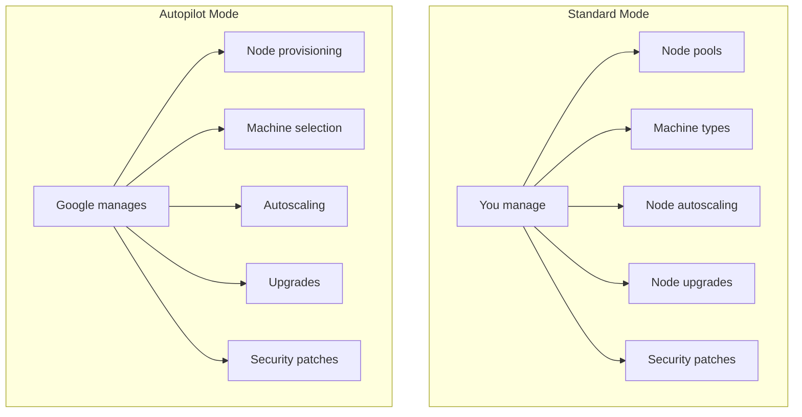

# How to Choose Between GKE Autopilot and Standard Mode for Your Workload Requirements

Author: [nawazdhandala](https://www.github.com/nawazdhandala)

Tags: GCP, GKE, Kubernetes, Autopilot, Cloud Architecture

Description: A practical comparison of GKE Autopilot and Standard mode to help you decide which cluster type fits your workload, team size, and operational requirements.

---

When you create a GKE cluster, the first decision you face is choosing between Autopilot and Standard mode. It is not just a billing difference - it fundamentally changes what you can and cannot do with your cluster, how you manage nodes, and how much operational overhead you take on.

I have run workloads on both modes, and the right choice depends on your specific situation. Let me break down the differences and give you a framework for deciding.

## The Core Difference

In Standard mode, you manage the node pools. You choose the machine types, configure autoscaling ranges, handle node upgrades, and pay for the nodes whether they are fully utilized or mostly idle.

In Autopilot mode, Google manages the nodes entirely. You just deploy pods, and GKE provisions exactly the right amount of compute. You pay per pod based on the resources each pod requests - no idle node costs.



## Pricing Model

This is often the deciding factor for smaller teams.

**Standard mode**: You pay for the nodes (VMs) regardless of utilization. If you have three n2-standard-4 nodes running but your pods only use 30% of the capacity, you are paying for 70% of wasted compute. You can mitigate this with cluster autoscaler, but there is always some waste.

**Autopilot mode**: You pay for the CPU, memory, and ephemeral storage that your pods request. If a pod requests 500m CPU and 512Mi memory, that is what you pay for - Google handles fitting pods onto nodes efficiently.

For workloads with variable load, Autopilot often costs less because you are not paying for idle capacity during off-peak hours. For stable, high-utilization workloads, Standard can be cheaper because you can pack nodes more efficiently.

## What Autopilot Restricts

Autopilot enforces best practices by restricting certain Kubernetes features. This is where many teams hit friction.

Things you cannot do in Autopilot:

- Run privileged containers
- Use hostNetwork or hostPID
- Mount hostPath volumes
- Run DaemonSets (Google manages node-level agents)
- SSH into nodes
- Use custom node images
- Choose specific machine types per pod (though you can request GPU or specific compute classes)
- Run pods without resource requests and limits

If your workload requires any of these, Standard mode is your only option.

```yaml
# This pod spec works in Standard but NOT in Autopilot
apiVersion: v1
kind: Pod
metadata:
  name: privileged-pod
spec:
  containers:
    - name: debug
      image: ubuntu
      securityContext:
        privileged: true  # Not allowed in Autopilot
      volumeMounts:
        - name: host-fs
          mountPath: /host
  volumes:
    - name: host-fs
      hostPath:  # Not allowed in Autopilot
        path: /
```

## What Autopilot Handles for You

Autopilot takes over a significant amount of operational work:

- **Node provisioning**: Nodes are automatically created and sized for your pod requests
- **Node upgrades**: Nodes are kept up to date with the latest patches
- **Security hardening**: Nodes run a hardened OS with minimal attack surface
- **Resource optimization**: Pods are bin-packed efficiently across nodes
- **Scaling to zero**: If you have no pods, you have no nodes (and no cost)

This is genuinely valuable for teams that do not have dedicated platform engineering resources.

## Decision Framework

Here is how I think about the choice:

### Choose Autopilot When

- Your team is small and does not have Kubernetes expertise
- Your workloads are standard web services, APIs, or batch jobs
- You want to minimize operational overhead
- Your workloads have variable traffic patterns
- You do not need privileged containers or host-level access
- You are running in a single region

### Choose Standard When

- You need privileged containers (e.g., for security scanning, monitoring agents)
- You run DaemonSets for logging, monitoring, or networking
- You need specific machine types (e.g., high-memory instances for databases)
- You need GPUs with specific configurations
- You have workloads that require host-level access
- You want full control over node configurations and kernel parameters
- You have dedicated platform engineering staff

## Real-World Scenarios

Let me give some concrete examples.

### Scenario 1: Web Application with API Backend

A team running a Next.js frontend and a Node.js API backend with moderate traffic.

**Recommendation: Autopilot.** These are standard containerized workloads with no special requirements. The team saves time on node management and pays only for what they use.

### Scenario 2: Data Processing Pipeline

A team running Apache Spark on Kubernetes with custom node configurations for high-memory processing.

**Recommendation: Standard.** Spark workers often need specific machine types (high-memory), and the operator patterns commonly used with Spark require DaemonSets or privileged access.

### Scenario 3: Multi-Tenant SaaS Platform

A platform running workloads for multiple customers with strict isolation requirements.

**Recommendation: Standard.** Multi-tenancy often requires fine-grained control over node pools (dedicated nodes per tenant), network policies that interact with node-level configurations, and custom security contexts.

### Scenario 4: Microservices with Variable Traffic

A team running 15 microservices with traffic that spikes 10x during business hours.

**Recommendation: Autopilot.** The variable traffic pattern means Standard mode would waste money during off-hours. Autopilot scales nodes to match actual pod demand.

## Resource Requirements in Autopilot

One important Autopilot behavior: every pod must have resource requests and limits. If you deploy a pod without them, Autopilot applies defaults.

```yaml
# In Autopilot, always specify resource requests
apiVersion: apps/v1
kind: Deployment
metadata:
  name: my-service
spec:
  replicas: 3
  selector:
    matchLabels:
      app: my-service
  template:
    metadata:
      labels:
        app: my-service
    spec:
      containers:
        - name: my-service
          image: my-service:latest
          resources:
            requests:
              # Be accurate - you pay for what you request
              cpu: "250m"
              memory: "512Mi"
              ephemeral-storage: "1Gi"
            limits:
              cpu: "500m"
              memory: "1Gi"
              ephemeral-storage: "2Gi"
```

Getting resource requests right is more important in Autopilot because you pay directly for them. Set them too high and you waste money; set them too low and your pods get throttled or killed.

## Migrating Between Modes

You cannot convert an existing cluster from Standard to Autopilot or vice versa. You need to create a new cluster and migrate your workloads.

```bash
# Create a new Autopilot cluster
gcloud container clusters create-auto my-autopilot-cluster \
  --region us-central1

# Export your workloads from the old cluster
kubectl get deployments -o yaml > deployments.yaml
kubectl get services -o yaml > services.yaml
kubectl get configmaps -o yaml > configmaps.yaml

# Switch context to the new cluster and apply
gcloud container clusters get-credentials my-autopilot-cluster --region us-central1
kubectl apply -f deployments.yaml
kubectl apply -f services.yaml
kubectl apply -f configmaps.yaml
```

## Cost Comparison Example

Let us do a rough cost comparison for a workload running 10 pods, each requesting 500m CPU and 1Gi memory.

**Standard mode**: You need enough nodes to fit 10 pods. With n2-standard-4 (4 vCPU, 16GB RAM), you need about 2 nodes. Cost: approximately $200/month for the two nodes (running 24/7), regardless of whether all 10 pods are running.

**Autopilot mode**: You pay for 10 x 500m CPU and 10 x 1Gi memory = 5 vCPU and 10Gi total. Cost: approximately $150/month if pods run 24/7. But if traffic drops at night and you scale to 3 pods, the cost drops proportionally.

The math shifts depending on your utilization. If your Standard cluster runs at 90% utilization consistently, it can be cheaper. If it runs at 40% utilization (which is typical for many teams), Autopilot wins.

## Wrapping Up

There is no universally right answer between Autopilot and Standard. Autopilot is the better default for most new projects - it reduces operational burden, enforces good practices, and aligns costs with actual usage. But Standard mode exists for a reason: some workloads genuinely need the control it provides. Start by listing your hard requirements (privileged access, DaemonSets, specific machine types) and see if any of them rule out Autopilot. If none do, start with Autopilot and switch to Standard later if you hit limitations. It is easier to add complexity than to remove it.
