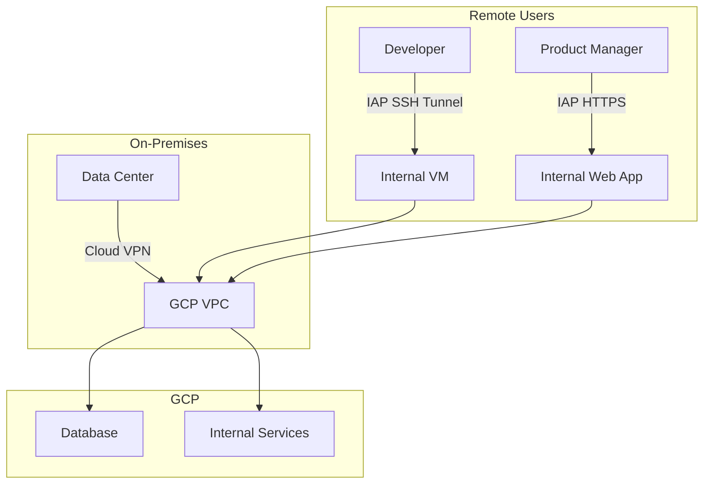

# How to Choose Between Identity-Aware Proxy and VPN for Securing Access to GCP Resources

Author: [nawazdhandala](https://www.github.com/nawazdhandala)

Tags: GCP, Identity-Aware Proxy, VPN, Zero Trust, Security, Access Control

Description: A practical comparison of Identity-Aware Proxy and VPN for securing access to internal applications and GCP resources with real configuration examples.

---

Securing access to internal applications and GCP resources typically comes down to two approaches: VPN (create a secure network tunnel) or Identity-Aware Proxy (verify identity per request). These represent two different security philosophies - network-perimeter security versus zero-trust access. Understanding when each makes sense helps you build a security model that actually works for your team.

## The Two Approaches

**VPN (Cloud VPN or Cloud Interconnect)** creates an encrypted tunnel between the user's network and your GCP VPC. Once connected, the user can access resources on the network as if they were locally connected. This is the traditional approach.

**Identity-Aware Proxy (IAP)** verifies a user's identity and authorization on every request to an application. Users access applications through a browser or IAP tunnel without needing to connect to the VPC. This is the zero-trust approach.

## Feature Comparison

| Feature | VPN | Identity-Aware Proxy |
|---------|-----|---------------------|
| Security model | Network perimeter | Zero trust (per-request) |
| Authentication | VPN credentials + network access | Google identity + IAM |
| Granularity | Network-level (IP ranges) | Application-level (per app, per user) |
| Access logging | VPN connection logs | Per-request audit logs |
| Client software | VPN client required | Browser (web apps) or gcloud (SSH/TCP) |
| Non-HTTP protocols | All protocols | HTTP, SSH, TCP (via tunnel) |
| Split tunneling | Configurable | Not applicable (no tunnel) |
| Lateral movement risk | Higher (network access) | Lower (application-specific) |
| Cost | Per tunnel-hour + data | Free for IAP, load balancer costs apply |
| Setup complexity | Moderate | Low to moderate |
| Works for | Any protocol, site-to-site | Web apps, SSH, RDP, TCP services |

## When to Use Identity-Aware Proxy

### Securing Internal Web Applications

IAP is perfect for internal web applications that should only be accessible to specific users:

```bash
# Step 1: Deploy an internal application on Cloud Run
gcloud run deploy internal-dashboard \
    --image=gcr.io/my-project/dashboard:latest \
    --region=us-central1 \
    --no-allow-unauthenticated

# Step 2: Set up a load balancer with IAP enabled
# Create a serverless NEG for Cloud Run
gcloud compute network-endpoint-groups create dashboard-neg \
    --region=us-central1 \
    --network-endpoint-type=serverless \
    --cloud-run-service=internal-dashboard

# Create a backend service with IAP
gcloud compute backend-services create dashboard-backend \
    --global \
    --load-balancing-scheme=EXTERNAL_MANAGED

gcloud compute backend-services add-backend dashboard-backend \
    --global \
    --network-endpoint-group=dashboard-neg \
    --network-endpoint-group-region=us-central1

# Enable IAP on the backend service
gcloud compute backend-services update dashboard-backend \
    --global \
    --iap=enabled,oauth2-client-id=CLIENT_ID,oauth2-client-secret=CLIENT_SECRET

# Step 3: Grant access to specific users
gcloud iap web add-iam-policy-binding \
    --resource-type=backend-services \
    --service=dashboard-backend \
    --member="user:engineer@example.com" \
    --role="roles/iap.httpsResourceAccessor"

gcloud iap web add-iam-policy-binding \
    --resource-type=backend-services \
    --service=dashboard-backend \
    --member="group:engineering@example.com" \
    --role="roles/iap.httpsResourceAccessor"
```

Now, when anyone tries to access the dashboard, IAP checks their Google identity and verifies they have the `iap.httpsResourceAccessor` role. No VPN needed.

### SSH Access to VMs Without Public IPs

IAP TCP forwarding lets you SSH into VMs that have no public IP address, without a VPN:

```bash
# Create a VM with no public IP (internal only)
gcloud compute instances create internal-server \
    --zone=us-central1-a \
    --machine-type=n2-standard-2 \
    --no-address \
    --network=default

# Grant IAP tunnel access to specific users
gcloud compute instances add-iam-policy-binding internal-server \
    --zone=us-central1-a \
    --member="user:admin@example.com" \
    --role="roles/iap.tunnelResourceAccessor"

# SSH through IAP tunnel - no VPN needed
gcloud compute ssh internal-server \
    --zone=us-central1-a \
    --tunnel-through-iap
```

The IAP tunnel encrypts the SSH connection and verifies the user's identity. The VM does not need a public IP, and no VPN infrastructure is required.

### Port Forwarding to Internal Services

Access databases and other TCP services through IAP tunnels:

```bash
# Forward local port 5432 to an internal database server through IAP
gcloud compute start-iap-tunnel db-server 5432 \
    --local-host-port=localhost:5432 \
    --zone=us-central1-a

# Now connect to the database through the tunnel
psql -h localhost -p 5432 -U myuser -d mydb
```

### Context-Aware Access

IAP supports access levels based on device attributes and context:

```bash
# Create an access level that requires a corporate device
gcloud access-context-manager levels create corporate-device \
    --title="Corporate Managed Device" \
    --basic-level-spec=access-level-spec.yaml

# Apply the access level to IAP
gcloud iap web add-iam-policy-binding \
    --resource-type=backend-services \
    --service=dashboard-backend \
    --member="group:engineering@example.com" \
    --role="roles/iap.httpsResourceAccessor" \
    --condition='expression=accessPolicies/POLICY_ID/accessLevels/corporate-device,title=Require corporate device'
```

### Use IAP When

- Securing internal web applications for specific users or groups
- Providing SSH/RDP access to VMs without public IPs
- You want per-user, per-application access control
- You need detailed audit logging of who accessed what
- You want to implement zero-trust security
- Users are remote and you do not want to deploy VPN clients

## When to Use VPN

### Site-to-Site Connectivity

VPN is the right choice for connecting your on-premises network to GCP:

```bash
# Create a Cloud VPN gateway for site-to-site connectivity
gcloud compute vpn-gateways create my-vpn-gateway \
    --network=my-vpc \
    --region=us-central1

# Create an external VPN gateway representing your on-premises device
gcloud compute external-vpn-gateways create on-prem-gateway \
    --interfaces=0=203.0.113.1

# Create a Cloud Router for dynamic routing
gcloud compute routers create my-router \
    --region=us-central1 \
    --network=my-vpc \
    --asn=65001

# Create VPN tunnels
gcloud compute vpn-tunnels create tunnel-to-onprem \
    --region=us-central1 \
    --vpn-gateway=my-vpn-gateway \
    --peer-external-gateway=on-prem-gateway \
    --peer-external-gateway-interface=0 \
    --shared-secret=my-shared-secret \
    --router=my-router \
    --ike-version=2 \
    --interface=0

# Configure BGP for dynamic route exchange
gcloud compute routers add-interface my-router \
    --region=us-central1 \
    --interface-name=tunnel-interface \
    --vpn-tunnel=tunnel-to-onprem \
    --ip-address=169.254.1.1 \
    --mask-length=30

gcloud compute routers add-bgp-peer my-router \
    --region=us-central1 \
    --peer-name=on-prem-peer \
    --interface=tunnel-interface \
    --peer-ip-address=169.254.1.2 \
    --peer-asn=65002
```

### Non-HTTP Protocol Access

If you need to access services that use protocols IAP does not support (UDP, custom protocols):

```bash
# VPN gives full network access for any protocol
# After connecting to VPN, access any service using its internal IP
# MongoDB (TCP 27017)
mongo 10.0.1.5:27017

# Custom application protocols
nc 10.0.1.10 9999

# LDAP (TCP 389)
ldapsearch -H ldap://10.0.1.20 -b "dc=example,dc=com"
```

### High-Bandwidth Connectivity

For workloads that need consistent, high-bandwidth connections:

```bash
# Cloud VPN supports up to 3 Gbps per tunnel
# For higher bandwidth, use Cloud Interconnect (Dedicated or Partner)
# Dedicated Interconnect: 10 Gbps or 100 Gbps connections
# Partner Interconnect: 50 Mbps to 50 Gbps via partner

# Create a VLAN attachment for Dedicated Interconnect
gcloud compute interconnects attachments dedicated create my-attachment \
    --router=my-router \
    --interconnect=my-interconnect \
    --region=us-central1 \
    --bandwidth=1g
```

### Use VPN When

- Connecting on-premises networks to GCP (site-to-site)
- Need full network-layer access to all protocols
- High-bandwidth, low-latency connectivity required
- Existing infrastructure depends on network-based access
- Legacy applications that cannot work with IAP

## The Hybrid Approach

Many organizations use both. IAP for user-to-application access and VPN for site-to-site connectivity:



This pattern uses IAP for individual user access (zero trust, per-user audit trail) and VPN for infrastructure-to-infrastructure connectivity where you need full network access.

## Security Comparison

| Risk | VPN | IAP |
|------|-----|-----|
| Credential compromise | Attacker gets network access | Attacker gets access to specific apps |
| Lateral movement | High risk (network access) | Low risk (app-specific access) |
| Audit trail | Connection-level logs | Per-request logs with user identity |
| MFA enforcement | VPN-level MFA | Google Workspace MFA + context-aware |
| Device trust | VPN client-based | BeyondCorp Enterprise integration |
| Session duration | Until VPN disconnects | Per-request verification |

IAP is inherently more secure for user access because it verifies identity on every request and limits access to specific applications. VPN grants broader network access, which increases the blast radius if credentials are compromised.

## Conclusion

For user access to specific applications and VMs, IAP is the better choice in almost all cases. It is more secure (zero trust), easier to manage (no VPN clients to deploy), and provides better audit logging. Use VPN for site-to-site connectivity, non-HTTP protocols, or when you need full network-layer access between environments. The combination of both gives you the strongest security posture - zero trust for users, encrypted tunnels for infrastructure.
