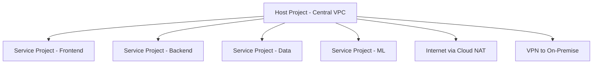
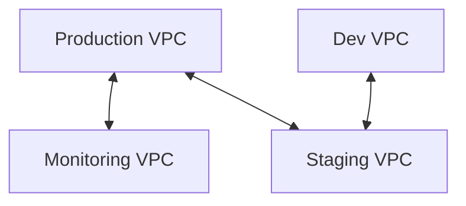

# How to Choose Between Shared VPC and VPC Peering for Multi-Project Networking on GCP

Author: [nawazdhandala](https://www.github.com/nawazdhandala)

Tags: GCP, Shared VPC, VPC Peering, Networking, Multi-Project, Cloud Networking

Description: A practical guide to choosing between Shared VPC and VPC Peering for connecting workloads across multiple GCP projects securely and efficiently.

---

When your GCP environment grows beyond a single project, you need a way for resources in different projects to communicate. Google Cloud gives you two main options: Shared VPC and VPC Peering. They solve the same basic problem - cross-project networking - but with fundamentally different approaches and trade-offs.

## The Core Difference

**Shared VPC** lets multiple projects share a single VPC network. One project (the host project) owns the network, and other projects (service projects) deploy resources into subnets of that shared network. All resources share the same IP space, firewall rules, and routes.

**VPC Peering** connects two independent VPC networks. Each project keeps its own VPC with its own IP ranges, firewall rules, and routes. Peering creates a tunnel between them so resources can communicate using internal IP addresses.

Think of Shared VPC as multiple teams working in the same office building (shared infrastructure). VPC Peering is like two separate office buildings connected by a private tunnel.

## Feature Comparison

| Feature | Shared VPC | VPC Peering |
|---------|-----------|-------------|
| Network ownership | Centralized (host project) | Independent per project |
| IP address management | Centralized | Per project |
| Firewall rules | Centralized (host project) | Per project |
| Routes | Shared across projects | Exchanged between peers |
| Transitive connectivity | Yes (all service projects can communicate) | No (A-B and B-C does not mean A-C) |
| Max connections | 1000 service projects per host | 25 peering connections per network |
| Cross-organization | No (same organization only) | Yes |
| Admin overhead | Higher (central network team needed) | Lower (teams manage their own) |
| DNS resolution | Automatic (same VPC) | Requires configuration |
| Load balancing | Cross-project backend services | Not directly supported |

## When to Use Shared VPC

### Centralized Network Management

Shared VPC is ideal when a central network team wants to control IP allocation, firewall rules, and routing across all projects:

```bash
# Step 1: Enable Shared VPC on the host project
gcloud compute shared-vpc enable host-project

# Step 2: Create the shared network in the host project
gcloud compute networks create shared-network \
    --project=host-project \
    --subnet-mode=custom

# Create subnets for different teams or environments
gcloud compute networks subnets create frontend-subnet \
    --project=host-project \
    --network=shared-network \
    --region=us-central1 \
    --range=10.0.1.0/24

gcloud compute networks subnets create backend-subnet \
    --project=host-project \
    --network=shared-network \
    --region=us-central1 \
    --range=10.0.2.0/24

gcloud compute networks subnets create data-subnet \
    --project=host-project \
    --network=shared-network \
    --region=us-central1 \
    --range=10.0.3.0/24

# Step 3: Associate service projects
gcloud compute shared-vpc associated-projects add frontend-project \
    --host-project=host-project

gcloud compute shared-vpc associated-projects add backend-project \
    --host-project=host-project

gcloud compute shared-vpc associated-projects add data-project \
    --host-project=host-project
```

### Centralized Firewall Management

With Shared VPC, the network team controls all firewall rules:

```bash
# Firewall rules in the host project apply to all service projects
# Allow frontend to talk to backend
gcloud compute firewall-rules create allow-frontend-to-backend \
    --project=host-project \
    --network=shared-network \
    --direction=INGRESS \
    --action=ALLOW \
    --rules=tcp:8080 \
    --source-ranges=10.0.1.0/24 \
    --target-tags=backend-server

# Allow backend to talk to database
gcloud compute firewall-rules create allow-backend-to-data \
    --project=host-project \
    --network=shared-network \
    --direction=INGRESS \
    --action=ALLOW \
    --rules=tcp:5432 \
    --source-ranges=10.0.2.0/24 \
    --target-tags=database-server

# Block frontend from directly accessing database
gcloud compute firewall-rules create deny-frontend-to-data \
    --project=host-project \
    --network=shared-network \
    --direction=INGRESS \
    --action=DENY \
    --rules=tcp:5432 \
    --source-ranges=10.0.1.0/24 \
    --target-tags=database-server \
    --priority=900
```

### Deploying Resources in Service Projects

Service project teams deploy their resources into the shared subnets:

```bash
# A team in the backend-project creates a VM in the shared subnet
gcloud compute instances create api-server \
    --project=backend-project \
    --zone=us-central1-a \
    --machine-type=n2-standard-4 \
    --subnet=projects/host-project/regions/us-central1/subnetworks/backend-subnet \
    --tags=backend-server

# A GKE cluster in a service project using the shared network
gcloud container clusters create backend-cluster \
    --project=backend-project \
    --zone=us-central1-a \
    --network=projects/host-project/global/networks/shared-network \
    --subnetwork=projects/host-project/regions/us-central1/subnetworks/backend-subnet \
    --cluster-secondary-range-name=pods \
    --services-secondary-range-name=services
```

### Use Shared VPC When

- You have a dedicated network/platform team
- Compliance requires centralized firewall and routing control
- Multiple teams need to communicate and share network resources
- You want consistent IP addressing across projects
- You need transitive connectivity (all projects can reach each other)

## When to Use VPC Peering

### Independent Team Networking

VPC Peering works well when teams want to manage their own networks but need occasional cross-project communication:

```bash
# Project A creates its VPC
gcloud compute networks create network-a \
    --project=project-a \
    --subnet-mode=custom

gcloud compute networks subnets create subnet-a \
    --project=project-a \
    --network=network-a \
    --region=us-central1 \
    --range=10.1.0.0/24

# Project B creates its VPC
gcloud compute networks create network-b \
    --project=project-b \
    --subnet-mode=custom

gcloud compute networks subnets create subnet-b \
    --project=project-b \
    --network=network-b \
    --region=us-central1 \
    --range=10.2.0.0/24

# Create peering from A to B
gcloud compute networks peerings create a-to-b \
    --project=project-a \
    --network=network-a \
    --peer-project=project-b \
    --peer-network=network-b

# Create peering from B to A (peering must be created from both sides)
gcloud compute networks peerings create b-to-a \
    --project=project-b \
    --network=network-b \
    --peer-project=project-a \
    --peer-network=network-a
```

### Cross-Organization Connectivity

VPC Peering works across GCP organizations, which Shared VPC cannot do:

```bash
# Peer with a partner organization's network
gcloud compute networks peerings create partner-peering \
    --project=my-project \
    --network=my-network \
    --peer-project=partner-org-project \
    --peer-network=partner-network
```

### Service-to-Service Communication

When specific services need to communicate without sharing an entire network:

```bash
# Peer a production VPC with a monitoring VPC
# Only these two networks can communicate
gcloud compute networks peerings create prod-to-monitoring \
    --project=production-project \
    --network=prod-network \
    --peer-project=monitoring-project \
    --peer-network=monitoring-network \
    --export-custom-routes \
    --import-custom-routes

# Each project manages its own firewall rules
# Project A allows monitoring traffic
gcloud compute firewall-rules create allow-monitoring \
    --project=production-project \
    --network=prod-network \
    --direction=INGRESS \
    --action=ALLOW \
    --rules=tcp:9090,tcp:9100 \
    --source-ranges=10.100.0.0/24
```

### Use VPC Peering When

- Teams want to manage their own networks independently
- You need cross-organization connectivity
- You want to isolate network blast radius (one team's misconfiguration does not affect others)
- You have a small number of projects that need to communicate
- Different projects need different firewall policies
- You are connecting to managed services that require peering (some Google services use peering)

## The Non-Transitive Problem with VPC Peering

The biggest limitation of VPC Peering is that it is not transitive. If Project A peers with Project B, and Project B peers with Project C, Project A cannot reach Project C through Project B.

```
Shared VPC:         A <--> B <--> C (all can communicate)
VPC Peering:        A <--> B     B <--> C     A cannot reach C
```

If you need A-to-C communication with peering, you must create a direct peering connection between them. This creates a full mesh that becomes hard to manage at scale:

```
3 projects = 3 peering connections
5 projects = 10 peering connections
10 projects = 45 peering connections
```

This is why Shared VPC is usually better for large environments where many projects need to communicate.

## Architecture Patterns

### Hub-and-Spoke with Shared VPC

The most common enterprise pattern:



### Limited Peering for Specific Connections

Good for smaller environments with clear boundaries:



## Decision Checklist

1. **How many projects need to communicate?** More than 5? Shared VPC is likely better.
2. **Do you have a central network team?** Yes? Shared VPC fits your model.
3. **Do teams need network independence?** Yes? VPC Peering gives them autonomy.
4. **Cross-organization?** VPC Peering is your only option.
5. **Need transitive connectivity?** Shared VPC provides it; peering does not.
6. **Compliance requires centralized controls?** Shared VPC centralizes everything.

## Conclusion

Shared VPC is the better choice for most enterprise GCP environments. It provides centralized control, transitive connectivity, and scales well to many projects. Use VPC Peering for specific cases - cross-organization connectivity, small environments where teams need full network autonomy, or connecting to services that require peering. Many organizations use both: Shared VPC as the primary networking model within the organization, with VPC Peering for external or special-case connections.
