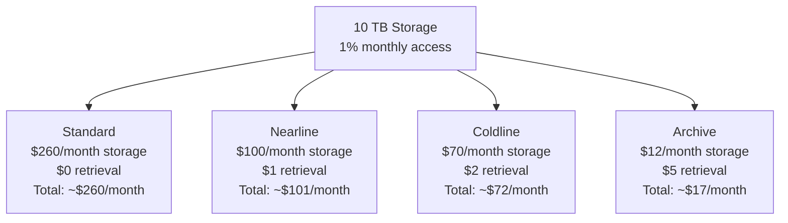

# How to Choose Between Standard Nearline Coldline and Archive Storage Classes in GCP

Author: [nawazdhandala](https://www.github.com/nawazdhandala)

Tags: GCP, Google Cloud Storage, Storage Classes, Cost Optimization, Cloud Architecture

Description: A practical comparison of Google Cloud Storage classes - Standard, Nearline, Coldline, and Archive - to help you choose the right one for your data.

---

Google Cloud Storage offers four storage classes, and picking the right one can cut your storage bill significantly. The catch is that cheaper storage comes with trade-offs in access costs and retrieval fees. Choosing well requires understanding your data access patterns - how often you read data, how quickly you need it, and how long you plan to keep it.

This guide breaks down each storage class, compares the costs, and gives you practical decision criteria for real workloads.

## The Four Storage Classes

### Standard Storage

Standard is the default and most expensive per-GB storage class, but it has no retrieval fees and no minimum storage duration. It is designed for data you access frequently.

**Pricing (US multi-region):**
- Storage: ~$0.026 per GB/month
- Class A operations (writes): $0.05 per 10,000
- Class B operations (reads): $0.004 per 10,000
- Retrieval: Free

**Best for:** Active application data, frequently accessed content, data being processed, website assets, streaming media.

### Nearline Storage

Nearline is for data you access less than once a month. It costs less to store but adds a per-GB retrieval fee.

**Pricing (US multi-region):**
- Storage: ~$0.010 per GB/month
- Class A operations: $0.10 per 10,000
- Class B operations: $0.01 per 10,000
- Retrieval: $0.01 per GB
- Minimum storage duration: 30 days

**Best for:** Monthly backups, data you query occasionally for reporting, older logs you still need to reference, disaster recovery data.

### Coldline Storage

Coldline targets data you access less than once per quarter. Lower storage cost, higher retrieval cost.

**Pricing (US multi-region):**
- Storage: ~$0.007 per GB/month
- Class A operations: $0.10 per 10,000
- Class B operations: $0.05 per 10,000
- Retrieval: $0.02 per GB
- Minimum storage duration: 90 days

**Best for:** Quarterly reports, compliance archives that occasionally need access, long-term backups, seasonal data.

### Archive Storage

Archive is the cheapest storage available on GCP. It is meant for data you rarely if ever access but need to retain.

**Pricing (US multi-region):**
- Storage: ~$0.0012 per GB/month
- Class A operations: $0.50 per 10,000
- Class B operations: $0.50 per 10,000
- Retrieval: $0.05 per GB
- Minimum storage duration: 365 days

**Best for:** Long-term regulatory archives, legal hold data, data you must keep for years but almost never read, historical datasets.

## Cost Comparison at Scale

Let me put this in perspective with a concrete example. Say you store 10 TB and access 1% of it once a month:



The savings are massive, but only if your access pattern matches the storage class.

## Decision Framework

Here is a straightforward way to decide:

**How often do you access the data?**

| Access Frequency | Storage Class |
|---|---|
| Multiple times per day | Standard |
| A few times per month | Nearline |
| Once per quarter or less | Coldline |
| Once per year or less | Archive |

**Is low latency critical?**

All four classes have the same latency for the first byte - typically milliseconds. The difference is purely in cost, not performance. This is a common misconception. Archive storage does not have multi-hour retrieval delays like some other cloud providers. GCS retrieval is fast regardless of storage class.

**Can you commit to a minimum storage duration?**

If you delete or overwrite an object before its minimum storage duration, you still pay for the full duration. So if you store something in Nearline and delete it after 10 days, you pay for 30 days.

This matters for temporary data. If objects might be short-lived, Standard is often cheaper despite the higher per-GB rate.

## Real-World Scenarios

### Application Logs

Your application generates 50 GB of logs daily. You need the last 7 days immediately available for debugging, the last 30 days for analysis, and 1 year for compliance.

**Recommendation:**
- Days 0-7: Standard (active debugging)
- Days 8-30: Nearline (occasional analysis)
- Days 31-365: Coldline (rare compliance checks)
- After 365 days: Delete

Use lifecycle rules to automate the transitions.

### Database Backups

Daily backups of 200 GB. You keep 7 daily, 4 weekly, 12 monthly, and 2 yearly backups.

**Recommendation:**
- Daily backups (last 7 days): Standard - you might need to restore quickly
- Weekly backups (last 4 weeks): Nearline - less likely to need
- Monthly backups (last 12 months): Coldline - rarely accessed
- Yearly backups: Archive - kept for compliance

### Media Assets

A content platform storing 100 TB of images and videos. About 20% is accessed regularly (popular content), 30% occasionally (older but still viewed), and 50% rarely (archived content).

**Recommendation:** Use Autoclass (covered below) or manually categorize:
- Hot content: Standard
- Warm content: Nearline
- Cold content: Coldline

### Machine Learning Datasets

Large training datasets (500 GB to several TB) used intensively during training periods, then not touched for months between experiments.

**Recommendation:** Coldline or Nearline depending on experiment frequency. During active training, the retrieval costs will spike but the storage savings over months of inactivity more than compensate.

## Using Autoclass

If your access patterns are unpredictable or you do not want to manage transitions manually, Autoclass automatically moves objects between storage classes based on actual access patterns.

```bash
# Create a bucket with Autoclass enabled
gcloud storage buckets create gs://my-autoclass-bucket \
  --location=us-central1 \
  --enable-autoclass
```

Autoclass observes access patterns and transitions objects automatically. Frequently accessed objects move to Standard, and untouched objects gradually move to Nearline, Coldline, and eventually Archive.

The trade-off is a small management fee and slightly less control. But for buckets with mixed or unpredictable access patterns, Autoclass often does a better job than manual rules.

## Mixing Storage Classes in One Bucket

You can store objects of different storage classes in the same bucket. The bucket has a default storage class, but you can override it per object:

```bash
# Upload a file with a specific storage class
gcloud storage cp ./archive-data.tar.gz gs://my-bucket/archives/ \
  --storage-class=ARCHIVE
```

This is useful when you have different types of data in the same bucket with different access patterns.

## The Minimum Storage Duration Trap

This catches people off guard. If you store an object in Coldline (90-day minimum) and delete it after 10 days, you pay for 80 extra days of storage. The same applies to storage class transitions.

Calculate whether the minimum storage duration charge still makes the cheaper class worthwhile. For short-lived objects, Standard is often the most cost-effective choice despite the higher per-GB rate.

## Summary Decision Table

| Factor | Standard | Nearline | Coldline | Archive |
|---|---|---|---|---|
| Storage cost | Highest | Medium | Low | Lowest |
| Retrieval cost | None | Low | Medium | High |
| Minimum duration | None | 30 days | 90 days | 365 days |
| Access frequency | Daily+ | Monthly | Quarterly | Yearly |
| Retrieval speed | Fast | Fast | Fast | Fast |

The right storage class is the one that minimizes total cost - storage plus retrieval plus operations - for your specific access pattern. When in doubt, start with Standard and use lifecycle rules or Autoclass to optimize over time as you learn your actual access patterns.
