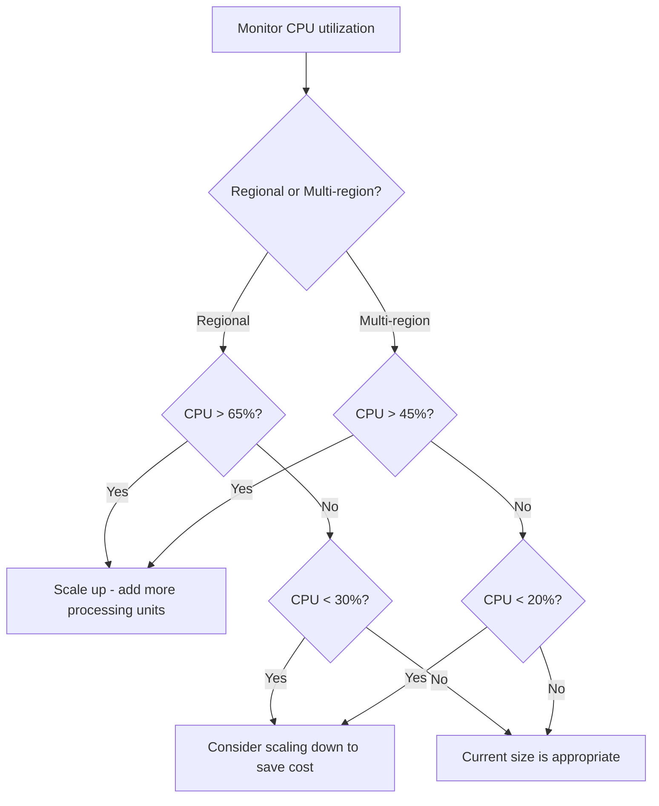

# How to Choose the Right Cloud Spanner Instance Size for Your Workload

Author: [nawazdhandala](https://www.github.com/nawazdhandala)

Tags: GCP, Cloud Spanner, Capacity Planning, Performance, Cost Optimization

Description: A practical guide to sizing your Cloud Spanner instance based on throughput requirements, data volume, and cost considerations.

---

One of the first questions everyone asks about Cloud Spanner is "how many nodes do I need?" The answer depends on your workload characteristics - data size, read throughput, write throughput, and query complexity all factor in. Getting the sizing right matters because over-provisioning wastes money and under-provisioning leads to poor performance. In this post, I will walk through how to think about Spanner instance sizing and give you practical guidelines for common workload patterns.

## Processing Units vs Nodes

Spanner capacity is measured in processing units. The relationship is simple:

- 1 node = 1000 processing units
- Minimum instance size = 100 processing units
- Below 1000 processing units, you scale in increments of 100
- At 1000 and above, you scale in increments of 1000

For most discussions, people still talk about "nodes," but processing units give you finer-grained control for smaller workloads.

## Baseline Capacity per Node

Each node (1000 processing units) provides roughly:

- **10,000 reads per second** (single-row point reads)
- **2,000 writes per second** (single-row writes)
- **10 GB of data storage** (recommended maximum for optimal performance)
- **2 TB of data storage** (hard limit per node)

These are approximate guidelines, not hard limits. The actual capacity depends heavily on your specific access patterns, row sizes, and query complexity.

## Sizing Based on Data Volume

The first constraint to check is data storage. While each node can technically hold up to 2 TB, performance degrades well before that. Google recommends keeping data per node under 10 GB for optimal performance.

Here is a simple calculation:

```
Total data size: 50 GB
Recommended data per node: 10 GB
Minimum nodes for data: 50 / 10 = 5 nodes
```

To estimate your data size, consider:

- Row count times average row size
- Secondary indexes (each index roughly doubles the storage for indexed columns)
- Data growth projections for the next 6-12 months

```bash
# Check the current data size of your database
gcloud spanner databases describe my-database \
    --instance=my-spanner-instance
```

## Sizing Based on Read Throughput

If your application is read-heavy, calculate the nodes needed based on reads per second:

```
Peak reads per second: 35,000
Reads per node: 10,000
Minimum nodes for reads: 35,000 / 10,000 = 3.5 -> 4 nodes
```

Keep in mind that complex queries (joins, aggregations, range scans) consume more resources than simple point reads. A query that scans 1000 rows counts as more than a single read. Adjust your estimates based on query complexity.

## Sizing Based on Write Throughput

Write-heavy workloads often hit their limit before read-heavy ones:

```
Peak writes per second: 8,000
Writes per node: 2,000
Minimum nodes for writes: 8,000 / 2,000 = 4 nodes
```

Writes are more expensive than reads because they need to be replicated across Spanner's underlying storage. Writes with secondary indexes are even more expensive because each write also updates the indexes.

## The Combined Calculation

Take the maximum of all three sizing dimensions:

```
Nodes for data volume:     5 nodes
Nodes for read throughput: 4 nodes
Nodes for write throughput: 4 nodes
Recommended instance size: 5 nodes (5000 processing units)
```

Then add a buffer for headroom. Google recommends keeping CPU utilization below 65% for regional instances and below 45% for multi-region instances during normal operations. This leaves room for traffic spikes.

```
Base requirement: 5 nodes
With 65% utilization target: 5 / 0.65 = 7.7 -> 8 nodes
```

## Monitoring to Validate Your Sizing

After launching, monitor these key metrics to validate your sizing:

```bash
# View instance metrics in Cloud Monitoring
# Set up a dashboard with these critical metrics
gcloud monitoring dashboards create --config-from-file=spanner-dashboard.json
```

The critical metrics to watch:

- **CPU utilization** - Should stay below 65% (regional) or 45% (multi-region) during normal operations
- **Storage utilization** - Track data growth over time
- **Operation latency** - p50 and p99 latency for reads and writes
- **Transaction aborts** - High abort rates indicate contention, not necessarily a sizing issue

Here is a decision framework for when to scale:



## Common Workload Patterns

### Read-Heavy Web Application
A typical web application with 100:1 read-to-write ratio. Start with sizing based on reads and add 20% buffer.

### Write-Heavy IoT Ingestion
IoT applications that continuously ingest sensor data. Size based on write throughput and consider batch writes to improve efficiency.

### Mixed OLTP Workload
Standard transactional workload with balanced reads and writes. Use the combined calculation above and target 50% CPU utilization for comfortable headroom.

### Analytical Queries
If you run complex analytical queries alongside OLTP traffic, those queries can spike CPU usage temporarily. Either run analytics during off-peak hours or add extra capacity specifically for analytics.

## Starting Small and Scaling Up

One of Spanner's biggest advantages is that you can scale up and down without downtime. This means you do not need to get the initial sizing perfect:

```bash
# Start with a small instance for initial deployment
gcloud spanner instances create my-instance \
    --config=regional-us-central1 \
    --processing-units=300

# Scale up as traffic grows
gcloud spanner instances update my-instance \
    --processing-units=1000

# Scale up further for a big launch
gcloud spanner instances update my-instance \
    --processing-units=5000
```

Scaling takes effect within seconds to minutes, so you can respond to changing load in near-real-time. Some teams even automate scaling based on CPU utilization using Cloud Monitoring alerts and Cloud Functions.

## Autoscaling with the Spanner Autoscaler

For workloads with variable traffic patterns, consider the open-source Spanner Autoscaler:

```bash
# The Spanner Autoscaler watches CPU metrics and adjusts processing units
# It runs as a Cloud Function triggered by Cloud Scheduler
# Configuration example:
# - min_processing_units: 1000
# - max_processing_units: 10000
# - scale_up_threshold: 65 (CPU %)
# - scale_down_threshold: 30 (CPU %)
# - cooldown_period: 10 (minutes)
```

This automatically adjusts your instance size based on actual demand, saving money during low-traffic periods and scaling up for peak hours.

## Cost Estimation

Spanner pricing is per node-hour (or processing-unit-hour). Here is a rough monthly cost estimate for US regional instances:

- 100 processing units: roughly $65/month
- 1000 processing units (1 node): roughly $650/month
- 5000 processing units (5 nodes): roughly $3,250/month

Multi-region configurations multiply these costs by 3x to 9x depending on the configuration.

Storage costs are additional, at roughly $0.30/GB/month. Backups are charged at a lower rate.

## Wrapping Up

Sizing a Cloud Spanner instance is not an exact science, but you can get a solid starting point by calculating requirements for data volume, read throughput, and write throughput, then adding headroom for the recommended CPU utilization targets. The beauty of Spanner is that you can adjust the sizing at any time without downtime, so start conservative, monitor the metrics, and scale as needed. Do not over-provision from day one when you can right-size based on actual data.
