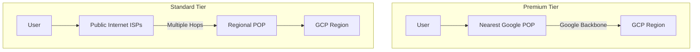

# How to Compare and Choose Between Premium and Standard Network Service Tiers on Google Cloud

Author: [nawazdhandala](https://www.github.com/nawazdhandala)

Tags: GCP, Networking, Network Tiers, Premium Tier, Standard Tier

Description: A detailed comparison of GCP Premium and Standard network service tiers to help you choose the right tier based on performance, cost, and use case requirements.

---

Google Cloud is one of the few cloud providers that lets you choose how your traffic routes between the internet and your resources. You get two options: Premium Tier and Standard Tier. Premium Tier routes traffic over Google's private global backbone, while Standard Tier routes it over the public internet. The choice affects latency, reliability, cost, and which GCP features are available to you.

In this post, I will break down the differences, show you how to configure each tier, and help you decide which one to use for different workloads.

## How Traffic Routing Differs

The fundamental difference is in how traffic gets from a user's device to your GCP resources.



With **Premium Tier**, traffic enters Google's network at the closest point of presence (POP) - Google has over 100 POPs globally. From there, it travels over Google's private fiber backbone directly to your region. This backbone is one of the largest networks in the world, with dedicated fiber connecting all regions.

With **Standard Tier**, traffic routes over the public internet through multiple ISP hops until it reaches the Google POP closest to the GCP region where your resource lives. This means more hops, more variability, and typically higher latency.

## Feature Comparison

Not all GCP features work with both tiers. Here is what you need to know:

| Feature | Premium Tier | Standard Tier |
|---------|-------------|---------------|
| Global external Application Load Balancer | Yes | No |
| Regional external Application Load Balancer | Yes | Yes |
| Network Load Balancer | Yes | Yes |
| Cloud CDN | Yes | No |
| Cloud Armor | Yes (Global LB) | Limited |
| Anycast IP | Yes | No |
| Multi-region backends on one LB | Yes | No |
| SSL certificates (managed) | Yes | Yes |

The big ones to notice: if you need global load balancing, Cloud CDN, or anycast IPs, you must use Premium Tier.

## Cost Comparison

Premium Tier costs more for egress traffic, but the pricing structure differs by region and volume. Here is a rough comparison for North America egress:

```
Premium Tier:
  0-1 TB/month:    $0.12/GB
  1-10 TB/month:   $0.11/GB
  10+ TB/month:    $0.08/GB

Standard Tier:
  0-1 TB/month:    $0.085/GB
  1-10 TB/month:   $0.065/GB
  10+ TB/month:    $0.045/GB
```

For a workload doing 5 TB of egress per month in North America, the difference is roughly $225/month. Whether that savings is worth the performance tradeoff depends entirely on your use case.

## Configuring Premium Tier (Default)

Premium Tier is the default on GCP. When you create resources without specifying a tier, you get Premium.

```bash
# Reserve a Premium Tier external IP (this is the default)
gcloud compute addresses create my-premium-ip \
    --region=us-central1 \
    --network-tier=PREMIUM

# Create a VM with Premium Tier networking
gcloud compute instances create premium-vm \
    --zone=us-central1-a \
    --machine-type=e2-medium \
    --network-tier=PREMIUM \
    --image-family=debian-11 \
    --image-project=debian-cloud
```

## Configuring Standard Tier

To use Standard Tier, you explicitly specify it when creating resources.

```bash
# Reserve a Standard Tier external IP
gcloud compute addresses create my-standard-ip \
    --region=us-central1 \
    --network-tier=STANDARD

# Create a VM with Standard Tier networking
gcloud compute instances create standard-vm \
    --zone=us-central1-a \
    --machine-type=e2-medium \
    --network-tier=STANDARD \
    --image-family=debian-11 \
    --image-project=debian-cloud
```

You can also set the default network tier for your entire project:

```bash
# Set the project-wide default to Standard Tier
gcloud compute project-info update \
    --default-network-tier=STANDARD

# Verify the setting
gcloud compute project-info describe \
    --format="value(defaultNetworkTier)"
```

Be careful with this - changing the project default affects all new resources that do not explicitly specify a tier.

## Load Balancer Configuration by Tier

The load balancer type changes depending on the tier.

For Premium Tier with global load balancing:

```bash
# Global backend service (Premium Tier)
gcloud compute backend-services create my-global-backend \
    --global \
    --protocol=HTTP \
    --health-checks=my-health-check

# Global forwarding rule with anycast IP
gcloud compute forwarding-rules create my-global-rule \
    --global \
    --address=my-premium-ip \
    --target-https-proxy=my-https-proxy \
    --ports=443
```

For Standard Tier with regional load balancing:

```bash
# Regional backend service (Standard Tier)
gcloud compute backend-services create my-regional-backend \
    --region=us-central1 \
    --protocol=HTTP \
    --health-checks=my-health-check

# Regional forwarding rule with Standard Tier IP
gcloud compute forwarding-rules create my-regional-rule \
    --region=us-central1 \
    --address=my-standard-ip \
    --target-http-proxy=my-regional-proxy \
    --ports=80 \
    --network-tier=STANDARD
```

## When to Use Premium Tier

Premium Tier makes sense when:

- **Low latency is critical**: User-facing applications where every millisecond matters. Premium Tier typically delivers 20-50% lower latency for geographically distributed users.
- **Global presence**: Applications serving users worldwide that benefit from global load balancing and anycast.
- **Reliability requirements**: The private backbone has fewer points of failure than the public internet. You get more consistent latency and fewer packet drops.
- **You need Cloud CDN or Cloud Armor**: These features require a global load balancer, which only works with Premium Tier.

## When to Use Standard Tier

Standard Tier is a good fit when:

- **Cost is the primary concern**: If you are running batch workloads, dev/test environments, or non-latency-sensitive services, the cost savings can be significant.
- **Single-region deployment**: If your application only runs in one region and your users are mostly in that same geography, the routing advantage of Premium Tier is minimal.
- **Data transfer heavy workloads**: If you are serving large files or doing heavy data egress, the per-GB savings on Standard Tier add up quickly.
- **Internal or B2B services**: For services accessed by a small, known set of users, the public internet routing is usually good enough.

## Mixing Tiers in the Same Project

You can use both tiers in the same project. This is useful for running production workloads on Premium Tier while keeping dev/test on Standard Tier.

```bash
# Production VM with Premium Tier
gcloud compute instances create prod-vm \
    --zone=us-central1-a \
    --network-tier=PREMIUM \
    --machine-type=e2-standard-4

# Dev VM with Standard Tier (cheaper)
gcloud compute instances create dev-vm \
    --zone=us-central1-a \
    --network-tier=STANDARD \
    --machine-type=e2-medium
```

## Measuring the Difference

To quantify the latency difference for your specific use case, you can run tests from different geographic locations.

```bash
# From a VM in another region or from an external server, measure latency
# to the Premium Tier IP
ping -c 50 <premium-ip>

# And to the Standard Tier IP
ping -c 50 <standard-ip>

# For HTTP workloads, use curl timing
curl -o /dev/null -s -w "Connect: %{time_connect}s\nTTFB: %{time_starttransfer}s\nTotal: %{time_total}s\n" \
    https://<premium-endpoint>/

curl -o /dev/null -s -w "Connect: %{time_connect}s\nTTFB: %{time_starttransfer}s\nTotal: %{time_total}s\n" \
    https://<standard-endpoint>/
```

In my experience, the difference is most noticeable for users far from the GCP region. A user in Singapore accessing a US-based server might see 50-100ms less latency with Premium Tier because their traffic enters Google's network in Singapore rather than traversing the public internet all the way to the US.

## Migration Between Tiers

Switching an existing resource between tiers requires replacing the external IP address, which means a brief interruption.

```bash
# You cannot change the tier of an existing IP
# Instead, create a new IP with the desired tier
gcloud compute addresses create new-ip \
    --region=us-central1 \
    --network-tier=STANDARD

# Update the VM to use the new IP
gcloud compute instances delete-access-config my-vm \
    --zone=us-central1-a \
    --access-config-name="External NAT"

gcloud compute instances add-access-config my-vm \
    --zone=us-central1-a \
    --address=new-ip \
    --network-tier=STANDARD
```

## Wrapping Up

The choice between Premium and Standard Tier comes down to your latency requirements and budget. Premium Tier gives you Google's world-class network backbone, global load balancing, and anycast - but at a higher price. Standard Tier saves money by routing over the public internet - perfectly fine for non-latency-sensitive workloads. Most organizations end up using Premium Tier for production user-facing services and Standard Tier for everything else. Start with Premium as the default, and switch specific workloads to Standard where the cost savings justify the performance tradeoff.
