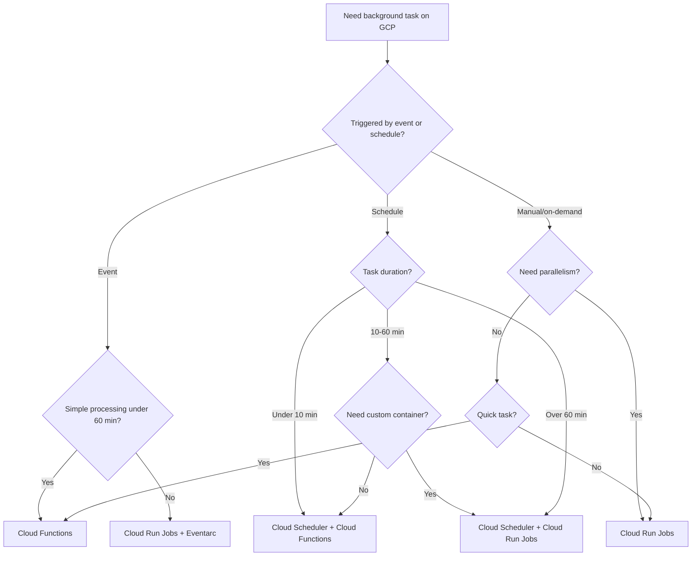

# How to Compare Cloud Run Jobs vs Cloud Functions vs Cloud Scheduler for Background Tasks

Author: [nawazdhandala](https://www.github.com/nawazdhandala)

Tags: GCP, Cloud Run Jobs, Cloud Functions, Cloud Scheduler, Serverless, Background Tasks

Description: A practical comparison of Cloud Run Jobs, Cloud Functions, and Cloud Scheduler for running background and scheduled tasks on Google Cloud.

---

Running background tasks on GCP is a common need - whether it is a nightly data cleanup, periodic report generation, or one-off batch processing. Google Cloud gives you several serverless options: Cloud Run Jobs for containerized batch workloads, Cloud Functions for event-driven code execution, and Cloud Scheduler for triggering time-based tasks. They overlap in some areas but serve different needs. Here is how to sort them out.

## What Each Service Does

**Cloud Run Jobs** execute a container to completion and then stop. Unlike Cloud Run services (which handle HTTP requests), jobs run a task, finish, and exit. They support parallelism - you can run multiple task instances simultaneously.

**Cloud Functions** run code in response to events or HTTP requests. They are designed for short-lived, single-purpose functions. Think of them as event handlers.

**Cloud Scheduler** is a managed cron service. It does not execute code itself. It triggers other services (HTTP endpoints, Pub/Sub topics, Cloud Run jobs) on a schedule. It is the clock, not the worker.

These services are often used together rather than as alternatives to each other.

## Feature Comparison

| Feature | Cloud Run Jobs | Cloud Functions | Cloud Scheduler |
|---------|---------------|----------------|----------------|
| Purpose | Run containers to completion | Run code on events | Trigger services on schedule |
| Runtime | Any Docker container | Supported runtimes (Python, Node, Go, Java, etc.) | N/A (triggers other services) |
| Max execution time | 24 hours | 60 minutes (2nd gen) | N/A |
| Parallelism | Up to 10,000 tasks | Per-instance concurrency | N/A |
| Trigger types | Manual, scheduled, Workflows | HTTP, Pub/Sub, Cloud Storage, Firestore, etc. | Cron schedule |
| Scaling | Configured task count | Automatic | N/A |
| Container support | Yes (any image) | Yes (2nd gen) or source code | N/A |
| Memory | Up to 32 GiB | Up to 32 GiB (2nd gen) | N/A |
| CPU | Up to 8 vCPU | Up to 8 vCPU (2nd gen) | N/A |
| Cost | Per vCPU-second + memory | Per invocation + compute | $0.10/job/month |
| Retry on failure | Configurable | Configurable | Configurable |

## Cloud Run Jobs - Batch Workloads

Cloud Run Jobs are ideal for tasks that need to run to completion, especially when they require custom software, long execution times, or parallel processing.

### When to Use Cloud Run Jobs

- Data processing that takes more than a few minutes
- Tasks requiring specific software or libraries in a container
- Parallel processing of independent tasks
- Database migrations
- File processing or data transformations
- Machine learning inference on batches of data

```bash
# Create a Cloud Run job for nightly data processing
gcloud run jobs create nightly-cleanup \
    --image=us-central1-docker.pkg.dev/my-project/my-repo/cleanup:latest \
    --region=us-central1 \
    --memory=2Gi \
    --cpu=2 \
    --task-timeout=3600 \
    --max-retries=3 \
    --set-env-vars="DB_HOST=10.0.0.1,BATCH_SIZE=1000"
```

Here is a container that processes data in batch:

```python
# cleanup.py - Runs as a Cloud Run Job
import os
import sys
from google.cloud import bigquery
from google.cloud import storage

def main():
    """Clean up old data and generate summary reports."""
    print("Starting nightly cleanup job...")

    client = bigquery.Client()

    # Step 1: Delete records older than 90 days
    delete_query = """
        DELETE FROM operations.audit_logs
        WHERE created_at < TIMESTAMP_SUB(CURRENT_TIMESTAMP(), INTERVAL 90 DAY)
    """
    result = client.query(delete_query).result()
    print(f"Deleted old audit log records")

    # Step 2: Generate daily summary
    summary_query = """
        CREATE OR REPLACE TABLE reports.daily_summary AS
        SELECT
            DATE(created_at) as day,
            action_type,
            COUNT(*) as count,
            COUNT(DISTINCT user_id) as unique_users
        FROM operations.audit_logs
        WHERE created_at >= TIMESTAMP_SUB(CURRENT_TIMESTAMP(), INTERVAL 30 DAY)
        GROUP BY day, action_type
    """
    client.query(summary_query).result()
    print("Daily summary generated")

    # Step 3: Export report to Cloud Storage
    storage_client = storage.Client()
    bucket = storage_client.bucket("reports-bucket")
    blob = bucket.blob(f"daily-summary-{os.environ.get('CLOUD_RUN_EXECUTION', 'local')}.csv")
    # ... export logic

    print("Nightly cleanup completed successfully")
    sys.exit(0)  # Exit with 0 to indicate success

if __name__ == "__main__":
    main()
```

```dockerfile
# Dockerfile for the Cloud Run Job
FROM python:3.11-slim
WORKDIR /app
COPY requirements.txt .
RUN pip install --no-cache-dir -r requirements.txt
COPY cleanup.py .
CMD ["python", "cleanup.py"]
```

### Parallel Processing with Cloud Run Jobs

One of Cloud Run Jobs' killer features is running multiple task instances in parallel:

```bash
# Create a job with 100 parallel tasks
# Each task processes a different shard of data
gcloud run jobs create parallel-processor \
    --image=us-central1-docker.pkg.dev/my-project/my-repo/processor:latest \
    --region=us-central1 \
    --tasks=100 \
    --parallelism=20 \
    --memory=1Gi \
    --cpu=1 \
    --task-timeout=1800
```

```python
# processor.py - Each task instance gets CLOUD_RUN_TASK_INDEX
import os

def main():
    task_index = int(os.environ.get("CLOUD_RUN_TASK_INDEX", 0))
    task_count = int(os.environ.get("CLOUD_RUN_TASK_COUNT", 1))

    print(f"Processing shard {task_index} of {task_count}")

    # Each task processes its own shard of data
    # For example, process users where user_id % task_count == task_index
    process_shard(task_index, task_count)

if __name__ == "__main__":
    main()
```

## Cloud Functions - Event-Driven Tasks

Cloud Functions are best for lightweight, event-driven background tasks.

### When to Use Cloud Functions

- Reacting to events (file upload, database change, Pub/Sub message)
- Quick processing tasks (under a few minutes)
- Webhook handlers
- Lightweight scheduled tasks (with Cloud Scheduler)

```python
# Cloud Function triggered by Cloud Storage upload
import functions_framework
from google.cloud import vision
from google.cloud import storage

@functions_framework.cloud_event
def process_uploaded_image(cloud_event):
    """Analyze an uploaded image using Vision API."""
    data = cloud_event.data
    bucket_name = data["bucket"]
    file_name = data["name"]

    # Only process image files
    if not file_name.lower().endswith(('.png', '.jpg', '.jpeg')):
        print(f"Skipping non-image file: {file_name}")
        return

    # Analyze the image with Vision API
    vision_client = vision.ImageAnnotatorClient()
    image = vision.Image(
        source=vision.ImageSource(
            gcs_image_uri=f"gs://{bucket_name}/{file_name}"
        )
    )

    # Detect labels in the image
    response = vision_client.label_detection(image=image)
    labels = [label.description for label in response.label_annotations]

    # Store the labels as metadata
    storage_client = storage.Client()
    bucket = storage_client.bucket(bucket_name)
    blob = bucket.blob(file_name)
    blob.metadata = {"labels": ",".join(labels)}
    blob.patch()

    print(f"Processed {file_name}: {labels}")
```

```bash
# Deploy the function
gcloud functions deploy process-image \
    --gen2 \
    --runtime=python311 \
    --region=us-central1 \
    --trigger-event-filters="type=google.cloud.storage.object.v1.finalized" \
    --trigger-event-filters="bucket=my-uploads-bucket" \
    --memory=512MB \
    --timeout=120s
```

### Cloud Functions for Scheduled Tasks

For simple scheduled tasks, Cloud Functions work well with Cloud Scheduler:

```python
# Cloud Function triggered by Cloud Scheduler via HTTP
import functions_framework
from google.cloud import bigquery

@functions_framework.http
def daily_report(request):
    """Generate a daily report - triggered by Cloud Scheduler."""
    client = bigquery.Client()

    query = """
        INSERT INTO reports.daily_metrics (report_date, active_users, revenue)
        SELECT
            CURRENT_DATE() as report_date,
            COUNT(DISTINCT user_id) as active_users,
            SUM(amount) as revenue
        FROM transactions.daily
        WHERE DATE(created_at) = CURRENT_DATE() - 1
    """
    client.query(query).result()

    return "Daily report generated", 200
```

## Cloud Scheduler - The Trigger

Cloud Scheduler does not run code. It sends HTTP requests, publishes Pub/Sub messages, or triggers Cloud Run jobs on a cron schedule.

### Common Cloud Scheduler Patterns

```bash
# Trigger a Cloud Run Job every night at 2 AM
gcloud scheduler jobs create http nightly-cleanup-trigger \
    --schedule="0 2 * * *" \
    --uri="https://us-central1-run.googleapis.com/apis/run.googleapis.com/v1/namespaces/my-project/jobs/nightly-cleanup:run" \
    --http-method=POST \
    --oauth-service-account-email=scheduler-sa@my-project.iam.gserviceaccount.com \
    --location=us-central1

# Trigger a Cloud Function every hour
gcloud scheduler jobs create http hourly-sync \
    --schedule="0 * * * *" \
    --uri="https://us-central1-my-project.cloudfunctions.net/hourly-sync" \
    --http-method=POST \
    --oidc-service-account-email=scheduler-sa@my-project.iam.gserviceaccount.com \
    --location=us-central1

# Publish to Pub/Sub every 5 minutes
gcloud scheduler jobs create pubsub five-min-check \
    --schedule="*/5 * * * *" \
    --topic=health-checks \
    --message-body='{"check": "all-services"}' \
    --location=us-central1
```

## When to Use What - Decision Guide



## Cost Comparison

For a task that runs daily and takes 5 minutes:

| Approach | Monthly Cost |
|----------|-------------|
| Cloud Scheduler + Cloud Function (256 MB) | ~$0.10 (scheduler) + ~$0.50 (function) = ~$0.60 |
| Cloud Scheduler + Cloud Run Job (1 vCPU, 512 MB) | ~$0.10 (scheduler) + ~$1.50 (job) = ~$1.60 |
| Cloud Run Job (manual trigger) | ~$1.50 |

For a task that runs hourly and takes 30 seconds:

| Approach | Monthly Cost |
|----------|-------------|
| Cloud Scheduler + Cloud Function (256 MB) | ~$0.10 + ~$1.00 = ~$1.10 |
| Cloud Scheduler + Cloud Run Job (1 vCPU, 512 MB) | ~$0.10 + ~$3.00 = ~$3.10 |

Cloud Functions are cheaper for short, frequent tasks. Cloud Run Jobs are better for longer tasks or when you need specific container tooling.

## Practical Recommendation

For most background task scenarios:

1. **Simple scheduled tasks** (data cleanup, report generation, API syncs): Cloud Scheduler triggering a Cloud Function. Fast to set up, cheapest to run.

2. **Heavy batch processing** (data migrations, large file processing, ML inference): Cloud Run Jobs, triggered by Cloud Scheduler or manually.

3. **Event-driven processing** (file uploads, database changes, message processing): Cloud Functions with event triggers.

4. **Parallel batch processing** (processing millions of records): Cloud Run Jobs with multiple task instances.

Start with Cloud Functions for simplicity. Move to Cloud Run Jobs when you outgrow them - either because of time limits, container requirements, or parallelism needs. Cloud Scheduler is almost always part of the picture for any scheduled workload.
