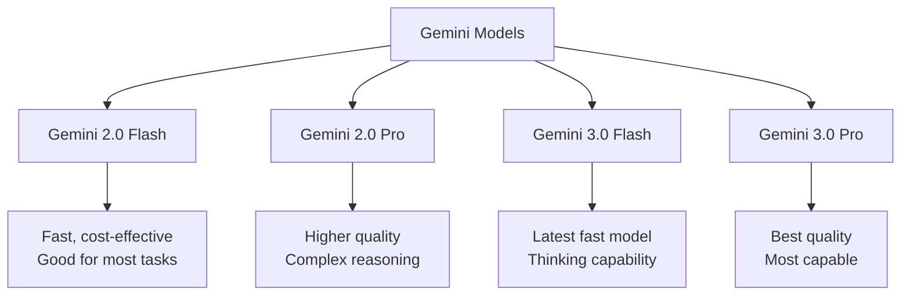

# How to Compare Gemini Model Variants Using Vertex AI Evaluation Metrics

Author: [nawazdhandala](https://www.github.com/nawazdhandala)

Tags: GCP, Gemini, Vertex AI, Model Evaluation, Model Comparison

Description: Learn how to systematically compare Gemini model variants using Vertex AI evaluation metrics to choose the right model for your specific use case.

---

Choosing the right Gemini model variant for your application is not straightforward. Should you use Flash or Pro? Gemini 2.0 or 3.0? Each variant has different strengths in quality, speed, and cost. The only reliable way to decide is to evaluate them systematically against your specific workload. Vertex AI's evaluation tools make this possible without guesswork.

In this post, I will show you how to run side-by-side evaluations of different Gemini models and interpret the results to make an informed choice.

## The Gemini Model Landscape

The Gemini family includes several model variants, each with different trade-offs:



The right choice depends on your quality requirements, latency budget, and cost constraints. Let me show you how to make that decision with data.

## Setting Up the Comparison Framework

Start by defining your evaluation dataset and the models you want to compare.

This code sets up the comparison infrastructure:

```python
import vertexai
from vertexai.generative_models import GenerativeModel
from vertexai.evaluation import EvalTask
import pandas as pd
import time

# Initialize Vertex AI
vertexai.init(project="your-project-id", location="us-central1")

# Define the models to compare
MODEL_VARIANTS = {
    "gemini-2.0-flash": GenerativeModel("gemini-2.0-flash"),
    "gemini-2.0-pro": GenerativeModel("gemini-2.0-pro"),
    "gemini-3.0-flash": GenerativeModel("gemini-3.0-flash"),
}

# Create an evaluation dataset representative of your workload
eval_dataset = pd.DataFrame({
    "prompt": [
        "Explain the CAP theorem and its practical implications for distributed databases.",
        "Write a Python function to find the longest palindromic substring.",
        "Compare microservices and monolithic architectures for a startup with 5 engineers.",
        "Analyze this error log and suggest fixes: 'OOMKilled: container exceeded memory limit of 512Mi'",
        "Create a Terraform configuration for a GKE autopilot cluster with private networking.",
        "Explain eventual consistency to a product manager who has no technical background.",
        "What are the security implications of using service account keys vs workload identity?",
        "Debug this SQL query that returns incorrect results: SELECT * FROM orders WHERE date > '2025-01'",
    ],
    "reference": [
        "The CAP theorem states that a distributed system can only guarantee two of three properties: Consistency, Availability, and Partition tolerance.",
        "A dynamic programming approach checking all substrings for palindrome property.",
        "Monolithic is simpler for small teams; microservices add complexity but enable independent scaling.",
        "The container ran out of memory. Increase memory limits or optimize application memory usage.",
        "Terraform code defining a GKE autopilot cluster with private nodes and authorized networks.",
        "Eventual consistency means all copies of data will match, but there may be a brief delay.",
        "Service account keys are long-lived credentials that can be leaked; workload identity uses short-lived tokens.",
        "The date comparison format may not match the column format; use proper date comparison syntax.",
    ]
})
```

## Running Side-by-Side Evaluations

Generate responses from each model and evaluate them with the same metrics.

```python
def evaluate_model(model_name, model, dataset, experiment_name):
    """Evaluate a single model variant."""
    print(f"\nEvaluating: {model_name}")

    # Generate responses
    responses = []
    latencies = []

    for _, row in dataset.iterrows():
        start_time = time.time()
        try:
            response = model.generate_content(row["prompt"])
            responses.append(response.text)
        except Exception as e:
            responses.append(f"Error: {str(e)}")
        latency = time.time() - start_time
        latencies.append(latency)

    # Add responses to dataset
    eval_data = dataset.copy()
    eval_data["response"] = responses

    # Run evaluation with multiple metrics
    eval_task = EvalTask(
        dataset=eval_data,
        metrics=[
            "coherence",
            "fluency",
            "groundedness",
            "fulfillment",
            "rouge_l_sum",
        ],
        experiment=experiment_name
    )

    result = eval_task.evaluate()

    # Add latency statistics
    result_summary = dict(result.summary_metrics)
    result_summary["avg_latency_ms"] = sum(latencies) / len(latencies) * 1000
    result_summary["p99_latency_ms"] = sorted(latencies)[int(len(latencies) * 0.99)] * 1000
    result_summary["model_name"] = model_name

    return result_summary, result.metrics_table

# Evaluate all models
all_results = {}
for model_name, model in MODEL_VARIANTS.items():
    summary, details = evaluate_model(
        model_name, model, eval_dataset,
        f"comparison-{model_name.replace('.', '-')}"
    )
    all_results[model_name] = summary
```

## Comparing Results

Organize the results into a comparison table for easy analysis.

```python
def create_comparison_table(results):
    """Create a formatted comparison of model results."""
    # Build a comparison DataFrame
    rows = []
    for model_name, metrics in results.items():
        rows.append(metrics)

    comparison = pd.DataFrame(rows)
    comparison = comparison.set_index("model_name")

    # Print formatted comparison
    print("\n" + "=" * 80)
    print("MODEL COMPARISON RESULTS")
    print("=" * 80)

    # Print each metric
    metric_columns = [c for c in comparison.columns if c != "model_name"]
    for metric in metric_columns:
        print(f"\n{metric}:")
        for model_name in comparison.index:
            value = comparison.loc[model_name, metric]
            if isinstance(value, float):
                bar_length = int(value * 10) if value <= 5 else int(value / 10)
                bar = "#" * max(bar_length, 1)
                print(f"  {model_name:30s} {value:8.3f}  {bar}")
            else:
                print(f"  {model_name:30s} {value}")

    return comparison

comparison = create_comparison_table(all_results)
```

## Pairwise Model Comparison

For a direct head-to-head comparison, use pairwise evaluation where a judge model directly compares outputs from two models.

```python
from vertexai.evaluation import PairwiseMetric, MetricPromptTemplateExamples

def pairwise_compare(model_a_name, model_b_name, dataset):
    """Run a pairwise comparison between two models."""
    model_a = MODEL_VARIANTS[model_a_name]
    model_b = MODEL_VARIANTS[model_b_name]

    # Generate responses from both models
    responses_a = []
    responses_b = []

    for _, row in dataset.iterrows():
        resp_a = model_a.generate_content(row["prompt"])
        resp_b = model_b.generate_content(row["prompt"])
        responses_a.append(resp_a.text)
        responses_b.append(resp_b.text)

    # Set up pairwise evaluation dataset
    pairwise_data = dataset.copy()
    pairwise_data["baseline_model_response"] = responses_a
    pairwise_data["response"] = responses_b

    # Define pairwise metric
    pairwise_quality = PairwiseMetric(
        metric="pairwise_quality",
        metric_prompt_template=MetricPromptTemplateExamples.get_prompt_template(
            "pairwise_question_answering_quality"
        ),
        baseline_model_response_column="baseline_model_response"
    )

    # Run the evaluation
    eval_task = EvalTask(
        dataset=pairwise_data,
        metrics=[pairwise_quality],
        experiment=f"pairwise-{model_a_name}-vs-{model_b_name}"
    )

    result = eval_task.evaluate()

    # Interpret results
    wins_b = 0
    wins_a = 0
    ties = 0

    table = result.metrics_table
    for _, row in table.iterrows():
        score = row.get("pairwise_quality", 0)
        if score > 0:
            wins_b += 1
        elif score < 0:
            wins_a += 1
        else:
            ties += 1

    print(f"\nPairwise: {model_a_name} vs {model_b_name}")
    print(f"  {model_a_name} wins: {wins_a}")
    print(f"  {model_b_name} wins: {wins_b}")
    print(f"  Ties: {ties}")

    return {"model_a_wins": wins_a, "model_b_wins": wins_b, "ties": ties}

# Compare Flash vs Pro
pairwise_compare("gemini-2.0-flash", "gemini-2.0-pro", eval_dataset)
```

## Cost-Quality Trade-Off Analysis

Model selection is not just about quality - cost matters too. Calculate the cost-effectiveness of each model.

```python
# Approximate pricing per million tokens (check current pricing)
PRICING = {
    "gemini-2.0-flash": {"input": 0.075, "output": 0.30},
    "gemini-2.0-pro": {"input": 1.25, "output": 5.00},
    "gemini-3.0-flash": {"input": 0.10, "output": 0.40},
}

def cost_quality_analysis(results, pricing):
    """Analyze cost vs quality trade-offs."""
    print("\nCOST-QUALITY ANALYSIS")
    print("-" * 60)

    for model_name, metrics in results.items():
        # Estimate cost per 1000 requests (assuming avg 500 input, 200 output tokens)
        price = pricing.get(model_name, {"input": 0, "output": 0})
        cost_per_1k = (
            (500 * price["input"] / 1_000_000) +
            (200 * price["output"] / 1_000_000)
        ) * 1000

        quality = metrics.get("coherence/mean", 0) + metrics.get("fulfillment/mean", 0)
        quality_per_dollar = quality / max(cost_per_1k, 0.001)

        print(f"\n{model_name}:")
        print(f"  Est. cost per 1K requests: ${cost_per_1k:.4f}")
        print(f"  Quality score: {quality:.2f}")
        print(f"  Quality per dollar: {quality_per_dollar:.2f}")
        print(f"  Avg latency: {metrics.get('avg_latency_ms', 0):.0f}ms")

cost_quality_analysis(all_results, PRICING)
```

## Task-Specific Evaluation

Different tasks may favor different models. Test each model on task categories separately.

```python
TASK_CATEGORIES = {
    "explanation": [0, 2, 5],    # Indices of explanation tasks
    "coding": [1, 4],            # Indices of coding tasks
    "analysis": [3, 6, 7],       # Indices of analysis tasks
}

def evaluate_by_task(results_details, categories):
    """Break down evaluation by task category."""
    print("\nTASK-SPECIFIC RESULTS")
    print("-" * 60)

    for category, indices in categories.items():
        print(f"\n{category.upper()}:")
        for model_name, (summary, details) in results_details.items():
            # Filter to relevant rows
            category_rows = details.iloc[indices]
            avg_quality = category_rows["fulfillment"].mean()
            print(f"  {model_name}: {avg_quality:.3f} avg fulfillment")
```

## Making the Final Decision

Use a decision matrix that weighs your specific priorities.

```python
def recommend_model(results, weights=None):
    """Recommend the best model based on weighted criteria."""
    if weights is None:
        weights = {
            "quality": 0.4,
            "speed": 0.3,
            "cost": 0.3
        }

    scores = {}
    for model_name, metrics in results.items():
        quality_score = (
            metrics.get("coherence/mean", 0) +
            metrics.get("fulfillment/mean", 0)
        ) / 2

        # Normalize latency (lower is better)
        latency = metrics.get("avg_latency_ms", 1000)
        speed_score = 5.0 * (1000 / max(latency, 100))
        speed_score = min(speed_score, 5.0)

        # Cost score (lower cost = higher score)
        price = PRICING.get(model_name, {"input": 1, "output": 1})
        cost_score = 5.0 / (1 + price["input"])

        weighted = (
            quality_score * weights["quality"] +
            speed_score * weights["speed"] +
            cost_score * weights["cost"]
        )

        scores[model_name] = {
            "quality": quality_score,
            "speed": speed_score,
            "cost": cost_score,
            "weighted_total": weighted
        }

    # Sort by weighted total
    ranked = sorted(scores.items(), key=lambda x: x[1]["weighted_total"], reverse=True)

    print("\nMODEL RECOMMENDATION")
    print("=" * 60)
    for rank, (model_name, score) in enumerate(ranked, 1):
        print(f"\n#{rank}: {model_name}")
        print(f"  Quality: {score['quality']:.2f}")
        print(f"  Speed: {score['speed']:.2f}")
        print(f"  Cost: {score['cost']:.2f}")
        print(f"  Weighted Total: {score['weighted_total']:.2f}")

    winner = ranked[0][0]
    print(f"\nRecommended: {winner}")
    return winner

best_model = recommend_model(all_results)
```

## Wrapping Up

Choosing the right Gemini model variant requires data, not guesses. Set up an evaluation dataset that represents your real workload, measure quality with multiple metrics, factor in latency and cost, and make an informed decision. Repeat this evaluation whenever new model versions are released or your workload changes. Use monitoring tools like OneUptime to track model performance in production and validate that your evaluation results hold up under real-world conditions.
