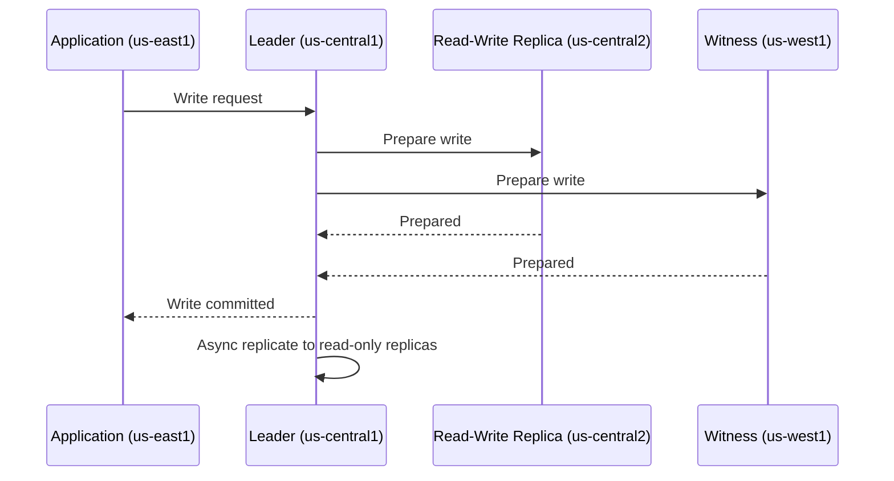
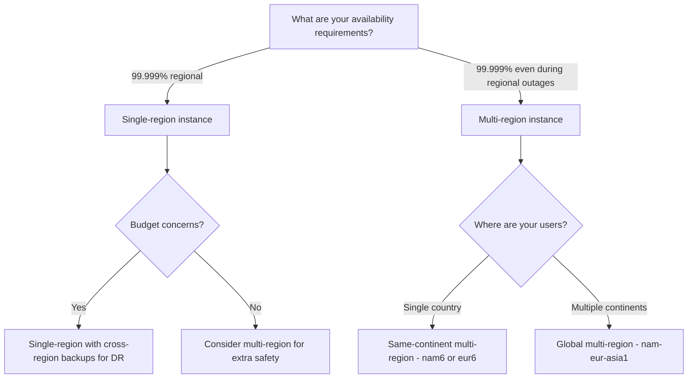

# How to Configure a Multi-Region Cloud Spanner Instance

Author: [nawazdhandala](https://www.github.com/nawazdhandala)

Tags: GCP, Cloud Spanner, Multi-Region, High Availability, Database

Description: A practical guide to configuring multi-region Cloud Spanner instances for global applications requiring high availability and low-latency reads.

---

One of Cloud Spanner's most compelling features is its ability to run across multiple regions while maintaining strong consistency. A multi-region instance replicates your data across several geographic areas, giving you higher availability guarantees and lower read latency for globally distributed users. In this post, I will walk through how to choose and configure a multi-region Spanner instance, and what tradeoffs to expect.

## Single-Region vs Multi-Region

Before diving into configuration, let's understand what you get with each option:

A **single-region instance** stores your data in one geographic region. It provides 99.999% availability (five nines) within that region. If the region goes down, your database goes down.

A **multi-region instance** replicates data across multiple regions automatically. It provides 99.999% availability even if an entire region becomes unavailable. Reads from any region are fast because replicas are local. Writes go through the leader region, so they have slightly higher latency if the writer is far from the leader.

## Available Multi-Region Configurations

Spanner offers several predefined multi-region configurations. You can see them all with:

```bash
# List all available instance configurations, including multi-region options
gcloud spanner instance-configs list --filter="name:nam OR name:eur OR name:asia"
```

Some commonly used multi-region configurations:

- **nam6** - Replicas in multiple US regions. Good for US-only applications needing regional fault tolerance.
- **nam14** - Replicas across North America, similar to nam6 but with different region choices.
- **eur6** - Replicas across multiple European regions.
- **nam-eur-asia1** - The broadest configuration, spanning North America, Europe, and Asia.

Each configuration has a specific set of read-write, read-only, and witness replicas placed in predetermined regions.

## Checking Configuration Details

To see exactly which regions are included in a configuration:

```bash
# See the detailed replica placement for a specific configuration
gcloud spanner instance-configs describe nam6
```

This will show you something like:

```
displayName: United States (NAM6)
replicas:
- location: us-central1
  type: READ_WRITE
- location: us-central2
  type: READ_WRITE
- location: us-east1
  type: READ_ONLY
- location: us-east4
  type: READ_ONLY
- location: us-west1
  type: WITNESS
```

The replica types matter:

- **READ_WRITE replicas** participate in write quorums and can serve reads. The leader is always in one of these regions.
- **READ_ONLY replicas** serve reads only. They receive data asynchronously but are guaranteed to be consistent.
- **WITNESS replicas** participate in write quorums to maintain consensus but do not store a full copy of the data and cannot serve reads.

## Creating a Multi-Region Instance

Creating a multi-region instance is nearly identical to creating a single-region one:

```bash
# Create a multi-region instance spanning US regions
gcloud spanner instances create my-global-instance \
    --config=nam6 \
    --display-name="My Global Spanner Instance" \
    --processing-units=1000
```

That is it. Spanner handles all the replication automatically. Your data is now spread across multiple US regions.

For a truly global deployment:

```bash
# Create a globally distributed instance
gcloud spanner instances create my-worldwide-instance \
    --config=nam-eur-asia1 \
    --display-name="Global Spanner Instance" \
    --processing-units=3000
```

## Creating a Database on a Multi-Region Instance

Database creation works the same as single-region:

```bash
# Create a database on the multi-region instance
gcloud spanner databases create my-global-db \
    --instance=my-global-instance \
    --ddl='CREATE TABLE Users (
        UserId STRING(36) NOT NULL,
        Email STRING(256) NOT NULL,
        Region STRING(32),
        CreatedAt TIMESTAMP NOT NULL
    ) PRIMARY KEY (UserId)'
```

The database automatically inherits the multi-region configuration of the instance.

## Understanding Write Latency

The most important tradeoff with multi-region instances is write latency. Every write must be committed by a quorum of replicas before it is acknowledged to the client. Since these replicas are in different regions, the write latency includes the network round-trip time between regions.

For a nam6 configuration, writes typically take 10-20ms because the replicas are within the US. For nam-eur-asia1, writes can take 200-400ms because the replicas span continents.

Here is how write flow works:



## Optimizing Read Performance

While writes go through the leader, reads can be served by any replica. This is where multi-region really shines for read-heavy workloads.

**Strong reads** are served by the nearest replica that has caught up to the latest committed timestamp. For read-write replicas, this is always up to date. For read-only replicas, there might be a few milliseconds of delay.

**Stale reads** can be served immediately by any replica, making them even faster. If your application can tolerate data that is a few seconds old, stale reads eliminate the consistency wait entirely.

```python
from google.cloud import spanner
import datetime

client = spanner.Client()
instance = client.instance("my-global-instance")
database = instance.database("my-global-db")

# Strong read - served by nearest up-to-date replica
with database.snapshot() as snapshot:
    results = snapshot.execute_sql("SELECT * FROM Users WHERE UserId = @id",
        params={"id": "user-123"},
        param_types={"id": spanner.param_types.STRING})

# Stale read - can be served by any replica immediately
# Accepts data up to 15 seconds old
staleness = datetime.timedelta(seconds=15)
with database.snapshot(exact_staleness=staleness) as snapshot:
    results = snapshot.execute_sql("SELECT * FROM Users WHERE UserId = @id",
        params={"id": "user-123"},
        param_types={"id": spanner.param_types.STRING})
```

## Cost Considerations

Multi-region instances cost more than single-region instances. The cost multiplier depends on the configuration:

- A nam6 instance costs roughly 3x a comparable single-region instance
- A nam-eur-asia1 instance costs roughly 9x

This is because you are paying for replicas in each region. The pricing scales with processing units, so a multi-region instance with 1000 processing units costs more than a single-region instance with 1000 processing units.

For many applications, the right strategy is to use single-region instances for development and staging, and multi-region for production where availability is critical.

## Decision Framework

Here is a framework for choosing between single and multi-region:



## Monitoring a Multi-Region Instance

Keep an eye on per-region latency to make sure your global deployment is performing as expected:

```bash
# Check instance-level metrics
gcloud spanner instances describe my-global-instance
```

Use Cloud Monitoring to track:

- Write latency by region (to see the impact of cross-region coordination)
- Read latency by region (to verify local reads are fast)
- CPU utilization per region (to detect unbalanced load)
- Replication lag (to monitor how quickly read-only replicas catch up)

## Wrapping Up

Multi-region Cloud Spanner instances give you a level of availability and global reach that is hard to achieve with any other database. The setup is simple - you just pick a multi-region configuration and create your instance. The complexity is in understanding the tradeoffs: higher write latency, higher cost, but dramatically better availability and global read performance. For applications that serve users worldwide or cannot tolerate regional outages, multi-region Spanner is one of the most practical solutions available.
