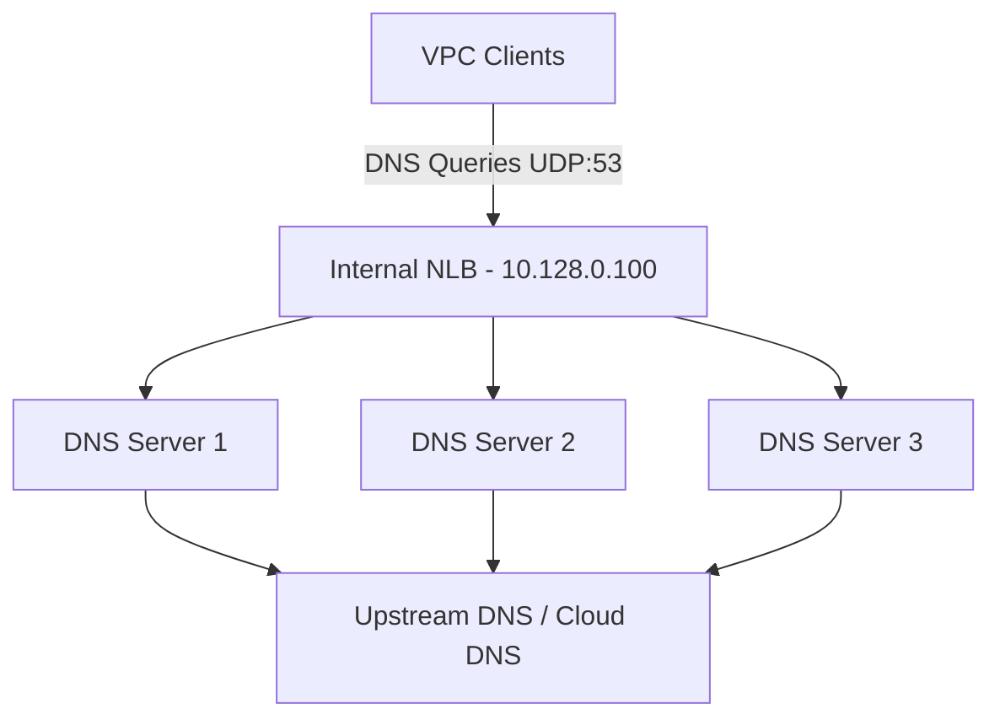

# How to Configure a Passthrough Network Load Balancer for UDP Traffic in GCP

Author: [nawazdhandala](https://www.github.com/nawazdhandala)

Tags: GCP, Network Load Balancer, UDP, Passthrough, Networking

Description: Learn how to configure a passthrough network load balancer in GCP for UDP traffic, supporting use cases like DNS servers, VoIP, gaming, and streaming protocols.

---

UDP workloads are fundamentally different from TCP and HTTP. There is no connection establishment, no guaranteed delivery, and no built-in flow control. When you need to load balance UDP traffic in GCP - for DNS servers, VoIP systems, game servers, or streaming protocols - the passthrough network load balancer is your only option. It forwards packets directly to backends without modifying them, preserving the original source IP and the connectionless nature of UDP.

This post covers the complete setup for both external and internal passthrough network load balancers for UDP traffic.

## How the Passthrough Network Load Balancer Works

Unlike proxy-based load balancers (HTTP(S), TCP proxy), the passthrough network load balancer does not terminate connections. It receives packets on the frontend IP and forwards them to a healthy backend, without modifying the packet headers. The backend sees the original client IP as the source address.

For UDP specifically:
- There is no connection state, so each packet is independently routed
- Session affinity uses a hash of the source IP (and optionally port) to consistently send packets from the same client to the same backend
- Health checks still work but use TCP or HTTP probes (since UDP health checks are not natively supported)

## External vs Internal

GCP offers two variants:

- **External passthrough NLB**: Has a public IP, accessible from the internet. Good for public-facing UDP services.
- **Internal passthrough NLB**: Has a private IP within your VPC. Good for internal UDP services like DNS resolvers.

## Setting Up an External Passthrough NLB for UDP

### Step 1: Create Backend Instances

First, set up your UDP servers. Here is an example creating instances with a startup script that runs a simple UDP echo server:

```bash
# Create a VM instance running a UDP service
gcloud compute instances create udp-server-1 \
    --zone=us-central1-a \
    --machine-type=e2-medium \
    --tags=udp-backend \
    --metadata=startup-script='#!/bin/bash
apt-get update && apt-get install -y socat
# Run a simple UDP echo server on port 5353
socat UDP4-RECVFROM:5353,fork EXEC:"/bin/cat" &'

gcloud compute instances create udp-server-2 \
    --zone=us-central1-a \
    --machine-type=e2-medium \
    --tags=udp-backend \
    --metadata=startup-script='#!/bin/bash
apt-get update && apt-get install -y socat
socat UDP4-RECVFROM:5353,fork EXEC:"/bin/cat" &'
```

### Step 2: Create an Unmanaged Instance Group

```bash
# Create an instance group and add the UDP servers
gcloud compute instance-groups unmanaged create udp-server-group \
    --zone=us-central1-a

gcloud compute instance-groups unmanaged add-instances udp-server-group \
    --zone=us-central1-a \
    --instances=udp-server-1,udp-server-2
```

### Step 3: Create a Health Check

UDP does not have a native health check mechanism, so you need to use a TCP or HTTP health check as a proxy for backend health. Run a lightweight HTTP health check endpoint alongside your UDP service:

```bash
# Create an HTTP health check as a proxy for UDP service health
gcloud compute health-checks create http udp-health-check \
    --port=8080 \
    --request-path="/health" \
    --check-interval=10s \
    --timeout=5s \
    --healthy-threshold=2 \
    --unhealthy-threshold=3 \
    --region=us-central1
```

Your backend instances need a simple HTTP server on port 8080 that returns 200 when the UDP service is healthy.

### Step 4: Create a Regional Backend Service

```bash
# Create a regional backend service for UDP traffic
gcloud compute backend-services create udp-backend-service \
    --protocol=UDP \
    --health-checks=udp-health-check \
    --health-checks-region=us-central1 \
    --load-balancing-scheme=EXTERNAL \
    --region=us-central1
```

Add the instance group:

```bash
# Add the instance group to the backend service
gcloud compute backend-services add-backend udp-backend-service \
    --instance-group=udp-server-group \
    --instance-group-zone=us-central1-a \
    --region=us-central1
```

### Step 5: Create the Forwarding Rule

```bash
# Reserve a regional static IP
gcloud compute addresses create udp-lb-ip \
    --region=us-central1

# Create the UDP forwarding rule
gcloud compute forwarding-rules create udp-forwarding-rule \
    --region=us-central1 \
    --address=udp-lb-ip \
    --backend-service=udp-backend-service \
    --ip-protocol=UDP \
    --ports=5353
```

### Step 6: Configure Firewall Rules

```bash
# Allow UDP traffic from any source to backend instances
gcloud compute firewall-rules create allow-udp-traffic \
    --network=default \
    --action=allow \
    --direction=ingress \
    --source-ranges=0.0.0.0/0 \
    --target-tags=udp-backend \
    --rules=udp:5353

# Allow health check probes
gcloud compute firewall-rules create allow-udp-health-check \
    --network=default \
    --action=allow \
    --direction=ingress \
    --source-ranges=130.211.0.0/22,35.191.0.0/16 \
    --target-tags=udp-backend \
    --rules=tcp:8080
```

## Setting Up an Internal Passthrough NLB for UDP

The internal variant is great for DNS resolvers and internal UDP services.

```bash
# Create a health check
gcloud compute health-checks create http internal-udp-health \
    --port=8080 \
    --request-path="/health" \
    --region=us-central1

# Create an internal backend service
gcloud compute backend-services create internal-udp-backend \
    --protocol=UDP \
    --health-checks=internal-udp-health \
    --health-checks-region=us-central1 \
    --load-balancing-scheme=INTERNAL \
    --region=us-central1

# Add backends
gcloud compute backend-services add-backend internal-udp-backend \
    --instance-group=udp-server-group \
    --instance-group-zone=us-central1-a \
    --region=us-central1

# Create the internal forwarding rule
gcloud compute forwarding-rules create internal-udp-rule \
    --region=us-central1 \
    --load-balancing-scheme=INTERNAL \
    --network=my-vpc \
    --subnet=my-subnet \
    --address=10.128.0.100 \
    --backend-service=internal-udp-backend \
    --ip-protocol=UDP \
    --ports=53
```

## Session Affinity for UDP

Since UDP is connectionless, session affinity is important for protocols where multiple packets from the same client should reach the same backend:

```bash
# Configure session affinity based on client IP
gcloud compute backend-services update udp-backend-service \
    --session-affinity=CLIENT_IP \
    --region=us-central1
```

Available session affinity options for UDP:
- `NONE` - Each packet is independently routed (round-robin)
- `CLIENT_IP` - Packets from the same client IP go to the same backend
- `CLIENT_IP_PORT_PROTO` - Packets from the same client IP, port, and protocol go to the same backend

## Use Case: Internal DNS Server

One of the most common UDP load balancing scenarios is running internal DNS servers:



Configure your VPC to use the load balancer IP as the DNS server:

```bash
# Update DHCP options to point to the internal NLB for DNS
gcloud compute networks subnets update my-subnet \
    --region=us-central1
```

Individual VMs can be configured to use the load balancer IP as their DNS server in `/etc/resolv.conf`.

## Use Case: VoIP/SIP Load Balancing

VoIP services using SIP over UDP need session affinity to keep a call's signaling on the same backend:

```bash
# VoIP backend with client IP affinity
gcloud compute backend-services create voip-backend \
    --protocol=UDP \
    --health-checks=voip-health \
    --health-checks-region=us-central1 \
    --load-balancing-scheme=EXTERNAL \
    --session-affinity=CLIENT_IP \
    --region=us-central1

# Forwarding rule for SIP UDP port
gcloud compute forwarding-rules create voip-rule \
    --region=us-central1 \
    --address=voip-ip \
    --backend-service=voip-backend \
    --ip-protocol=UDP \
    --ports=5060
```

## Testing the Setup

Test your UDP load balancer with `nc` (netcat):

```bash
# Send a UDP packet to the load balancer and listen for response
echo "hello" | nc -u -w2 LOAD_BALANCER_IP 5353

# Send multiple packets to verify distribution
for i in $(seq 1 10); do
    echo "packet $i" | nc -u -w1 LOAD_BALANCER_IP 5353
done
```

For DNS load balancers, use `dig`:

```bash
# Test DNS queries through the load balancer
dig @LOAD_BALANCER_IP example.com
```

## Monitoring UDP Traffic

Enable logging on the backend service:

```bash
# Enable logging to track UDP traffic patterns
gcloud compute backend-services update udp-backend-service \
    --enable-logging \
    --logging-sample-rate=1.0 \
    --region=us-central1
```

## Limitations

Keep these in mind when planning your UDP load balancing:

- **No global load balancing**: The passthrough NLB is regional only. For multi-region UDP, you need a load balancer in each region.
- **No UDP health checks**: You must use TCP or HTTP health checks as a proxy for service health.
- **No connection draining**: Since UDP is connectionless, there is no connection draining during backend removal.
- **Packet size limits**: The load balancer handles standard UDP packets. Jumbo frames are not supported through the load balancer.

## Wrapping Up

UDP load balancing in GCP is handled exclusively by the passthrough network load balancer. While it lacks some features of its TCP/HTTP counterparts (like global load balancing and protocol-native health checks), it gets the job done for DNS, VoIP, gaming, and other UDP workloads. The key is to set up proper HTTP or TCP health checks alongside your UDP service and configure session affinity based on your protocol's requirements.
