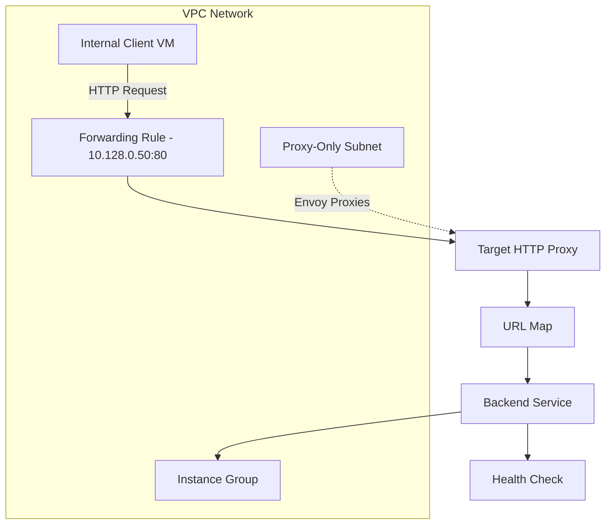

# How to Configure a Regional Internal Application Load Balancer in GCP

Author: [nawazdhandala](https://www.github.com/nawazdhandala)

Tags: GCP, Load Balancer, Internal Load Balancer, Networking, Google Cloud

Description: Learn how to configure a regional internal application load balancer in GCP to distribute HTTP and HTTPS traffic between internal services within your VPC network.

---

Not every load balancer needs to face the internet. When you have microservices communicating inside a VPC, or internal tools that should never be exposed publicly, a regional internal application load balancer is the right choice. It distributes Layer 7 (HTTP/HTTPS) traffic between backends that live within your VPC network, and it is only accessible from within that network or connected networks.

This guide covers the full setup from scratch, including the proxy-only subnet that this load balancer type requires.

## How the Regional Internal Application Load Balancer Works

Unlike external load balancers, the internal application load balancer gets a private IP address from your VPC subnet. Clients within the VPC (or connected via VPN/Interconnect) send requests to this private IP, and the load balancer routes them to healthy backends based on URL maps, just like its external counterpart.

Under the hood, this load balancer uses Envoy proxies. These proxies run in a special proxy-only subnet that you must create in the same region as the load balancer. The proxies handle the actual traffic forwarding, so backend instances see traffic originating from IPs in the proxy-only subnet rather than from the original client.

## Prerequisites

- A GCP project with the Compute Engine API enabled
- A VPC network with at least one subnet in your target region
- Backend instances or instance groups already running
- The `gcloud` CLI installed and authenticated

## Step 1: Create the Proxy-Only Subnet

The Envoy-based internal load balancer needs a dedicated proxy-only subnet. This subnet provides IP addresses for the proxy instances.

```bash
# Create a proxy-only subnet in the same region as your load balancer
gcloud compute networks subnets create proxy-only-subnet \
    --purpose=REGIONAL_MANAGED_PROXY \
    --role=ACTIVE \
    --network=my-vpc \
    --region=us-central1 \
    --range=10.129.0.0/23
```

A /23 gives you 512 addresses, which is usually plenty. The proxy-only subnet is shared across all Envoy-based load balancers in that region, so you only need one per region per VPC.

## Step 2: Create a Health Check

Health checks for internal load balancers work the same way as external ones. The load balancer pings your backends to determine which are healthy.

```bash
# Create a health check for the internal backends
gcloud compute health-checks create http internal-http-check \
    --region=us-central1 \
    --port=8080 \
    --request-path="/health" \
    --check-interval=10s \
    --timeout=5s \
    --healthy-threshold=2 \
    --unhealthy-threshold=3
```

Make sure your backend application responds with a 200 status code on the health check path.

## Step 3: Create a Regional Backend Service

The backend service must be regional, matching the scope of this load balancer.

```bash
# Create a regional backend service for internal traffic
gcloud compute backend-services create internal-web-backend \
    --protocol=HTTP \
    --health-checks=internal-http-check \
    --health-checks-region=us-central1 \
    --load-balancing-scheme=INTERNAL_MANAGED \
    --region=us-central1
```

The `INTERNAL_MANAGED` load balancing scheme is what makes this an Envoy-based internal load balancer rather than a passthrough one.

Now attach your instance group:

```bash
# Add an instance group to the backend service
gcloud compute backend-services add-backend internal-web-backend \
    --instance-group=my-internal-group \
    --instance-group-zone=us-central1-a \
    --region=us-central1
```

## Step 4: Create a URL Map

Even for simple routing, you need a URL map. It connects incoming requests to backend services.

```bash
# Create a URL map that routes all traffic to the backend
gcloud compute url-maps create internal-web-map \
    --default-service=internal-web-backend \
    --region=us-central1
```

For more advanced setups, you can add path rules and host rules to route different URLs to different backend services.

## Step 5: Create a Target HTTP Proxy

The target proxy ties the URL map to the load balancer.

```bash
# Create a regional target HTTP proxy
gcloud compute target-http-proxies create internal-http-proxy \
    --url-map=internal-web-map \
    --region=us-central1
```

If you need HTTPS between the client and the load balancer (for internal encryption), you would use `target-https-proxies` instead and attach an SSL certificate.

## Step 6: Create the Forwarding Rule

The forwarding rule defines the internal IP address and port that clients will use to reach the load balancer.

```bash
# Create a forwarding rule with a specific internal IP
gcloud compute forwarding-rules create internal-web-rule \
    --load-balancing-scheme=INTERNAL_MANAGED \
    --network=my-vpc \
    --subnet=my-subnet \
    --address=10.128.0.50 \
    --ports=80 \
    --region=us-central1 \
    --target-http-proxy=internal-http-proxy \
    --target-http-proxy-region=us-central1
```

You can omit the `--address` flag to let GCP assign an IP automatically from the subnet range.

## Step 7: Configure Firewall Rules

You need two firewall rules: one to allow health check traffic from Google's health check ranges, and one to allow traffic from the proxy-only subnet to your backends.

```bash
# Allow health check probes from Google's IP ranges
gcloud compute firewall-rules create allow-health-checks \
    --network=my-vpc \
    --action=allow \
    --direction=ingress \
    --source-ranges=130.211.0.0/22,35.191.0.0/16 \
    --target-tags=internal-backend \
    --rules=tcp:8080

# Allow traffic from the proxy-only subnet to backends
gcloud compute firewall-rules create allow-proxy-traffic \
    --network=my-vpc \
    --action=allow \
    --direction=ingress \
    --source-ranges=10.129.0.0/23 \
    --target-tags=internal-backend \
    --rules=tcp:8080
```

The source range for the second rule should match the proxy-only subnet CIDR you created in Step 1.

## Step 8: Test the Load Balancer

SSH into a VM in the same VPC and test:

```bash
# From a VM within the VPC, curl the load balancer's internal IP
curl http://10.128.0.50/

# Check the response headers to verify load balancing
for i in $(seq 1 10); do curl -s http://10.128.0.50/ | head -1; done
```

You should see responses from your backend application. If you have multiple backend instances, you should see traffic distributed across them.

## Architecture Diagram



## Key Differences from External Load Balancers

There are a few important distinctions worth knowing:

**Scope**: The regional internal application load balancer is regional, not global. Your backends must be in the same region as the load balancer. If you need cross-region internal load balancing, look at the cross-region internal application load balancer instead.

**IP Address**: It uses a private IP from your VPC subnet, not a public IP. Only clients within the VPC (or connected networks) can reach it.

**Proxy-Only Subnet**: This is unique to Envoy-based load balancers. External load balancers do not need this.

**Source IP**: Backend instances see the proxy-only subnet IPs as the source, not the original client IP. The original client IP is available in the `X-Forwarded-For` header.

## Troubleshooting Tips

If requests are timing out, check that the proxy-only subnet exists and is in the ACTIVE role. Without it, the Envoy proxies have no IP addresses to use.

If you get 502 errors, the health checks are likely failing. Verify that your firewall rules allow traffic on the health check port from Google's health check IP ranges, and that the application is actually responding on the configured path and port.

If some clients cannot reach the load balancer, confirm they are in the same VPC or a connected network. The internal load balancer is not accessible from the internet.

## Wrapping Up

The regional internal application load balancer is a solid choice for distributing HTTP traffic between internal services in GCP. It gives you Layer 7 features like path-based routing and host-based routing without exposing anything to the public internet. The setup requires a proxy-only subnet and regional resources, but once it is running, it behaves much like the external HTTP(S) load balancer you are probably already familiar with.
