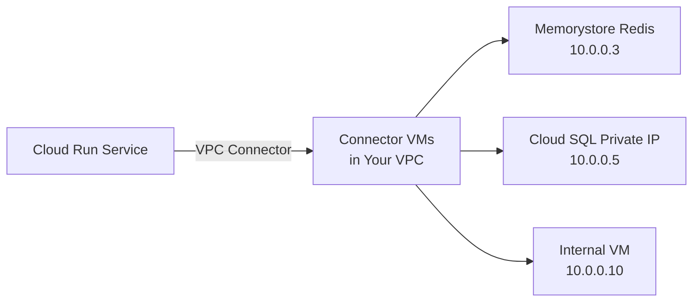

# How to Configure a VPC Connector for Cloud Run to Access Resources in a Private VPC Network

Author: [nawazdhandala](https://www.github.com/nawazdhandala)

Tags: GCP, Cloud Run, VPC Connector, Private Networking, Cloud Infrastructure

Description: A step-by-step guide to setting up a Serverless VPC Access connector for Cloud Run to securely communicate with resources inside a private VPC network like databases, Redis instances, and internal APIs.

---

Cloud Run services run in Google's managed infrastructure, not in your VPC. That means by default they cannot reach resources in your private network - no Memorystore Redis instances, no Cloud SQL with private IP only, no internal VMs, no resources behind internal load balancers. A VPC connector bridges this gap.

Serverless VPC Access creates a connector that lets Cloud Run send traffic into your VPC. Once connected, your Cloud Run service can talk to any resource in the VPC as if it were inside the network.

## How VPC Connectors Work

A VPC connector creates a set of VM instances (managed by Google) in your VPC that relay traffic between Cloud Run and your private network. You do not manage these VMs directly, but they consume IP addresses from a subnet you specify.



## Step 1: Create a Subnet for the Connector

The VPC connector needs a dedicated `/28` subnet (16 IP addresses). Do not use an existing subnet that has other resources in it:

```bash
# Create a dedicated subnet for the VPC connector
gcloud compute networks subnets create vpc-connector-subnet \
  --network=my-vpc \
  --region=us-central1 \
  --range=10.8.0.0/28
```

The `/28` range gives you 16 IP addresses, which is the minimum for a connector. For high-throughput services, you might need more - the connector scales its VMs based on traffic, and each VM uses an IP from this subnet.

## Step 2: Create the VPC Connector

Create the connector using the dedicated subnet:

```bash
# Create a Serverless VPC Access connector
gcloud compute networks vpc-access connectors create my-connector \
  --region=us-central1 \
  --subnet=vpc-connector-subnet \
  --subnet-project=my-project \
  --min-instances=2 \
  --max-instances=10 \
  --machine-type=e2-micro
```

Key options:
- `--min-instances=2` keeps at least 2 connector VMs running for availability
- `--max-instances=10` caps the connector's auto-scaling
- `--machine-type=e2-micro` is sufficient for most workloads (also available: e2-standard-4 for high throughput)

Alternatively, you can create a connector without a pre-existing subnet by specifying an IP range directly:

```bash
# Create a connector with an auto-created subnet
gcloud compute networks vpc-access connectors create my-connector \
  --region=us-central1 \
  --network=my-vpc \
  --range=10.8.0.0/28 \
  --min-instances=2 \
  --max-instances=10
```

Verify the connector is ready:

```bash
# Check the connector status
gcloud compute networks vpc-access connectors describe my-connector \
  --region=us-central1 \
  --format="yaml(name, state, network, ipCidrRange, minInstances, maxInstances)"
```

The state should be `READY`.

## Step 3: Connect Cloud Run to the VPC

Attach the connector to your Cloud Run service:

```bash
# Deploy Cloud Run service with VPC connector
gcloud run deploy my-service \
  --image=us-central1-docker.pkg.dev/my-project/repo/my-app:v1 \
  --region=us-central1 \
  --vpc-connector=my-connector \
  --vpc-egress=private-ranges-only
```

The `--vpc-egress` flag controls which traffic goes through the connector:
- `private-ranges-only` - Only traffic to private IP ranges (RFC 1918) goes through the connector. Internet traffic goes directly. This is the most common and recommended setting.
- `all-traffic` - All egress traffic goes through the connector, including internet traffic. Use this if you need traffic to exit through a Cloud NAT or firewall in your VPC.

For an existing service, update it:

```bash
# Update an existing service to use the VPC connector
gcloud run services update my-service \
  --region=us-central1 \
  --vpc-connector=my-connector \
  --vpc-egress=private-ranges-only
```

## Step 4: Test Connectivity

Deploy a test service that tries to reach a private resource:

```python
# test_vpc.py - Test VPC connectivity from Cloud Run
import os
import socket
import redis
from flask import Flask, jsonify

app = Flask(__name__)

REDIS_HOST = os.environ.get('REDIS_HOST', '10.0.0.3')
REDIS_PORT = int(os.environ.get('REDIS_PORT', '6379'))

@app.route('/test-redis')
def test_redis():
    """Test connectivity to a Memorystore Redis instance in the VPC."""
    try:
        # Connect to Redis on the private IP
        r = redis.Redis(host=REDIS_HOST, port=REDIS_PORT, socket_timeout=5)
        r.set('test-key', 'hello from cloud run')
        value = r.get('test-key')
        return jsonify({
            'status': 'connected',
            'redis_host': REDIS_HOST,
            'test_value': value.decode('utf-8')
        })
    except Exception as e:
        return jsonify({
            'status': 'failed',
            'error': str(e)
        }), 500

@app.route('/test-internal')
def test_internal():
    """Test DNS resolution and connectivity to an internal hostname."""
    try:
        # Test connectivity to an internal VM
        internal_host = os.environ.get('INTERNAL_HOST', '10.0.0.10')
        sock = socket.create_connection((internal_host, 80), timeout=5)
        sock.close()
        return jsonify({
            'status': 'connected',
            'host': internal_host
        })
    except Exception as e:
        return jsonify({
            'status': 'failed',
            'error': str(e)
        }), 500

if __name__ == '__main__':
    port = int(os.environ.get('PORT', 8080))
    app.run(host='0.0.0.0', port=port)
```

## Step 5: Configure Firewall Rules

The VPC connector VMs need firewall rules to reach your private resources. The connector uses the IP range you specified, so create rules that allow traffic from that range:

```bash
# Allow traffic from the VPC connector to Memorystore Redis
gcloud compute firewall-rules create allow-connector-to-redis \
  --network=my-vpc \
  --allow=tcp:6379 \
  --source-ranges=10.8.0.0/28 \
  --target-tags=redis-server

# Allow traffic from the VPC connector to internal VMs
gcloud compute firewall-rules create allow-connector-to-internal \
  --network=my-vpc \
  --allow=tcp:80,tcp:443,tcp:5432 \
  --source-ranges=10.8.0.0/28
```

## Connecting to Specific Resources

### Memorystore Redis

```bash
# Deploy with Redis connection through VPC connector
gcloud run deploy my-service \
  --image=us-central1-docker.pkg.dev/my-project/repo/my-app:v1 \
  --region=us-central1 \
  --vpc-connector=my-connector \
  --vpc-egress=private-ranges-only \
  --set-env-vars="REDIS_HOST=10.0.0.3,REDIS_PORT=6379"
```

### Cloud SQL with Private IP

```bash
# Deploy with Cloud SQL private IP connection through VPC connector
gcloud run deploy my-service \
  --image=us-central1-docker.pkg.dev/my-project/repo/my-app:v1 \
  --region=us-central1 \
  --vpc-connector=my-connector \
  --vpc-egress=private-ranges-only \
  --set-env-vars="DB_HOST=10.0.0.5,DB_PORT=5432,DB_NAME=mydb,DB_USER=appuser" \
  --set-secrets="DB_PASSWORD=db-password:latest"
```

### Internal HTTP APIs

```python
# Calling an internal API through the VPC connector
import requests

def call_internal_api():
    """Call an internal API running on a VM in the VPC."""
    response = requests.get(
        'http://10.0.0.10:8080/api/internal-data',
        timeout=10
    )
    return response.json()
```

## Monitoring the VPC Connector

Check connector throughput and instance count:

```bash
# List connector details including current instance count
gcloud compute networks vpc-access connectors describe my-connector \
  --region=us-central1

# Check connector metrics in Cloud Monitoring
gcloud monitoring time-series list \
  --filter='metric.type="vpcaccess.googleapis.com/connector/sent_bytes_count"' \
  --interval-start-time=$(date -u -d '-1 hour' +%Y-%m-%dT%H:%M:%SZ)
```

## Scaling Considerations

The connector auto-scales its VM instances based on throughput. Each e2-micro instance handles about 100 Mbps. If your service sends a lot of data through the VPC, you might need to increase the maximum instances or switch to a larger machine type:

```bash
# Update the connector for higher throughput
gcloud compute networks vpc-access connectors update my-connector \
  --region=us-central1 \
  --min-instances=3 \
  --max-instances=10 \
  --machine-type=e2-standard-4
```

## Direct VPC Egress (Alternative)

Cloud Run also supports Direct VPC Egress, which does not require a separate connector. It places the Cloud Run instances directly in your VPC subnet:

```bash
# Deploy with Direct VPC Egress (no connector needed)
gcloud run deploy my-service \
  --image=us-central1-docker.pkg.dev/my-project/repo/my-app:v1 \
  --region=us-central1 \
  --network=my-vpc \
  --subnet=my-subnet \
  --vpc-egress=private-ranges-only
```

Direct VPC Egress is simpler and can handle higher throughput without managing connector instances. However, it requires enough IP addresses in the subnet for all Cloud Run instances.

## Cost Considerations

VPC connector VMs are billed like regular Compute Engine instances. With 2 e2-micro instances as the minimum, the baseline cost is approximately $15-20/month. This runs 24/7 regardless of whether your Cloud Run service is receiving traffic.

If cost is a concern and your VPC access needs are occasional, consider using the built-in Cloud SQL connection (which does not need a VPC connector) or Direct VPC Egress for a more cost-effective approach.

A VPC connector is the bridge that makes Cloud Run work in enterprise environments where everything runs on private networks. The setup takes about 10 minutes, and once it is in place, your serverless services can access any private resource as naturally as if they were running on a VM inside the VPC.
