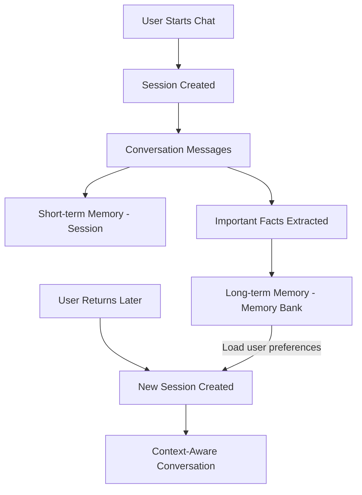
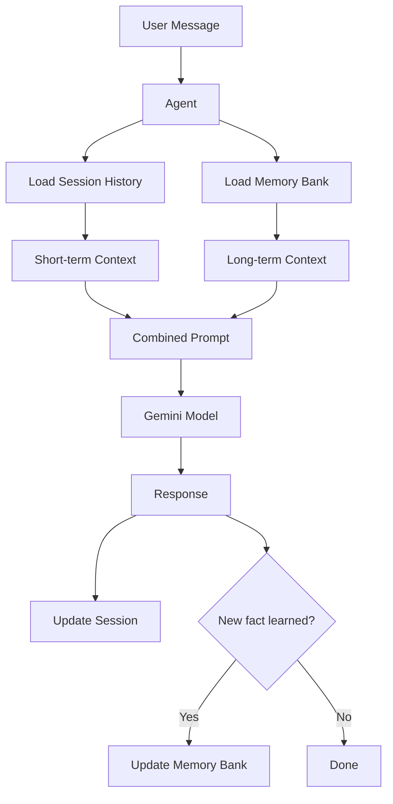

# How to Configure Agent Memory with Vertex AI Agent Engine Sessions and Memory Bank

Author: [nawazdhandala](https://www.github.com/nawazdhandala)

Tags: GCP, Vertex AI, Agent Engine, Sessions, Memory Bank

Description: Configure persistent memory for AI agents using Vertex AI Agent Engine sessions and memory bank to enable context-aware multi-turn conversations.

---

An AI agent that forgets everything between messages is frustrating to use. Users expect agents to remember what was discussed, retain preferences, and build on previous interactions. Vertex AI Agent Engine provides two memory mechanisms for this: sessions for short-term conversation context and memory bank for long-term persistent storage. Understanding how to configure both gives your agent the ability to maintain context within a conversation and recall important information across conversations.

This guide covers setting up and using both memory systems effectively.

## Sessions vs. Memory Bank

These two memory types serve different purposes:

**Sessions** handle short-term, within-conversation memory. When a user starts a chat, a session is created. The session stores the conversation history - every message exchanged between the user and the agent during that interaction. When the conversation ends, the session can be retained for reference or discarded.

**Memory Bank** handles long-term, cross-conversation memory. It stores persistent facts about users, preferences, and important details that should carry over between separate conversations. If a user tells the agent "I prefer responses in Spanish" in one session, the memory bank ensures that preference is available in future sessions.



## Prerequisites

- Google Cloud project with Vertex AI API enabled
- Python 3.9+

```bash
pip install google-cloud-aiplatform langchain-google-vertexai
```

## Working with Sessions

### Creating and Managing Sessions

```python
from google.cloud import aiplatform
import uuid

# Initialize the AI Platform SDK
aiplatform.init(project="your-project-id", location="us-central1")

class SessionManager:
    """Manage conversation sessions for the AI agent."""

    def __init__(self, project_id: str, location: str):
        self.project_id = project_id
        self.location = location
        self.active_sessions = {}

    def create_session(self, user_id: str, metadata: dict = None) -> str:
        """Create a new conversation session for a user."""
        session_id = str(uuid.uuid4())

        session_data = {
            "session_id": session_id,
            "user_id": user_id,
            "messages": [],
            "metadata": metadata or {},
            "created_at": self._get_timestamp(),
        }

        self.active_sessions[session_id] = session_data
        print(f"Created session {session_id} for user {user_id}")
        return session_id

    def add_message(self, session_id: str, role: str, content: str):
        """Add a message to the session history."""
        if session_id not in self.active_sessions:
            raise ValueError(f"Session {session_id} not found")

        message = {
            "role": role,  # "user" or "agent"
            "content": content,
            "timestamp": self._get_timestamp(),
        }

        self.active_sessions[session_id]["messages"].append(message)

    def get_history(self, session_id: str, max_messages: int = 20) -> list:
        """Get the conversation history for a session, limited to recent messages."""
        if session_id not in self.active_sessions:
            return []

        messages = self.active_sessions[session_id]["messages"]
        # Return the most recent messages to stay within context limits
        return messages[-max_messages:]

    def close_session(self, session_id: str):
        """Close a session and optionally persist it for later reference."""
        if session_id in self.active_sessions:
            session = self.active_sessions[session_id]
            session["closed_at"] = self._get_timestamp()
            # In production, persist to Firestore or another store
            print(f"Session {session_id} closed with {len(session['messages'])} messages")
            del self.active_sessions[session_id]

    def _get_timestamp(self):
        from datetime import datetime
        return datetime.utcnow().isoformat()

# Usage
session_mgr = SessionManager("your-project-id", "us-central1")
session_id = session_mgr.create_session("user-123", metadata={"channel": "web"})
session_mgr.add_message(session_id, "user", "What is my account balance?")
session_mgr.add_message(session_id, "agent", "Your current balance is $1,234.56.")
```

### Integrating Sessions with the Agent

```python
from langchain_google_vertexai import ChatVertexAI
from langchain_core.prompts import ChatPromptTemplate, MessagesPlaceholder
from langchain_core.messages import HumanMessage, AIMessage

class ConversationalAgent:
    """An agent that uses session memory for context-aware conversations."""

    def __init__(self, project_id: str, location: str):
        self.llm = ChatVertexAI(
            model_name="gemini-1.5-pro",
            project=project_id,
            location=location,
            temperature=0.3,
        )

        self.prompt = ChatPromptTemplate.from_messages([
            ("system", """You are a helpful customer support agent.
            Use the conversation history to maintain context.
            If the user references something from earlier in the conversation,
            use that context to provide relevant answers."""),
            MessagesPlaceholder(variable_name="history"),
            ("human", "{input}"),
        ])

        self.chain = self.prompt | self.llm
        self.session_mgr = SessionManager(project_id, location)

    def chat(self, user_id: str, session_id: str, message: str) -> str:
        """Process a user message within a session context."""
        # Record the user message
        self.session_mgr.add_message(session_id, "user", message)

        # Get conversation history
        history = self.session_mgr.get_history(session_id)

        # Convert history to LangChain message format
        langchain_history = []
        for msg in history[:-1]:  # Exclude the current message
            if msg["role"] == "user":
                langchain_history.append(HumanMessage(content=msg["content"]))
            else:
                langchain_history.append(AIMessage(content=msg["content"]))

        # Generate response
        response = self.chain.invoke({
            "history": langchain_history,
            "input": message,
        })

        agent_response = response.content

        # Record the agent response
        self.session_mgr.add_message(session_id, "agent", agent_response)

        return agent_response

# Usage
agent = ConversationalAgent("your-project-id", "us-central1")
session_id = agent.session_mgr.create_session("user-456")

print(agent.chat("user-456", session_id, "I ordered a laptop last week"))
print(agent.chat("user-456", session_id, "Has it shipped yet?"))
# The agent knows "it" refers to the laptop from the previous message
```

## Working with Memory Bank

### Building a Persistent Memory Store

The memory bank stores long-term facts about users that persist across conversations.

```python
from google.cloud import firestore
from datetime import datetime

class MemoryBank:
    """Long-term memory storage for AI agent using Firestore."""

    def __init__(self, project_id: str):
        self.db = firestore.Client(project=project_id)
        self.collection = "agent_memory_bank"

    def store_memory(self, user_id: str, key: str, value: str, category: str = "general"):
        """Store a persistent memory about a user."""
        doc_ref = self.db.collection(self.collection).document(user_id)

        # Use a subcollection for individual memories
        memory_ref = doc_ref.collection("memories").document(key)
        memory_ref.set({
            "key": key,
            "value": value,
            "category": category,
            "created_at": datetime.utcnow(),
            "updated_at": datetime.utcnow(),
        })

        print(f"Stored memory for {user_id}: {key} = {value}")

    def get_memories(self, user_id: str, category: str = None) -> list:
        """Retrieve all memories for a user, optionally filtered by category."""
        doc_ref = self.db.collection(self.collection).document(user_id)
        memories_ref = doc_ref.collection("memories")

        if category:
            query = memories_ref.where("category", "==", category)
        else:
            query = memories_ref

        memories = []
        for doc in query.stream():
            data = doc.to_dict()
            memories.append({
                "key": data["key"],
                "value": data["value"],
                "category": data["category"],
            })

        return memories

    def get_memory(self, user_id: str, key: str) -> str:
        """Get a specific memory by key."""
        doc_ref = (
            self.db.collection(self.collection)
            .document(user_id)
            .collection("memories")
            .document(key)
        )

        doc = doc_ref.get()
        if doc.exists:
            return doc.to_dict().get("value")
        return None

    def delete_memory(self, user_id: str, key: str):
        """Delete a specific memory."""
        doc_ref = (
            self.db.collection(self.collection)
            .document(user_id)
            .collection("memories")
            .document(key)
        )
        doc_ref.delete()
        print(f"Deleted memory {key} for {user_id}")

    def format_memories_for_prompt(self, user_id: str) -> str:
        """Format all memories into a string for inclusion in the agent prompt."""
        memories = self.get_memories(user_id)
        if not memories:
            return "No prior information about this user."

        formatted = []
        for mem in memories:
            formatted.append(f"- {mem['key']}: {mem['value']}")

        return "Known information about this user:\n" + "\n".join(formatted)
```

### Integrating Memory Bank with the Agent

```python
class MemoryAwareAgent:
    """An agent that uses both session memory and long-term memory bank."""

    def __init__(self, project_id: str, location: str):
        self.llm = ChatVertexAI(
            model_name="gemini-1.5-pro",
            project=project_id,
            location=location,
            temperature=0.3,
        )

        self.memory_bank = MemoryBank(project_id)
        self.session_mgr = SessionManager(project_id, location)

    def chat(self, user_id: str, session_id: str, message: str) -> str:
        """Chat with full memory context - both session and long-term."""
        # Load long-term memories for this user
        user_memories = self.memory_bank.format_memories_for_prompt(user_id)

        # Get session history
        history = self.session_mgr.get_history(session_id)
        self.session_mgr.add_message(session_id, "user", message)

        # Build prompt with both memory types
        prompt = ChatPromptTemplate.from_messages([
            ("system", f"""You are a helpful assistant with memory of past interactions.

{user_memories}

Use this information to personalize your responses. If the user shares new
preferences or important information, mention that you will remember it."""),
            MessagesPlaceholder(variable_name="history"),
            ("human", "{input}"),
        ])

        chain = prompt | self.llm

        langchain_history = []
        for msg in history:
            if msg["role"] == "user":
                langchain_history.append(HumanMessage(content=msg["content"]))
            else:
                langchain_history.append(AIMessage(content=msg["content"]))

        response = chain.invoke({
            "history": langchain_history,
            "input": message,
        })

        agent_response = response.content
        self.session_mgr.add_message(session_id, "agent", agent_response)

        return agent_response

    def remember(self, user_id: str, key: str, value: str, category: str = "preference"):
        """Explicitly store a long-term memory about the user."""
        self.memory_bank.store_memory(user_id, key, value, category)

# Usage
agent = MemoryAwareAgent("your-project-id", "us-central1")

# Store some long-term memories
agent.remember("user-789", "preferred_language", "English", "preference")
agent.remember("user-789", "plan_type", "Professional", "account")
agent.remember("user-789", "company", "Acme Corp", "account")

# Start a new conversation - the agent already knows about the user
session_id = agent.session_mgr.create_session("user-789")
print(agent.chat("user-789", session_id, "Can you help me upgrade my plan?"))
# The agent knows they are on the Professional plan and works for Acme Corp
```

## Memory Architecture



## Summary

Configuring memory properly is what separates a basic chatbot from a useful AI agent. Sessions give you within-conversation context so the agent tracks what is being discussed. The memory bank gives you cross-conversation persistence so the agent remembers important facts about each user. Combine both in your agent prompt, and you get an experience that feels personal and context-aware. Use Firestore for the memory bank storage, keep session histories trimmed to manage token costs, and be intentional about what gets stored in long-term memory versus what is transient.
