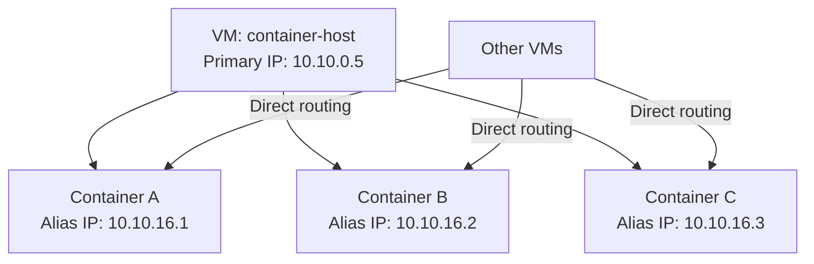

# How to Configure Alias IP Ranges for Containers Running on GCP VMs

Author: [nawazdhandala](https://www.github.com/nawazdhandala)

Tags: GCP, Alias IP, Containers, VPC, Networking

Description: Learn how to configure alias IP ranges on GCP VMs so containers get their own routable VPC IP addresses, enabling direct container-to-container communication across the network.

---

When you run containers on GCP VMs, those containers typically get IP addresses from Docker's internal bridge network. The problem is these IPs are only reachable from within the host VM - other VMs, load balancers, and services cannot route traffic directly to a specific container. Alias IP ranges solve this by giving your VM additional IP addresses from the VPC that you can assign to individual containers.

In this post, I will show you how to set up alias IP ranges, assign them to VMs, and configure containers to use routable VPC addresses.

## What Are Alias IP Ranges

Alias IP ranges let you assign multiple IP addresses or CIDR blocks to a single VM's network interface. These addresses come from either the subnet's primary range or a secondary range, and they are fully routable within the VPC.



The key benefit is that traffic between containers on different VMs goes directly through the VPC network - no overlay networks, no encapsulation, no NAT. This gives you better performance and simpler networking.

## Setting Up the Subnet

First, create or update a subnet with a secondary range for container IPs:

```bash
# Create a subnet with a secondary range for container alias IPs
gcloud compute networks subnets create container-subnet \
  --network=production-vpc \
  --region=us-central1 \
  --range=10.10.0.0/20 \
  --secondary-range=container-ips=10.10.16.0/20 \
  --enable-private-ip-google-access
```

If the subnet already exists, add the secondary range:

```bash
# Add a secondary range to an existing subnet
gcloud compute networks subnets update existing-subnet \
  --region=us-central1 \
  --add-secondary-ranges=container-ips=10.10.16.0/20
```

## Creating a VM with Alias IP Ranges

When creating a VM, specify the alias IP range it should use:

```bash
# Create a VM with an alias IP range from the secondary range
# The /28 gives this VM 16 alias IPs for containers
gcloud compute instances create container-host-1 \
  --zone=us-central1-a \
  --machine-type=e2-standard-4 \
  --subnet=container-subnet \
  --network-interface=subnet=container-subnet,aliases=container-ips:10.10.16.0/28 \
  --image-family=cos-113-lts \
  --image-project=cos-cloud \
  --can-ip-forward
```

This assigns the range 10.10.16.0/28 (16 addresses) to the VM. You can use addresses 10.10.16.1 through 10.10.16.14 for containers (10.10.16.0 is the network address and 10.10.16.15 is broadcast).

For multiple VMs, assign different slices of the secondary range:

```bash
# Second VM gets a different /28 from the same secondary range
gcloud compute instances create container-host-2 \
  --zone=us-central1-a \
  --machine-type=e2-standard-4 \
  --subnet=container-subnet \
  --network-interface=subnet=container-subnet,aliases=container-ips:10.10.16.16/28 \
  --image-family=cos-113-lts \
  --image-project=cos-cloud \
  --can-ip-forward
```

## Adding Alias IPs to an Existing VM

You can add alias IP ranges to a running VM:

```bash
# Add alias IPs to an existing VM
gcloud compute instances network-interfaces update container-host-1 \
  --zone=us-central1-a \
  --aliases="container-ips:10.10.16.0/28"
```

To add IPs from the primary range instead of a secondary range:

```bash
# Add alias IPs from the primary subnet range
gcloud compute instances network-interfaces update container-host-1 \
  --zone=us-central1-a \
  --aliases="10.10.0.32/28"
```

## Configuring Docker to Use Alias IPs

Once the VM has alias IPs, configure Docker to assign them to containers. The approach depends on your container runtime.

### Using Docker with macvlan

macvlan lets containers get IPs directly from the host's network:

```bash
# SSH into the container host
gcloud compute ssh container-host-1 --zone=us-central1-a

# Create a macvlan network in Docker using the alias IP range
docker network create -d macvlan \
  --subnet=10.10.16.0/20 \
  --ip-range=10.10.16.0/28 \
  --gateway=10.10.0.1 \
  -o parent=eth0 \
  container-net
```

Now run containers with specific IPs from the alias range:

```bash
# Run a container with a specific alias IP
docker run -d --name web-1 \
  --network=container-net \
  --ip=10.10.16.2 \
  nginx:alpine

# Run another container with a different alias IP
docker run -d --name web-2 \
  --network=container-net \
  --ip=10.10.16.3 \
  nginx:alpine
```

### Using Docker with Host Networking and Manual IP Assignment

An alternative approach is to assign the alias IPs to the host's network interface and have containers bind to specific IPs:

```bash
# Add alias IPs to the network interface inside the VM
sudo ip addr add 10.10.16.2/32 dev eth0
sudo ip addr add 10.10.16.3/32 dev eth0

# Run containers that bind to specific IPs
docker run -d --name web-1 \
  --network=host \
  -e LISTEN_ADDR=10.10.16.2:80 \
  my-web-app

docker run -d --name web-2 \
  --network=host \
  -e LISTEN_ADDR=10.10.16.3:80 \
  my-web-app
```

## Verifying Connectivity

From another VM in the VPC, test that you can reach the container IPs directly:

```bash
# From a different VM, ping the container's alias IP
ping -c 3 10.10.16.2

# Test HTTP connectivity to the container
curl http://10.10.16.2:80
```

The traffic flows directly through the VPC - no NAT, no proxy, no overlay. This is one of the main advantages of alias IPs over Docker's default bridge networking.

## Creating Firewall Rules for Container Traffic

Since alias IPs are routable VPC addresses, you need firewall rules to control traffic to them:

```bash
# Allow HTTP traffic to containers from other VMs in the VPC
gcloud compute firewall-rules create allow-http-to-containers \
  --network=production-vpc \
  --direction=INGRESS \
  --action=ALLOW \
  --rules=tcp:80,tcp:443 \
  --source-ranges=10.10.0.0/20 \
  --destination-ranges=10.10.16.0/20 \
  --description="Allow HTTP to container alias IPs"
```

## Setting Up Internal Load Balancing

You can point an internal load balancer directly at container alias IPs:

```bash
# Create a health check for the containers
gcloud compute health-checks create http container-health \
  --port=80 \
  --request-path=/health

# Create an instance group for the container hosts
gcloud compute instance-groups unmanaged create container-group \
  --zone=us-central1-a

gcloud compute instance-groups unmanaged add-instances container-group \
  --zone=us-central1-a \
  --instances=container-host-1,container-host-2

# Create a backend service
gcloud compute backend-services create container-backend \
  --load-balancing-scheme=INTERNAL \
  --protocol=TCP \
  --region=us-central1 \
  --health-checks=container-health

gcloud compute backend-services add-backend container-backend \
  --instance-group=container-group \
  --instance-group-zone=us-central1-a \
  --region=us-central1
```

## Monitoring Alias IP Usage

Track how many alias IPs are in use across your VMs:

```bash
# List all VMs and their alias IP configurations
gcloud compute instances list \
  --filter="networkInterfaces[].aliasIpRanges:*" \
  --format="table(name, zone, networkInterfaces[0].aliasIpRanges[].ipCidrRange)"
```

## When to Use Alias IPs vs. GKE

Alias IPs are essentially what GKE uses under the hood for pod networking in VPC-native clusters. If you are running containers at scale, GKE handles all of this automatically. Alias IPs make sense when:

- You are running a small number of containers and GKE is overkill
- You need direct control over container IP assignment
- You are running non-Kubernetes container workloads
- You want containers with stable, predictable IP addresses

## Wrapping Up

Alias IP ranges bridge the gap between VM-level networking and container networking in GCP. By assigning VPC-routable IPs to individual containers, you get direct connectivity without the complexity of overlay networks. Set up a secondary range on your subnet, allocate slices to each VM, and configure your container runtime to use those IPs. The result is simple, performant container networking that plays nicely with the rest of your VPC infrastructure.
