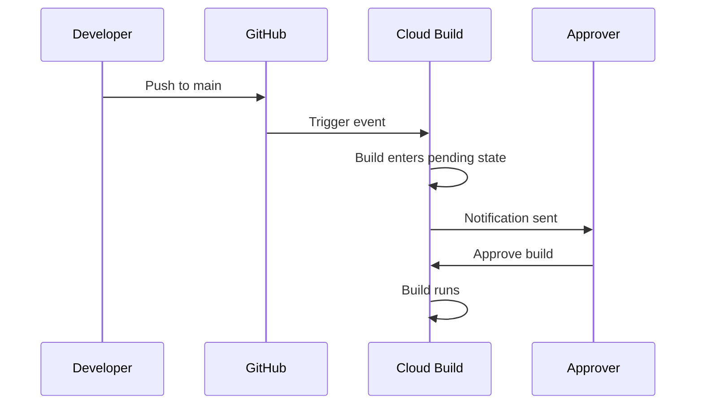

# How to Configure Approval Gates in Cloud Build to Require Manual Approval Before Deployment

Author: [nawazdhandala](https://www.github.com/nawazdhandala)

Tags: GCP, Cloud Build, Approval Gates, CI/CD, Deployment Safety, DevOps

Description: Learn how to add manual approval gates to your Cloud Build pipelines so that deployments require human approval before proceeding to production.

---

Fully automated deployments are great for development environments, but pushing to production without a human checkpoint makes a lot of teams nervous. Cloud Build supports approval gates that pause a build and wait for someone to manually approve before continuing. In this post, I will walk through how to set up approval-based triggers, configure who can approve, and integrate approvals into a multi-stage deployment pipeline.

## How Approval Gates Work

When you enable approval on a Cloud Build trigger, the build does not run automatically when the trigger event occurs. Instead, the build enters a "pending approval" state. A designated approver reviews the build and either approves it (the build runs) or rejects it (the build is cancelled).

The flow looks like this:



## Setting Up an Approval Gate

### Step 1: Create a Trigger with Approval Required

You can enable approval when creating a new trigger or update an existing one:

```bash
# Create a trigger with manual approval required
gcloud builds triggers create github \
  --name="deploy-production" \
  --repo-name="my-app" \
  --repo-owner="my-org" \
  --branch-pattern="^main$" \
  --build-config="cloudbuild-production.yaml" \
  --require-approval
```

For an existing trigger, update it:

```bash
# Add approval requirement to an existing trigger
gcloud builds triggers update deploy-production \
  --require-approval
```

### Step 2: Configure the Approval Settings via the Console

The GCP Console provides more granular control over approval settings. Navigate to Cloud Build > Triggers, click on your trigger, and scroll to the "Approval" section.

Here you can configure:

- **Require approval** - Toggle the approval gate on/off
- **Approvers** - Specify who can approve builds from this trigger
- **Comment required** - Whether the approver must provide a reason

### Step 3: Set Up Approver Permissions

Approvers need the `cloudbuild.builds.approve` IAM permission. The easiest way to grant this is through the Cloud Build Approver role:

```bash
# Grant the Cloud Build Approver role to a user
gcloud projects add-iam-policy-binding $PROJECT_ID \
  --member="user:approver@company.com" \
  --role="roles/cloudbuild.builds.approve"

# Grant to a group (recommended for teams)
gcloud projects add-iam-policy-binding $PROJECT_ID \
  --member="group:deploy-approvers@company.com" \
  --role="roles/cloudbuild.builds.approve"
```

You can also restrict approval to specific triggers by using IAM conditions, but for most teams, the project-level role is sufficient.

## Approving and Rejecting Builds

### Through the Console

When a build is pending approval, it appears in the Cloud Build dashboard with an "Awaiting approval" badge. Click on the build to see details about what triggered it - the commit SHA, branch, author, and the trigger that caught it.

Click "Approve" to start the build or "Reject" to cancel it. If comment-required is enabled, you will need to enter a justification.

### Through the gcloud CLI

```bash
# List builds pending approval
gcloud builds list --filter="status=PENDING"

# Approve a specific build
gcloud builds approve BUILD_ID \
  --comment="Reviewed changes, approved for production deployment"

# Reject a build
gcloud builds reject BUILD_ID \
  --comment="Found issues in the migration script, needs rework"
```

### Through the API

For integration with chat tools or custom approval workflows:

```bash
# Approve a build via the REST API
curl -X POST \
  "https://cloudbuild.googleapis.com/v1/projects/$PROJECT_ID/builds/$BUILD_ID:approve" \
  -H "Authorization: Bearer $(gcloud auth print-access-token)" \
  -H "Content-Type: application/json" \
  -d '{
    "approvalResult": {
      "decision": "APPROVED",
      "comment": "Approved via automation"
    }
  }'
```

## Building a Multi-Stage Deployment Pipeline

A common pattern is to have automated builds for development and staging, but require approval for production. Here is how to set this up with separate triggers:

```bash
# Staging trigger - no approval needed, runs on develop branch
gcloud builds triggers create github \
  --name="deploy-staging" \
  --repo-name="my-app" \
  --repo-owner="my-org" \
  --branch-pattern="^develop$" \
  --build-config="cloudbuild-staging.yaml"

# Production trigger - requires approval, runs on main branch
gcloud builds triggers create github \
  --name="deploy-production" \
  --repo-name="my-app" \
  --repo-owner="my-org" \
  --branch-pattern="^main$" \
  --build-config="cloudbuild-production.yaml" \
  --require-approval
```

The staging cloudbuild.yaml deploys automatically:

```yaml
# cloudbuild-staging.yaml - deploys to staging automatically
steps:
  - name: 'gcr.io/cloud-builders/docker'
    args: ['build', '-t', 'gcr.io/$PROJECT_ID/my-app:$SHORT_SHA', '.']

  - name: 'gcr.io/cloud-builders/docker'
    args: ['push', 'gcr.io/$PROJECT_ID/my-app:$SHORT_SHA']

  - name: 'gcr.io/google.com/cloudsdktool/cloud-sdk'
    args:
      - 'gcloud'
      - 'run'
      - 'deploy'
      - 'my-app-staging'
      - '--image'
      - 'gcr.io/$PROJECT_ID/my-app:$SHORT_SHA'
      - '--region'
      - 'us-central1'
```

The production cloudbuild.yaml is similar but deploys to the production service:

```yaml
# cloudbuild-production.yaml - runs only after manual approval
steps:
  - name: 'gcr.io/cloud-builders/docker'
    args: ['build', '-t', 'gcr.io/$PROJECT_ID/my-app:$SHORT_SHA', '.']

  - name: 'gcr.io/cloud-builders/docker'
    args: ['push', 'gcr.io/$PROJECT_ID/my-app:$SHORT_SHA']

  - name: 'gcr.io/google.com/cloudsdktool/cloud-sdk'
    args:
      - 'gcloud'
      - 'run'
      - 'deploy'
      - 'my-app-production'
      - '--image'
      - 'gcr.io/$PROJECT_ID/my-app:$SHORT_SHA'
      - '--region'
      - 'us-central1'
      - '--min-instances'
      - '3'
```

## Setting Up Notifications

Pending approvals are only useful if approvers know about them. Set up notifications using Cloud Build's Pub/Sub integration:

### Pub/Sub Notification

Cloud Build publishes events to the `cloud-builds` Pub/Sub topic. Create a subscription that triggers a Cloud Function to send notifications:

```bash
# Create a Pub/Sub subscription for build events
gcloud pubsub subscriptions create build-approval-notifications \
  --topic=cloud-builds \
  --push-endpoint="https://us-central1-$PROJECT_ID.cloudfunctions.net/notify-approval"
```

The Cloud Function filters for pending builds and sends notifications:

```javascript
// Cloud Function to notify approvers about pending builds
exports.notifyApproval = async (event, context) => {
  const build = JSON.parse(Buffer.from(event.data, 'base64').toString());

  // Only notify for builds pending approval
  if (build.status !== 'PENDING') {
    return;
  }

  const message = {
    text: `Build ${build.id} is waiting for approval.\n` +
          `Trigger: ${build.buildTriggerId}\n` +
          `Commit: ${build.substitutions.SHORT_SHA}\n` +
          `Approve: https://console.cloud.google.com/cloud-build/builds/${build.id}`
  };

  // Send to Slack
  await fetch(process.env.SLACK_WEBHOOK_URL, {
    method: 'POST',
    headers: { 'Content-Type': 'application/json' },
    body: JSON.stringify(message)
  });
};
```

## Approval Timeout

Pending builds do not wait forever. Cloud Build has a default approval timeout after which the build is automatically cancelled. Check your organization's settings for the specific timeout value.

If you need longer approval windows (for example, a build submitted on Friday that gets approved on Monday), you can configure the timeout in the trigger settings.

## Audit Trail

Every approval and rejection is logged, including:

- Who approved or rejected the build
- When the decision was made
- The comment provided (if required)
- The build configuration that was approved

This audit trail is accessible through the Cloud Build API and Cloud Logging, making it suitable for compliance requirements.

```bash
# Query Cloud Logging for approval events
gcloud logging read 'resource.type="build" AND jsonPayload.status="QUEUED" AND jsonPayload.approval.decision="APPROVED"' \
  --limit=10 \
  --format="table(timestamp, jsonPayload.id, jsonPayload.approval.approverAccount)"
```

## Best Practices

Keep the time between approval and deployment short. If a build is approved on Monday but the code has changed by Tuesday, the deployment may no longer be appropriate. Consider setting short approval timeouts and requiring re-submission.

Require approval only where it matters. Every approval gate adds latency and friction to the deployment process. Development and staging environments should deploy automatically; save approval gates for production and other sensitive environments.

Use groups instead of individual approvers. If only one person can approve and they are on vacation, deployments stop. Create an IAM group with multiple approvers to avoid single points of failure.

Review what you are approving. Before clicking "Approve," look at the commit diff, the build configuration, and ideally the staging deployment results. An approval gate is only as effective as the review behind it.

Combine approval gates with other safety mechanisms. Approval gates catch obvious issues, but they are not a substitute for automated tests, canary deployments, and rollback procedures. Use them as one layer in a defense-in-depth deployment strategy.

## Wrapping Up

Approval gates add a simple but effective human checkpoint to your Cloud Build pipelines. They are especially valuable for production deployments where an extra pair of eyes can catch issues that automated tests miss. The setup is straightforward - enable the flag on your trigger, assign approvers, and set up notifications so pending builds do not get lost. Combined with automated builds for lower environments, approval gates give you the confidence to deploy often while maintaining a safety net for production.
