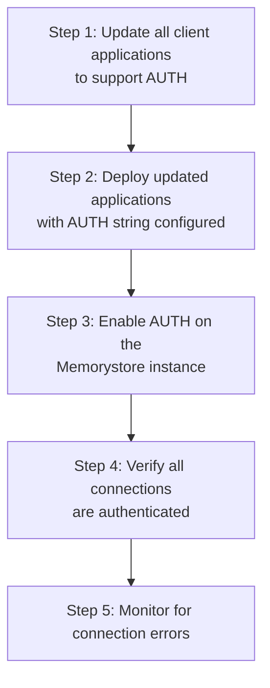

# How to Configure AUTH Authentication for Memorystore Redis

Author: [nawazdhandala](https://www.github.com/nawazdhandala)

Tags: GCP, Memorystore, Redis, Authentication, Security

Description: Secure your Memorystore for Redis instances by enabling and configuring AUTH authentication, managing auth strings, and updating client applications.

---

By default, any client that can reach your Memorystore Redis instance on the network can execute any Redis command without authentication. If your VPC network is tightly controlled, that might be acceptable for development. But for production workloads, you should always enable AUTH. It adds a layer of defense that prevents unauthorized access even if your network controls have a gap.

AUTH in Memorystore Redis works by requiring clients to present a password (called the AUTH string) before executing any commands. In this post, I will cover how to enable AUTH on new and existing instances, rotate auth strings safely, and update your applications to use the credential.

## How Memorystore AUTH Works

When AUTH is enabled on a Memorystore Redis instance, the server generates a random, long auth string. This string functions as a password. Every client connection must send an `AUTH` command with this string before running any other commands.

A few important points:
- Memorystore generates the AUTH string for you - you cannot set a custom password
- The AUTH string is a high-entropy random string (typically 50+ characters)
- You can retrieve the AUTH string using the gcloud CLI or API
- Rotating the auth string is supported and can be done without downtime

## Enabling AUTH on a New Instance

The simplest approach - enable AUTH when you create the instance:

```bash
# Create a new Redis instance with AUTH enabled from the start
gcloud redis instances create secure-cache \
  --size=2 \
  --region=us-central1 \
  --tier=standard \
  --redis-version=redis_7_0 \
  --enable-auth
```

After creation, retrieve the AUTH string:

```bash
# Get the generated AUTH string for the instance
gcloud redis instances get-auth-string secure-cache \
  --region=us-central1
```

Store this string securely - you will need it in every client that connects to this instance.

## Enabling AUTH on an Existing Instance

You can enable AUTH on an already running instance. Existing connections will not be immediately dropped, but new connections will require authentication:

```bash
# Enable AUTH on an existing Memorystore Redis instance
gcloud redis instances update my-existing-redis \
  --region=us-central1 \
  --enable-auth
```

After enabling, retrieve the new AUTH string:

```bash
# Retrieve the AUTH string
gcloud redis instances get-auth-string my-existing-redis \
  --region=us-central1
```

Be aware that this is a disruptive change if your applications are not prepared for it. Plan the rollout carefully.

## Migration Strategy for Existing Instances

When enabling AUTH on a production instance, follow this sequence to avoid downtime:



### Step 1: Update Client Code

First, update your application code to support optional AUTH. The application should work with or without AUTH until the migration is complete:

```python
# redis_client.py - Redis client that supports optional AUTH
import os
import redis

def create_redis_client():
    """Create a Redis client that handles AUTH gracefully."""

    host = os.environ.get("REDIS_HOST", "10.0.0.3")
    port = int(os.environ.get("REDIS_PORT", "6379"))
    # AUTH string will be None if not set, which means no auth
    auth = os.environ.get("REDIS_AUTH", None)

    client = redis.Redis(
        host=host,
        port=port,
        password=auth,  # None means no auth, string means AUTH is used
        decode_responses=True,
        socket_timeout=5,
        retry_on_timeout=True
    )

    # Verify connectivity
    try:
        client.ping()
        print(f"Connected to Redis at {host}:{port} (auth={'enabled' if auth else 'disabled'})")
    except redis.AuthenticationError:
        print("AUTH is required but no password provided")
        raise
    except redis.ConnectionError as e:
        print(f"Failed to connect to Redis: {e}")
        raise

    return client
```

### Step 2: Deploy with AUTH String

Set the AUTH string as an environment variable or secret:

```bash
# Store the AUTH string in Secret Manager
AUTH_STRING=$(gcloud redis instances get-auth-string my-existing-redis \
  --region=us-central1 \
  --format="value(authString)")

echo -n "${AUTH_STRING}" | gcloud secrets create redis-auth \
  --data-file=-

# Update your application deployment to include the AUTH secret
# For GKE:
kubectl create secret generic redis-auth \
  --from-literal=REDIS_AUTH="${AUTH_STRING}"

# For Cloud Run:
gcloud run services update my-service \
  --set-secrets="REDIS_AUTH=redis-auth:latest"
```

### Step 3: Enable AUTH

With all clients updated and deployed:

```bash
# Now it is safe to enable AUTH
gcloud redis instances update my-existing-redis \
  --region=us-central1 \
  --enable-auth
```

## Rotating the AUTH String

Periodically rotating credentials is a security best practice. Memorystore supports a two-phase rotation that allows you to update clients before the old string stops working.

### Understanding Rotation Phases

Memorystore maintains two auth strings during rotation:
1. The current auth string (still works)
2. The new auth string (also works)

Both strings are valid during the transition period, giving you time to update all clients.

### Performing a Rotation

```bash
# Step 1: Initiate the rotation - this generates a new auth string
# while keeping the old one valid
gcloud redis instances update secure-cache \
  --region=us-central1 \
  --update-redis-config=AUTH=new

# Step 2: Get the new AUTH string
NEW_AUTH=$(gcloud redis instances get-auth-string secure-cache \
  --region=us-central1 \
  --format="value(authString)")

# Step 3: Update all client applications with the new string
# (deploy updates to GKE, Cloud Run, etc.)

# Step 4: After all clients are updated, complete the rotation
# This invalidates the old auth string
gcloud redis instances update secure-cache \
  --region=us-central1 \
  --update-redis-config=AUTH=complete
```

### Automated Rotation Script

Here is a script that automates the rotation process:

```bash
#!/bin/bash
# rotate-redis-auth.sh - Rotate the AUTH string for a Memorystore instance

INSTANCE="secure-cache"
REGION="us-central1"
SECRET_NAME="redis-auth"

echo "Starting AUTH rotation for ${INSTANCE}..."

# Get the new AUTH string
NEW_AUTH=$(gcloud redis instances get-auth-string "${INSTANCE}" \
  --region="${REGION}" \
  --format="value(authString)")

if [ -z "${NEW_AUTH}" ]; then
    echo "Failed to retrieve AUTH string"
    exit 1
fi

# Update Secret Manager with the new auth string
echo -n "${NEW_AUTH}" | gcloud secrets versions add "${SECRET_NAME}" \
  --data-file=-

echo "Secret Manager updated with new AUTH string"

# Update Kubernetes secret if applicable
kubectl delete secret redis-auth 2>/dev/null
kubectl create secret generic redis-auth \
  --from-literal=REDIS_AUTH="${NEW_AUTH}"

echo "Kubernetes secret updated"

# Trigger a rolling restart of deployments that use Redis
kubectl rollout restart deployment/my-app

echo "Rolling restart initiated"
echo "Monitor the rollout with: kubectl rollout status deployment/my-app"
```

## Connecting with AUTH from Different Languages

### Python with redis-py

```python
# Python connection with AUTH
import redis

r = redis.Redis(
    host="10.0.0.3",
    port=6379,
    password="your-auth-string-here",
    decode_responses=True
)
r.ping()
```

### Node.js with ioredis

```javascript
// Node.js connection with AUTH using ioredis
const Redis = require("ioredis");

const client = new Redis({
    host: "10.0.0.3",
    port: 6379,
    password: "your-auth-string-here",
    retryStrategy: (times) => Math.min(times * 100, 30000)
});

client.on("ready", () => console.log("Connected with AUTH"));
```

### Go with go-redis

```go
// Go connection with AUTH
rdb := redis.NewClient(&redis.Options{
    Addr:     "10.0.0.3:6379",
    Password: "your-auth-string-here",
    DB:       0,
})
```

### Java with Jedis

```java
// Java connection with AUTH using Jedis
import redis.clients.jedis.Jedis;
import redis.clients.jedis.JedisPool;
import redis.clients.jedis.JedisPoolConfig;

JedisPoolConfig poolConfig = new JedisPoolConfig();
poolConfig.setMaxTotal(20);

JedisPool pool = new JedisPool(
    poolConfig,
    "10.0.0.3",
    6379,
    2000,  // connection timeout
    "your-auth-string-here"  // AUTH password
);

try (Jedis jedis = pool.getResource()) {
    jedis.ping();
}
```

## Disabling AUTH

If you need to disable AUTH (for example, in a development environment):

```bash
# Disable AUTH on a Memorystore instance
gcloud redis instances update secure-cache \
  --region=us-central1 \
  --no-enable-auth
```

Update your client applications to remove the password parameter first, or they will send AUTH commands that the server does not expect.

## Monitoring AUTH Failures

Track failed authentication attempts to detect unauthorized access attempts:

```bash
# Check Redis logs for AUTH failures
gcloud logging read 'resource.type="redis_instance" AND "AUTH"' \
  --limit=20 \
  --format="table(timestamp, textPayload)"
```

Set up an alert for repeated AUTH failures, as this could indicate a brute-force attempt or a misconfigured client.

## Wrapping Up

Enabling AUTH on Memorystore Redis is a simple but important security measure. It protects against unauthorized access from within your VPC and adds defense in depth alongside network controls. The key to a smooth rollout is updating your client applications before enabling AUTH on the instance, and using the rotation feature to change credentials without downtime. Make AUTH part of your standard Memorystore deployment process and you will avoid a common security gap.
