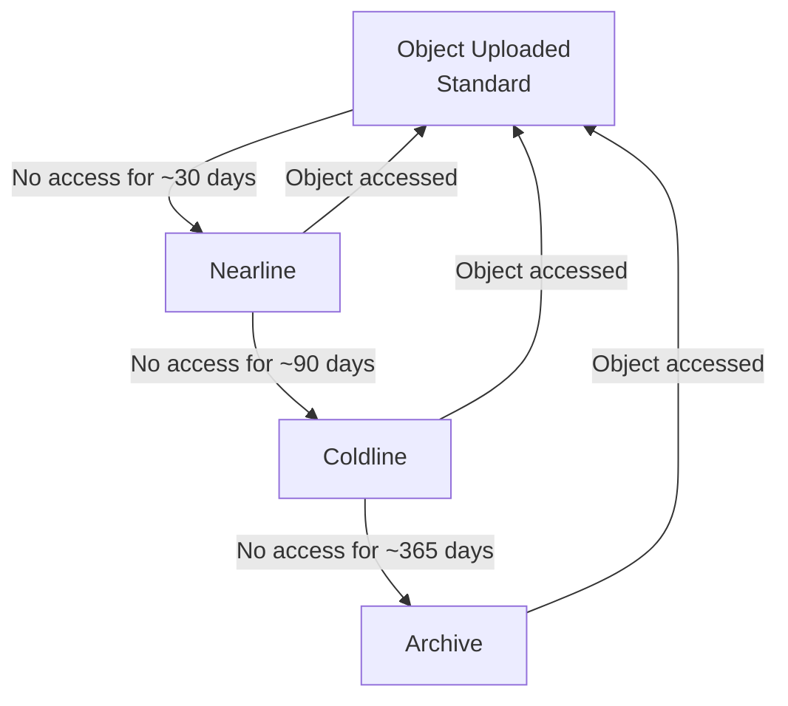

# How to Configure Autoclass to Automatically Manage Storage Classes in Google Cloud Storage

Author: [nawazdhandala](https://www.github.com/nawazdhandala)

Tags: GCP, Google Cloud Storage, Autoclass, Cost Optimization, Storage Management

Description: Learn how to enable and configure Autoclass in Google Cloud Storage to automatically transition objects between storage classes based on access patterns.

---

Choosing the right storage class for every object in a bucket is tedious work, and getting it wrong means either overpaying for storage or overpaying for retrieval. Autoclass removes this decision entirely by automatically moving objects between storage classes based on how often they are actually accessed. Frequently accessed objects stay in Standard, and untouched objects gradually move to Nearline, Coldline, and Archive.

This guide covers how Autoclass works, how to enable it, and when it makes sense for your workloads.

## How Autoclass Works

Autoclass monitors the access patterns of individual objects in a bucket. Based on this monitoring:

- Objects that are accessed frequently are kept in or promoted to **Standard** storage
- Objects that have not been accessed recently are transitioned to **Nearline** (after ~30 days of no access)
- Further inactivity moves them to **Coldline** (after ~90 days)
- Eventually, untouched objects end up in **Archive** (after ~365 days)

When an object in a colder storage class is accessed, Autoclass automatically moves it back to Standard.



The key advantage: you never pay for Standard storage on objects that are not being used, and you never pay excessive retrieval fees on objects you access frequently.

## Enabling Autoclass

### On a New Bucket

```bash
# Create a new bucket with Autoclass enabled
gcloud storage buckets create gs://my-autoclass-bucket \
  --location=us-central1 \
  --enable-autoclass
```

### On an Existing Bucket

```bash
# Enable Autoclass on an existing bucket
gcloud storage buckets update gs://my-existing-bucket \
  --enable-autoclass
```

When enabling Autoclass on an existing bucket, all objects start being monitored immediately. Objects already in non-Standard classes will be transitioned based on their subsequent access patterns.

### Verifying Autoclass Status

```bash
# Check if Autoclass is enabled on a bucket
gcloud storage buckets describe gs://my-autoclass-bucket \
  --format="json(autoclass)"
```

The output shows whether Autoclass is enabled and when the configuration was last toggled.

## Configuring the Terminal Storage Class

By default, Autoclass transitions objects through Standard, Nearline, Coldline, and stops at Coldline. You can configure it to also include Archive as the terminal class:

```bash
# Enable Autoclass with Archive as the terminal storage class
gcloud storage buckets update gs://my-autoclass-bucket \
  --enable-autoclass \
  --autoclass-terminal-storage-class=ARCHIVE
```

To keep Coldline as the terminal class (no transition to Archive):

```bash
# Set Coldline as the terminal storage class
gcloud storage buckets update gs://my-autoclass-bucket \
  --autoclass-terminal-storage-class=COLDLINE
```

Use Archive terminal class when you have data that might not be accessed for years. Use Coldline terminal class when you want a balance between cost savings and lower retrieval fees.

## Disabling Autoclass

```bash
# Disable Autoclass on a bucket
gcloud storage buckets update gs://my-autoclass-bucket \
  --no-enable-autoclass
```

When you disable Autoclass, objects stay in whatever storage class they are currently in. They are not automatically moved back to Standard.

## When to Use Autoclass

Autoclass is ideal for these scenarios:

**Mixed access patterns.** When a bucket contains data with varying access frequencies and you cannot easily predict which objects will be hot or cold. Think user-generated content - some uploads get viewed constantly, others are uploaded and forgotten.

**New projects without historical data.** When you do not yet have enough access pattern data to create effective lifecycle rules. Let Autoclass handle it while you learn your data's behavior.

**Buckets with changing access patterns.** Seasonal data, campaign assets, or project files where access patterns shift over time. Autoclass adapts automatically.

**Simplifying operations.** When your team does not have the bandwidth to create and maintain fine-tuned lifecycle rules for every bucket.

## When NOT to Use Autoclass

There are scenarios where manual lifecycle rules are better:

**Predictable access patterns.** If you know for certain that logs older than 30 days are never accessed, a lifecycle rule is simpler and gives you direct control.

**Compliance requirements.** If regulations require data to be in a specific storage class (like Archive for retention), use lifecycle rules to guarantee the transition timing.

**Cost sensitivity.** Autoclass has a small management fee. For very large buckets where you have solid access pattern data, hand-tuned lifecycle rules might save slightly more.

**Data with known expiration.** If objects should be deleted after a specific period, lifecycle rules handle this directly. Autoclass only manages transitions, not deletions.

## Autoclass vs Lifecycle Rules

Here is a comparison to help you decide:

| Factor | Autoclass | Lifecycle Rules |
|---|---|---|
| Configuration effort | Minimal (enable/disable) | Must define rules manually |
| Adapts to changes | Yes, continuously | No, rules are static |
| Promotes to warmer class | Yes, on access | No (transition is one-way) |
| Deletion support | No | Yes |
| Management fee | Small fee per object | None |
| Per-object intelligence | Yes | No (applies uniformly) |
| Predictable transitions | Depends on access | Fixed schedule |

You can also combine them. Use Autoclass for storage class management and lifecycle rules for deletion:

```bash
# Enable Autoclass for storage class transitions
gcloud storage buckets update gs://my-bucket --enable-autoclass

# Add a lifecycle rule to delete objects after 2 years
# (Autoclass does not handle deletion)
gcloud storage buckets update gs://my-bucket \
  --lifecycle-file=delete-after-2-years.json
```

Where the lifecycle file only contains deletion rules:

```json
{
  "rule": [
    {
      "action": {"type": "Delete"},
      "condition": {"age": 730}
    }
  ]
}
```

## Setting Up with Terraform

```hcl
resource "google_storage_bucket" "autoclass_bucket" {
  name     = "my-autoclass-bucket"
  location = "US"

  autoclass {
    enabled                = true
    terminal_storage_class = "ARCHIVE"
  }

  # Lifecycle rules for deletion only (Autoclass handles transitions)
  lifecycle_rule {
    action {
      type = "Delete"
    }
    condition {
      age = 730  # 2 years
    }
  }
}
```

## Monitoring Autoclass Behavior

### Checking Object Storage Classes

To see what storage class individual objects are currently in:

```bash
# List objects with their storage classes
gcloud storage ls -L gs://my-autoclass-bucket/ | grep -E "Name:|Storage"
```

### Using Cloud Monitoring

Set up monitoring to track storage class distribution over time:

```bash
# View storage metrics in Cloud Monitoring
# The metric is storage.googleapis.com/storage/total_bytes
# Filter by storage_class label to see distribution
```

You can create a Cloud Monitoring dashboard that shows bytes per storage class, which gives you visibility into how Autoclass is managing your data.

## Python Configuration

```python
from google.cloud import storage

def enable_autoclass(bucket_name, terminal_class="ARCHIVE"):
    """Enable Autoclass on a bucket with a specified terminal storage class."""
    client = storage.Client()
    bucket = client.get_bucket(bucket_name)

    # Enable Autoclass with the desired terminal class
    bucket.autoclass_enabled = True
    bucket.autoclass_terminal_storage_class = terminal_class
    bucket.patch()

    print(f"Enabled Autoclass on {bucket_name}")
    print(f"Terminal storage class: {terminal_class}")

def check_autoclass_status(bucket_name):
    """Check the Autoclass configuration of a bucket."""
    client = storage.Client()
    bucket = client.get_bucket(bucket_name)

    print(f"Bucket: {bucket_name}")
    print(f"Autoclass enabled: {bucket.autoclass_enabled}")
    if bucket.autoclass_enabled:
        print(f"Terminal class: {bucket.autoclass_terminal_storage_class}")
        print(f"Toggle time: {bucket.autoclass_toggle_time}")

enable_autoclass("my-data-bucket", "ARCHIVE")
check_autoclass_status("my-data-bucket")
```

## Cost Considerations

Autoclass charges a small management fee per object for the monitoring and transition management. This fee is typically much smaller than the savings from automatic transitions, but it is worth understanding:

- There is no charge for objects in Standard storage class
- A small per-object fee applies for monitoring objects in non-Standard classes
- Retrieval fees still apply when objects are accessed in colder classes (before promotion)

For most workloads, the net effect is significant cost savings. The management fee is a fraction of what you save by not storing cold data in Standard class.

## Migration Strategy

If you are currently using lifecycle rules and want to switch to Autoclass:

1. Enable Autoclass on the bucket
2. Remove your storage class transition lifecycle rules (keep deletion rules)
3. Monitor the bucket for a few weeks to see how Autoclass manages transitions
4. Compare costs before and after

Autoclass takes the guesswork out of storage class management. For buckets where you cannot easily predict access patterns, it is almost always the right choice. For buckets with very predictable patterns and strict compliance requirements, stick with lifecycle rules. And for everything in between, try Autoclass and see if the savings materialize.
