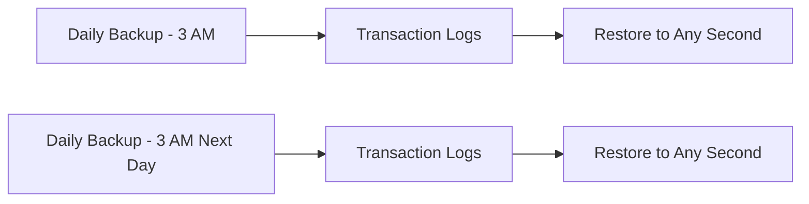

# How to Configure Automated Backups and Point-in-Time Recovery in Cloud SQL

Author: [nawazdhandala](https://www.github.com/nawazdhandala)

Tags: GCP, Cloud SQL, Backups, Point-in-Time Recovery, Disaster Recovery

Description: Learn how to configure automated backups and point-in-time recovery for Cloud SQL instances to protect your data and enable granular restore capabilities.

---

Backups are your last line of defense when things go wrong. Accidental data deletion, application bugs that corrupt data, or even ransomware - a solid backup strategy handles all of these. Cloud SQL provides automated backups and point-in-time recovery (PITR) out of the box. This guide covers how to set them up, how they work, and how to use them when you actually need to restore.

## Understanding Cloud SQL Backup Types

Cloud SQL offers two complementary backup mechanisms:

**Automated Backups** are full snapshots of your database taken daily during a window you specify. They are stored independently of your instance and survive instance deletion (for a retention period).

**Point-in-Time Recovery (PITR)** uses transaction logs (binary logs for MySQL, WAL for PostgreSQL) to let you restore to any specific second within the retention window. PITR builds on automated backups - it replays transactions from the most recent backup to the exact point in time you specify.



## Enabling Automated Backups

If backups are not already enabled on your instance, turn them on:

```bash
# Enable automated backups with a 3 AM backup window
gcloud sql instances patch my-instance \
    --backup-start-time=03:00
```

The backup start time is in UTC. Choose a time when your database has the least write activity, as backups can cause a brief performance impact.

For a new instance, include backup configuration at creation time:

```bash
# Create an instance with backups enabled from the start
gcloud sql instances create my-instance \
    --database-version=POSTGRES_15 \
    --tier=db-custom-4-16384 \
    --region=us-central1 \
    --backup-start-time=03:00 \
    --retained-backups-count=14 \
    --enable-point-in-time-recovery
```

## Configuring Backup Retention

By default, Cloud SQL retains 7 automated backups. You can adjust this:

```bash
# Set backup retention to 30 days
gcloud sql instances patch my-instance \
    --retained-backups-count=30
```

Consider your requirements:

- **7 days**: Fine for development and staging
- **14-30 days**: Good for most production workloads
- **30+ days**: Required for some compliance standards

Each backup consumes storage. The first backup is roughly the size of your database, and subsequent backups are incremental. Cloud SQL provides backup storage equal to your instance's disk size for free. Beyond that, you pay per GB per month.

## Enabling Point-in-Time Recovery

PITR requires automated backups to be enabled first. Then enable PITR:

For MySQL:

```bash
# Enable PITR for MySQL (requires binary logging)
gcloud sql instances patch my-mysql-instance \
    --enable-bin-log
```

For PostgreSQL:

```bash
# Enable PITR for PostgreSQL (uses WAL archiving)
gcloud sql instances patch my-postgres-instance \
    --enable-point-in-time-recovery
```

You can also set the transaction log retention period:

```bash
# Set transaction log retention to 7 days
# This determines how far back PITR can go
gcloud sql instances patch my-instance \
    --retained-transaction-log-days=7
```

The transaction log retention period determines how far back you can do a point-in-time restore. A longer retention means more storage usage but a wider recovery window.

## Using Terraform for Backup Configuration

Here is a complete Terraform configuration with backups and PITR:

```hcl
# Cloud SQL instance with full backup and PITR configuration
resource "google_sql_database_instance" "main" {
  name             = "production-db"
  database_version = "POSTGRES_15"
  region           = "us-central1"

  settings {
    tier = "db-custom-4-16384"

    backup_configuration {
      enabled                        = true
      start_time                     = "03:00"
      point_in_time_recovery_enabled = true

      # Number of backups to retain
      retained_backups = 30

      # Transaction log retention in days
      transaction_log_retention_days = 7

      backup_retention_settings {
        retained_backups = 30
        retention_unit   = "COUNT"
      }
    }

    disk_type       = "PD_SSD"
    disk_size       = 100
    disk_autoresize = true
  }
}
```

## Listing Available Backups

Check what backups are available for your instance:

```bash
# List all backups for an instance
gcloud sql backups list --instance=my-instance
```

This shows each backup's ID, status, start and end time, and type. You will need the backup ID when restoring.

## Creating an On-Demand Backup

Sometimes you want a backup right now - before a major deployment, for example:

```bash
# Create an on-demand backup with a description
gcloud sql backups create \
    --instance=my-instance \
    --description="Pre-deployment backup 2026-02-17"
```

On-demand backups count toward your retention limit unless you mark them differently. They are useful as safety nets before risky operations.

## Restoring from an Automated Backup

To restore from a specific backup:

```bash
# List backups to find the one you want
gcloud sql backups list --instance=my-instance

# Restore a specific backup by its ID
# WARNING: This overwrites the current instance data
gcloud sql backups restore BACKUP_ID \
    --restore-instance=my-instance
```

The restore operation overwrites the current data in your instance. If you want to check the backup's contents first, restore to a temporary instance:

```bash
# Restore to a different (temporary) instance for verification
gcloud sql backups restore BACKUP_ID \
    --restore-instance=my-temp-instance \
    --backup-instance=my-instance
```

## Performing a Point-in-Time Recovery

PITR lets you restore to any second within your transaction log retention window. This is especially useful for recovering from accidental data deletion:

```bash
# Restore the instance to a specific point in time
# Use RFC 3339 format for the timestamp
gcloud sql instances clone my-instance my-instance-recovered \
    --point-in-time="2026-02-17T14:30:00Z"
```

This creates a new instance (`my-instance-recovered`) with data as it existed at the specified timestamp. The original instance is not modified.

You can also restore in-place, but cloning to a new instance is safer because you can verify the data before switching:

```bash
# Verify the recovered data
gcloud sql connect my-instance-recovered --user=postgres

# Once verified, you can:
# 1. Update your application to point to the new instance
# 2. Or export data from the clone and import into the original
```

## Backup Storage and Costs

Understanding backup storage costs:

- **Free tier**: Backup storage up to the size of your instance disk is free
- **Beyond free tier**: Charged per GB per month at standard storage rates
- **Transaction logs**: Count toward your backup storage

Example: If your instance has 100 GB of disk, you get 100 GB of backup storage free. With 30 daily backups (incremental) and 7 days of transaction logs, you might use 150-200 GB of backup storage total.

## Backup Best Practices

### 1. Test Your Restores

This is the most important practice and the one most people skip. Schedule periodic restore tests:

```bash
# Monthly restore test - create a clone and verify
gcloud sql instances clone my-instance restore-test-$(date +%Y%m%d) \
    --point-in-time="$(date -u +%Y-%m-%dT%H:%M:%SZ)"

# Run validation queries against the clone
# Then delete it when done
gcloud sql instances delete restore-test-$(date +%Y%m%d)
```

### 2. Set Backup Windows During Low Traffic

Schedule automated backups when your database is least busy. Backups can cause brief I/O spikes, and while Cloud SQL handles this well, you do not want it competing with peak traffic.

### 3. Use Longer Retention for Compliance

Some industries require specific backup retention periods. Check your compliance requirements and configure accordingly. You may also need to export backups to Cloud Storage for long-term archival.

### 4. Export for Long-Term Storage

Cloud SQL backups are tied to the instance lifecycle. For truly long-term archival, export your data:

```bash
# Export the database to a Cloud Storage bucket for long-term archival
gcloud sql export sql my-instance \
    gs://my-backup-bucket/exports/mydb-$(date +%Y%m%d).sql \
    --database=mydb
```

### 5. Monitor Backup Success

Create alerts for backup failures:

```bash
# Check recent backup status
gcloud sql backups list --instance=my-instance --limit=5
```

Look for any backups with `FAILED` status. Failed backups should be investigated immediately.

## Cross-Region Backup Storage

By default, backups are stored in the same region as your instance. For disaster recovery, consider enabling cross-region backup storage:

```bash
# Enable cross-region backup storage
gcloud sql instances patch my-instance \
    --backup-location=us
```

Using a multi-region location like `us` stores backups across multiple regions within that geography, protecting against a regional outage.

## Summary

Cloud SQL's automated backups and point-in-time recovery give you a solid foundation for data protection. Enable both, set appropriate retention periods, and - most importantly - regularly test your restore process. When the time comes that you actually need to restore, you do not want that to be your first time doing it. Configure your backup window during low-traffic hours, export to Cloud Storage for long-term archival, and monitor for backup failures.
