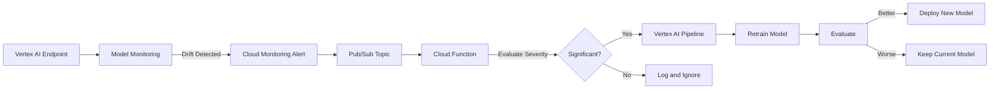

# How to Configure Automated Model Retraining Triggered by Data Drift Alerts on GCP

Author: [nawazdhandala](https://www.github.com/nawazdhandala)

Tags: Vertex AI, Data Drift, Model Retraining, MLOps, Google Cloud

Description: Learn how to configure automated model retraining pipelines that trigger when data drift alerts are detected using Vertex AI Model Monitoring and Cloud Functions.

---

Scheduled model retraining is better than no retraining, but it is wasteful. If your model is performing well and the data has not changed, retraining weekly burns compute resources for no benefit. If your data shifts dramatically mid-week, you are stuck with a degraded model until the next scheduled run.

The ideal approach is event-driven retraining - your system detects data drift, evaluates whether it is significant enough to impact model performance, and automatically kicks off a retraining pipeline if needed. On GCP, you can build this by connecting Vertex AI Model Monitoring alerts to Cloud Functions that trigger Vertex AI Pipelines.

## The Event-Driven Retraining Architecture

Here is how all the pieces fit together.



## Step 1: Set Up Model Monitoring with Drift Detection

First, configure Vertex AI Model Monitoring to detect drift and send alerts.

```python
# setup_monitoring.py
from google.cloud import aiplatform
from google.cloud.aiplatform import model_monitoring

def setup_drift_monitoring(endpoint_id, training_data_uri):
    """Configure drift detection that will trigger retraining."""
    aiplatform.init(project="my-project", location="us-central1")

    endpoint = aiplatform.Endpoint(endpoint_id)
    deployed_models = endpoint.list_models()
    deployed_model_id = deployed_models[0].id

    # Set drift thresholds for each feature
    # These should be tuned based on your model's sensitivity
    drift_config = model_monitoring.DriftDetectionConfig(
        drift_thresholds={
            "user_age": model_monitoring.ThresholdConfig(value=0.2),
            "session_duration": model_monitoring.ThresholdConfig(value=0.2),
            "purchase_count_30d": model_monitoring.ThresholdConfig(value=0.15),
            "avg_order_value": model_monitoring.ThresholdConfig(value=0.15),
        },
        attribute_drift_thresholds={
            "device_type": model_monitoring.ThresholdConfig(value=0.25),
            "region": model_monitoring.ThresholdConfig(value=0.25),
        }
    )

    skew_config = model_monitoring.SkewDetectionConfig(
        data_source=training_data_uri,
        skew_thresholds={
            "user_age": model_monitoring.ThresholdConfig(value=0.3),
            "session_duration": model_monitoring.ThresholdConfig(value=0.3),
        },
    )

    # Configure email alerts (we will also use Cloud Monitoring for Pub/Sub)
    email_config = model_monitoring.EmailAlertConfig(
        user_emails=["ml-team@company.com"]
    )

    monitoring_job = aiplatform.ModelDeploymentMonitoringJob.create(
        display_name="drift-triggered-retraining-monitor",
        endpoint=endpoint,
        logging_sampling_strategy=model_monitoring.RandomSampleConfig(
            sample_rate=0.8
        ),
        schedule_config=model_monitoring.ScheduleConfig(
            monitor_interval=3600  # Check every hour
        ),
        alert_config=email_config,
        objective_configs={
            deployed_model_id: model_monitoring.ObjectiveConfig(
                prediction_drift_detection_config=drift_config,
                training_prediction_skew_detection_config=skew_config,
            )
        },
    )

    print(f"Monitoring job created: {monitoring_job.resource_name}")
    return monitoring_job
```

## Step 2: Create a Cloud Monitoring Alert Policy

Set up a Cloud Monitoring alert that fires when drift scores exceed your threshold and publishes to a Pub/Sub topic.

```python
# setup_alert_policy.py
from google.cloud import monitoring_v3

def create_drift_alert_policy(project_id, notification_channel_id):
    """Create an alert policy that triggers on model drift."""
    client = monitoring_v3.AlertPolicyServiceClient()

    alert_policy = monitoring_v3.AlertPolicy(
        display_name="Model Drift - Trigger Retraining",
        documentation=monitoring_v3.AlertPolicy.Documentation(
            content="Automatic alert when model drift exceeds threshold. "
                    "This triggers the retraining pipeline.",
            mime_type="text/markdown",
        ),
        conditions=[
            monitoring_v3.AlertPolicy.Condition(
                display_name="Feature drift score exceeds threshold",
                condition_threshold=monitoring_v3.AlertPolicy.Condition.MetricThreshold(
                    filter=(
                        'metric.type="aiplatform.googleapis.com/'
                        'prediction/online/feature_attribution_drift_score"'
                    ),
                    comparison=monitoring_v3.ComparisonType.COMPARISON_GT,
                    threshold_value=0.3,
                    duration={"seconds": 0},
                    aggregations=[
                        monitoring_v3.Aggregation(
                            alignment_period={"seconds": 3600},
                            per_series_aligner=monitoring_v3.Aggregation.Aligner.ALIGN_MAX,
                        )
                    ],
                ),
            )
        ],
        notification_channels=[notification_channel_id],
        combiner=monitoring_v3.AlertPolicy.ConditionCombinerType.OR,
    )

    result = client.create_alert_policy(
        name=f"projects/{project_id}",
        alert_policy=alert_policy,
    )

    print(f"Alert policy created: {result.name}")
    return result.name
```

## Step 3: Set Up the Pub/Sub Topic and Cloud Function

Create the Pub/Sub infrastructure and the Cloud Function that evaluates drift severity and triggers retraining.

```bash
# Create the Pub/Sub topic for drift alerts
gcloud pubsub topics create model-drift-alerts

# Create a notification channel that publishes to Pub/Sub
# Note: You may need to use the API directly for Pub/Sub notification channels
gcloud monitoring channels create \
  --display-name="Drift Alert to Pub/Sub" \
  --type=pubsub \
  --channel-labels=topic=projects/my-project/topics/model-drift-alerts
```

Now create the Cloud Function that processes drift alerts.

```python
# cloud_function/main.py
import json
import base64
from google.cloud import aiplatform
from google.cloud import bigquery
import functions_framework

# Configuration
PROJECT_ID = "my-project"
LOCATION = "us-central1"
PIPELINE_TEMPLATE = "gs://my-bucket/pipelines/retraining_pipeline.json"
STAGING_BUCKET = "gs://my-bucket/pipeline-staging"

# Minimum interval between retraining runs (in hours)
MIN_RETRAIN_INTERVAL_HOURS = 24

# Minimum number of drifted features to trigger retraining
MIN_DRIFTED_FEATURES = 2

@functions_framework.cloud_event
def handle_drift_alert(cloud_event):
    """Process a drift alert and decide whether to trigger retraining."""

    # Decode the Pub/Sub message
    data = base64.b64decode(cloud_event.data["message"]["data"]).decode()
    alert_data = json.loads(data)

    print(f"Received drift alert: {json.dumps(alert_data, indent=2)}")

    # Check if we should actually retrain
    should_retrain = evaluate_retraining_need(alert_data)

    if should_retrain:
        print("Drift is significant enough to trigger retraining")
        trigger_retraining_pipeline(alert_data)
    else:
        print("Drift detected but below retraining threshold. Logging only.")
        log_drift_event(alert_data, triggered_retrain=False)


def evaluate_retraining_need(alert_data):
    """Evaluate whether the drift is significant enough to warrant retraining."""
    bq_client = bigquery.Client()

    # Check when the last retraining was triggered
    query = """
    SELECT MAX(triggered_at) as last_retrain
    FROM `ml_ops.retraining_log`
    WHERE status IN ('completed', 'running')
    """
    result = list(bq_client.query(query).result())

    if result and result[0]["last_retrain"]:
        from datetime import datetime, timedelta, timezone
        last_retrain = result[0]["last_retrain"]
        hours_since_retrain = (
            datetime.now(timezone.utc) - last_retrain
        ).total_seconds() / 3600

        if hours_since_retrain < MIN_RETRAIN_INTERVAL_HOURS:
            print(f"Last retrain was {hours_since_retrain:.1f} hours ago. "
                  f"Minimum interval: {MIN_RETRAIN_INTERVAL_HOURS} hours. Skipping.")
            return False

    # Check how many features are showing drift
    drifted_features = get_drifted_feature_count()

    if drifted_features < MIN_DRIFTED_FEATURES:
        print(f"Only {drifted_features} features drifted. "
              f"Minimum: {MIN_DRIFTED_FEATURES}. Skipping.")
        return False

    return True


def get_drifted_feature_count():
    """Count how many features are currently showing significant drift."""
    aiplatform.init(project=PROJECT_ID, location=LOCATION)

    # Query recent monitoring results
    # This is a simplified version - in practice you would query
    # the monitoring job's anomaly results
    bq_client = bigquery.Client()
    query = """
    SELECT COUNT(DISTINCT feature_name) as drifted_count
    FROM `ml_ops.drift_scores`
    WHERE drift_score > 0.2
      AND measured_at > TIMESTAMP_SUB(CURRENT_TIMESTAMP(), INTERVAL 1 HOUR)
    """
    result = list(bq_client.query(query).result())
    return result[0]["drifted_count"] if result else 0


def trigger_retraining_pipeline(alert_data):
    """Submit a Vertex AI Pipeline job for model retraining."""
    aiplatform.init(
        project=PROJECT_ID,
        location=LOCATION,
        staging_bucket=STAGING_BUCKET,
    )

    # Submit the retraining pipeline
    job = aiplatform.PipelineJob(
        display_name=f"drift-triggered-retraining",
        template_path=PIPELINE_TEMPLATE,
        parameter_values={
            "project_id": PROJECT_ID,
            "training_data_table": "ml_features.training_data",
            "endpoint_id": "ENDPOINT_ID",
            "trigger_reason": "data_drift",
            "drift_details": json.dumps(alert_data),
        },
        enable_caching=False,
    )

    job.submit()
    print(f"Retraining pipeline submitted: {job.resource_name}")

    # Log the retraining event
    log_drift_event(alert_data, triggered_retrain=True, pipeline_job=job.resource_name)


def log_drift_event(alert_data, triggered_retrain, pipeline_job=None):
    """Log the drift event for audit and analysis."""
    bq_client = bigquery.Client()

    row = {
        "alert_data": json.dumps(alert_data),
        "triggered_retrain": triggered_retrain,
        "pipeline_job": pipeline_job,
        "triggered_at": "AUTO",  # BigQuery will use CURRENT_TIMESTAMP()
    }

    errors = bq_client.insert_rows_json("ml_ops.retraining_log", [row])
    if errors:
        print(f"Error logging event: {errors}")
```

## Step 4: Build the Retraining Pipeline

The retraining pipeline should fetch fresh data, train a new model, compare it against the current production model, and deploy only if it is better.

```python
# pipeline/retraining_pipeline.py
from kfp.v2 import dsl, compiler

@dsl.pipeline(
    name="drift-triggered-retraining",
    description="Automated retraining pipeline triggered by data drift"
)
def retraining_pipeline(
    project_id: str,
    training_data_table: str,
    endpoint_id: str,
    trigger_reason: str = "scheduled",
    drift_details: str = "{}",
):
    # Step 1: Fetch fresh training data
    data_task = fetch_training_data(
        project_id=project_id,
        table_name=training_data_table,
    )

    # Step 2: Train a new model
    train_task = train_model(
        train_data=data_task.outputs["train_data"],
    )

    # Step 3: Evaluate the new model
    eval_task = evaluate_model(
        model=train_task.outputs["model"],
        test_data=data_task.outputs["test_data"],
    )

    # Step 4: Compare with current production model
    compare_task = compare_with_production(
        new_model_metrics=eval_task.outputs["metrics"],
        endpoint_id=endpoint_id,
        project_id=project_id,
    )

    # Step 5: Deploy only if the new model is better
    with dsl.Condition(compare_task.output == True):
        deploy_task = deploy_model(
            model=train_task.outputs["model"],
            endpoint_id=endpoint_id,
            project_id=project_id,
        )

        # Step 6: Update the monitoring baseline with the new training data
        update_baseline_task = update_monitoring_baseline(
            train_data=data_task.outputs["train_data"],
            endpoint_id=endpoint_id,
            project_id=project_id,
        )
```

Here is the comparison component that checks whether the new model beats the current one.

```python
# components/compare_models.py
from kfp.v2 import dsl
from kfp.v2.dsl import Input, Metrics

@dsl.component(
    base_image="python:3.10",
    packages_to_install=["google-cloud-aiplatform"]
)
def compare_with_production(
    new_model_metrics: Input[Metrics],
    endpoint_id: str,
    project_id: str,
    improvement_threshold: float = 0.01,
) -> bool:
    """Compare new model metrics against current production model.
    Returns True if the new model is better by at least the improvement threshold."""
    from google.cloud import aiplatform
    import json

    aiplatform.init(project=project_id, location="us-central1")

    # Get current production model metrics from metadata
    endpoint = aiplatform.Endpoint(endpoint_id)
    current_models = endpoint.list_models()

    if not current_models:
        print("No current model deployed. New model will be deployed.")
        return True

    # Read new model metrics
    new_accuracy = new_model_metrics.metadata.get("accuracy", 0)
    new_f1 = new_model_metrics.metadata.get("f1_score", 0)

    # Get current model metrics from labels or metadata
    current_model = aiplatform.Model(current_models[0].model)
    current_accuracy = float(current_model.labels.get("accuracy", "0"))
    current_f1 = float(current_model.labels.get("f1_score", "0"))

    print(f"Current model - Accuracy: {current_accuracy}, F1: {current_f1}")
    print(f"New model     - Accuracy: {new_accuracy}, F1: {new_f1}")

    # Check if new model is better
    accuracy_improved = new_accuracy > current_accuracy + improvement_threshold
    f1_improved = new_f1 > current_f1 + improvement_threshold

    is_better = accuracy_improved or f1_improved

    if is_better:
        print(f"New model is better. Recommending deployment.")
    else:
        print(f"New model is not significantly better. Keeping current model.")

    return is_better
```

## Step 5: Deploy the Cloud Function

```bash
# Deploy the drift alert handler
gcloud functions deploy drift-alert-handler \
  --gen2 \
  --runtime python310 \
  --trigger-topic model-drift-alerts \
  --entry-point handle_drift_alert \
  --region us-central1 \
  --service-account ml-pipeline-sa@my-project.iam.gserviceaccount.com \
  --set-env-vars PROJECT_ID=my-project
```

## Tuning the Retraining Triggers

Getting the right balance between too-frequent and too-infrequent retraining requires iteration. Here are guidelines:

- Start with conservative thresholds (higher drift scores before triggering)
- Set a minimum interval between retraining runs to avoid wasting resources
- Require multiple features to show drift before triggering (one feature drifting might be noise)
- Monitor the retraining outcomes to see if drift-triggered retraining actually improves the model

## Wrapping Up

Event-driven model retraining is more efficient than scheduled retraining because it responds to actual data changes rather than arbitrary time intervals. The key building blocks on GCP are Vertex AI Model Monitoring for drift detection, Cloud Monitoring alerts for notification routing, Pub/Sub for event delivery, Cloud Functions for decision logic, and Vertex AI Pipelines for the actual retraining. Start with a simple setup, tune the thresholds based on your model's sensitivity to drift, and add guardrails like minimum retraining intervals and model comparison gates to prevent unnecessary work.
