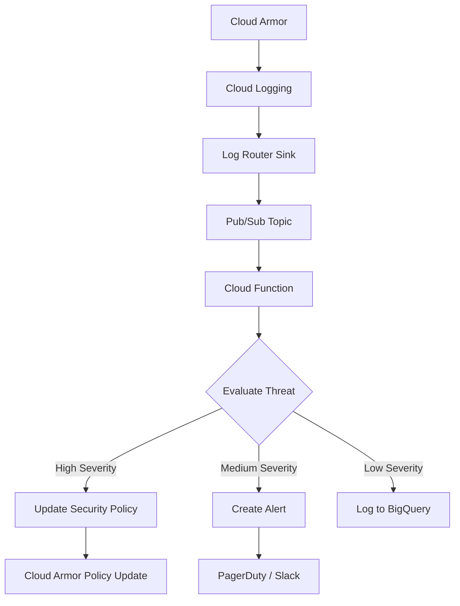

# How to Configure Automated Response to Cloud Armor Threat Intelligence Signals

Author: [nawazdhandala](https://www.github.com/nawazdhandala)

Tags: GCP, Cloud Armor, Threat Intelligence, WAF, Security Automation

Description: Learn how to configure Google Cloud Armor to automatically respond to threat intelligence signals, blocking malicious traffic before it reaches your applications.

---

Google Cloud Armor is GCP's web application firewall and DDoS protection service. One of its more powerful features is the integration with threat intelligence feeds that let you automatically block traffic from known malicious sources. But setting this up correctly - especially the automated response part - requires understanding how the pieces fit together.

In this guide, I'll walk through configuring Cloud Armor security policies that react to threat intelligence signals, set up automated response workflows, and integrate with Cloud Functions for custom remediation actions.

## What Are Threat Intelligence Signals?

Cloud Armor's threat intelligence integration provides curated lists of IP addresses and ranges known to be associated with malicious activity. These include known botnets, Tor exit nodes, cryptocurrency miners, and scanner IPs. Google maintains these lists, and they update automatically.

The key feed categories include:

- **iplist-known-malicious-ips**: IPs flagged by Google's threat analysis
- **iplist-tor-exit-nodes**: Tor network exit nodes
- **iplist-search-engines-crawlers**: Legitimate search engine crawlers
- **iplist-public-clouds**: Known public cloud provider IP ranges

## Setting Up the Base Security Policy

Start by creating a Cloud Armor security policy attached to your backend service:

```bash
# Create a security policy with adaptive protection enabled
gcloud compute security-policies create web-app-policy \
    --description="Security policy with threat intelligence" \
    --type=CLOUD_ARMOR

# Enable adaptive protection for automatic DDoS detection
gcloud compute security-policies update web-app-policy \
    --enable-layer7-ddos-defense \
    --layer7-ddos-defense-rule-visibility=STANDARD
```

## Adding Threat Intelligence Rules

Now add rules that reference the threat intelligence feeds:

```bash
# Block traffic from known malicious IPs - highest priority
gcloud compute security-policies rules create 1000 \
    --security-policy=web-app-policy \
    --expression="evaluateThreatIntelligence('iplist-known-malicious-ips')" \
    --action=deny-403 \
    --description="Block known malicious IPs"

# Block Tor exit nodes - useful for apps that don't need Tor access
gcloud compute security-policies rules create 1100 \
    --security-policy=web-app-policy \
    --expression="evaluateThreatIntelligence('iplist-tor-exit-nodes')" \
    --action=deny-403 \
    --description="Block Tor exit nodes"

# Rate limit traffic from public cloud IPs to catch bot traffic
gcloud compute security-policies rules create 1200 \
    --security-policy=web-app-policy \
    --expression="evaluateThreatIntelligence('iplist-public-clouds')" \
    --action=rate-based-ban \
    --rate-limit-threshold-count=100 \
    --rate-limit-threshold-interval-sec=60 \
    --ban-duration-sec=600 \
    --description="Rate limit public cloud IPs"
```

## Combining Threat Intel with Custom Rules

Threat intelligence feeds work best when combined with custom WAF rules. Here's a CEL expression that combines threat signals with request patterns:

```bash
# Block known malicious IPs that are also hitting API endpoints
gcloud compute security-policies rules create 900 \
    --security-policy=web-app-policy \
    --expression="evaluateThreatIntelligence('iplist-known-malicious-ips') && request.path.matches('/api/.*')" \
    --action=deny-403 \
    --description="Block malicious IPs targeting API endpoints"

# Apply stricter rate limits to suspicious sources hitting auth endpoints
gcloud compute security-policies rules create 950 \
    --security-policy=web-app-policy \
    --expression="evaluateThreatIntelligence('iplist-public-clouds') && request.path.matches('/auth/.*|/login.*')" \
    --action=rate-based-ban \
    --rate-limit-threshold-count=10 \
    --rate-limit-threshold-interval-sec=60 \
    --ban-duration-sec=3600 \
    --description="Strict rate limit on cloud IPs hitting auth"
```

## Building the Automated Response Pipeline

The real power comes from automating responses to Cloud Armor events. Here's the architecture:



## Setting Up Log-Based Alerts

First, create a log sink that captures Cloud Armor deny events:

```bash
# Create a Pub/Sub topic for Cloud Armor events
gcloud pubsub topics create cloud-armor-events

# Create a log sink that routes Cloud Armor deny events to Pub/Sub
gcloud logging sinks create cloud-armor-sink \
    pubsub.googleapis.com/projects/YOUR_PROJECT/topics/cloud-armor-events \
    --log-filter='resource.type="http_load_balancer" AND jsonPayload.enforcedSecurityPolicy.outcome="DENY"'
```

## The Automated Response Function

This Cloud Function processes Cloud Armor events and takes automated action:

```python
import base64
import json
from google.cloud import compute_v1
from google.cloud import pubsub_v1
from collections import defaultdict

# Threshold for automatic IP blocking
BLOCK_THRESHOLD = 50  # Number of denied requests before auto-blocking
TIME_WINDOW_SECONDS = 300  # 5-minute window

# In-memory counter (use Redis or Firestore in production)
ip_counters = defaultdict(int)

def process_armor_event(event, context):
    """Process Cloud Armor deny events and take automated action"""
    # Decode the Pub/Sub message
    pubsub_message = base64.b64decode(event["data"]).decode("utf-8")
    log_entry = json.loads(pubsub_message)

    # Extract relevant fields from the log entry
    source_ip = log_entry.get("jsonPayload", {}).get(
        "enforcedSecurityPolicy", {}
    ).get("matchedField", "")

    rule_name = log_entry.get("jsonPayload", {}).get(
        "enforcedSecurityPolicy", {}
    ).get("name", "")

    # Count occurrences from this IP
    ip_counters[source_ip] += 1

    if ip_counters[source_ip] >= BLOCK_THRESHOLD:
        # This IP has exceeded our threshold - add it to the blocklist
        add_ip_to_blocklist(source_ip)
        send_notification(source_ip, ip_counters[source_ip], rule_name)
        ip_counters[source_ip] = 0  # Reset counter

def add_ip_to_blocklist(ip_address):
    """Add an IP to the Cloud Armor deny list"""
    client = compute_v1.SecurityPoliciesClient()
    project = "your-project-id"
    policy_name = "web-app-policy"

    # Get the current policy
    policy = client.get(project=project, security_policy=policy_name)

    # Find the custom blocklist rule or create one
    blocklist_rule = None
    for rule in policy.rules:
        if rule.description == "Auto-generated blocklist":
            blocklist_rule = rule
            break

    if blocklist_rule:
        # Append the new IP to the existing expression
        current_expr = blocklist_rule.match.expr.expression
        new_expr = f"{current_expr} || inIpRange(origin.ip, '{ip_address}/32')"
        blocklist_rule.match.expr.expression = new_expr
    else:
        # Create a new rule for auto-blocked IPs
        new_rule = compute_v1.SecurityPolicyRule()
        new_rule.priority = 500
        new_rule.action = "deny(403)"
        new_rule.description = "Auto-generated blocklist"
        new_rule.match = compute_v1.SecurityPolicyRuleMatcher()
        new_rule.match.expr = compute_v1.Expr()
        new_rule.match.expr.expression = (
            f"inIpRange(origin.ip, '{ip_address}/32')"
        )
        policy.rules.append(new_rule)

    # Update the policy
    client.patch(
        project=project,
        security_policy=policy_name,
        security_policy_resource=policy
    )
    print(f"Blocked IP: {ip_address}")
```

## Adding Notification Channels

You'll want visibility into what the automated system is doing:

```python
import requests

def send_notification(ip_address, request_count, rule_name):
    """Send a Slack notification when an IP is auto-blocked"""
    webhook_url = "https://hooks.slack.com/services/YOUR/WEBHOOK/URL"

    message = {
        "blocks": [
            {
                "type": "section",
                "text": {
                    "type": "mrkdwn",
                    "text": (
                        f"*Cloud Armor Auto-Block Triggered*\n"
                        f"- IP: `{ip_address}`\n"
                        f"- Denied requests: {request_count}\n"
                        f"- Triggering rule: {rule_name}\n"
                        f"- Action: Added to blocklist"
                    )
                }
            }
        ]
    }

    # Post the notification to Slack
    requests.post(webhook_url, json=message)
```

## Using Adaptive Protection

Cloud Armor's Adaptive Protection uses machine learning to detect anomalous traffic patterns. When it detects a potential attack, it generates alerts with suggested rules:

```bash
# Enable adaptive protection with automatic rule deployment
gcloud compute security-policies update web-app-policy \
    --enable-layer7-ddos-defense \
    --layer7-ddos-defense-rule-visibility=STANDARD \
    --layer7-ddos-defense-threshold-configs='[{
        "name": "high-confidence",
        "autoDeployLoadThreshold": 0.7,
        "autoDeployConfidenceThreshold": 0.8,
        "autoDeployImpactedBaselineThreshold": 0.01,
        "autoDeployExpirationSec": 7200
    }]'
```

This tells Cloud Armor to automatically deploy blocking rules when it detects an attack with high confidence, and to expire those rules after 2 hours.

## Monitoring and Dashboards

Set up monitoring to track the effectiveness of your threat intelligence rules:

```bash
# Create an alert policy for high volumes of blocked traffic
gcloud alpha monitoring policies create \
    --display-name="Cloud Armor High Block Rate" \
    --condition-display-name="Blocked requests spike" \
    --condition-filter='resource.type="http_load_balancer" AND metric.type="loadbalancing.googleapis.com/https/request_count" AND metric.labels.response_code_class="400"' \
    --condition-threshold-value=1000 \
    --condition-threshold-duration=300s \
    --notification-channels=YOUR_CHANNEL_ID
```

## Testing Your Configuration

Before relying on these rules in production, test them:

```bash
# Preview mode lets you see what would be blocked without actually blocking
gcloud compute security-policies rules update 1000 \
    --security-policy=web-app-policy \
    --action=deny-403 \
    --preview

# Check the logs to see what traffic would have been blocked
gcloud logging read 'resource.type="http_load_balancer" AND jsonPayload.previewSecurityPolicy.matchedFieldValue!=""' \
    --limit=50 \
    --format=json
```

## Wrapping Up

Automated response to Cloud Armor threat intelligence signals gives you a proactive security posture instead of a reactive one. Start with the built-in threat intelligence feeds to block known bad actors, layer on custom rules for your specific attack patterns, and build automated response workflows for anything that needs immediate action. The combination of adaptive protection, log-based triggers, and Cloud Functions gives you a flexible system that can respond to threats faster than any human could. Just remember to keep humans in the loop for high-impact decisions - auto-blocking an IP is fine, but auto-modifying firewall rules at scale should always have guardrails.
