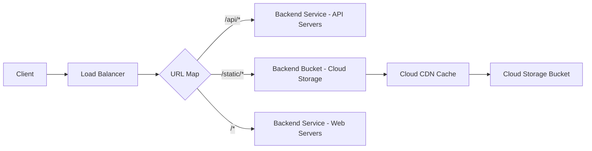

# How to Configure Backend Buckets with Cloud Storage Behind a GCP Load Balancer

Author: [nawazdhandala](https://www.github.com/nawazdhandala)

Tags: GCP, Cloud Storage, Backend Bucket, Load Balancer, CDN

Description: Learn how to serve static content from Google Cloud Storage through a GCP HTTP(S) load balancer using backend buckets for fast, scalable content delivery.

---

Serving static assets like images, CSS, JavaScript, and HTML files directly from Cloud Storage through a load balancer is one of the most cost-effective and performant setups in GCP. Instead of spinning up compute instances to serve files that never change, you put them in a Cloud Storage bucket and create a backend bucket that the load balancer can route to. Pair it with Cloud CDN and you get a globally distributed static content delivery system for pennies.

This post walks through the complete setup, from creating the bucket to configuring the URL map for mixed static and dynamic content.

## What Is a Backend Bucket?

In GCP load balancer terminology, a backend bucket is a pointer to a Cloud Storage bucket that can be used as a backend for an HTTP(S) load balancer. While a backend service routes traffic to compute instances, a backend bucket routes traffic to Cloud Storage.

Backend buckets support:
- Serving objects from Cloud Storage through the load balancer
- Cloud CDN caching for faster content delivery
- Custom response headers
- Compression

They do not support:
- Dynamic content or server-side processing
- Health checks (Cloud Storage is inherently highly available)
- Session affinity

## Step 1: Create a Cloud Storage Bucket

First, create a bucket and make its objects publicly accessible:

```bash
# Create a Cloud Storage bucket for static content
gcloud storage buckets create gs://my-static-assets-bucket \
    --location=US \
    --uniform-bucket-level-access
```

Make the bucket public so the load balancer can serve objects:

```bash
# Grant public read access to all objects in the bucket
gcloud storage buckets add-iam-policy-binding gs://my-static-assets-bucket \
    --member=allUsers \
    --role=roles/storage.objectViewer
```

Upload some test content:

```bash
# Upload a sample HTML file to the bucket
echo '<html><body><h1>Hello from Cloud Storage</h1></body></html>' > index.html
gcloud storage cp index.html gs://my-static-assets-bucket/

# Upload a sample CSS file
echo 'body { font-family: sans-serif; }' > style.css
gcloud storage cp style.css gs://my-static-assets-bucket/static/style.css
```

## Step 2: Create the Backend Bucket

Now create the backend bucket resource that links to your Cloud Storage bucket:

```bash
# Create a backend bucket pointing to the Cloud Storage bucket
gcloud compute backend-buckets create static-assets-backend \
    --gcs-bucket-name=my-static-assets-bucket \
    --enable-cdn
```

The `--enable-cdn` flag turns on Cloud CDN caching, which is usually what you want for static content. Without it, every request goes directly to Cloud Storage.

## Step 3: Set Up the URL Map

If you already have a load balancer serving dynamic content, you can add the backend bucket alongside your existing backend services. This is the most common pattern - serve `/static/*` from Cloud Storage and everything else from your application servers.

```bash
# Add a path matcher for static content to an existing URL map
gcloud compute url-maps add-path-matcher my-url-map \
    --path-matcher-name=static-paths \
    --default-service=my-dynamic-backend \
    --backend-bucket-path-rules="/static/*=static-assets-backend" \
    --global
```

If you are creating a new load balancer that only serves static content:

```bash
# Create a URL map that serves everything from the backend bucket
gcloud compute url-maps create static-only-map \
    --default-backend-bucket=static-assets-backend \
    --global
```

## Step 4: Complete the Load Balancer Setup

If you are building a new load balancer, you need the rest of the components:

```bash
# Reserve a global static IP
gcloud compute addresses create static-site-ip \
    --ip-version=IPV4 --global

# Create a managed SSL certificate
gcloud compute ssl-certificates create static-site-cert \
    --domains=static.example.com --global

# Create the HTTPS target proxy
gcloud compute target-https-proxies create static-site-proxy \
    --url-map=static-only-map \
    --ssl-certificates=static-site-cert

# Create the forwarding rule
gcloud compute forwarding-rules create static-site-rule \
    --address=static-site-ip \
    --global \
    --target-https-proxy=static-site-proxy \
    --ports=443
```

## Serving a Single Page Application

For single page applications (React, Vue, Angular), you want all routes to serve `index.html` from the bucket. This requires a custom URL map configuration:

```bash
# Import a URL map for SPA hosting with fallback to index.html
gcloud compute url-maps import spa-map \
    --global \
    --source=/dev/stdin <<'EOF'
name: spa-map
defaultService: projects/MY_PROJECT/global/backendBuckets/static-assets-backend
hostRules:
- hosts:
  - '*'
  pathMatcher: spa-routes
pathMatchers:
- name: spa-routes
  defaultUrlRedirect:
    pathRedirect: /index.html
    redirectResponseCode: FOUND
    stripQuery: false
  routeRules:
  - priority: 1
    matchRules:
    - prefixMatch: /static/
    service: projects/MY_PROJECT/global/backendBuckets/static-assets-backend
  - priority: 2
    matchRules:
    - regexMatch: .*\.(js|css|png|jpg|gif|svg|ico|woff|woff2|ttf)$
    service: projects/MY_PROJECT/global/backendBuckets/static-assets-backend
EOF
```

## Configuring Cloud CDN Settings

Fine-tune CDN caching for your backend bucket:

```bash
# Update CDN settings for the backend bucket
gcloud compute backend-buckets update static-assets-backend \
    --enable-cdn \
    --cache-mode=CACHE_ALL_STATIC \
    --default-ttl=3600 \
    --max-ttl=86400 \
    --client-ttl=3600
```

Cache mode options:
- `USE_ORIGIN_HEADERS` - Respect Cache-Control headers set on the Cloud Storage objects
- `FORCE_CACHE_ALL` - Cache everything regardless of headers
- `CACHE_ALL_STATIC` - Cache common static file types automatically

## Setting Cache-Control on Storage Objects

You can control caching at the object level by setting metadata on your Cloud Storage objects:

```bash
# Set a 1-hour cache on an individual object
gcloud storage objects update gs://my-static-assets-bucket/style.css \
    --cache-control="public, max-age=3600"

# Set a long cache on versioned assets (e.g., app.abc123.js)
gcloud storage objects update gs://my-static-assets-bucket/static/app.abc123.js \
    --cache-control="public, max-age=31536000, immutable"

# Set no-cache on index.html (so users always get the latest version)
gcloud storage objects update gs://my-static-assets-bucket/index.html \
    --cache-control="no-cache, no-store, must-revalidate"
```

## Custom Response Headers

You can add custom headers to responses served through the backend bucket:

```bash
# Add custom response headers for security and CORS
gcloud compute backend-buckets update static-assets-backend \
    --custom-response-headers="X-Frame-Options: DENY" \
    --custom-response-headers="X-Content-Type-Options: nosniff" \
    --custom-response-headers="Access-Control-Allow-Origin: https://app.example.com"
```

## Enabling Compression

The load balancer can automatically compress responses:

```bash
# Enable compression on the backend bucket
gcloud compute backend-buckets update static-assets-backend \
    --compression-mode=AUTOMATIC
```

With automatic compression, the load balancer compresses responses for clients that send an `Accept-Encoding: gzip` header. This works even if the original objects in Cloud Storage are not compressed.

## Mixed Architecture: Dynamic and Static

Here is a common architecture combining backend services for dynamic content with a backend bucket for static assets:



## Cost Comparison

Serving static content through a backend bucket is significantly cheaper than serving it from compute instances:

- **Cloud Storage**: ~$0.026/GB stored, $0.12/GB egress (first 1 TB)
- **Cloud CDN**: ~$0.08/GB served from cache (varies by region)
- **Compute Engine**: Instance costs + egress + operational overhead

For a site serving 100 GB of static content per month, the backend bucket approach costs a few dollars. The equivalent compute setup could easily be 10-20x more expensive.

## Wrapping Up

Backend buckets are one of the simplest yet most effective optimizations you can make in GCP. They let you serve static content at Cloud Storage prices with CDN-level performance, all through the same load balancer that handles your dynamic content. The setup takes about 10 minutes, and the cost savings and performance improvements are immediate.
