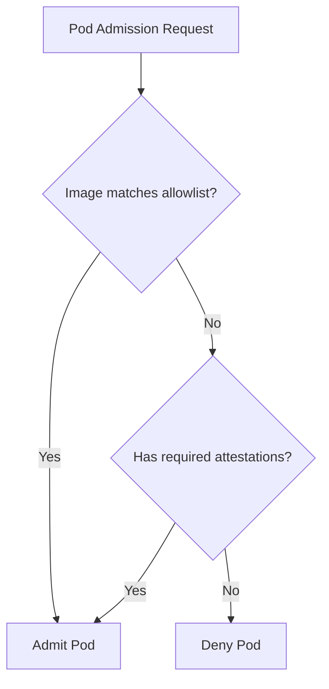

# How to Configure Binary Authorization Allowlist Patterns for Trusted Registries

Author: [nawazdhandala](https://www.github.com/nawazdhandala)

Tags: GCP, Binary Authorization, Container Registry, Allowlist, Container Security

Description: Learn how to configure Binary Authorization allowlist patterns to permit images from trusted registries while blocking everything else on your GKE clusters.

---

When you enable Binary Authorization on GKE with attestation requirements, you quickly realize that not every image can go through your attestation pipeline. System images, sidecar proxies, and third-party tools from trusted vendors all need to be admitted without attestations. That is where allowlist patterns come in.

Allowlist patterns (sometimes called admission whitelist patterns) tell Binary Authorization to skip attestation checks for images matching specific registry patterns. They are your escape hatch for trusted sources that do not participate in your signing pipeline.

The trick is configuring them correctly - broad enough to cover what you need, but tight enough to not create security gaps.

## How Allowlist Patterns Work

When GKE tries to admit a pod, Binary Authorization checks the image against the allowlist patterns first. If the image matches any pattern, it is admitted without checking attestations. If it does not match, the normal attestation check applies.



## Default Allowlist Patterns

When you first set up Binary Authorization, the default policy includes patterns for GKE system images:

```yaml
admissionWhitelistPatterns:
  - namePattern: gcr.io/google_containers/*
  - namePattern: gcr.io/google-containers/*
  - namePattern: k8s.gcr.io/**
  - namePattern: gke.gcr.io/**
  - namePattern: gcr.io/stackdriver-agents/*
```

These are essential. Without them, GKE system components like kube-proxy, metrics-server, and the Istio sidecar would be blocked.

## Step 1: View Your Current Policy

```bash
# Export the current Binary Authorization policy
gcloud container binauthz policy export --project=my-project-id
```

## Step 2: Understanding Pattern Syntax

Allowlist patterns support two wildcard types:

- `*` matches a single path segment (everything between slashes)
- `**` matches zero or more path segments

Examples:

| Pattern | Matches | Does Not Match |
|---|---|---|
| `gcr.io/my-project/*` | `gcr.io/my-project/app` | `gcr.io/my-project/team/app` |
| `gcr.io/my-project/**` | `gcr.io/my-project/app` and `gcr.io/my-project/team/app` | `gcr.io/other-project/app` |
| `us-docker.pkg.dev/my-project/my-repo/*` | `us-docker.pkg.dev/my-project/my-repo/app` | `us-docker.pkg.dev/my-project/other-repo/app` |

The `**` pattern is more permissive and should be used carefully.

## Step 3: Add Your Organization's Registries

Add patterns for your own container registries where images go through your CI/CD pipeline.

```yaml
# policy.yaml
admissionWhitelistPatterns:
  # GKE system images (keep these)
  - namePattern: gcr.io/google_containers/*
  - namePattern: gcr.io/google-containers/*
  - namePattern: k8s.gcr.io/**
  - namePattern: gke.gcr.io/**
  - namePattern: gcr.io/stackdriver-agents/*

  # Your organization's Container Registry
  - namePattern: gcr.io/my-project-id/*

  # Your Artifact Registry repositories
  - namePattern: us-central1-docker.pkg.dev/my-project-id/production-images/*
  - namePattern: us-central1-docker.pkg.dev/my-project-id/base-images/*

defaultAdmissionRule:
  enforcementMode: ENFORCED_BLOCK_AND_AUDIT_LOG
  evaluationMode: REQUIRE_ATTESTATION
  requireAttestationsBy:
    - projects/my-project-id/attestors/build-attestor
globalPolicyEvaluationMode: ENABLE
```

```bash
# Apply the updated policy
gcloud container binauthz policy import policy.yaml --project=my-project-id
```

## Step 4: Add Trusted Third-Party Registries

If you use images from trusted third-party vendors, add their registries.

```yaml
admissionWhitelistPatterns:
  # GKE system images
  - namePattern: gcr.io/google_containers/*
  - namePattern: gcr.io/google-containers/*
  - namePattern: k8s.gcr.io/**
  - namePattern: gke.gcr.io/**
  - namePattern: gcr.io/stackdriver-agents/*

  # Your registries
  - namePattern: gcr.io/my-project-id/*

  # Datadog agent images
  - namePattern: gcr.io/datadoghq/*

  # Istio images
  - namePattern: gcr.io/istio-release/*

  # Cert-manager
  - namePattern: quay.io/jetstack/cert-manager-*

  # NGINX Ingress Controller from GCR mirror
  - namePattern: registry.k8s.io/ingress-nginx/*
```

Be selective here. Every pattern you add is a potential bypass of your attestation requirements.

## Step 5: Use Per-Cluster Rules for Different Environments

Different clusters may need different allowlist patterns. Use cluster-specific admission rules.

```yaml
admissionWhitelistPatterns:
  - namePattern: gcr.io/google_containers/*
  - namePattern: k8s.gcr.io/**
  - namePattern: gke.gcr.io/**

# Default rule for all clusters
defaultAdmissionRule:
  enforcementMode: ENFORCED_BLOCK_AND_AUDIT_LOG
  evaluationMode: REQUIRE_ATTESTATION
  requireAttestationsBy:
    - projects/my-project-id/attestors/build-attestor

# Dev cluster - more permissive
clusterAdmissionRules:
  us-central1-a.dev-cluster:
    evaluationMode: ALWAYS_ALLOW
    enforcementMode: DRYRUN_AUDIT_LOG_ONLY

  # Staging cluster - require build attestation only
  us-central1-b.staging-cluster:
    evaluationMode: REQUIRE_ATTESTATION
    enforcementMode: ENFORCED_BLOCK_AND_AUDIT_LOG
    requireAttestationsBy:
      - projects/my-project-id/attestors/build-attestor

  # Production cluster - require both build and security attestations
  us-central1-c.prod-cluster:
    evaluationMode: REQUIRE_ATTESTATION
    enforcementMode: ENFORCED_BLOCK_AND_AUDIT_LOG
    requireAttestationsBy:
      - projects/my-project-id/attestors/build-attestor
      - projects/my-project-id/attestors/security-attestor

globalPolicyEvaluationMode: ENABLE
```

## Step 6: Audit Allowlist Usage

Track which allowlisted images are being deployed.

```bash
# Check audit logs for images admitted via allowlist
gcloud logging read \
  'resource.type="k8s_cluster" AND protoPayload.serviceName="binaryauthorization.googleapis.com"' \
  --limit=20 \
  --format="table(timestamp, protoPayload.response.allowed, protoPayload.request.image)" \
  --project=my-project-id
```

## Step 7: Tighten Patterns Over Time

Start with broader patterns and tighten them as you understand what your clusters actually need.

Here is a script to discover what images are currently running in your cluster:

```bash
# List all unique image prefixes running in the cluster
kubectl get pods --all-namespaces \
  -o jsonpath='{range .items[*]}{range .spec.containers[*]}{.image}{"\n"}{end}{end}' | \
  sort -u
```

Use this output to create precise allowlist patterns rather than overly broad ones.

## Common Mistakes to Avoid

1. **Using `docker.io/**` as an allowlist pattern**: This allows any image from Docker Hub, defeating the purpose of Binary Authorization entirely.

2. **Forgetting GKE system image patterns**: If you remove the default GKE patterns, system components will be blocked and your cluster will malfunction.

3. **Using `*` when you mean `**`**: `gcr.io/my-org/*` only matches one-level paths. If your images are at `gcr.io/my-org/team/app`, you need `gcr.io/my-org/**`.

4. **Not updating patterns when migrating registries**: If you move from Container Registry to Artifact Registry, update your allowlist patterns accordingly.

5. **Allowlisting too broadly during troubleshooting**: When something is blocked, it is tempting to add a broad pattern. Take the time to add a precise one instead.

## Verifying Your Configuration

After updating the policy, test it.

```bash
# This should succeed (matches allowlist)
kubectl run test-allowed \
  --image=gcr.io/my-project-id/my-app:latest \
  --restart=Never

# This should be blocked (not in allowlist, no attestation)
kubectl run test-blocked \
  --image=docker.io/library/nginx:latest \
  --restart=Never

# Clean up test pods
kubectl delete pod test-allowed test-blocked --ignore-not-found
```

## Conclusion

Allowlist patterns are a necessary part of any Binary Authorization setup, but they require careful management. Every pattern is an exception to your attestation requirements, so keep them as narrow as possible. Start with the GKE system patterns, add your own registries, and only add third-party patterns when you have a clear need. Review your allowlist periodically and remove patterns you no longer need. The goal is to have every image either attested by your pipeline or coming from a registry you explicitly trust.
