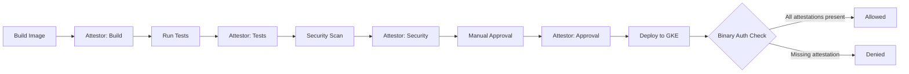

# How to Configure Binary Authorization Attestation Policies for Multi-Stage CI/CD Pipelines on GCP

Author: [nawazdhandala](https://www.github.com/nawazdhandala)

Tags: GCP, Binary Authorization, CI/CD, Container Security, Supply Chain Security

Description: Configure Binary Authorization with multi-stage attestation policies for GCP CI/CD pipelines, requiring images to pass build, test, and security scan stages before deployment.

---

Binary Authorization on GCP lets you enforce that only trusted container images get deployed to your GKE clusters. The basic setup is straightforward - require images to be signed before deployment. But real-world CI/CD pipelines have multiple stages: build, unit tests, integration tests, security scanning, and maybe a manual approval step. Each stage should attest that the image passed, and only images with all required attestations should make it to production.

This guide walks through setting up a multi-stage attestation policy that mirrors a typical enterprise CI/CD pipeline.

## How Binary Authorization Works

The core concept: an attestor signs a container image after verifying some condition was met. A Binary Authorization policy specifies which attestors are required. When a deployment happens on GKE, Binary Authorization checks whether the image has all required attestations before allowing it to run.



## Creating Attestors

You need a separate attestor for each stage of your pipeline. Each attestor has its own cryptographic key pair:

```bash
# Create KMS keyring for attestation keys
gcloud kms keyrings create binauthz-keys \
    --location=global

# Create keys for each pipeline stage
for STAGE in build test security-scan approval; do
    gcloud kms keys create "${STAGE}-attestor-key" \
        --keyring=binauthz-keys \
        --location=global \
        --purpose=asymmetric-signing \
        --default-algorithm=ec-sign-p256-sha256
done
```

Now create the attestors and attach the keys:

```bash
# Create the Container Analysis notes (required for attestors)
for STAGE in build test security-scan approval; do
    # Create a note in Container Analysis
    curl -X POST \
        "https://containeranalysis.googleapis.com/v1/projects/YOUR_PROJECT/notes?noteId=${STAGE}-attestor-note" \
        -H "Authorization: Bearer $(gcloud auth print-access-token)" \
        -H "Content-Type: application/json" \
        -d "{
            \"attestation\": {
                \"hint\": {
                    \"humanReadableName\": \"${STAGE} stage attestor\"
                }
            }
        }"

    # Create the attestor
    gcloud container binauthz attestors create "${STAGE}-attestor" \
        --attestation-authority-note="${STAGE}-attestor-note" \
        --attestation-authority-note-project=YOUR_PROJECT

    # Add the KMS key to the attestor
    gcloud container binauthz attestors public-keys add \
        --attestor="${STAGE}-attestor" \
        --keyversion-project=YOUR_PROJECT \
        --keyversion-location=global \
        --keyversion-keyring=binauthz-keys \
        --keyversion-key="${STAGE}-attestor-key" \
        --keyversion=1
done
```

## Configuring the Binary Authorization Policy

The policy requires all four attestations for production. Staging only needs build and test attestations:

```yaml
# binauthz-policy.yaml
admissionWhitelistPatterns:
  # Allow GKE system images
  - namePattern: "gcr.io/google_containers/*"
  - namePattern: "gcr.io/gke-release/*"
  - namePattern: "gcr.io/stackdriver-agents/*"

defaultAdmissionRule:
  # Default: deny everything that isn't explicitly allowed
  evaluationMode: ALWAYS_DENY
  enforcementMode: ENFORCED_BLOCK_AND_AUDIT_LOG

clusterAdmissionRules:
  # Production cluster requires all four attestations
  us-central1-a.production-cluster:
    evaluationMode: REQUIRE_ATTESTATION
    enforcementMode: ENFORCED_BLOCK_AND_AUDIT_LOG
    requireAttestationsBy:
      - projects/YOUR_PROJECT/attestors/build-attestor
      - projects/YOUR_PROJECT/attestors/test-attestor
      - projects/YOUR_PROJECT/attestors/security-scan-attestor
      - projects/YOUR_PROJECT/attestors/approval-attestor

  # Staging only needs build and test attestations
  us-central1-a.staging-cluster:
    evaluationMode: REQUIRE_ATTESTATION
    enforcementMode: ENFORCED_BLOCK_AND_AUDIT_LOG
    requireAttestationsBy:
      - projects/YOUR_PROJECT/attestors/build-attestor
      - projects/YOUR_PROJECT/attestors/test-attestor
```

Apply the policy:

```bash
gcloud container binauthz policy import binauthz-policy.yaml
```

## Integrating Attestation into Cloud Build

Here's a Cloud Build configuration that creates attestations at each stage:

```yaml
# cloudbuild.yaml - Multi-stage pipeline with attestations
steps:
  # Stage 1: Build the container image
  - name: 'gcr.io/cloud-builders/docker'
    args: ['build', '-t', '${_IMAGE}:${SHORT_SHA}', '.']
    id: 'build'

  # Stage 1b: Push the image to Artifact Registry
  - name: 'gcr.io/cloud-builders/docker'
    args: ['push', '${_IMAGE}:${SHORT_SHA}']
    id: 'push'
    waitFor: ['build']

  # Stage 1c: Create build attestation
  - name: 'gcr.io/cloud-builders/gcloud'
    entrypoint: 'bash'
    args:
      - '-c'
      - |
        # Get the image digest for attestation
        DIGEST=$(gcloud artifacts docker images describe \
          ${_IMAGE}:${SHORT_SHA} \
          --format='value(image_summary.digest)')

        # Create the build attestation
        gcloud container binauthz attestations sign-and-create \
          --artifact-url="${_IMAGE}@${DIGEST}" \
          --attestor="build-attestor" \
          --attestor-project="YOUR_PROJECT" \
          --keyversion-project="YOUR_PROJECT" \
          --keyversion-location="global" \
          --keyversion-keyring="binauthz-keys" \
          --keyversion-key="build-attestor-key" \
          --keyversion="1"
    id: 'attest-build'
    waitFor: ['push']

  # Stage 2: Run unit and integration tests
  - name: '${_IMAGE}:${SHORT_SHA}'
    entrypoint: 'sh'
    args: ['-c', 'npm test && npm run test:integration']
    id: 'test'
    waitFor: ['push']

  # Stage 2b: Create test attestation on success
  - name: 'gcr.io/cloud-builders/gcloud'
    entrypoint: 'bash'
    args:
      - '-c'
      - |
        DIGEST=$(gcloud artifacts docker images describe \
          ${_IMAGE}:${SHORT_SHA} \
          --format='value(image_summary.digest)')

        gcloud container binauthz attestations sign-and-create \
          --artifact-url="${_IMAGE}@${DIGEST}" \
          --attestor="test-attestor" \
          --attestor-project="YOUR_PROJECT" \
          --keyversion-project="YOUR_PROJECT" \
          --keyversion-location="global" \
          --keyversion-keyring="binauthz-keys" \
          --keyversion-key="test-attestor-key" \
          --keyversion="1"
    id: 'attest-test'
    waitFor: ['test']

  # Stage 3: Run vulnerability scanning
  - name: 'gcr.io/cloud-builders/gcloud'
    entrypoint: 'bash'
    args:
      - '-c'
      - |
        # Wait for on-push scanning to complete
        DIGEST=$(gcloud artifacts docker images describe \
          ${_IMAGE}:${SHORT_SHA} \
          --format='value(image_summary.digest)')

        # Check vulnerability scan results
        CRITICAL=$(gcloud artifacts docker images list-vulnerabilities \
          "${_IMAGE}@${DIGEST}" \
          --format='value(vulnerability.effectiveSeverity)' \
          | grep -c CRITICAL || true)

        if [ "$CRITICAL" -gt 0 ]; then
          echo "Found $CRITICAL critical vulnerabilities. Failing pipeline."
          exit 1
        fi

        # No critical vulns found - create security attestation
        gcloud container binauthz attestations sign-and-create \
          --artifact-url="${_IMAGE}@${DIGEST}" \
          --attestor="security-scan-attestor" \
          --attestor-project="YOUR_PROJECT" \
          --keyversion-project="YOUR_PROJECT" \
          --keyversion-location="global" \
          --keyversion-keyring="binauthz-keys" \
          --keyversion-key="security-scan-attestor-key" \
          --keyversion="1"
    id: 'attest-security'
    waitFor: ['push']

substitutions:
  _IMAGE: 'us-central1-docker.pkg.dev/YOUR_PROJECT/repo/app'
```

## Manual Approval Attestation

For the final approval gate, use a Cloud Function triggered by a human action (like a Slack button or a custom UI):

```python
from google.cloud import binaryauthorization_v1
from google.cloud import kms_v1

def create_approval_attestation(request):
    """Create an approval attestation when a human approves deployment"""
    data = request.get_json()
    image_url = data["image_url"]
    approver = data["approver_email"]

    # Verify the approver is authorized
    authorized_approvers = [
        "lead@company.com",
        "security@company.com",
    ]
    if approver not in authorized_approvers:
        return {"error": "Unauthorized approver"}, 403

    # Create the attestation
    client = binaryauthorization_v1.BinauthzManagementServiceV1Client()

    attestation = client.create_attestation(
        parent="projects/YOUR_PROJECT/attestors/approval-attestor",
        attestation={
            "resource_uri": image_url,
            "signatures": [_sign_payload(image_url)],
        },
    )

    return {
        "status": "approved",
        "attestation": attestation.name,
        "approver": approver,
    }
```

## Verifying Attestations Before Deployment

Add a pre-deployment check in your CD pipeline:

```bash
# Verify all required attestations exist before deploying
IMAGE_DIGEST="us-central1-docker.pkg.dev/YOUR_PROJECT/repo/app@sha256:abc123"

for ATTESTOR in build test security-scan approval; do
    echo "Checking ${ATTESTOR} attestation..."
    gcloud container binauthz attestations list \
        --attestor="${ATTESTOR}-attestor" \
        --artifact-url="${IMAGE_DIGEST}" \
        --format="value(name)" | grep -q . || {
            echo "Missing ${ATTESTOR} attestation for ${IMAGE_DIGEST}"
            exit 1
        }
    echo "  Found."
done

echo "All attestations verified. Proceeding with deployment."
kubectl set image deployment/app app="${IMAGE_DIGEST}"
```

## Wrapping Up

Multi-stage attestation policies bring real security to your deployment pipeline. Each stage - build, test, security scan, and approval - independently verifies that the image meets a specific quality bar, and Binary Authorization ensures no image reaches production without all the checkmarks. The setup takes some upfront effort, but once it's in place, you have a cryptographically verifiable chain of trust from source code to production. Start with two stages (build and test), get comfortable with the workflow, then add security scanning and manual approval as your team matures.
