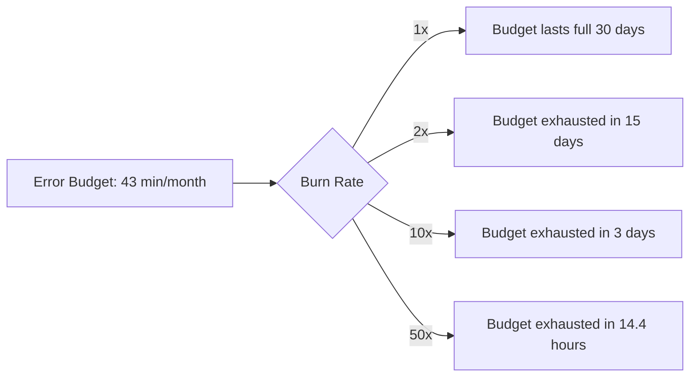
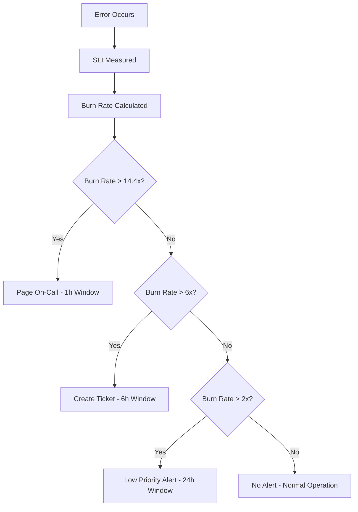

# How to Configure Burn Rate Alerts for SLO-Based Incident Detection on GCP

Author: [nawazdhandala](https://www.github.com/nawazdhandala)

Tags: GCP, SLO, Burn Rate, Alerting, SRE, Cloud Monitoring, Google Cloud

Description: Learn how to configure burn rate alerts for SLO-based incident detection on Google Cloud Platform to catch reliability issues at the right speed.

---

Traditional threshold-based alerts are blunt instruments. They fire when a metric crosses a line, regardless of whether the situation is a brief blip or a sustained problem. SLO-based burn rate alerts are smarter. They fire based on how fast you are consuming your error budget, which directly correlates with the severity and urgency of the problem. On Google Cloud Monitoring, you can set up burn rate alerts that automatically scale their urgency to match the situation. Let me show you how.

## What Is a Burn Rate?

Your error budget is the amount of unreliability your SLO allows. If your SLO is 99.9% over 30 days, your error budget is 0.1% of total requests - roughly 43 minutes of downtime. The burn rate is how fast you are using that budget.

A burn rate of 1x means you are consuming the budget at exactly the expected rate - you will use it all up by the end of the SLO window. A burn rate of 10x means you are consuming the budget 10 times faster than expected. At that rate, you would exhaust your entire 30-day error budget in 3 days.



## Why Burn Rate Instead of Simple Thresholds?

Consider this scenario. Your error rate spikes to 5% for 2 minutes, then returns to normal. A simple "error rate > 1%" alert would fire and page someone, even though the total impact was tiny - maybe 0.001% of your monthly error budget. A burn rate alert would recognize that the budget impact is negligible and stay quiet.

Conversely, a slow but persistent degradation - say a 0.2% error rate that lasts for days - might not trigger a simple threshold alert but would steadily drain your error budget. A burn rate alert catches this.

## Step 1: Create an SLO First

Burn rate alerts are built on top of SLOs. If you do not have one yet, create it.

```bash
# Create a 99.9% availability SLO with a 30-day rolling window
gcloud monitoring slos create \
    --service=my-api-service \
    --display-name="API Availability - 99.9%" \
    --request-based-sli \
    --good-total-ratio-threshold \
    --good-service-filter='metric.type="loadbalancing.googleapis.com/https/request_count" AND metric.labels.response_code_class="200"' \
    --total-service-filter='metric.type="loadbalancing.googleapis.com/https/request_count"' \
    --goal=0.999 \
    --rolling-period=30d \
    --project=my-gcp-project
```

## Step 2: Create a Burn Rate Alert Policy

Google Cloud Monitoring supports burn rate conditions natively. Here is how to create one using the API.

```bash
# Create a burn rate alert that fires when consuming budget 10x faster than normal
curl -X POST \
  "https://monitoring.googleapis.com/v3/projects/my-gcp-project/alertPolicies" \
  -H "Authorization: Bearer $(gcloud auth print-access-token)" \
  -H "Content-Type: application/json" \
  -d '{
    "displayName": "SLO Burn Rate Alert - High Severity",
    "conditions": [{
      "displayName": "Burn rate exceeds 10x",
      "conditionThreshold": {
        "filter": "select_slo_burn_rate(\"projects/my-gcp-project/services/my-api-service/serviceLevelObjectives/REPLACE_WITH_SLO_ID\", \"3600s\")",
        "comparison": "COMPARISON_GT",
        "thresholdValue": 10,
        "duration": "0s",
        "trigger": {
          "count": 1
        }
      }
    }],
    "combiner": "OR",
    "notificationChannels": [
      "projects/my-gcp-project/notificationChannels/REPLACE_WITH_CHANNEL_ID"
    ],
    "alertStrategy": {
      "autoClose": "604800s"
    }
  }'
```

The key part is the `select_slo_burn_rate` function. The second parameter (`3600s`) is the lookback window - it calculates the burn rate over the last hour.

## Step 3: Configure Multiple Burn Rate Thresholds

A single burn rate alert is good, but multiple thresholds at different speeds give you better signal. Here is the pattern recommended by Google's SRE book.

```bash
# Fast burn - catches severe incidents quickly
# Lookback: 1 hour, Threshold: 14.4x (would consume budget in ~2 days)
cat > fast-burn-alert.json << 'EOF'
{
  "displayName": "SLO Fast Burn Alert - Page Immediately",
  "conditions": [{
    "displayName": "Fast burn rate (1h window)",
    "conditionThreshold": {
      "filter": "select_slo_burn_rate(\"projects/my-gcp-project/services/my-api-service/serviceLevelObjectives/SLO_ID\", \"3600s\")",
      "comparison": "COMPARISON_GT",
      "thresholdValue": 14.4,
      "duration": "0s",
      "trigger": { "count": 1 }
    }
  }],
  "combiner": "OR",
  "notificationChannels": ["projects/my-gcp-project/notificationChannels/PAGER_CHANNEL"],
  "documentation": {
    "content": "The error budget is being consumed 14.4x faster than expected. At this rate, the entire monthly budget will be exhausted in about 2 days. This requires immediate investigation.",
    "mimeType": "text/markdown"
  }
}
EOF

gcloud monitoring policies create --policy-from-file=fast-burn-alert.json

# Slow burn - catches gradual degradation
# Lookback: 6 hours, Threshold: 6x (would consume budget in ~5 days)
cat > slow-burn-alert.json << 'EOF'
{
  "displayName": "SLO Slow Burn Alert - Ticket",
  "conditions": [{
    "displayName": "Slow burn rate (6h window)",
    "conditionThreshold": {
      "filter": "select_slo_burn_rate(\"projects/my-gcp-project/services/my-api-service/serviceLevelObjectives/SLO_ID\", \"21600s\")",
      "comparison": "COMPARISON_GT",
      "thresholdValue": 6,
      "duration": "0s",
      "trigger": { "count": 1 }
    }
  }],
  "combiner": "OR",
  "notificationChannels": ["projects/my-gcp-project/notificationChannels/TICKET_CHANNEL"],
  "documentation": {
    "content": "The error budget has been consumed at an elevated rate over the last 6 hours. This is not urgent but should be investigated within the day."
  }
}
EOF

gcloud monitoring policies create --policy-from-file=slow-burn-alert.json
```

## Step 4: Configure Using Terraform

Here is the Terraform equivalent for managing burn rate alerts as code.

```hcl
# Fast burn rate alert - pages on-call
resource "google_monitoring_alert_policy" "fast_burn" {
  display_name = "SLO Fast Burn - Page"
  project      = var.project_id
  combiner     = "OR"

  conditions {
    display_name = "Fast burn rate (1h lookback)"
    condition_threshold {
      filter = "select_slo_burn_rate(\"${google_monitoring_slo.availability.id}\", \"3600s\")"
      comparison      = "COMPARISON_GT"
      threshold_value = 14.4
      duration        = "0s"

      trigger {
        count = 1
      }
    }
  }

  notification_channels = [var.pager_channel_id]

  documentation {
    content   = "Error budget burn rate is critically high. Investigate immediately."
    mime_type = "text/markdown"
  }
}

# Slow burn rate alert - creates ticket
resource "google_monitoring_alert_policy" "slow_burn" {
  display_name = "SLO Slow Burn - Ticket"
  project      = var.project_id
  combiner     = "OR"

  conditions {
    display_name = "Slow burn rate (6h lookback)"
    condition_threshold {
      filter = "select_slo_burn_rate(\"${google_monitoring_slo.availability.id}\", \"21600s\")"
      comparison      = "COMPARISON_GT"
      threshold_value = 6
      duration        = "0s"

      trigger {
        count = 1
      }
    }
  }

  notification_channels = [var.ticket_channel_id]

  documentation {
    content   = "Error budget is being consumed at an elevated rate. Investigate today."
    mime_type = "text/markdown"
  }
}
```

## Understanding Burn Rate Math

Here is how burn rate thresholds translate to budget consumption.

For a 99.9% SLO over 30 days with a total error budget of 43.2 minutes.

| Burn Rate | Budget Exhaustion Time | Detection Window | Response |
|-----------|----------------------|------------------|----------|
| 1x | 30 days | - | Normal |
| 2x | 15 days | 24 hours | Low priority ticket |
| 6x | 5 days | 6 hours | Medium priority ticket |
| 14.4x | 2 days | 1 hour | Page on-call |
| 50x | 14.4 hours | 5 minutes | Critical page |

The detection window should be inversely proportional to the burn rate. High burn rates need fast detection; low burn rates can afford longer lookback windows that reduce false positives.

## Burn Rate Alert Flow

Here is the incident detection flow.



## Testing Your Burn Rate Alerts

Before relying on burn rate alerts in production, you should test them. One approach is to intentionally inject errors and verify the alert fires.

```bash
# Generate synthetic errors to test the alert
# This sends 100 requests, 50% of which should fail
for i in $(seq 1 100); do
  curl -s -o /dev/null -w "%{http_code}\n" https://my-service.example.com/test-endpoint
done
```

Then check if the burn rate alert fired.

```bash
# List recent incidents
gcloud monitoring policies list \
    --project=my-gcp-project \
    --filter='displayName:"SLO"'
```

## Common Mistakes

The most common mistake is setting the burn rate threshold too low. A threshold of 1.5x will fire constantly because normal traffic patterns include minor fluctuations. Start with higher thresholds (10x or 14.4x) and tune down only if you find you are missing real incidents.

Another mistake is using too short a lookback window without a corresponding high threshold. A 5-minute lookback with a 2x threshold will generate a lot of noise from brief spikes that have no meaningful impact on your error budget.

## Wrapping Up

Burn rate alerts transform SLOs from passive dashboards into active incident detection systems. They automatically scale their urgency to match the severity of the problem - a total outage triggers immediate pages, while a slow degradation creates tickets for the next business day. The key is picking the right combination of lookback windows and thresholds for your organization's response capabilities. Start with a two-tier setup (fast burn for pages, slow burn for tickets) and add more tiers as you refine your approach.
