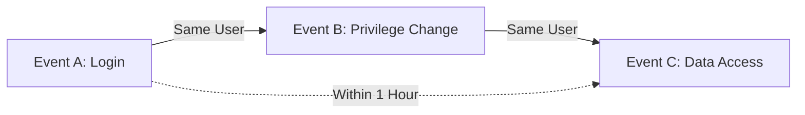

# How to Configure Chronicle Alert Rules with Multi-Event Correlation

Author: [nawazdhandala](https://www.github.com/nawazdhandala)

Tags: GCP, Chronicle SIEM, Alert Rules, Event Correlation, Threat Detection

Description: Learn how to configure multi-event correlation alert rules in Google Chronicle to detect complex attack patterns that span multiple log sources and time windows.

---

Single-event detection rules catch the easy stuff. An alert that fires when someone logs in from a blocked country or when a known malicious IP connects to your network is straightforward. But real attacks involve sequences of events across multiple systems. An attacker does not just log in - they log in, escalate privileges, move laterally, and exfiltrate data. Catching these patterns requires multi-event correlation, and that is where Chronicle's YARA-L rules really shine.

In this guide, I will walk through building increasingly complex correlation rules that detect attack chains rather than individual events.

## The Basics of Multi-Event Correlation

Multi-event correlation in Chronicle works through three key mechanisms:

1. **Variable binding** - Using placeholder variables to link events by common fields (same user, same IP, same resource)
2. **Time windows** - The `match` section defines how long to look for correlated events
3. **Event ordering** - Timestamp comparisons ensure events happened in the expected sequence



## Rule 1: Credential Stuffing Detection

This rule correlates failed login attempts across multiple accounts from the same IP. It is a classic credential stuffing pattern - the attacker tries stolen credentials against many accounts.

```
rule credential_stuffing_detection {
    meta:
        author = "security-team"
        description = "Detects single IP attempting logins to many distinct accounts"
        severity = "HIGH"
        mitre_attack_tactic = "Credential Access"
        mitre_attack_technique = "T1110.004 - Credential Stuffing"

    events:
        // Match failed login events
        $fail.metadata.event_type = "USER_LOGIN"
        $fail.security_result.action = "BLOCK"
        $fail.principal.ip = $attacker_ip
        $fail.target.user.email_addresses = $target_user

        // Ensure IP is not empty
        $fail.principal.ip != ""

    match:
        // Group by source IP over a 30-minute window
        $attacker_ip over 30m

    outcome:
        // Count distinct targeted accounts
        $targeted_accounts = count_distinct($target_user)
        $total_attempts = count($fail.metadata.id)
        $risk_score = max(85)

    condition:
        // Trigger when the same IP targets 10+ distinct accounts
        $fail and $targeted_accounts > 10
}
```

The key here is `count_distinct($target_user)` in the outcome section. This counts unique target accounts, distinguishing credential stuffing (many accounts) from brute force (one account, many passwords).

## Rule 2: Kill Chain Detection - Recon to Exploitation

This rule detects a two-stage pattern: reconnaissance followed by exploitation. The attacker first scans for services, then exploits what they find.

```
rule recon_followed_by_exploitation {
    meta:
        author = "security-team"
        description = "Detects port scanning followed by exploitation attempt from the same source"
        severity = "CRITICAL"
        mitre_attack_tactic = "Initial Access"

    events:
        // Stage 1: Port scanning - many connection attempts to different ports
        $scan.metadata.event_type = "NETWORK_CONNECTION"
        $scan.security_result.action = "BLOCK"
        $scan.principal.ip = $attacker_ip
        $scan.target.ip = $victim_ip
        $scan.target.port = $scanned_port

        // Stage 2: Successful connection on a specific port
        $exploit.metadata.event_type = "NETWORK_CONNECTION"
        $exploit.security_result.action = "ALLOW"
        $exploit.principal.ip = $attacker_ip
        $exploit.target.ip = $victim_ip

        // Exploitation happens after scanning
        $scan.metadata.event_timestamp.seconds <
            $exploit.metadata.event_timestamp.seconds

    match:
        // Correlate by attacker and victim IPs over 1 hour
        $attacker_ip, $victim_ip over 1h

    outcome:
        $ports_scanned = count_distinct($scanned_port)
        $risk_score = max(90)

    condition:
        // At least 20 ports scanned, followed by a successful connection
        $scan and $exploit and $ports_scanned > 20
}
```

## Rule 3: Insider Threat - Privilege Escalation and Data Access

This rule detects a pattern consistent with insider threats or compromised accounts: a user changes their own permissions and then accesses resources they did not have access to before.

```
rule privilege_escalation_then_data_access {
    meta:
        author = "security-team"
        description = "Detects user modifying their own permissions then accessing sensitive resources"
        severity = "CRITICAL"
        mitre_attack_tactic = "Privilege Escalation"

    events:
        // Event 1: User modifies IAM permissions
        $perm_change.metadata.event_type = "USER_RESOURCE_UPDATE_PERMISSIONS"
        $perm_change.principal.user.email_addresses = $actor
        $perm_change.target.user.email_addresses = $actor

        // Event 2: Same user accesses a sensitive resource
        $access.metadata.event_type = "USER_RESOURCE_ACCESS"
        $access.principal.user.email_addresses = $actor
        $access.target.resource.name = /.*sensitive.*|.*confidential.*|.*restricted.*/

        // Access happens after permission change
        $perm_change.metadata.event_timestamp.seconds <
            $access.metadata.event_timestamp.seconds

    match:
        $actor over 2h

    outcome:
        $accessed_resources = array_distinct($access.target.resource.name)
        $permission_changes = count($perm_change.metadata.id)
        $risk_score = max(95)

    condition:
        $perm_change and $access
}
```

## Rule 4: Account Takeover Chain

This rule detects a complete account takeover sequence: password reset, followed by login from a new device, followed by MFA change.

```
rule account_takeover_chain {
    meta:
        author = "security-team"
        description = "Detects password reset then login from new location then MFA change"
        severity = "CRITICAL"
        mitre_attack_tactic = "Persistence"

    events:
        // Step 1: Password reset event
        $reset.metadata.event_type = "USER_CHANGE_PASSWORD"
        $reset.target.user.email_addresses = $victim

        // Step 2: Login from a different IP than usual
        $login.metadata.event_type = "USER_LOGIN"
        $login.security_result.action = "ALLOW"
        $login.principal.user.email_addresses = $victim
        $login.principal.ip = $login_ip

        // Step 3: MFA configuration change
        $mfa_change.metadata.product_event_type = /.*mfa.*|.*2fa.*|.*two.factor.*/
        $mfa_change.principal.user.email_addresses = $victim

        // Events must happen in order
        $reset.metadata.event_timestamp.seconds <
            $login.metadata.event_timestamp.seconds
        $login.metadata.event_timestamp.seconds <
            $mfa_change.metadata.event_timestamp.seconds

    match:
        $victim over 4h

    outcome:
        $login_ips = array_distinct($login.principal.ip)
        $risk_score = max(95)

    condition:
        $reset and $login and $mfa_change
}
```

## Rule 5: Cross-Cloud Lateral Movement

For multi-cloud environments, this rule detects an attacker moving from AWS to GCP using the same compromised identity.

```
rule cross_cloud_lateral_movement {
    meta:
        author = "security-team"
        description = "Detects suspicious activity in AWS followed by GCP activity from same user"
        severity = "HIGH"
        mitre_attack_tactic = "Lateral Movement"

    events:
        // AWS suspicious activity - service account key creation
        $aws_action.metadata.product_name = "AWS CloudTrail"
        $aws_action.metadata.product_event_type = "CreateAccessKey"
        $aws_action.principal.user.email_addresses = $user

        // GCP activity from the same user - creating resources
        $gcp_action.metadata.product_name = "Google Cloud Platform"
        $gcp_action.metadata.event_type = "USER_RESOURCE_CREATION"
        $gcp_action.principal.user.email_addresses = $user

        // GCP action happens after AWS action
        $aws_action.metadata.event_timestamp.seconds <
            $gcp_action.metadata.event_timestamp.seconds

    match:
        $user over 2h

    outcome:
        $aws_actions = array_distinct($aws_action.metadata.product_event_type)
        $gcp_resources = array_distinct($gcp_action.target.resource.name)
        $risk_score = max(80)

    condition:
        $aws_action and $gcp_action
}
```

## Tuning Correlation Rules

Multi-event rules are more prone to false positives than single-event rules because the correlation window can match unrelated events. Here are tuning strategies.

### Tighten Time Windows

Start with a wider window for detection, then narrow it based on what you see. If your privilege escalation rule fires on normal admin activity that happens hours apart, tighten the window from 2 hours to 30 minutes.

### Add Exclusions

Exclude known-good patterns. For example, your CI/CD service accounts might legitimately create access keys and deploy resources.

```
// Exclude known automation accounts
not $perm_change.principal.user.email_addresses = /.*@.*\.iam\.gserviceaccount\.com$/
not $perm_change.principal.user.email_addresses in %automation_accounts
```

### Use Outcome Thresholds

Instead of triggering on any correlation match, require a minimum volume of events.

```
condition:
    $scan and $exploit and $ports_scanned > 50
```

### Weight by Risk Score

Use outcome risk scores to prioritize alerts. A correlation involving a privileged admin account should score higher than one involving a read-only service account.

## Deploying Multi-Event Rules

1. Write the rule and validate syntax in the Chronicle rule editor
2. Run the rule in test mode against 7-14 days of historical data
3. Review all matches for false positives
4. Adjust thresholds, time windows, and exclusions
5. Enable the rule in alerting mode
6. Monitor for the first week and tune as needed

## Monitoring Rule Performance

After deployment, track these metrics:

- **True positive rate** - How often does the rule fire on actual threats?
- **False positive rate** - How often does it fire on benign activity?
- **Mean time to detection** - How long after the attack pattern starts does the rule fire?
- **Events correlated** - How many events is the rule processing per evaluation?

Rules that process too many events per evaluation can be slow. If a rule is sluggish, add more specific filters to reduce the event volume it needs to process.

Multi-event correlation transforms your detection from reactive (catching individual bad events) to proactive (catching attack patterns). Start with the common patterns in this guide, adapt them to your environment, and gradually build up a library of high-fidelity correlation rules.
