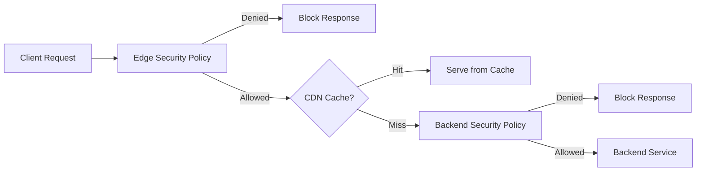

# How to Configure Cloud Armor Edge Security Policies for Cloud CDN in GCP

Author: [nawazdhandala](https://www.github.com/nawazdhandala)

Tags: GCP, Cloud Armor, Cloud CDN, Edge Security, Content Delivery

Description: Learn how to configure Cloud Armor edge security policies that protect your Cloud CDN-served content from abuse, scraping, and unauthorized access at the network edge.

---

If you are serving content through Cloud CDN, there is a gap you might not be aware of. Standard Cloud Armor backend security policies only evaluate requests that miss the CDN cache and reach your backend service. That means cached content is served directly from the edge without any security policy evaluation. Edge security policies fill this gap by letting you apply Cloud Armor rules to all requests, including those served from CDN cache.

This guide covers how to set up edge security policies for Cloud CDN and the specific considerations that come with them.

## How Edge Security Policies Differ from Backend Policies

Let me clarify the two types of Cloud Armor security policies:

**Backend security policies** attach to backend services. They evaluate requests that pass through the load balancer to your backend. Cached CDN responses bypass this entirely.

**Edge security policies** attach to backend services or backend buckets and evaluate requests before the CDN cache is checked. Every request hits the edge policy, whether the response comes from cache or not.

Here is the flow:



## When You Need Edge Security Policies

Edge security policies are useful when:

- You want to geo-restrict cached content (only serve in certain countries)
- You need to block specific IP ranges from accessing any content, cached or not
- You want to prevent scraping of your CDN-served assets
- You need to enforce access controls on static content served from Cloud Storage backend buckets

## Step 1: Create an Edge Security Policy

Edge security policies use a different type parameter when created:

```bash
# Create an edge security policy
gcloud compute security-policies create cdn-edge-policy \
  --type=CLOUD_ARMOR_EDGE \
  --description="Edge security policy for CDN content" \
  --project=your-project-id
```

The `--type=CLOUD_ARMOR_EDGE` flag is what distinguishes this from a regular backend policy.

## Step 2: Add Rules to the Edge Policy

Edge security policies support a subset of the features available in backend policies. You can use IP-based rules and geographic rules, but some advanced features like reCAPTCHA integration and rate limiting are not available at the edge.

Here are some common rules to add:

```bash
# Block traffic from specific countries
gcloud compute security-policies rules create 1000 \
  --security-policy=cdn-edge-policy \
  --expression="origin.region_code == 'XX'" \
  --action=deny-403 \
  --description="Geo-block specific country from CDN content"

# Allow only specific IP ranges (useful for staging CDN)
gcloud compute security-policies rules create 2000 \
  --security-policy=cdn-edge-policy \
  --src-ip-ranges="203.0.113.0/24,198.51.100.0/24" \
  --action=allow \
  --description="Allow access from approved IP ranges"

# Set the default rule to deny all other traffic
gcloud compute security-policies rules update 2147483647 \
  --security-policy=cdn-edge-policy \
  --action=deny-403 \
  --description="Default deny for all non-matching traffic"
```

## Step 3: Attach the Edge Policy to a Backend Service

You can attach the edge security policy to a backend service that has Cloud CDN enabled:

```bash
# Attach edge security policy to a CDN-enabled backend service
gcloud compute backend-services update your-cdn-backend \
  --edge-security-policy=cdn-edge-policy \
  --global \
  --project=your-project-id
```

Note that this is `--edge-security-policy`, not `--security-policy`. The latter is for backend policies. You can actually have both an edge and a backend security policy on the same backend service.

## Step 4: Attach to Backend Buckets

If you are using Cloud Storage backend buckets with Cloud CDN, you can also apply edge policies to those:

```bash
# Attach edge security policy to a backend bucket
gcloud compute backend-buckets update your-cdn-bucket \
  --edge-security-policy=cdn-edge-policy \
  --project=your-project-id
```

This is particularly important for backend buckets because they do not support backend security policies at all. Edge security policies are the only Cloud Armor protection available for backend buckets.

## What Rules Are Supported at the Edge?

Edge security policies have some limitations compared to backend policies. Here is a breakdown:

| Feature | Backend Policy | Edge Policy |
|---------|---------------|-------------|
| IP allowlist/denylist | Yes | Yes |
| Geographic rules | Yes | Yes |
| CEL expressions (basic) | Yes | Yes |
| Rate limiting | Yes | No |
| reCAPTCHA integration | Yes | No |
| Preconfigured WAF rules | Yes | No |
| Adaptive Protection | Yes | No |
| Header-based rules | Yes | Limited |

The key takeaway is that edge policies focus on network-level filtering. If you need application-layer inspection, you will still need a backend security policy as well.

## Combining Edge and Backend Policies

For comprehensive protection, use both policy types together:

```bash
# Backend service with both edge and backend policies
gcloud compute backend-services update your-cdn-backend \
  --edge-security-policy=cdn-edge-policy \
  --security-policy=backend-waf-policy \
  --global \
  --project=your-project-id
```

Here is a practical example of how to structure the two policies:

**Edge policy** (cdn-edge-policy):
- Block traffic from embargoed countries
- Block known bad IP ranges
- Allow everything else

**Backend policy** (backend-waf-policy):
- Apply WAF rules for SQL injection, XSS
- Rate limit API endpoints
- reCAPTCHA bot management

This layered approach means that geographic and IP-based blocks happen at the edge (fast and cheap), while more expensive inspection happens only for cache misses.

## Monitoring Edge Policy Activity

You can monitor edge security policy activity through Cloud Logging:

```bash
# View edge security policy enforcement logs
gcloud logging read \
  'resource.type="http_load_balancer" AND jsonPayload.enforcedEdgeSecurityPolicy.name="cdn-edge-policy"' \
  --project=your-project-id \
  --limit=25 \
  --format=json
```

Notice that edge policy logs use `enforcedEdgeSecurityPolicy` rather than `enforcedSecurityPolicy`. Keep this in mind when building log queries or alerts.

You can set up a monitoring alert to catch spikes in blocked requests:

```bash
# Create an alerting policy for edge security blocks
gcloud alpha monitoring policies create \
  --display-name="CDN Edge Security Blocks Spike" \
  --condition-display-name="High rate of edge policy denials" \
  --condition-filter='resource.type="https_lb_rule" AND metric.type="loadbalancing.googleapis.com/https/edge_security_policy/denied_request_count"' \
  --condition-threshold-value=1000 \
  --condition-threshold-duration=300s \
  --notification-channels=your-channel-id
```

## Practical Example: Geo-Restricted Media CDN

Here is a complete example of setting up edge security for a media streaming backend that should only be accessible in specific countries:

```bash
# Create the edge policy
gcloud compute security-policies create media-geo-policy \
  --type=CLOUD_ARMOR_EDGE \
  --description="Geo-restrict media content"

# Allow traffic from approved countries
gcloud compute security-policies rules create 1000 \
  --security-policy=media-geo-policy \
  --expression="origin.region_code == 'US' || origin.region_code == 'CA' || origin.region_code == 'GB'" \
  --action=allow \
  --description="Allow US, Canada, and UK traffic"

# Deny everything else
gcloud compute security-policies rules update 2147483647 \
  --security-policy=media-geo-policy \
  --action=deny-403

# Attach to the media backend bucket
gcloud compute backend-buckets update media-bucket \
  --edge-security-policy=media-geo-policy
```

## Things to Keep in Mind

A few practical notes from experience:

- Edge policies are evaluated for every request, so keep rules simple and the rule count low to minimize latency impact
- Changes to edge policies can take a few minutes to propagate to all edge locations globally
- If you need to do emergency blocking, add a high-priority rule rather than waiting for policy propagation
- Backend buckets can only have edge policies, not backend policies, so plan your security architecture accordingly
- Testing edge policies in preview mode works the same as backend policies

## Wrapping Up

Edge security policies close an important gap in Cloud CDN security. Without them, cached content is effectively unprotected by Cloud Armor. By combining edge policies for network-level filtering with backend policies for application-level inspection, you get comprehensive protection across your CDN-accelerated infrastructure. For any production deployment using Cloud CDN, setting up an edge security policy should be a standard part of your security configuration.
