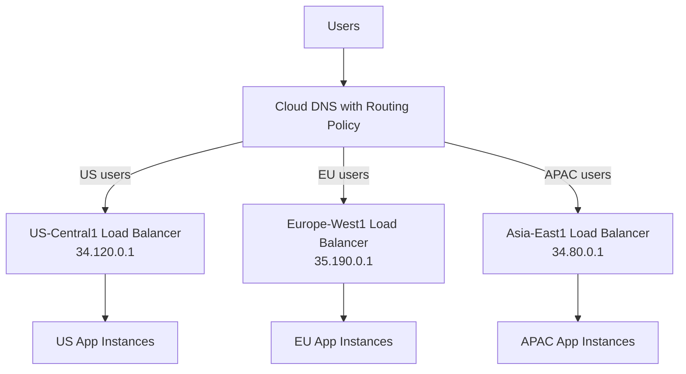

# How to Configure Cloud DNS for Multi-Region Active-Active Application Routing

Author: [nawazdhandala](https://www.github.com/nawazdhandala)

Tags: GCP, Cloud DNS, Multi-Region, Active-Active, Load Balancing, Networking

Description: Learn how to configure Google Cloud DNS routing policies for multi-region active-active application deployments with geolocation and weighted routing.

---

Running an application across multiple GCP regions improves both availability and latency. But getting traffic to the right region requires more than just deploying your app in two places. DNS is often the first layer of traffic routing, and Cloud DNS has built-in routing policies that make multi-region setups straightforward without needing a global load balancer for every use case.

In this post, I will show you how to configure Cloud DNS routing policies for active-active multi-region deployments using geolocation routing, weighted routing, and health-checked failover.

## Multi-Region Architecture Overview

In an active-active setup, your application runs in two or more regions and serves traffic simultaneously. Each region has its own set of resources - Compute Engine instances, GKE clusters, or Cloud Run services - behind a regional load balancer.



Cloud DNS routing policies determine which regional IP address is returned to the user based on their geographic location, weighted distribution, or failover configuration.

## Option 1: Geolocation Routing

Geolocation routing returns different IPs based on where the DNS query originates. Users in Europe get the European IP, users in Asia get the Asian IP, and so on.

### Create the Routing Policy

```bash
# Create a geolocation routing policy record set
gcloud dns record-sets create app.example.com. \
    --zone=my-zone \
    --type=A \
    --ttl=300 \
    --routing-policy-type=GEO \
    --routing-policy-data="us-central1=34.120.0.1;europe-west1=35.190.0.1;asia-east1=34.80.0.1" \
    --project=my-project
```

The `--routing-policy-data` parameter maps GCP regions to IP addresses. Cloud DNS maps the query source location to the nearest GCP region and returns the corresponding IP.

### Using Terraform

```hcl
# Geolocation routing policy in Cloud DNS
resource "google_dns_record_set" "app_geo" {
  name         = "app.example.com."
  managed_zone = google_dns_managed_zone.my_zone.name
  type         = "A"
  ttl          = 300

  routing_policy {
    geo {
      location = "us-central1"
      rrdatas  = ["34.120.0.1"]
    }
    geo {
      location = "europe-west1"
      rrdatas  = ["35.190.0.1"]
    }
    geo {
      location = "asia-east1"
      rrdatas  = ["34.80.0.1"]
    }
  }
}
```

### Geolocation Fencing

By default, if a user's location does not match any defined region, Cloud DNS returns the geographically closest result. You can enable geofencing to restrict this behavior so that users only get routed to their explicitly matching region.

```bash
# Create a geolocation policy with fencing enabled
gcloud dns record-sets create app.example.com. \
    --zone=my-zone \
    --type=A \
    --ttl=300 \
    --routing-policy-type=GEO \
    --enable-geo-fencing \
    --routing-policy-data="us-central1=34.120.0.1;europe-west1=35.190.0.1" \
    --project=my-project
```

With fencing, users in regions not covered by the policy receive no answer instead of being routed to the nearest region.

## Option 2: Weighted Routing

Weighted routing distributes traffic across regions based on percentages. This is useful for gradual rollouts, A/B testing, or balancing load across regions with different capacities.

```bash
# Create a weighted routing policy that sends 60% to US and 40% to EU
gcloud dns record-sets create app.example.com. \
    --zone=my-zone \
    --type=A \
    --ttl=300 \
    --routing-policy-type=WRR \
    --routing-policy-data="0.6=34.120.0.1;0.4=35.190.0.1" \
    --project=my-project
```

The weights do not need to add up to 1.0 - Cloud DNS normalizes them automatically. So `60=34.120.0.1;40=35.190.0.1` works the same way.

```hcl
# Weighted routing policy in Terraform
resource "google_dns_record_set" "app_wrr" {
  name         = "app.example.com."
  managed_zone = google_dns_managed_zone.my_zone.name
  type         = "A"
  ttl          = 300

  routing_policy {
    wrr {
      weight  = 0.6
      rrdatas = ["34.120.0.1"]
    }
    wrr {
      weight  = 0.4
      rrdatas = ["35.190.0.1"]
    }
  }
}
```

## Option 3: Geolocation with Health Checks (Failover)

The real power comes when you combine geolocation routing with health checks. If a regional endpoint goes down, Cloud DNS automatically stops routing traffic to it and sends users to the next closest healthy region.

### Create Health Checks

First, set up health checks for each regional endpoint.

```bash
# Create a health check for the US endpoint
gcloud compute health-checks create http us-health-check \
    --port=80 \
    --request-path=/health \
    --check-interval=10 \
    --timeout=5 \
    --healthy-threshold=2 \
    --unhealthy-threshold=3 \
    --project=my-project

# Create a health check for the EU endpoint
gcloud compute health-checks create http eu-health-check \
    --port=80 \
    --request-path=/health \
    --check-interval=10 \
    --timeout=5 \
    --healthy-threshold=2 \
    --unhealthy-threshold=3 \
    --project=my-project
```

### Create the Routing Policy with Health Checks

Cloud DNS health-checked routing uses a different approach. You need to create the record set referencing the health check resources.

```hcl
# Health-checked geolocation routing in Terraform
resource "google_dns_record_set" "app_geo_health" {
  name         = "app.example.com."
  managed_zone = google_dns_managed_zone.my_zone.name
  type         = "A"
  ttl          = 300

  routing_policy {
    enable_geo_fencing = false

    geo {
      location = "us-central1"
      health_checked_targets {
        internal_load_balancers {
          load_balancer_type = "regionalL4ilb"
          ip_address         = "34.120.0.1"
          port               = "80"
          ip_protocol        = "tcp"
          network_url        = google_compute_network.my_vpc.id
          project            = "my-project"
          region             = "us-central1"
        }
      }
    }

    geo {
      location = "europe-west1"
      health_checked_targets {
        internal_load_balancers {
          load_balancer_type = "regionalL4ilb"
          ip_address         = "35.190.0.1"
          port               = "80"
          ip_protocol        = "tcp"
          network_url        = google_compute_network.my_vpc.id
          project            = "my-project"
          region             = "europe-west1"
        }
      }
    }
  }
}
```

When a health check fails for one region, Cloud DNS automatically routes queries to the next closest healthy region. Once the failed region recovers, Cloud DNS resumes normal geolocation routing.

## Option 4: Primary-Backup Failover

For active-passive setups where one region is primary and another is a backup, use the failover routing policy.

```hcl
# Primary-backup failover routing
resource "google_dns_record_set" "app_failover" {
  name         = "app.example.com."
  managed_zone = google_dns_managed_zone.my_zone.name
  type         = "A"
  ttl          = 60  # Low TTL for fast failover

  routing_policy {
    primary_backup {
      # Healthy traffic goes to the primary
      primary {
        internal_load_balancers {
          load_balancer_type = "regionalL4ilb"
          ip_address         = "34.120.0.1"
          port               = "80"
          ip_protocol        = "tcp"
          network_url        = google_compute_network.my_vpc.id
          project            = "my-project"
          region             = "us-central1"
        }
      }

      # Backup receives traffic when primary is unhealthy
      backup_geo {
        location = "europe-west1"
        rrdatas  = ["35.190.0.1"]
      }

      # Trickle ratio sends a small percentage to backup even when primary is healthy
      trickle_ratio = 0.1
    }
  }
}
```

The `trickle_ratio` is a nice touch - it sends a small percentage of traffic to the backup region even when the primary is healthy. This keeps the backup warm and validates that it can handle traffic.

## TTL Considerations

For multi-region routing, TTL settings matter a lot. Lower TTLs mean faster failover but more DNS queries.

- **Active-active without health checks**: TTL of 300 seconds is fine. Failover is not automated anyway.
- **Active-active with health checks**: TTL of 30-60 seconds. You want clients to re-query frequently so they pick up routing changes quickly.
- **Primary-backup failover**: TTL of 30 seconds or less. Fast failover is critical here.

## Monitoring Multi-Region DNS

Set up monitoring to track which regions are receiving traffic and catch routing issues early.

```bash
# Enable DNS query logging for monitoring
gcloud dns policies create dns-monitoring \
    --networks=my-vpc \
    --enable-logging \
    --project=my-project
```

Create a Cloud Monitoring dashboard that tracks DNS query volume per region. You can also set up alerts for health check failures.

```bash
# Create an alert for health check failures
gcloud monitoring policies create \
    --display-name="Regional Health Check Failure" \
    --condition-display-name="Health check failed" \
    --condition-filter='resource.type="gce_instance" AND metric.type="compute.googleapis.com/instance/uptime_total"' \
    --notification-channels=projects/my-project/notificationChannels/12345 \
    --project=my-project
```

## Wrapping Up

Cloud DNS routing policies give you a solid foundation for multi-region traffic management without the complexity of a global load balancer. Geolocation routing handles the common case of routing users to their nearest region, weighted routing gives you control over traffic distribution, and health-checked routing adds automatic failover. For most multi-region active-active deployments, the combination of geolocation routing with health checks provides the right balance of performance, availability, and simplicity.
