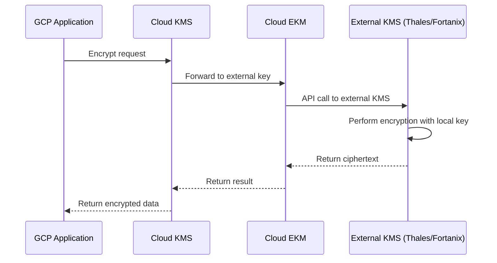

# How to Configure Cloud External Key Manager with a Third-Party KMS in GCP

Author: [nawazdhandala](https://www.github.com/nawazdhandala)

Tags: GCP, Cloud EKM, External Key Manager, Cloud KMS, Encryption

Description: A practical guide to configuring Google Cloud External Key Manager (Cloud EKM) to use encryption keys stored in a third-party key management system like Thales, Fortanix, or Equinix.

---

Some organizations have a strict requirement that encryption keys must never reside on the cloud provider's infrastructure. Maybe it is a regulatory mandate. Maybe the security team insists on maintaining full custody of all key material. Maybe there is an existing investment in an on-premises or third-party key management system that cannot be abandoned.

Cloud External Key Manager (Cloud EKM) addresses this by letting you use encryption keys that are stored and managed outside of Google Cloud. The key material stays in your third-party KMS - Thales CipherTrust, Fortanix SDKMS, or another supported provider. When GCP needs to perform a cryptographic operation, it sends a request to your external KMS through a secure channel. Google never sees or stores the actual key material.

## How Cloud EKM Works

Cloud EKM creates a reference in Cloud KMS that points to a key in your external system. When a GCP service needs to encrypt or decrypt data, the request goes through Cloud KMS, which forwards it to your external KMS via an API call. The external KMS performs the cryptographic operation and returns the result.



There are two connectivity options:

- **Cloud EKM over the internet** - Your external KMS is accessible via a public HTTPS endpoint
- **Cloud EKM over VPC** - Your external KMS is connected through a VPC network using Private Service Connect, providing a private network path

## Supported External KMS Providers

Google has partnered with several third-party KMS providers:

- **Thales CipherTrust Manager** - on-premises or cloud-hosted
- **Fortanix SDKMS** - SaaS or on-premises
- **Equinix SmartKey** - SaaS-based
- **Ionic Security** - cloud-based
- **Unbound CORE** - on-premises or cloud

Each provider has its own setup guide for the EKM integration. The provider generates a key and exposes it through an API that conforms to the Cloud EKM protocol.

## Prerequisites

- A GCP project with Cloud KMS API enabled
- An external KMS account with a supported provider
- A key created in the external KMS that is configured for EKM access
- The external KMS URI (provided by your KMS vendor)
- For VPC-based EKM: a VPC network with Private Service Connect configured

```bash
# Enable the Cloud KMS API
gcloud services enable cloudkms.googleapis.com --project=my-project-id
```

## Step 1 - Set Up Your External KMS

The exact steps depend on your provider. Here is the general process:

1. Log into your external KMS management console
2. Create a key designated for Google Cloud EKM use
3. Configure the key with the correct algorithm (typically AES-256 for symmetric encryption)
4. Note the key URI - this is the endpoint Google will call for cryptographic operations
5. Configure authentication credentials or mutual TLS certificates

The key URI typically looks something like:
```
https://your-ekm-provider.example.com/api/v1/cckm/ekm/endpoints/my-key-endpoint
```

## Step 2 - Create an EKM Connection (VPC-Based)

For VPC-based EKM, create a connection that defines how Cloud KMS reaches your external KMS:

```bash
# Create an EKM connection for VPC-based access
gcloud kms ekm-connections create my-ekm-connection \
  --location=us-central1 \
  --service-directory-service="projects/my-project-id/locations/us-central1/namespaces/my-namespace/services/my-ekm-service" \
  --hostname="ekm.internal.example.com" \
  --server-certificates-pem-file=./ekm-server-cert.pem \
  --project=my-project-id
```

For internet-based EKM, the connection is established through the key URI directly when creating the crypto key.

## Step 3 - Create a Key Ring

Create a key ring to hold your EKM keys:

```bash
# Create a key ring for external keys
gcloud kms keyrings create ekm-keyring \
  --location=us-central1 \
  --project=my-project-id
```

## Step 4 - Create an External Key

Create a Cloud KMS key that references your external key material:

```bash
# Create an externally managed symmetric encryption key (internet-based)
gcloud kms keys create my-external-key \
  --keyring=ekm-keyring \
  --location=us-central1 \
  --purpose=encryption \
  --protection-level=external \
  --default-algorithm=external-symmetric-encryption \
  --skip-initial-version-creation \
  --project=my-project-id
```

Then create a key version that points to the external key URI:

```bash
# Create a key version pointing to the external KMS
gcloud kms keys versions create \
  --key=my-external-key \
  --keyring=ekm-keyring \
  --location=us-central1 \
  --external-key-uri="https://your-ekm-provider.example.com/api/v1/cckm/ekm/endpoints/my-key-endpoint" \
  --primary \
  --project=my-project-id
```

For VPC-based EKM:

```bash
# Create an externally managed key using VPC connectivity
gcloud kms keys create my-vpc-external-key \
  --keyring=ekm-keyring \
  --location=us-central1 \
  --purpose=encryption \
  --protection-level=external-vpc \
  --default-algorithm=external-symmetric-encryption \
  --crypto-key-backend="projects/my-project-id/locations/us-central1/ekmConnections/my-ekm-connection" \
  --skip-initial-version-creation \
  --project=my-project-id

# Create the key version
gcloud kms keys versions create \
  --key=my-vpc-external-key \
  --keyring=ekm-keyring \
  --location=us-central1 \
  --external-key-uri="https://ekm.internal.example.com/api/v1/keys/my-key" \
  --primary \
  --project=my-project-id
```

## Terraform Configuration

```hcl
# EKM connection for VPC-based access
resource "google_kms_ekm_connection" "ekm_conn" {
  name     = "my-ekm-connection"
  location = "us-central1"
  project  = var.project_id

  service_resolvers {
    service_directory_service = "projects/${var.project_id}/locations/us-central1/namespaces/my-namespace/services/my-ekm-service"
    hostname                 = "ekm.internal.example.com"

    server_certificates {
      raw_der = filebase64("./ekm-server-cert.der")
    }
  }
}

# Key ring for external keys
resource "google_kms_key_ring" "ekm_keyring" {
  name     = "ekm-keyring"
  location = "us-central1"
  project  = var.project_id
}

# External key
resource "google_kms_crypto_key" "external_key" {
  name     = "my-external-key"
  key_ring = google_kms_key_ring.ekm_keyring.id
  purpose  = "ENCRYPT_DECRYPT"

  version_template {
    algorithm        = "EXTERNAL_SYMMETRIC_ENCRYPTION"
    protection_level = "EXTERNAL_VPC"
  }

  crypto_key_backend = google_kms_ekm_connection.ekm_conn.id

  skip_initial_version_creation = true

  lifecycle {
    prevent_destroy = true
  }
}
```

## Using External Keys

Once configured, external keys work like any other Cloud KMS key. Your applications use the standard encrypt and decrypt APIs:

```bash
# Encrypt using an external key (same API as any KMS key)
echo -n "data protected by external key" > plaintext.txt
gcloud kms encrypt \
  --key=my-external-key \
  --keyring=ekm-keyring \
  --location=us-central1 \
  --plaintext-file=plaintext.txt \
  --ciphertext-file=encrypted.dat \
  --project=my-project-id

# Decrypt using an external key
gcloud kms decrypt \
  --key=my-external-key \
  --keyring=ekm-keyring \
  --location=us-central1 \
  --ciphertext-file=encrypted.dat \
  --plaintext-file=decrypted.txt \
  --project=my-project-id
```

## Using External Keys with CMEK

External keys can be used as CMEK for GCP services, just like software or HSM keys:

```bash
# Use an external key for Cloud Storage encryption
gcloud storage buckets update gs://my-sovereign-bucket \
  --default-encryption-key=projects/my-project-id/locations/us-central1/keyRings/ekm-keyring/cryptoKeys/my-external-key

# Use an external key for BigQuery
bq mk --dataset \
  --default_kms_key=projects/my-project-id/locations/us-central1/keyRings/ekm-keyring/cryptoKeys/my-external-key \
  my-project-id:sovereign_dataset
```

## The "Kill Switch" Advantage

The most significant benefit of Cloud EKM is the ability to cut off access to your GCP data instantly by disabling the key in your external KMS. If you detect a security incident or need to comply with an emergency data access revocation order, you disable the key in your third-party KMS. Google can no longer decrypt any data protected by that key, and all access stops immediately.

This is a stronger guarantee than disabling a Cloud KMS key because Google never had the key material in the first place. Even in a hypothetical scenario where Google's infrastructure is compromised, the attacker cannot access the key material because it was never there.

## Availability Considerations

Cloud EKM introduces a dependency on your external KMS. If your external KMS is down, Cloud KMS cannot perform cryptographic operations, which means GCP services using that key will experience errors.

Design for availability:
- Use a high-availability external KMS deployment
- Monitor the external KMS endpoint health from GCP
- Set up alerting for EKM operation failures
- Consider having a fallback plan (temporarily switching to a Cloud KMS key) for non-critical workloads

```bash
# Monitor EKM operation failures in audit logs
gcloud logging read 'resource.type="cloudkms_cryptokeyversion" AND protoPayload.status.code!=0 AND protoPayload.resourceName:"ekm-keyring"' \
  --project=my-project-id \
  --limit=10 \
  --format="table(timestamp, protoPayload.status.message, protoPayload.resourceName)"
```

## Latency Impact

External key operations add network latency because each cryptographic operation requires a round trip to your external KMS. For internet-based EKM, expect 50-200ms additional latency per operation depending on the distance between Google's infrastructure and your KMS endpoint. VPC-based EKM typically has lower latency because the traffic stays on private networks.

For latency-sensitive workloads, use envelope encryption to minimize the number of EKM calls. Encrypt your data locally and only use the external key for wrapping the data encryption key.

## Cost Structure

Cloud EKM has its own pricing tier, which is higher than software or HSM keys. Each external cryptographic operation is billed at the EKM rate. Additionally, you pay for your third-party KMS service separately.

The combined cost is justified when regulatory compliance demands it. For workloads that do not have a hard requirement for external key custody, standard Cloud KMS (software or HSM) provides excellent security at a lower cost.

## Best Practices

Test the EKM integration thoroughly in a non-production environment before relying on it for critical data. Simulate failures of the external KMS to understand how your applications behave when cryptographic operations fail.

Use VPC-based EKM when possible for better latency and security. Internet-based EKM is easier to set up but exposes the communication path to the public internet.

Document the kill switch procedure and test it regularly. When you need to revoke access in an emergency, you do not want to be figuring out the process for the first time.

Cloud EKM is the strongest key custody model available in GCP. It satisfies the most demanding regulatory requirements while still letting you use Google Cloud services for compute, storage, and analytics. The trade-off is added complexity and an external dependency, but for organizations that require sovereign control over encryption keys, it is the right tool.
