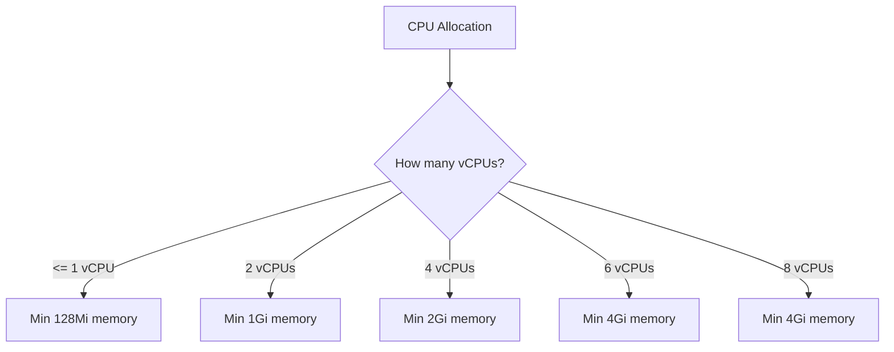

# How to Configure Cloud Functions Memory and CPU Allocation for Compute-Intensive Tasks

Author: [nawazdhandala](https://www.github.com/nawazdhandala)

Tags: GCP, Cloud Functions, Performance, Memory, CPU

Description: Learn how to properly configure memory and CPU allocation for Google Cloud Functions to handle compute-intensive workloads like image processing, data transformation, and ML inference.

---

Cloud Functions default to 256MB of memory and a fraction of a CPU core. That is fine for lightweight API handlers, but the moment you try to process images, transform large datasets, or run any kind of compute-heavy workload, you hit walls. Functions crash with out-of-memory errors, run slowly due to CPU throttling, or time out because they do not have enough resources to finish in time.

The fix is straightforward: allocate more memory and CPU. But getting the allocation right - not too little, not too much - takes some understanding of how these resources work in Cloud Functions.

## Memory and CPU Tiers

In Gen 2 Cloud Functions (which run on Cloud Run), memory and CPU can be configured independently. Here are the available options:

**Memory options**: 128Mi, 256Mi, 512Mi, 1Gi, 2Gi, 4Gi, 8Gi, 16Gi, 32Gi

**CPU options**: 0.083 (1/12), 0.167 (1/6), 0.25, 0.333, 0.5, 1, 2, 4, 6, 8

There are constraints though. Higher CPU values require minimum memory amounts:



## Configuring Memory and CPU

### Using gcloud

```bash
# Low resource function (API handler)
gcloud functions deploy api-handler \
  --gen2 \
  --runtime=nodejs20 \
  --region=us-central1 \
  --source=. \
  --entry-point=handler \
  --trigger-http \
  --memory=256Mi \
  --cpu=0.25

# Medium resource function (data processing)
gcloud functions deploy data-processor \
  --gen2 \
  --runtime=nodejs20 \
  --region=us-central1 \
  --source=. \
  --entry-point=processData \
  --trigger-http \
  --memory=1Gi \
  --cpu=1

# High resource function (image processing, ML inference)
gcloud functions deploy image-processor \
  --gen2 \
  --runtime=nodejs20 \
  --region=us-central1 \
  --source=. \
  --entry-point=processImage \
  --trigger-http \
  --memory=4Gi \
  --cpu=2

# Maximum resources (heavy compute workloads)
gcloud functions deploy heavy-compute \
  --gen2 \
  --runtime=nodejs20 \
  --region=us-central1 \
  --source=. \
  --entry-point=compute \
  --trigger-http \
  --memory=16Gi \
  --cpu=4
```

### Using Terraform

```hcl
resource "google_cloudfunctions2_function" "image_processor" {
  name     = "image-processor"
  location = "us-central1"

  build_config {
    runtime     = "nodejs20"
    entry_point = "processImage"
    source {
      storage_source {
        bucket = google_storage_bucket.source.name
        object = google_storage_bucket_object.source.name
      }
    }
  }

  service_config {
    # Allocate 4GB memory and 2 vCPUs
    available_memory = "4Gi"
    available_cpu    = "2"

    timeout_seconds    = 300
    min_instance_count = 0
    max_instance_count = 20

    service_account_email = google_service_account.function_sa.email
  }
}
```

## Profiling Memory Usage

Before blindly increasing memory, measure how much your function actually uses. Add memory tracking to your function:

```javascript
// Memory profiling helper for Cloud Functions
function getMemoryUsage() {
  const usage = process.memoryUsage();
  return {
    rss: Math.round(usage.rss / 1024 / 1024),        // Total allocated
    heapUsed: Math.round(usage.heapUsed / 1024 / 1024), // JS heap used
    heapTotal: Math.round(usage.heapTotal / 1024 / 1024), // JS heap total
    external: Math.round(usage.external / 1024 / 1024)   // External (C++ objects)
  };
}

const functions = require('@google-cloud/functions-framework');

functions.http('processData', async (req, res) => {
  const startMemory = getMemoryUsage();
  console.log('Start memory (MB):', JSON.stringify(startMemory));

  // Your processing logic
  const data = await loadLargeDataset();
  const midMemory = getMemoryUsage();
  console.log('After loading data (MB):', JSON.stringify(midMemory));

  const result = await transformData(data);
  const endMemory = getMemoryUsage();
  console.log('After processing (MB):', JSON.stringify(endMemory));

  // Calculate peak usage
  const peakRss = Math.max(startMemory.rss, midMemory.rss, endMemory.rss);
  console.log(`Peak RSS: ${peakRss}MB`);

  res.json({
    result: result.summary,
    memoryProfile: { start: startMemory, mid: midMemory, end: endMemory, peakRss }
  });
});
```

For Python:

```python
import resource
import os

def get_memory_mb():
    """Get current memory usage in MB."""
    # On Linux (Cloud Functions runtime)
    if os.path.exists('/proc/self/status'):
        with open('/proc/self/status') as f:
            for line in f:
                if line.startswith('VmRSS:'):
                    return int(line.split()[1]) / 1024
    # Fallback
    return resource.getrusage(resource.RUSAGE_SELF).ru_maxrss / 1024
```

## Common Workloads and Recommended Allocations

Here are starting points based on common workloads I have deployed:

### API Handlers (lightweight)

```bash
# Simple CRUD, read from database, return JSON
# Memory: 256Mi-512Mi, CPU: 0.25-0.5
gcloud functions deploy api \
  --gen2 \
  --memory=256Mi \
  --cpu=0.25 \
  --concurrency=80
```

### Image Processing

```bash
# Resize images with sharp, process up to 10MP images
# Memory: 1Gi-4Gi (depends on image size), CPU: 1-2
gcloud functions deploy resize-images \
  --gen2 \
  --memory=2Gi \
  --cpu=1 \
  --concurrency=4 \
  --timeout=120s
```

Sharp loads images entirely into memory. A 10-megapixel JPEG decompresses to about 30MB in RAM, and during resize you need both the original and the resized version in memory simultaneously. Add overhead for the Node.js runtime itself, and 1-2Gi is usually the sweet spot.

### PDF Generation

```bash
# Generate PDFs with Puppeteer/Chromium
# Memory: 1Gi-2Gi (Chromium needs a lot), CPU: 1
gcloud functions deploy generate-pdf \
  --gen2 \
  --memory=2Gi \
  --cpu=1 \
  --concurrency=2 \
  --timeout=120s
```

### CSV/JSON Data Transformation

```bash
# Process large CSV files (up to 100MB)
# Memory: 2Gi-8Gi (depends on file size), CPU: 1-2
gcloud functions deploy transform-data \
  --gen2 \
  --memory=4Gi \
  --cpu=2 \
  --timeout=300s
```

### ML Model Inference

```bash
# Run inference with TensorFlow/ONNX models
# Memory: 4Gi-16Gi (depends on model size), CPU: 2-4
gcloud functions deploy ml-inference \
  --gen2 \
  --memory=8Gi \
  --cpu=4 \
  --concurrency=1 \
  --timeout=300s
```

## CPU Throttling vs Always-On CPU

Gen 2 has two CPU allocation modes that significantly affect compute performance:

**CPU throttled (default)**: CPU is only allocated during request processing. Between requests, the CPU is throttled to near zero. This is cheaper but means background tasks will not run between requests.

**CPU always allocated**: CPU is available even when the instance is idle. More expensive but necessary for functions that maintain state, keep connections warm, or do background processing.

```bash
# CPU throttled (cheaper, good for request-response patterns)
gcloud functions deploy my-function \
  --gen2 \
  --cpu-throttling \
  --memory=1Gi \
  --cpu=1

# CPU always on (for background work and maintaining connections)
gcloud functions deploy my-function \
  --gen2 \
  --no-cpu-throttling \
  --memory=1Gi \
  --cpu=1
```

For compute-intensive functions, always use `--no-cpu-throttling` to ensure you get the full CPU allocation during processing.

## Memory Optimization Techniques

If your function is hitting memory limits, try these techniques before increasing memory:

### Stream Large Files Instead of Loading Into Memory

```javascript
// BAD: Loading entire file into memory
const [content] = await storage.bucket('my-bucket').file('big-file.csv').download();
const lines = content.toString().split('\n'); // Entire file in memory

// GOOD: Process file as a stream
const readline = require('readline');
const readStream = storage.bucket('my-bucket').file('big-file.csv').createReadStream();
const rl = readline.createInterface({ input: readStream });

for await (const line of rl) {
  await processLine(line); // One line at a time
}
```

### Process Data in Batches

```javascript
// Process large arrays in chunks to control memory pressure
async function processInBatches(items, batchSize, processFn) {
  for (let i = 0; i < items.length; i += batchSize) {
    const batch = items.slice(i, i + batchSize);
    await processFn(batch);

    // Allow garbage collection between batches
    if (global.gc) global.gc();
  }
}
```

### Release References Early

```javascript
// Release large objects when you are done with them
async function processData(req, res) {
  let rawData = await fetchLargeDataset();
  const summary = computeSummary(rawData);

  // Release the raw data since we only need the summary now
  rawData = null;

  // The garbage collector can now reclaim that memory
  const report = generateReport(summary);
  res.json(report);
}
```

## Cost Implications

Higher memory and CPU cost more. Here is a rough comparison:

| Configuration | Cost per million invocations (100ms each) |
|---|---|
| 256Mi / 0.167 CPU | ~$0.40 |
| 512Mi / 0.333 CPU | ~$0.80 |
| 1Gi / 1 CPU | ~$2.40 |
| 2Gi / 2 CPU | ~$6.40 |
| 4Gi / 4 CPU | ~$16.00 |

The key is to allocate just enough resources for reliable execution. Over-provisioning wastes money, while under-provisioning causes failures and retries (which also cost money).

## Monitoring Resource Usage

Use OneUptime to track memory utilization and CPU usage across your functions. Set up alerts for when functions approach their memory limits or when execution times suggest CPU contention. A function that was comfortably running at 60% memory utilization might creep up to 90% after a dependency update, and you want to catch that before it starts crashing in production.

Start with generous allocations during development, profile your actual usage under realistic load, then right-size based on the data. Leave about 20-30% headroom above your peak usage to handle occasional spikes.
