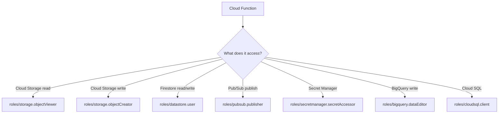

# How to Configure Cloud Functions to Use a Custom Service Account Instead of the Default

Author: [nawazdhandala](https://www.github.com/nawazdhandala)

Tags: GCP, Cloud Functions, IAM, Service Accounts, Security

Description: Step-by-step guide on configuring Google Cloud Functions to run with a custom service account for better security and least-privilege access control.

---

Every Cloud Function in Google Cloud runs as some service account. If you have not explicitly configured one, your functions are running as the default compute service account, which typically has the Editor role on your entire project. That is way too much access for a function that just needs to read from one Cloud Storage bucket or write to one Firestore collection.

Switching to a custom service account is one of the easiest security improvements you can make. It takes about five minutes, and the payoff - proper least-privilege access - is substantial. Let me show you exactly how to do it.

## Why the Default Service Account Is a Problem

The default compute service account (`PROJECT_NUMBER-compute@developer.gserviceaccount.com`) is automatically created when you enable certain APIs. By default, it has the Editor role, which grants read/write access to most resources in your project.

This means any Cloud Function running as this account can:

- Read and write any Cloud Storage bucket in the project
- Access any Firestore database
- Publish to any Pub/Sub topic
- Read secrets from Secret Manager
- And much more

If one function gets compromised (say, through a dependency vulnerability), the attacker has broad access to your entire project. Custom service accounts let you limit the blast radius.

## Step 1: Create a Custom Service Account

Start by creating a dedicated service account for your function. Give it a descriptive name that reflects what the function does.

```bash
# Create a service account specifically for the image processing function
gcloud iam service-accounts create image-processor-sa \
  --display-name "Image Processor Cloud Function" \
  --description "Service account for the image processing Cloud Function"
```

This creates a service account with the email `image-processor-sa@YOUR_PROJECT_ID.iam.gserviceaccount.com`.

## Step 2: Grant Only the Permissions It Needs

Now grant just the roles this function actually requires. Think about what resources the function accesses and assign the most specific roles possible.

```bash
# Grant read access to the source bucket
gcloud projects add-iam-policy-binding YOUR_PROJECT_ID \
  --member "serviceAccount:image-processor-sa@YOUR_PROJECT_ID.iam.gserviceaccount.com" \
  --role "roles/storage.objectViewer" \
  --condition "expression=resource.name.startsWith('projects/_/buckets/source-images'),title=source-bucket-only"

# Grant write access to the destination bucket
gsutil iam ch \
  serviceAccount:image-processor-sa@YOUR_PROJECT_ID.iam.gserviceaccount.com:objectCreator \
  gs://processed-images

# Grant permission to write logs (Cloud Functions need this)
gcloud projects add-iam-policy-binding YOUR_PROJECT_ID \
  --member "serviceAccount:image-processor-sa@YOUR_PROJECT_ID.iam.gserviceaccount.com" \
  --role "roles/logging.logWriter"
```

Here is a quick reference of common roles you might need:



## Step 3: Deploy the Function with the Custom Service Account

When deploying, use the `--service-account` flag to specify your custom service account.

```bash
# Deploy with the custom service account (Gen 1)
gcloud functions deploy processImage \
  --runtime nodejs18 \
  --trigger-bucket source-images \
  --service-account image-processor-sa@YOUR_PROJECT_ID.iam.gserviceaccount.com \
  --region us-central1 \
  --source .

# Deploy with the custom service account (Gen 2)
gcloud functions deploy processImage \
  --gen2 \
  --runtime nodejs18 \
  --trigger-http \
  --service-account image-processor-sa@YOUR_PROJECT_ID.iam.gserviceaccount.com \
  --region us-central1 \
  --source .
```

## Step 4: Update Existing Functions

If you already have deployed functions running as the default service account, you can update them without changing any code.

```bash
# Update an existing function to use the custom service account
gcloud functions deploy existingFunction \
  --service-account image-processor-sa@YOUR_PROJECT_ID.iam.gserviceaccount.com \
  --region us-central1
```

The function will redeploy with the new service account. No code changes needed.

## Using Terraform for Infrastructure as Code

If you manage your infrastructure with Terraform (and you should), here is how to set up the service account and function together.

```hcl
# Create the service account
resource "google_service_account" "image_processor" {
  account_id   = "image-processor-sa"
  display_name = "Image Processor Cloud Function"
  description  = "Service account for the image processing Cloud Function"
}

# Grant specific permissions
resource "google_project_iam_member" "storage_viewer" {
  project = var.project_id
  role    = "roles/storage.objectViewer"
  member  = "serviceAccount:${google_service_account.image_processor.email}"
}

resource "google_project_iam_member" "log_writer" {
  project = var.project_id
  role    = "roles/logging.logWriter"
  member  = "serviceAccount:${google_service_account.image_processor.email}"
}

# Deploy the function with the custom service account
resource "google_cloudfunctions_function" "image_processor" {
  name        = "processImage"
  runtime     = "nodejs18"
  region      = "us-central1"

  available_memory_mb   = 256
  source_archive_bucket = google_storage_bucket.function_source.name
  source_archive_object = google_storage_bucket_object.function_zip.name

  # This is the key line - specify the custom service account
  service_account_email = google_service_account.image_processor.email

  event_trigger {
    event_type = "google.storage.object.finalize"
    resource   = google_storage_bucket.source_images.name
  }

  entry_point = "processImage"
}
```

## Verifying the Configuration

After deployment, verify your function is using the right service account.

```bash
# Check which service account a function is using
gcloud functions describe processImage --region us-central1 \
  --format "value(serviceAccountEmail)"

# You should see your custom service account, not the default one
# Expected: image-processor-sa@YOUR_PROJECT_ID.iam.gserviceaccount.com
```

## Testing Permissions

To make sure you did not over-restrict the permissions, test your function thoroughly. If you get permission errors, the error messages are usually pretty clear about which permission is missing.

```bash
# Check what roles are assigned to your service account
gcloud projects get-iam-policy YOUR_PROJECT_ID \
  --flatten "bindings[].members" \
  --filter "bindings.members:image-processor-sa@YOUR_PROJECT_ID.iam.gserviceaccount.com" \
  --format "table(bindings.role)"
```

## One Service Account Per Function vs. Shared Accounts

There is a design decision here: do you create one service account per function, or share accounts across functions with similar needs?

My recommendation is one per function for anything in production. The overhead is minimal (service accounts are free), and it gives you:

- Clear audit trails - you can see exactly which function performed which action
- Independent permission management - changing one function's access does not affect others
- Better blast radius containment - a compromise in one function stays contained

For development or staging environments, sharing a service account across related functions is fine.

## Common Gotchas

A few things that catch people off guard:

1. **The deployer needs permissions too**: The account deploying the function needs `iam.serviceAccounts.actAs` permission on the target service account. Without it, the deploy fails.

2. **Cloud Functions service agent**: The Cloud Functions service agent (`service-PROJECT_NUMBER@gcf-admin-robot.iam.gserviceaccount.com`) also needs `iam.serviceAccounts.actAs` on your custom service account.

3. **Secret Manager access**: If your function reads secrets, do not forget to grant `roles/secretmanager.secretAccessor` to the custom service account.

4. **Eventarc triggers**: For Gen 2 functions with Eventarc triggers, the trigger's service account and the function's runtime service account are separate. Make sure both are configured correctly.

```bash
# Grant the Cloud Functions service agent permission to act as your SA
gcloud iam service-accounts add-iam-policy-binding \
  image-processor-sa@YOUR_PROJECT_ID.iam.gserviceaccount.com \
  --member "serviceAccount:service-PROJECT_NUMBER@gcf-admin-robot.iam.gserviceaccount.com" \
  --role "roles/iam.serviceAccountUser"
```

## Wrapping Up

Configuring custom service accounts for Cloud Functions is a straightforward change that meaningfully improves your security posture. It takes a few extra minutes during setup compared to using the default, but the principle of least privilege is worth that investment. Start with your most sensitive functions - anything that handles user data, financial transactions, or connects to production databases - and work your way through the rest. Your future self will thank you when the next CVE in a Node.js package drops and your functions only have the access they actually need.
