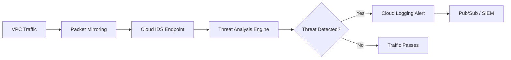

# How to Configure Cloud IDS for Network-Based Threat Detection in Google Cloud

Author: [nawazdhandala](https://www.github.com/nawazdhandala)

Tags: GCP, Cloud IDS, Intrusion Detection, Network Security, Threat Detection

Description: A practical guide to deploying Cloud IDS on Google Cloud for network-based intrusion detection, including configuration, packet mirroring, and alert integration.

---

Cloud IDS is Google Cloud's managed network intrusion detection service. It monitors network traffic flowing through your VPC and generates alerts when it detects malicious activity like exploit attempts, malware communication, command-and-control traffic, and policy violations. Unlike Cloud NGFW which can block traffic inline, Cloud IDS operates in detection mode - it watches traffic and alerts you without modifying the packet flow.

This makes Cloud IDS a good fit for environments where you need visibility into threats without the risk of blocking legitimate traffic. It is powered by Palo Alto Networks' threat detection engine, which means you get enterprise-grade signature coverage without managing any security appliances.

## How Cloud IDS Works

Cloud IDS uses Packet Mirroring to receive a copy of network traffic from your VPC. The traffic is sent to a Cloud IDS endpoint where it is analyzed against threat signatures. When a match is found, Cloud IDS generates a threat log entry that you can view in the console, query through Cloud Logging, or forward to your SIEM.



The original traffic flow is not affected. Packet Mirroring sends a copy, so there is no latency impact on your workloads.

## Prerequisites

Before setting up Cloud IDS:

1. Enable the IDS API in your project
2. Have a VPC network where you want traffic monitored
3. Ensure you have the `ids.endpoints.create` permission
4. Decide which subnets and traffic directions to monitor

## Creating a Cloud IDS Endpoint

An IDS endpoint is the resource that receives mirrored traffic and performs analysis. Each endpoint is associated with a specific VPC network and zone.

```bash
# Enable the Cloud IDS API
gcloud services enable ids.googleapis.com --project=my-network-project

# Create a Cloud IDS endpoint
gcloud ids endpoints create prod-ids-endpoint \
  --network=prod-vpc \
  --zone=us-central1-a \
  --severity=MEDIUM \
  --project=my-network-project \
  --async
```

The `--severity` flag sets the minimum threat severity that generates alerts. Options are INFORMATIONAL, LOW, MEDIUM, HIGH, and CRITICAL. Setting it to MEDIUM means you get alerts for medium, high, and critical threats.

Endpoint creation takes several minutes. Check the status with:

```bash
# Check endpoint creation status
gcloud ids endpoints describe prod-ids-endpoint \
  --zone=us-central1-a \
  --project=my-network-project
```

## Configuring Packet Mirroring

After the endpoint is created, set up Packet Mirroring to send traffic to it. You can mirror traffic from specific instances, subnets, or based on tags.

### Mirror All Traffic from a Subnet

```bash
# Get the endpoint forwarding rule for packet mirroring
ENDPOINT_FR=$(gcloud ids endpoints describe prod-ids-endpoint \
  --zone=us-central1-a \
  --project=my-network-project \
  --format='value(endpointForwardingRule)')

# Create a packet mirroring policy for the production subnet
gcloud compute packet-mirrorings create prod-subnet-mirror \
  --region=us-central1 \
  --network=prod-vpc \
  --collector-ilb=${ENDPOINT_FR} \
  --mirrored-subnets=prod-subnet \
  --project=my-network-project
```

### Mirror Traffic from Specific Instances

```bash
# Mirror traffic from specific instances only
gcloud compute packet-mirrorings create targeted-mirror \
  --region=us-central1 \
  --network=prod-vpc \
  --collector-ilb=${ENDPOINT_FR} \
  --mirrored-instances=zones/us-central1-a/instances/web-server-1,zones/us-central1-a/instances/web-server-2 \
  --project=my-network-project
```

### Mirror Traffic from Tagged Instances

```bash
# Mirror traffic from instances with a specific network tag
gcloud compute packet-mirrorings create tagged-mirror \
  --region=us-central1 \
  --network=prod-vpc \
  --collector-ilb=${ENDPOINT_FR} \
  --mirrored-tags=ids-monitored \
  --project=my-network-project
```

### Filter Mirrored Traffic

You can filter what traffic gets mirrored to reduce costs and noise.

```bash
# Mirror only inbound HTTP and HTTPS traffic
gcloud compute packet-mirrorings create filtered-mirror \
  --region=us-central1 \
  --network=prod-vpc \
  --collector-ilb=${ENDPOINT_FR} \
  --mirrored-subnets=prod-subnet \
  --filter-cidr-ranges=0.0.0.0/0 \
  --filter-protocols=tcp:80,tcp:443 \
  --filter-direction=INGRESS \
  --project=my-network-project
```

## Terraform Configuration

Here is a complete Terraform setup for Cloud IDS with Packet Mirroring.

```hcl
# Cloud IDS endpoint
resource "google_cloud_ids_endpoint" "prod" {
  name     = "prod-ids-endpoint"
  location = "us-central1-a"
  network  = google_compute_network.prod.id
  severity = "MEDIUM"
  project  = "my-network-project"
}

# Packet mirroring policy to send traffic to the IDS endpoint
resource "google_compute_packet_mirroring" "prod" {
  name    = "prod-traffic-mirror"
  region  = "us-central1"
  project = "my-network-project"

  network {
    url = google_compute_network.prod.id
  }

  collector_ilb {
    url = google_cloud_ids_endpoint.prod.endpoint_forwarding_rule
  }

  mirrored_resources {
    subnetworks {
      url = google_compute_subnetwork.prod.id
    }
  }

  filter {
    cidr_ranges  = ["0.0.0.0/0"]
    ip_protocols = ["tcp"]
    direction    = "BOTH"
  }
}
```

## Viewing Threat Logs

Cloud IDS writes threat detections to Cloud Logging. Here is how to query them.

```bash
# View recent Cloud IDS threat detections
gcloud logging read 'resource.type="ids.googleapis.com/Endpoint" AND jsonPayload.alert_severity!=""' \
  --project=my-network-project \
  --limit=20 \
  --format="table(timestamp, jsonPayload.alert_severity, jsonPayload.category, jsonPayload.name, jsonPayload.source_ip_address, jsonPayload.destination_ip_address, jsonPayload.destination_port)"
```

For more detailed analysis, export logs to BigQuery.

```bash
# Create a log sink for Cloud IDS threats to BigQuery
gcloud logging sinks create ids-threats-sink \
  bigquery.googleapis.com/projects/my-network-project/datasets/ids_threats \
  --log-filter='resource.type="ids.googleapis.com/Endpoint"' \
  --project=my-network-project
```

Once in BigQuery, run analytical queries.

```sql
-- Top threat categories in the last 7 days
SELECT
  jsonPayload.category AS threat_category,
  jsonPayload.alert_severity AS severity,
  COUNT(*) AS detection_count,
  COUNT(DISTINCT jsonPayload.source_ip_address) AS unique_sources,
  COUNT(DISTINCT jsonPayload.destination_ip_address) AS unique_targets
FROM `my-network-project.ids_threats.ids_googleapis_com_threat`
WHERE timestamp >= TIMESTAMP_SUB(CURRENT_TIMESTAMP(), INTERVAL 7 DAY)
GROUP BY threat_category, severity
ORDER BY detection_count DESC
LIMIT 20;
```

## Setting Up Real-Time Alerting

For high-severity threats, you want immediate notification. Set up a log-based alert.

```bash
# Create a log-based metric for high-severity IDS threats
gcloud logging metrics create ids-high-severity-threats \
  --description="Count of high and critical severity Cloud IDS detections" \
  --log-filter='resource.type="ids.googleapis.com/Endpoint" AND (jsonPayload.alert_severity="HIGH" OR jsonPayload.alert_severity="CRITICAL")' \
  --project=my-network-project

# Create an alert policy based on the metric
gcloud monitoring policies create \
  --display-name="Cloud IDS High Severity Threat" \
  --condition-display-name="High severity threat detected" \
  --condition-filter='metric.type="logging.googleapis.com/user/ids-high-severity-threats"' \
  --condition-threshold-value=0 \
  --condition-threshold-comparison=COMPARISON_GT \
  --condition-threshold-duration=0s \
  --notification-channels=projects/my-network-project/notificationChannels/CHANNEL_ID \
  --project=my-network-project
```

## Forwarding to External SIEM

Most organizations want IDS alerts in their SIEM for correlation with other security events. Use Pub/Sub as the integration point.

```bash
# Create a Pub/Sub topic for IDS alerts
gcloud pubsub topics create ids-alerts --project=my-network-project

# Create a log sink that routes IDS threats to Pub/Sub
gcloud logging sinks create ids-to-pubsub \
  pubsub.googleapis.com/projects/my-network-project/topics/ids-alerts \
  --log-filter='resource.type="ids.googleapis.com/Endpoint" AND jsonPayload.alert_severity!="INFORMATIONAL"' \
  --project=my-network-project
```

From Pub/Sub, you can push to Splunk, Chronicle, or any SIEM that supports Pub/Sub subscriptions.

## Cost Optimization

Cloud IDS pricing is based on the endpoint (hourly) and the volume of traffic inspected (per GB). Here are ways to control costs:

1. **Filter mirrored traffic** - only mirror protocols and ports you care about
2. **Use targeted mirroring** - mirror critical workloads rather than entire subnets
3. **Adjust severity threshold** - set the minimum severity higher to reduce processing
4. **Schedule monitoring** - for non-production environments, consider enabling mirroring only during business hours

```bash
# Disable packet mirroring during off-hours (run via Cloud Scheduler)
gcloud compute packet-mirrorings update prod-subnet-mirror \
  --region=us-central1 \
  --no-enable \
  --project=my-network-project
```

## Cloud IDS vs Cloud NGFW

The two services complement each other:

| Feature | Cloud IDS | Cloud NGFW |
|---------|-----------|------------|
| Mode | Detection (passive) | Prevention (inline) |
| Traffic impact | None (mirrored copy) | Adds latency (inspects inline) |
| Blocking | No | Yes |
| TLS inspection | No | Yes |
| Use case | Visibility and alerting | Active threat blocking |

Many organizations deploy both - Cloud IDS for broad visibility across all traffic, and Cloud NGFW for inline protection on critical paths.

Cloud IDS gives you network-level threat visibility with minimal operational overhead. Deploy an endpoint, point Packet Mirroring at it, and you immediately start seeing threats that your firewall rules alone would miss. It is one of the fastest paths to better network security posture on Google Cloud.
