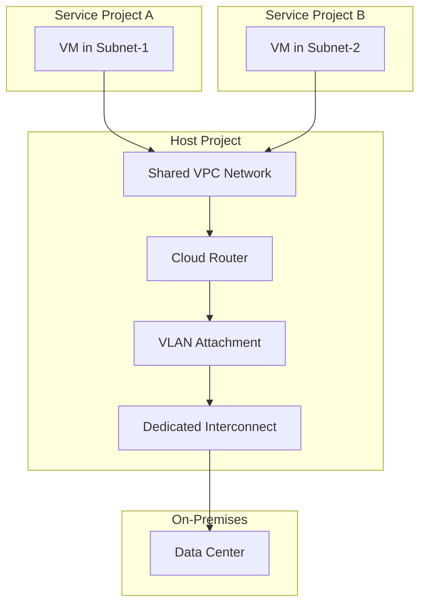

# How to Configure Cloud Interconnect with Shared VPC for Multi-Project Access in GCP

Author: [nawazdhandala](https://www.github.com/nawazdhandala)

Tags: GCP, Cloud Interconnect, Shared VPC, Multi-Project, Networking, Hybrid Cloud

Description: Learn how to configure Cloud Interconnect with Shared VPC in GCP so that multiple projects can share a single interconnect connection for on-premises connectivity.

---

In many GCP organizations, teams work in separate projects but still need access to on-premises resources through Cloud Interconnect. Setting up a separate Interconnect for each project would be expensive and operationally complex. The better approach is to combine Cloud Interconnect with Shared VPC, allowing a centralized network team to manage the connectivity while service projects use it transparently.

This post walks through the architecture and step-by-step setup of Cloud Interconnect with Shared VPC for multi-project access.

## The Architecture

Shared VPC has a host project that owns the VPC network and networking resources, and service projects that use subnets from the shared network. Cloud Interconnect resources live in the host project, and VMs in service projects route to on-premises through the shared VPC.



Key points:

- The Interconnect and VLAN attachments are in the host project
- The Cloud Router and shared VPC are also in the host project
- Service projects have VMs in shared subnets
- Routes from Cloud Router automatically apply to all VMs using the shared network

## Prerequisites

Before you start:

- An organization in GCP
- A host project with a VPC network
- One or more service projects
- Shared VPC already configured (or we will set it up)
- An active Dedicated or Partner Interconnect in the host project
- Organization Admin or Shared VPC Admin role

## Step 1: Set Up Shared VPC

If you have not already configured Shared VPC, here is how:

```bash
# Enable the Compute Engine API in the host project
gcloud services enable compute.googleapis.com \
    --project=host-project-id

# Enable Shared VPC on the host project
gcloud compute shared-vpc enable host-project-id

# Associate service projects
gcloud compute shared-vpc associated-projects add service-project-a \
    --host-project=host-project-id

gcloud compute shared-vpc associated-projects add service-project-b \
    --host-project=host-project-id
```

## Step 2: Create Subnets for Service Projects

Create subnets in the shared VPC that service projects will use:

```bash
# Create subnet for Service Project A
gcloud compute networks subnets create subnet-team-a \
    --project=host-project-id \
    --network=shared-vpc \
    --region=us-east4 \
    --range=10.1.0.0/24 \
    --description="Subnet for Team A"

# Create subnet for Service Project B
gcloud compute networks subnets create subnet-team-b \
    --project=host-project-id \
    --network=shared-vpc \
    --region=us-east4 \
    --range=10.2.0.0/24 \
    --description="Subnet for Team B"
```

## Step 3: Grant Subnet Access to Service Projects

Service projects need permission to use the shared subnets:

```bash
# Grant Service Project A access to its subnet
gcloud compute networks subnets add-iam-policy-binding subnet-team-a \
    --project=host-project-id \
    --region=us-east4 \
    --member="serviceAccount:service-project-a-number@cloudservices.gserviceaccount.com" \
    --role="roles/compute.networkUser"

# Grant Service Project B access to its subnet
gcloud compute networks subnets add-iam-policy-binding subnet-team-b \
    --project=host-project-id \
    --region=us-east4 \
    --member="serviceAccount:service-project-b-number@cloudservices.gserviceaccount.com" \
    --role="roles/compute.networkUser"
```

You can also grant access to specific users or groups instead of project service accounts.

## Step 4: Set Up Cloud Interconnect in the Host Project

All Interconnect resources go in the host project. If you already have an Interconnect, skip to the VLAN attachment step.

```bash
# Create Cloud Router in the host project
gcloud compute routers create ic-router \
    --project=host-project-id \
    --network=shared-vpc \
    --region=us-east4 \
    --asn=16550

# Create VLAN attachment on existing Interconnect
gcloud compute interconnects attachments dedicated create shared-attachment \
    --project=host-project-id \
    --interconnect=my-interconnect \
    --router=ic-router \
    --region=us-east4 \
    --bandwidth=BPS_10G \
    --vlan=100
```

## Step 5: Configure BGP

Set up BGP between Cloud Router and your on-premises router:

```bash
# Add BGP interface
gcloud compute routers add-interface ic-router \
    --project=host-project-id \
    --interface-name=ic-interface \
    --interconnect-attachment=shared-attachment \
    --region=us-east4

# Add BGP peer
gcloud compute routers add-bgp-peer ic-router \
    --project=host-project-id \
    --peer-name=onprem-peer \
    --interface=ic-interface \
    --peer-ip-address=169.254.60.2 \
    --peer-asn=65001 \
    --region=us-east4
```

## Step 6: Configure Route Advertisements

By default, Cloud Router advertises all subnets in the VPC. This means your on-premises network will learn routes to all shared subnets. You might want to be more selective:

```bash
# Advertise only specific subnets to on-premises
gcloud compute routers update ic-router \
    --project=host-project-id \
    --region=us-east4 \
    --advertisement-mode=CUSTOM \
    --set-advertisement-ranges=10.1.0.0/24,10.2.0.0/24
```

Or advertise all subnets plus any custom ranges:

```bash
# Advertise all VPC subnets plus additional ranges
gcloud compute routers update ic-router \
    --project=host-project-id \
    --region=us-east4 \
    --advertisement-mode=CUSTOM \
    --set-advertisement-groups=ALL_SUBNETS \
    --set-advertisement-ranges=10.100.0.0/16
```

## Step 7: Create VMs in Service Projects

Now service project teams can create VMs that automatically have connectivity to on-premises:

```bash
# Create a VM in Service Project A using the shared subnet
gcloud compute instances create vm-team-a \
    --project=service-project-a \
    --zone=us-east4-a \
    --machine-type=e2-medium \
    --subnet=projects/host-project-id/regions/us-east4/subnetworks/subnet-team-a

# Create a VM in Service Project B using the shared subnet
gcloud compute instances create vm-team-b \
    --project=service-project-b \
    --zone=us-east4-a \
    --machine-type=e2-medium \
    --subnet=projects/host-project-id/regions/us-east4/subnetworks/subnet-team-b
```

These VMs can reach on-premises resources through the Interconnect without any additional configuration in the service projects.

## Firewall Rules

Firewall rules for the shared VPC are managed in the host project. Create rules that allow traffic between the shared subnets and on-premises:

```bash
# Allow traffic from on-premises to shared subnets
gcloud compute firewall-rules create allow-onprem-to-shared \
    --project=host-project-id \
    --network=shared-vpc \
    --allow=tcp,udp,icmp \
    --source-ranges=192.168.0.0/16 \
    --target-tags=onprem-access \
    --description="Allow on-premises traffic to shared VPC"

# Allow traffic between shared subnets (internal)
gcloud compute firewall-rules create allow-internal-shared \
    --project=host-project-id \
    --network=shared-vpc \
    --allow=tcp,udp,icmp \
    --source-ranges=10.1.0.0/24,10.2.0.0/24 \
    --description="Allow internal traffic between shared subnets"
```

## IAM Considerations

With this setup, there is a clear separation of responsibilities:

| Role | Responsibility | IAM Role |
|------|---------------|----------|
| Network Admin | Manages Interconnect, Cloud Router, VLAN attachments | Compute Network Admin |
| Shared VPC Admin | Manages shared VPC, subnets, firewall rules | Compute Shared VPC Admin |
| Service Project Admin | Creates VMs, manages workloads | Compute Instance Admin (on service project) |

Service project admins do not need access to the host project's Interconnect resources. They just create VMs in the shared subnets and connectivity works.

## Monitoring Across Projects

Since the Interconnect is in the host project, monitoring is centralized there. But you might want service project teams to see their own traffic. Use Cloud Monitoring with cross-project metrics:

```bash
# Create a metrics scope that includes service projects
# This is done in the Cloud Console under Monitoring > Settings > Metrics Scope
# Or via API:
gcloud monitoring metrics-scopes create \
    --monitored-project=service-project-a

gcloud monitoring metrics-scopes create \
    --monitored-project=service-project-b
```

This lets service project teams view network metrics in Cloud Monitoring without needing access to the host project.

## Adding New Service Projects

When a new team needs on-premises connectivity, the process is straightforward:

1. Associate the new project with the host project
2. Create a subnet (or share an existing one)
3. Grant the networkUser role
4. The team creates VMs in the shared subnet

No changes to the Interconnect, Cloud Router, or BGP configuration are needed. New subnets are automatically advertised if Cloud Router is set to advertise all subnets.

```bash
# Add a new service project
gcloud compute shared-vpc associated-projects add service-project-c \
    --host-project=host-project-id

# Create a subnet for them
gcloud compute networks subnets create subnet-team-c \
    --project=host-project-id \
    --network=shared-vpc \
    --region=us-east4 \
    --range=10.3.0.0/24

# Grant access
gcloud compute networks subnets add-iam-policy-binding subnet-team-c \
    --project=host-project-id \
    --region=us-east4 \
    --member="serviceAccount:service-project-c-number@cloudservices.gserviceaccount.com" \
    --role="roles/compute.networkUser"
```

## Wrapping Up

Combining Cloud Interconnect with Shared VPC is the standard pattern for multi-project hybrid connectivity in GCP. The network team manages the Interconnect, VLAN attachments, and routing in the host project, while service project teams get transparent on-premises connectivity by deploying into shared subnets. This keeps the network centralized, reduces costs by sharing a single Interconnect, and scales easily as new projects are added. The main thing to plan carefully is your subnet allocation and firewall rules - everything else falls into place naturally.
