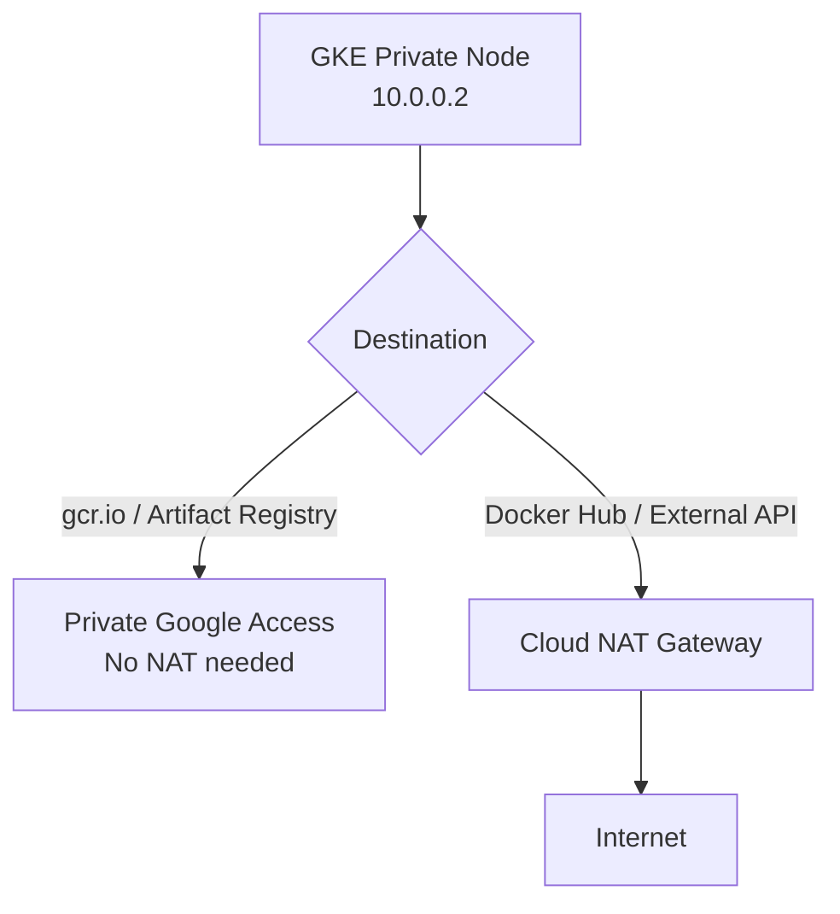

# How to Configure Cloud NAT for GKE Clusters with Private Nodes in GCP

Author: [nawazdhandala](https://www.github.com/nawazdhandala)

Tags: GCP, Cloud NAT, GKE, Kubernetes, Private Cluster

Description: Set up Cloud NAT to provide internet access for GKE clusters running private nodes, enabling container image pulls, external API calls, and package downloads.

---

Private GKE clusters are the recommended configuration for production workloads. They give your nodes internal-only IP addresses, keeping them unreachable from the internet. But those nodes still need outbound internet access for pulling container images from public registries, downloading dependencies, calling external APIs, and sending telemetry. Cloud NAT provides this outbound connectivity without exposing your nodes to inbound internet traffic.

This guide covers configuring Cloud NAT specifically for GKE private clusters, including the nuances around pod IP ranges, node IP ranges, and alias IP considerations.

## Why GKE Private Clusters Need Cloud NAT

When you create a GKE cluster with `--enable-private-nodes`, the worker nodes get only internal IP addresses. Without Cloud NAT or another NAT solution, these nodes cannot:

- Pull container images from Docker Hub, GCR, or other public registries
- Download packages during container builds
- Reach external APIs from your workloads
- Send metrics to external monitoring services

Note: Pulling images from Google Container Registry (gcr.io) and Artifact Registry works without Cloud NAT because GCP uses private connectivity for these. But any public registry like Docker Hub requires outbound internet access.



## Step 1: Create a Private GKE Cluster

If you do not have one yet, here is how to create a private cluster:

```bash
# Create a private GKE cluster
gcloud container clusters create private-cluster \
  --zone=us-central1-a \
  --network=your-vpc \
  --subnetwork=your-subnet \
  --enable-private-nodes \
  --enable-ip-alias \
  --master-ipv4-cidr=172.16.0.0/28 \
  --no-enable-master-authorized-networks \
  --project=your-project-id
```

The `--enable-ip-alias` flag is required for private clusters. It creates alias IP ranges for pods and services.

## Step 2: Create a Cloud Router

Cloud NAT requires a Cloud Router in the same region as your GKE cluster:

```bash
# Create a Cloud Router in the same region as the GKE cluster
gcloud compute routers create gke-nat-router \
  --network=your-vpc \
  --region=us-central1 \
  --project=your-project-id
```

## Step 3: Create Cloud NAT for GKE

Here is where it gets GKE-specific. You need to configure NAT not just for the node IP range, but also for the pod IP range. Pods use alias IP ranges, and their traffic also needs to be NATed for outbound internet access.

```bash
# Create Cloud NAT covering all subnet IP ranges (including alias ranges for pods)
gcloud compute routers nats create gke-nat-gateway \
  --router=gke-nat-router \
  --region=us-central1 \
  --auto-allocate-nat-external-ips \
  --nat-all-subnet-ip-ranges \
  --project=your-project-id
```

The `--nat-all-subnet-ip-ranges` flag covers both the primary subnet range (node IPs) and any secondary/alias ranges (pod IPs). This is the simplest and most common configuration for GKE.

## Step 4: Verify NAT Is Working

Deploy a test pod and verify outbound connectivity:

```bash
# Get cluster credentials
gcloud container clusters get-credentials private-cluster \
  --zone=us-central1-a \
  --project=your-project-id

# Run a test pod to check outbound internet access
kubectl run nat-test --image=curlimages/curl --rm -it --restart=Never -- curl -s ifconfig.me
```

The command should return one of your NAT gateway's external IP addresses.

## Configuring NAT for Specific GKE Subnets Only

If you have multiple subnets and only want NAT for your GKE subnet, target it specifically:

```bash
# First, find the subnet and its secondary ranges
gcloud compute networks subnets describe your-gke-subnet \
  --region=us-central1 \
  --format="yaml(secondaryIpRanges)" \
  --project=your-project-id
```

Then create NAT for that specific subnet, including its secondary ranges:

```bash
# Create NAT targeting specific subnet and its secondary ranges
gcloud compute routers nats create gke-nat-gateway \
  --router=gke-nat-router \
  --region=us-central1 \
  --auto-allocate-nat-external-ips \
  --nat-custom-subnet-ip-ranges="your-gke-subnet,your-gke-subnet:pods-range,your-gke-subnet:services-range" \
  --project=your-project-id
```

Replace `pods-range` and `services-range` with the actual names of your secondary IP ranges.

## Port Allocation for GKE

GKE clusters can have many pods per node, and each pod can make outbound connections. This means port consumption can be much higher than a typical VM setup. Plan your port allocation accordingly:

```bash
# Enable dynamic port allocation with higher limits for GKE
gcloud compute routers nats update gke-nat-gateway \
  --router=gke-nat-router \
  --region=us-central1 \
  --enable-dynamic-port-allocation \
  --min-ports-per-vm=1024 \
  --max-ports-per-vm=16384 \
  --project=your-project-id
```

The key insight is that Cloud NAT allocates ports per VM (node), not per pod. If you run 30 pods per node and each pod makes 100 concurrent outbound connections, that node needs 3,000 ports minimum.

## Using Static IPs for GKE NAT

If your GKE workloads call third-party APIs that require IP allowlisting:

```bash
# Reserve static IPs
gcloud compute addresses create gke-nat-ip-1 --region=us-central1
gcloud compute addresses create gke-nat-ip-2 --region=us-central1

# Update NAT to use static IPs
gcloud compute routers nats update gke-nat-gateway \
  --router=gke-nat-router \
  --region=us-central1 \
  --nat-external-ip-pool=gke-nat-ip-1,gke-nat-ip-2 \
  --project=your-project-id
```

## Handling GKE Autoscaling

When GKE autoscaler adds new nodes, those nodes automatically use the existing Cloud NAT gateway. No configuration changes are needed. However, you should plan your NAT capacity for the maximum number of nodes your cluster might scale to:

```
Required ports = Max nodes x Max pods per node x Avg connections per pod
Required NAT IPs = Required ports / 64,512
```

For example, with 50 max nodes, 30 pods per node, and 50 connections per pod:
```
50 x 30 x 50 = 75,000 ports needed
75,000 / 64,512 = 2 NAT IPs minimum (round up for headroom)
```

## Monitoring NAT for GKE

Enable logging to monitor GKE NAT traffic:

```bash
# Enable NAT logging
gcloud compute routers nats update gke-nat-gateway \
  --router=gke-nat-router \
  --region=us-central1 \
  --enable-logging \
  --log-filter=ERRORS_ONLY \
  --project=your-project-id
```

Check for issues:

```bash
# Look for NAT errors related to GKE nodes
gcloud logging read \
  'resource.type="nat_gateway" AND resource.labels.gateway_name="gke-nat-gateway" AND jsonPayload.allocation_status="DROPPED"' \
  --project=your-project-id \
  --freshness=6h \
  --format="table(timestamp, jsonPayload.connection.src_ip, jsonPayload.connection.dest_ip)"
```

## Private Google Access vs Cloud NAT

Make sure you also enable Private Google Access on your GKE subnet. This allows nodes to reach Google APIs and services without going through Cloud NAT:

```bash
# Enable Private Google Access on the GKE subnet
gcloud compute networks subnets update your-gke-subnet \
  --region=us-central1 \
  --enable-private-google-access \
  --project=your-project-id
```

With Private Google Access enabled, traffic to Google services (including GCR and Artifact Registry) uses internal routing and does not consume NAT ports.

## Troubleshooting Common GKE NAT Issues

**Pods cannot pull images from Docker Hub:**
- Verify Cloud NAT is configured and covers the pod IP range
- Check that the node's subnet secondary ranges are included in the NAT configuration
- Test with a simple curl pod to isolate the issue

**Intermittent connection failures:**
- Usually port exhaustion. Check NAT logs for DROPPED events
- Increase `max-ports-per-vm` or add more NAT IPs
- Enable dynamic port allocation if not already enabled

**Some pods work but others do not:**
- All pods on the same node share the node's NAT port allocation
- If one pod is consuming too many ports, others on the same node suffer
- Consider using NetworkPolicy to limit outbound connections from chatty pods

**NAT works but DNS resolution fails:**
- GKE uses kube-dns or CoreDNS internally, which should resolve without NAT
- If using external DNS servers, ensure the NAT covers DNS traffic (UDP port 53)

## Wrapping Up

Cloud NAT is essential for GKE private clusters that need outbound internet access. The setup is straightforward, but the GKE-specific considerations around pod IP ranges and port allocation per node are important to get right. Use dynamic port allocation from the start, enable Private Google Access to reduce NAT load, and monitor for port exhaustion especially if your pods make many outbound connections. With proper configuration, Cloud NAT provides reliable outbound connectivity for your private GKE clusters without compromising on security.
