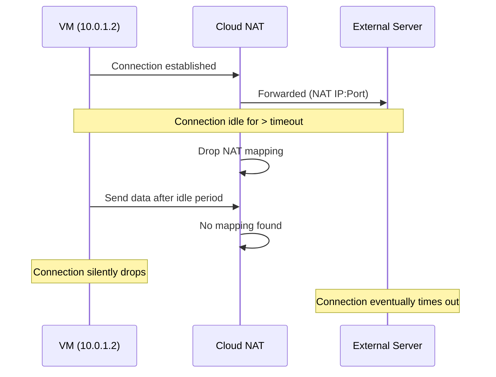

# How to Configure Cloud NAT Timeout Values for Long-Lived TCP Connections in GCP

Author: [nawazdhandala](https://www.github.com/nawazdhandala)

Tags: GCP, Cloud NAT, TCP Timeout, Networking, Connection Management

Description: Tune Cloud NAT timeout settings for applications with long-lived TCP connections like database links, WebSocket servers, and streaming services to prevent unexpected disconnections.

---

Cloud NAT has several timeout settings that control how long it keeps NAT translations alive. The defaults work well for typical web traffic with short-lived HTTP connections. But if your applications maintain long-lived TCP connections - database connections, WebSocket sessions, gRPC streams, MQTT connections, or SSH tunnels - those defaults will cause unexpected disconnections. Understanding and tuning these timeouts is essential for reliable connectivity.

## The Timeout Settings

Cloud NAT has four configurable timeout values:

| Setting | Default | What It Controls |
|---------|---------|-----------------|
| `tcp-established-idle-timeout` | 1200s (20 min) | How long an established TCP connection can be idle before the NAT mapping is dropped |
| `tcp-transitory-idle-timeout` | 30s | How long a TCP connection in a transitory state (SYN, FIN) can be idle |
| `tcp-time-wait-timeout` | 120s | How long the port stays reserved after a connection enters TIME_WAIT |
| `udp-idle-timeout` | 30s | How long an idle UDP mapping is maintained |

The most important one for long-lived connections is `tcp-established-idle-timeout`. When this timer expires on an idle connection, Cloud NAT silently drops the NAT mapping. The connection appears to hang because neither side knows the mapping is gone.

## What Happens When a Timeout Fires

Here is the sequence when a long-lived connection exceeds the idle timeout:



The VM does not receive a TCP RST. It just stops getting responses. From the application's perspective, the connection hangs until it eventually times out at the application or OS level.

## Step 1: Check Your Current Timeout Settings

View your current NAT configuration:

```bash
# Check current timeout settings
gcloud compute routers nats describe your-nat-gateway \
  --router=your-router \
  --region=us-central1 \
  --project=your-project-id \
  --format="yaml(tcpEstablishedIdleTimeoutSec, tcpTransitoryIdleTimeoutSec, tcpTimeWaitTimeoutSec, udpIdleTimeoutSec)"
```

If the fields are not shown, the defaults are in use.

## Step 2: Increase Timeouts for Long-Lived Connections

For applications that maintain persistent TCP connections, increase the established idle timeout:

```bash
# Increase TCP established idle timeout to 12 hours
gcloud compute routers nats update your-nat-gateway \
  --router=your-router \
  --region=us-central1 \
  --tcp-established-idle-timeout=43200 \
  --project=your-project-id
```

The maximum value is 1,200,000 seconds (about 14 days). Here are some recommended values for common use cases:

| Use Case | Recommended Timeout |
|----------|-------------------|
| Database connection pools | 3600s (1 hour) |
| WebSocket connections | 7200s (2 hours) |
| gRPC streaming | 3600s (1 hour) |
| SSH tunnels | 7200s (2 hours) |
| MQTT persistent sessions | 14400s (4 hours) |
| Long-running data transfers | 86400s (24 hours) |

## Step 3: Configure All Timeout Values Together

For a comprehensive configuration, set all timeout values at once:

```bash
# Configure all NAT timeout values
gcloud compute routers nats update your-nat-gateway \
  --router=your-router \
  --region=us-central1 \
  --tcp-established-idle-timeout=7200 \
  --tcp-transitory-idle-timeout=30 \
  --tcp-time-wait-timeout=120 \
  --udp-idle-timeout=30 \
  --project=your-project-id
```

In this example:
- Established connections can be idle for 2 hours before the mapping drops
- Connections in SYN/FIN states have 30 seconds (usually fine as-is)
- TIME_WAIT keeps the port reserved for 2 minutes after close
- UDP mappings time out after 30 seconds of inactivity

## Balancing Timeouts vs Port Usage

There is a tradeoff: longer timeouts mean NAT ports are held longer. If you set a 24-hour timeout and a connection goes idle but never closes, that port is occupied for 24 hours. This can contribute to port exhaustion.

```bash
# If you need long timeouts, also increase port capacity
gcloud compute routers nats update your-nat-gateway \
  --router=your-router \
  --region=us-central1 \
  --tcp-established-idle-timeout=7200 \
  --enable-dynamic-port-allocation \
  --min-ports-per-vm=256 \
  --max-ports-per-vm=8192 \
  --project=your-project-id
```

Dynamic port allocation helps here because idle connections still hold ports, but VMs that do not need long-lived connections return their ports to the pool.

## The Application-Level Solution: TCP Keep-Alive

Instead of setting very long NAT timeouts, a better approach is to use TCP keep-alive at the application or OS level. Keep-alive probes send small packets at regular intervals, preventing the connection from appearing idle to Cloud NAT.

Configure TCP keep-alive on your VMs:

```bash
# Set TCP keep-alive interval to 60 seconds on the VM
# This ensures the connection is never idle for more than 60 seconds
sudo sysctl -w net.ipv4.tcp_keepalive_time=60
sudo sysctl -w net.ipv4.tcp_keepalive_intvl=60
sudo sysctl -w net.ipv4.tcp_keepalive_probes=5
```

Make these settings persistent:

```bash
# Add to /etc/sysctl.d/99-tcp-keepalive.conf
cat <<EOF | sudo tee /etc/sysctl.d/99-tcp-keepalive.conf
# Keep TCP connections alive through Cloud NAT
net.ipv4.tcp_keepalive_time = 60
net.ipv4.tcp_keepalive_intvl = 60
net.ipv4.tcp_keepalive_probes = 5
EOF

# Apply the settings
sudo sysctl --system
```

With these settings, a keep-alive probe is sent every 60 seconds after the connection has been idle for 60 seconds. This is well within the default 20-minute NAT timeout, so the connection stays alive.

## Application-Level Keep-Alive Examples

Many applications and libraries have their own keep-alive settings:

For a PostgreSQL connection pool (using Node.js pg library):

```javascript
// Configure PostgreSQL client with keep-alive enabled
const { Pool } = require('pg');

const pool = new Pool({
  host: 'external-db-host.example.com',
  port: 5432,
  database: 'mydb',
  // Enable TCP keep-alive to prevent Cloud NAT timeout
  keepAlive: true,
  keepAliveInitialDelayMillis: 60000,  // 60 seconds
});
```

For a Redis connection:

```python
import redis

# Configure Redis client with keep-alive
client = redis.Redis(
    host='external-redis.example.com',
    port=6379,
    # Send keep-alive probes to prevent NAT timeout
    socket_keepalive=True,
    socket_keepalive_options={
        1: 60,   # TCP_KEEPIDLE: start probes after 60s idle
        2: 60,   # TCP_KEEPINTVL: probe interval 60s
        3: 5,    # TCP_KEEPCNT: 5 probes before giving up
    }
)
```

## Monitoring Timeout-Related Issues

Look for signs of timeout-related disconnections in your NAT logs:

```bash
# Enable logging if not already enabled
gcloud compute routers nats update your-nat-gateway \
  --router=your-router \
  --region=us-central1 \
  --enable-logging \
  --log-filter=ALL \
  --project=your-project-id

# Look for connections that were dropped (could indicate timeout)
gcloud logging read \
  'resource.type="nat_gateway" AND resource.labels.gateway_name="your-nat-gateway" AND jsonPayload.allocation_status="DROPPED"' \
  --project=your-project-id \
  --freshness=6h \
  --format="table(timestamp, jsonPayload.connection.src_ip, jsonPayload.connection.dest_ip)"
```

Unfortunately, Cloud NAT does not log timeout events specifically. You will need to correlate NAT logs with your application logs to identify timeout-caused disconnections. Look for patterns where connections drop after being idle for exactly the timeout duration.

## Reducing TIME_WAIT for High-Throughput Workloads

If your workloads create and close many connections rapidly, reducing the TIME_WAIT timeout helps free ports faster:

```bash
# Reduce TIME_WAIT from 120s to 15s for high-throughput workloads
gcloud compute routers nats update your-nat-gateway \
  --router=your-router \
  --region=us-central1 \
  --tcp-time-wait-timeout=15 \
  --project=your-project-id
```

This is safe for most workloads because TIME_WAIT primarily prevents old packets from being confused with new connections to the same destination. With short-lived connections to many different destinations, reducing this timer has minimal risk.

## Wrapping Up

Cloud NAT timeout tuning is essential for any workload that relies on persistent TCP connections. The default 20-minute idle timeout silently kills connections that your applications expect to stay open. The best approach is a combination: increase the NAT timeout to a reasonable value for your workload, and enable TCP keep-alive at the OS or application level to prevent connections from ever reaching the timeout. This dual approach gives you reliability without wasting NAT ports on truly abandoned connections.
