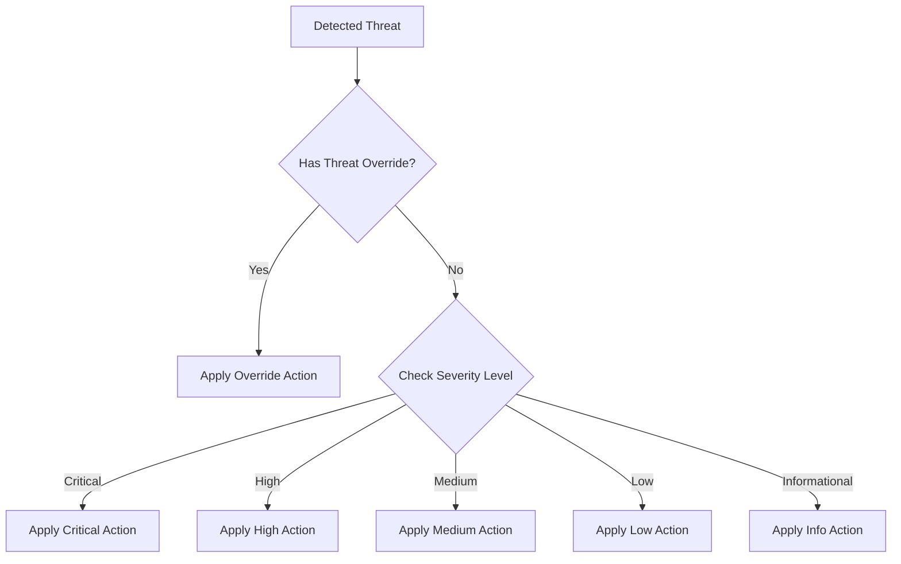

# How to Configure Cloud NGFW Threat Prevention Profiles on Google Cloud

Author: [nawazdhandala](https://www.github.com/nawazdhandala)

Tags: GCP, Cloud NGFW, Threat Prevention, Security Profiles, Network Security

Description: Learn how to configure and tune Cloud NGFW threat prevention profiles on Google Cloud for detecting and blocking network-based threats with granular control.

---

Cloud NGFW on Google Cloud uses threat prevention profiles to decide how to handle different types of network threats. A profile defines the action to take for each threat severity level and lets you override actions for specific threat signatures. Getting the profile configuration right is the difference between catching real threats and drowning in false positives. Too aggressive and you block legitimate traffic. Too permissive and you miss actual attacks.

In this post, I will cover how to create, configure, and tune threat prevention profiles for Cloud NGFW, including practical strategies for going from detection to prevention mode.

## Understanding Threat Prevention Profiles

A threat prevention profile has two main configuration areas:

1. **Severity-based actions**: Default actions applied to all threats of a given severity level (Critical, High, Medium, Low, Informational)
2. **Threat-specific overrides**: Custom actions for individual threat IDs that override the severity-based defaults



Available actions are:
- **DENY**: Block the traffic and log the event
- **ALERT**: Allow the traffic but log it as a security event
- **ALLOW**: Allow the traffic with no alert (effectively suppress the detection)

## Step 1 - Create a Threat Prevention Profile

Start by creating a baseline profile in detection-only mode.

```bash
# Create a security profile for threat prevention in detection mode
gcloud network-security security-profiles threat-prevention create detection-profile \
    --organization=123456789 \
    --location=global \
    --description="Detection-only profile for initial deployment"

# Set all severities to ALERT (detection only, no blocking)
gcloud network-security security-profiles threat-prevention update detection-profile \
    --organization=123456789 \
    --location=global \
    --severity-overrides=\
severity=CRITICAL,action=ALERT,\
severity=HIGH,action=ALERT,\
severity=MEDIUM,action=ALERT,\
severity=LOW,action=ALERT,\
severity=INFORMATIONAL,action=ALLOW
```

This profile detects all threats but does not block anything. You will use this during the initial deployment phase to understand what threats exist in your environment.

## Step 2 - Create a Security Profile Group

Security profile groups bundle profiles together and are referenced by firewall policy rules.

```bash
# Create a profile group using the detection profile
gcloud network-security security-profile-groups create detection-group \
    --organization=123456789 \
    --location=global \
    --threat-prevention-profile=organizations/123456789/locations/global/securityProfiles/detection-profile \
    --description="Detection-only profile group"
```

## Step 3 - Associate with Firewall Policy Rules

Create firewall policy rules that route traffic through the NGFW for inspection.

```bash
# Create a network firewall policy
gcloud compute network-firewall-policies create ngfw-policy \
    --global \
    --project=my-project

# Rule to inspect inbound traffic
gcloud compute network-firewall-policies rules create 100 \
    --firewall-policy=ngfw-policy \
    --global-firewall-policy \
    --direction=INGRESS \
    --action=apply_security_profile_group \
    --security-profile-group=//networksecurity.googleapis.com/organizations/123456789/locations/global/securityProfileGroups/detection-group \
    --src-ip-ranges=0.0.0.0/0 \
    --layer4-configs=tcp:80,tcp:443,tcp:8080,tcp:8443 \
    --description="Inspect inbound web traffic"

# Rule to inspect outbound traffic
gcloud compute network-firewall-policies rules create 200 \
    --firewall-policy=ngfw-policy \
    --global-firewall-policy \
    --direction=EGRESS \
    --action=apply_security_profile_group \
    --security-profile-group=//networksecurity.googleapis.com/organizations/123456789/locations/global/securityProfileGroups/detection-group \
    --dest-ip-ranges=0.0.0.0/0 \
    --layer4-configs=tcp \
    --description="Inspect outbound traffic"

# Rule to inspect east-west traffic
gcloud compute network-firewall-policies rules create 300 \
    --firewall-policy=ngfw-policy \
    --global-firewall-policy \
    --direction=INGRESS \
    --action=apply_security_profile_group \
    --security-profile-group=//networksecurity.googleapis.com/organizations/123456789/locations/global/securityProfileGroups/detection-group \
    --src-ip-ranges=10.0.0.0/8,172.16.0.0/12,192.168.0.0/16 \
    --layer4-configs=all \
    --description="Inspect internal traffic for lateral movement"

# Associate the policy with your VPC
gcloud compute network-firewall-policies associations create \
    --firewall-policy=ngfw-policy \
    --global-firewall-policy \
    --network=my-vpc \
    --name=ngfw-vpc-assoc \
    --project=my-project
```

## Step 4 - Analyze Detection Results

After running in detection mode for 1-2 weeks, analyze the findings.

```bash
# Query threat detections from Cloud Logging
gcloud logging read \
    'resource.type="gce_subnetwork" AND jsonPayload.rule_details.action="APPLY_SECURITY_PROFILE_GROUP"' \
    --format="table(timestamp, jsonPayload.threat_details.threat_id, jsonPayload.threat_details.threat_name, jsonPayload.threat_details.severity, jsonPayload.connection.src_ip, jsonPayload.connection.dest_ip)" \
    --limit=100
```

Export to BigQuery for deeper analysis:

```sql
-- Summarize detected threats by severity and type
SELECT
    jsonPayload.threat_details.severity AS severity,
    jsonPayload.threat_details.threat_name AS threat_name,
    jsonPayload.threat_details.threat_id AS threat_id,
    jsonPayload.threat_details.category AS category,
    COUNT(*) AS detection_count,
    COUNT(DISTINCT jsonPayload.connection.src_ip) AS unique_sources,
    COUNT(DISTINCT jsonPayload.connection.dest_ip) AS unique_targets
FROM
    `my_project.ngfw_logs.compute_googleapis_com_firewall`
WHERE
    jsonPayload.threat_details IS NOT NULL
    AND _TABLE_SUFFIX >= FORMAT_DATE('%Y%m%d', DATE_SUB(CURRENT_DATE(), INTERVAL 14 DAY))
GROUP BY
    severity, threat_name, threat_id, category
ORDER BY
    CASE severity
        WHEN 'CRITICAL' THEN 1
        WHEN 'HIGH' THEN 2
        WHEN 'MEDIUM' THEN 3
        WHEN 'LOW' THEN 4
        ELSE 5
    END,
    detection_count DESC;
```

```sql
-- Find potential false positives - threats from known-good internal sources
SELECT
    jsonPayload.threat_details.threat_name AS threat,
    jsonPayload.threat_details.threat_id AS threat_id,
    jsonPayload.connection.src_ip AS source,
    jsonPayload.connection.dest_ip AS destination,
    jsonPayload.connection.dest_port AS port,
    COUNT(*) AS occurrences
FROM
    `my_project.ngfw_logs.compute_googleapis_com_firewall`
WHERE
    jsonPayload.threat_details IS NOT NULL
    AND jsonPayload.connection.src_ip LIKE '10.%'  -- Internal traffic
    AND _TABLE_SUFFIX >= FORMAT_DATE('%Y%m%d', DATE_SUB(CURRENT_DATE(), INTERVAL 14 DAY))
GROUP BY
    threat, threat_id, source, destination, port
HAVING
    occurrences > 50  -- Frequent detections are more likely false positives
ORDER BY
    occurrences DESC;
```

## Step 5 - Create a Tuned Prevention Profile

Based on your analysis, create a prevention profile that blocks real threats and suppresses false positives.

```bash
# Create the prevention profile
gcloud network-security security-profiles threat-prevention create prevention-profile \
    --organization=123456789 \
    --location=global \
    --description="Tuned prevention profile with false positive suppression"

# Set severity-based actions
gcloud network-security security-profiles threat-prevention update prevention-profile \
    --organization=123456789 \
    --location=global \
    --severity-overrides=\
severity=CRITICAL,action=DENY,\
severity=HIGH,action=DENY,\
severity=MEDIUM,action=ALERT,\
severity=LOW,action=ALERT,\
severity=INFORMATIONAL,action=ALLOW

# Override specific threats that are false positives
# These threat IDs come from your analysis in Step 4
gcloud network-security security-profiles threat-prevention update prevention-profile \
    --organization=123456789 \
    --location=global \
    --threat-overrides=\
threat-id=41234,action=ALLOW,\
threat-id=41235,action=ALLOW,\
threat-id=52789,action=ALERT
```

## Step 6 - Gradual Rollout to Prevention Mode

Do not switch to prevention mode all at once. Use a phased approach.

```bash
# Phase 1: Create a prevention profile group
gcloud network-security security-profile-groups create prevention-group \
    --organization=123456789 \
    --location=global \
    --threat-prevention-profile=organizations/123456789/locations/global/securityProfiles/prevention-profile

# Phase 2: Apply prevention to a single subnet first
gcloud compute network-firewall-policies rules create 150 \
    --firewall-policy=ngfw-policy \
    --global-firewall-policy \
    --direction=INGRESS \
    --action=apply_security_profile_group \
    --security-profile-group=//networksecurity.googleapis.com/organizations/123456789/locations/global/securityProfileGroups/prevention-group \
    --src-ip-ranges=0.0.0.0/0 \
    --dest-ip-ranges=10.0.1.0/24 \
    --layer4-configs=tcp:80,tcp:443 \
    --description="Prevention mode - test subnet only"

# Phase 3: After validation, expand to more subnets
# Phase 4: Replace detection rules with prevention rules across all subnets
```

## Step 7 - Managing Multiple Profiles

Different environments may need different profiles. Here is a strategy for managing them.

```bash
# Aggressive profile for DMZ/internet-facing services
gcloud network-security security-profiles threat-prevention create dmz-profile \
    --organization=123456789 \
    --location=global \
    --description="Aggressive prevention for DMZ"

gcloud network-security security-profiles threat-prevention update dmz-profile \
    --organization=123456789 \
    --location=global \
    --severity-overrides=\
severity=CRITICAL,action=DENY,\
severity=HIGH,action=DENY,\
severity=MEDIUM,action=DENY,\
severity=LOW,action=ALERT,\
severity=INFORMATIONAL,action=ALLOW

# Conservative profile for internal services
gcloud network-security security-profiles threat-prevention create internal-profile \
    --organization=123456789 \
    --location=global \
    --description="Conservative detection for internal traffic"

gcloud network-security security-profiles threat-prevention update internal-profile \
    --organization=123456789 \
    --location=global \
    --severity-overrides=\
severity=CRITICAL,action=DENY,\
severity=HIGH,action=ALERT,\
severity=MEDIUM,action=ALERT,\
severity=LOW,action=ALLOW,\
severity=INFORMATIONAL,action=ALLOW
```

Create separate profile groups for each:

```bash
gcloud network-security security-profile-groups create dmz-group \
    --organization=123456789 \
    --location=global \
    --threat-prevention-profile=organizations/123456789/locations/global/securityProfiles/dmz-profile

gcloud network-security security-profile-groups create internal-group \
    --organization=123456789 \
    --location=global \
    --threat-prevention-profile=organizations/123456789/locations/global/securityProfiles/internal-profile
```

## Step 8 - Automated Profile Management

Automate threat override management with a script that processes false positive reports.

```python
# manage_overrides.py - Manage threat prevention overrides
import subprocess
import json

ORG_ID = "123456789"
PROFILE_NAME = "prevention-profile"

def get_current_overrides():
    """Get the current threat overrides from the profile."""
    result = subprocess.run(
        ["gcloud", "network-security", "security-profiles",
         "threat-prevention", "describe", PROFILE_NAME,
         "--organization", ORG_ID, "--location", "global",
         "--format", "json"],
        capture_output=True, text=True
    )
    profile = json.loads(result.stdout)
    return profile.get("threatOverrides", [])

def add_override(threat_id, action, reason):
    """Add a threat override to suppress a false positive."""
    current = get_current_overrides()

    # Check if override already exists
    for override in current:
        if override.get("threatId") == str(threat_id):
            print(f"Override for threat {threat_id} already exists")
            return

    # Build the override string
    override_parts = [f"threat-id={o['threatId']},action={o['action']}" for o in current]
    override_parts.append(f"threat-id={threat_id},action={action}")
    override_str = ",".join(override_parts)

    subprocess.run(
        ["gcloud", "network-security", "security-profiles",
         "threat-prevention", "update", PROFILE_NAME,
         "--organization", ORG_ID, "--location", "global",
         "--threat-overrides", override_str],
        check=True
    )
    print(f"Added override: threat {threat_id} -> {action} (Reason: {reason})")

# Example usage: suppress a false positive
add_override(41234, "ALLOW", "False positive - internal health check traffic")
add_override(52789, "ALERT", "Low confidence detection - monitor only")
```

## Monitoring Profile Effectiveness

Track key metrics to understand how well your profiles are performing:

```sql
-- Detection vs Prevention breakdown over time
SELECT
    DATE(timestamp) AS date,
    jsonPayload.threat_details.severity AS severity,
    COUNTIF(jsonPayload.threat_details.action = 'DENY') AS blocked_count,
    COUNTIF(jsonPayload.threat_details.action = 'ALERT') AS alerted_count,
    COUNTIF(jsonPayload.threat_details.action = 'ALLOW') AS suppressed_count
FROM
    `my_project.ngfw_logs.compute_googleapis_com_firewall`
WHERE
    jsonPayload.threat_details IS NOT NULL
    AND _TABLE_SUFFIX >= FORMAT_DATE('%Y%m%d', DATE_SUB(CURRENT_DATE(), INTERVAL 30 DAY))
GROUP BY
    date, severity
ORDER BY
    date DESC, severity;
```

## Wrapping Up

Threat prevention profiles are where the tuning happens in Cloud NGFW. The process is iterative: start with detection-only, analyze the findings for a few weeks, identify false positives, create a tuned prevention profile with overrides, and gradually roll out prevention mode starting with the most critical traffic paths. Different environments deserve different profiles - be aggressive on internet-facing services and more conservative on internal traffic. Automate the override management process so your security team can quickly suppress false positives without manual gcloud commands. The goal is a profile that blocks real threats with minimal noise, giving your team confidence that alerts are worth investigating.
