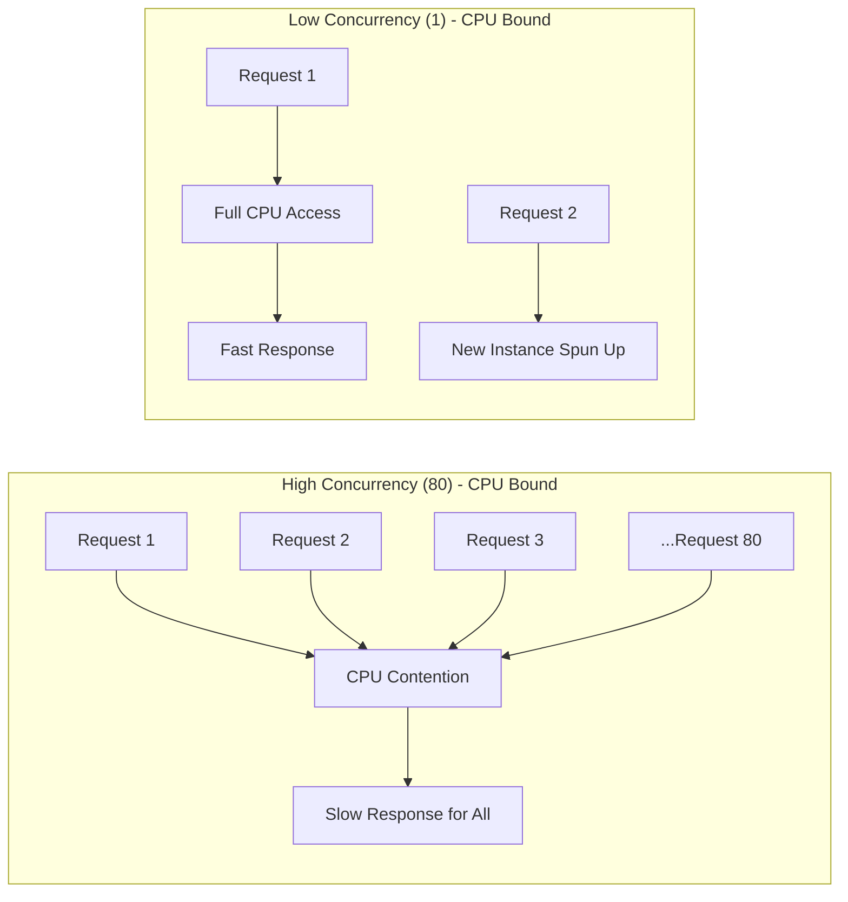

# How to Configure Cloud Run Concurrency Settings to Optimize Throughput for CPU-Bound Applications

Author: [nawazdhandala](https://www.github.com/nawazdhandala)

Tags: GCP, Cloud Run, Concurrency, Performance, Throughput, Google Cloud

Description: Learn how to tune Cloud Run concurrency settings to maximize throughput for CPU-bound applications by balancing requests per container instance.

---

Cloud Run's concurrency setting controls how many requests a single container instance handles simultaneously. The default is 80, which works well for I/O-bound workloads like web APIs that spend most of their time waiting on databases. But for CPU-bound applications - image processing, data transformation, PDF generation - that default can tank your performance.

This guide explains how concurrency works under the hood, how to find the right value for CPU-bound workloads, and how to configure it properly.

## How Concurrency Works in Cloud Run

When a request comes into Cloud Run, the platform routes it to an available container instance. The concurrency setting determines how many requests can be routed to a single instance at the same time.

With a concurrency of 80 (the default), a single container can be processing up to 80 requests simultaneously. For an I/O-bound app that spends 95% of its time waiting on network calls, this is fine because the CPU is mostly idle between requests.

For a CPU-bound app, this is a disaster. If each request needs significant CPU time, 80 concurrent requests will all compete for the same CPU cores. Each request gets a tiny slice of CPU time, everything slows down, and latency goes through the roof.

Here is a visualization of the difference:



## Finding the Right Concurrency Value

The optimal concurrency depends on your CPU allocation and the nature of your workload. Here is a practical approach.

**For pure CPU-bound workloads** (image processing, video encoding, heavy computation), start with concurrency equal to the number of vCPUs allocated to your container:

- 1 vCPU: concurrency = 1
- 2 vCPUs: concurrency = 2
- 4 vCPUs: concurrency = 4

**For mixed workloads** (some CPU work, some I/O waits), you can go higher. A good starting point is 2-4x the number of vCPUs:

- 1 vCPU: concurrency = 2 to 4
- 2 vCPUs: concurrency = 4 to 8

**For I/O-bound workloads** (typical web APIs, proxy services), the default of 80 is usually fine or even conservative.

## Configuring Concurrency

### Using gcloud CLI

Set concurrency during deployment:

```bash
# Deploy with concurrency set to 1 for CPU-bound work
gcloud run deploy image-processor \
  --image=us-central1-docker.pkg.dev/MY_PROJECT/my-repo/image-processor:latest \
  --region=us-central1 \
  --concurrency=1 \
  --cpu=2 \
  --memory=1Gi
```

Update an existing service:

```bash
# Lower concurrency on an existing service
gcloud run services update image-processor \
  --region=us-central1 \
  --concurrency=1
```

### Using Service YAML

```yaml
# service.yaml - CPU-bound service with low concurrency
apiVersion: serving.knative.dev/v1
kind: Service
metadata:
  name: image-processor
spec:
  template:
    metadata:
      annotations:
        autoscaling.knative.dev/maxScale: "100"
    spec:
      # Set concurrency at the container spec level
      containerConcurrency: 1
      containers:
        - image: us-central1-docker.pkg.dev/MY_PROJECT/my-repo/image-processor:latest
          resources:
            limits:
              cpu: "2"
              memory: 1Gi
```

### Using Terraform

```hcl
# Cloud Run service with tuned concurrency
resource "google_cloud_run_v2_service" "image_processor" {
  name     = "image-processor"
  location = "us-central1"

  template {
    # Max concurrent requests per instance
    max_instance_request_concurrency = 1

    scaling {
      min_instance_count = 0
      max_instance_count = 100
    }

    containers {
      image = "us-central1-docker.pkg.dev/my-project/my-repo/image-processor:latest"
      resources {
        limits = {
          cpu    = "2"
          memory = "1Gi"
        }
      }
    }
  }
}
```

## Practical Example: Image Processing Service

Let me walk through a real scenario. You have a service that receives image upload URLs, downloads the images, resizes them to multiple dimensions, and stores the results in Cloud Storage.

Here is the processing code:

```python
# processor.py - CPU-intensive image processing service
from flask import Flask, request, jsonify
from PIL import Image
import io
import requests as http_requests
from google.cloud import storage

app = Flask(__name__)
storage_client = storage.Client()
bucket = storage_client.bucket("my-processed-images")

# Target sizes for the resize operation
SIZES = [
    (1920, 1080),
    (1280, 720),
    (640, 480),
    (320, 240),
    (160, 120),
]

@app.route("/process", methods=["POST"])
def process_image():
    """Download an image, resize it to multiple sizes, and upload results."""
    data = request.get_json()
    image_url = data["url"]
    image_id = data["id"]

    # Download the original image
    response = http_requests.get(image_url)
    original = Image.open(io.BytesIO(response.content))

    results = []
    for width, height in SIZES:
        # CPU-intensive resize operation
        resized = original.resize((width, height), Image.LANCZOS)

        # Convert to bytes
        buffer = io.BytesIO()
        resized.save(buffer, format="JPEG", quality=85)
        buffer.seek(0)

        # Upload to Cloud Storage
        blob_name = f"{image_id}/{width}x{height}.jpg"
        blob = bucket.blob(blob_name)
        blob.upload_from_file(buffer, content_type="image/jpeg")
        results.append(blob_name)

    return jsonify({"processed": results}), 200
```

Each request does significant CPU work (resizing with LANCZOS filtering). If 80 requests hit the same instance simultaneously, the CPU would be completely saturated and each request would take far longer than necessary.

## Load Testing to Find the Sweet Spot

Rather than guessing, measure. Deploy your service with different concurrency values and run load tests:

```bash
# Deploy with concurrency=1
gcloud run deploy image-processor \
  --image=us-central1-docker.pkg.dev/MY_PROJECT/my-repo/image-processor:latest \
  --region=us-central1 \
  --concurrency=1 \
  --cpu=2 \
  --memory=1Gi

# Run a load test with hey (or your preferred tool)
hey -n 100 -c 20 \
  -m POST \
  -H "Content-Type: application/json" \
  -d '{"url":"https://example.com/test.jpg","id":"test-001"}' \
  https://image-processor-xxxxx.run.app/process
```

Record the p50, p95, and p99 latencies. Then repeat with concurrency=2, 4, 8, and so on. You will typically see a curve like this:

- Concurrency 1: Low latency per request, but Cloud Run scales out aggressively (more instances, higher cost)
- Concurrency 2-4: Slightly higher latency, fewer instances, lower cost
- Concurrency 8+: Latency starts climbing rapidly as CPU contention increases

The sweet spot is where latency is still acceptable and cost is reasonable.

## How Concurrency Affects Autoscaling

Concurrency directly affects how aggressively Cloud Run scales. With concurrency=1, every new concurrent request needs a new instance. With concurrency=80, Cloud Run can pack 80 requests into one instance before scaling.

This means lower concurrency leads to more instances and higher costs, but better per-request performance. Higher concurrency means fewer instances and lower costs, but potentially worse latency for CPU-bound work.

Here is the math. If you have 100 concurrent requests:

- Concurrency 1: Cloud Run needs ~100 instances
- Concurrency 10: Cloud Run needs ~10 instances
- Concurrency 80: Cloud Run needs ~2 instances

You need to find the balance between cost and latency that works for your application.

## Concurrency and Max Instances

When you lower concurrency, you should also consider your max instances limit. If concurrency is 1 and you get a burst of 200 requests, Cloud Run needs to scale to 200 instances. If your max instances is set to 100, half those requests will queue up or get 429 errors.

```bash
# Set a higher max instances limit when using low concurrency
gcloud run services update image-processor \
  --region=us-central1 \
  --concurrency=1 \
  --max-instances=500
```

## Monitoring and Adjusting

After deploying, monitor these metrics in Cloud Monitoring:

- **Container instance count**: Shows how many instances are running
- **Request latency**: Shows if concurrency is causing slowdowns
- **CPU utilization**: Should be high but not maxed at 100% constantly
- **Billable instance time**: Shows cost impact

```bash
# Quick check on instance count over the last hour
gcloud monitoring metrics list \
  --filter='metric.type="run.googleapis.com/container/instance_count"'
```

If p99 latency is creeping up, lower the concurrency. If instance count seems excessively high for your traffic volume, you might be able to increase concurrency without hurting latency.

## Summary

For CPU-bound Cloud Run applications, the default concurrency of 80 is almost always too high. Start with concurrency equal to your vCPU count, load test to find the right balance between latency and cost, and adjust max instances to handle your expected traffic. The small configuration change can make a dramatic difference in your application's response times and reliability under load.
