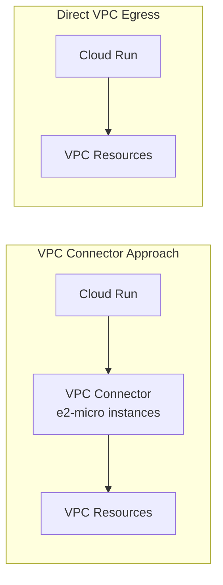

# How to Configure Cloud Run Direct VPC Egress to Avoid VPC Connector Throughput Limits

Author: [nawazdhandala](https://www.github.com/nawazdhandala)

Tags: GCP, Cloud Run, VPC, Direct VPC Egress, Networking, Google Cloud

Description: Learn how to configure Cloud Run Direct VPC Egress to bypass the throughput limitations of Serverless VPC Access connectors for high-bandwidth workloads.

---

If you have been using Serverless VPC Access connectors to give your Cloud Run services access to VPC resources, you have probably hit the throughput ceiling at some point. The connectors max out around 1 Gbps, and scaling them requires managing connector instances and dealing with their own set of limitations.

Direct VPC Egress is the newer, better approach. It lets Cloud Run instances send traffic directly into your VPC without going through a connector, removing the throughput bottleneck entirely. This guide covers how to set it up and when it makes sense over the older connector approach.

## VPC Connector vs Direct VPC Egress

Let me lay out the key differences so you can understand why Direct VPC Egress exists.

**Serverless VPC Access Connector:**
- Uses dedicated e2-micro or e2-standard instances as a bridge between Cloud Run and your VPC
- Maximum throughput of about 1 Gbps (can scale with larger instance types)
- You pay for the connector instances 24/7 regardless of traffic
- Connector instances can become a bottleneck under load
- You have to manage connector scaling

**Direct VPC Egress:**
- Cloud Run instances connect directly to the VPC subnet
- No intermediate proxy instances
- Throughput scales with your Cloud Run instances
- No additional cost beyond standard VPC networking charges
- Simpler to configure and maintain

The architecture difference looks like this:



## Prerequisites

Before configuring Direct VPC Egress, you need:

- A VPC network with a subnet in the same region as your Cloud Run service
- The subnet must have enough available IP addresses (each Cloud Run instance uses one IP)
- Cloud Run API enabled
- Compute Engine API enabled (for VPC networking)

```bash
# Enable required APIs
gcloud services enable run.googleapis.com compute.googleapis.com
```

## Step 1: Prepare the VPC Subnet

Direct VPC Egress assigns an IP address from your VPC subnet to each Cloud Run instance. You need a subnet with enough IPs for your expected instance count plus some headroom.

If you already have a suitable subnet, you can skip this step. Otherwise, create one:

```bash
# Create a subnet for Cloud Run Direct VPC Egress
gcloud compute networks subnets create cloud-run-subnet \
  --network=default \
  --region=us-central1 \
  --range=10.10.0.0/24
```

A /24 subnet gives you 254 usable IP addresses. If your Cloud Run service can scale to 100 instances, that is plenty. For larger services, use a bigger range.

Check available IPs in an existing subnet:

```bash
# List available IP ranges in the subnet
gcloud compute networks subnets describe cloud-run-subnet \
  --region=us-central1 \
  --format="yaml(ipCidrRange, secondaryIpRanges)"
```

## Step 2: Configure Direct VPC Egress During Deployment

You can set up Direct VPC Egress when deploying a new service or updating an existing one.

### New Service Deployment

```bash
# Deploy a Cloud Run service with Direct VPC Egress
gcloud run deploy my-service \
  --image=us-central1-docker.pkg.dev/MY_PROJECT/my-repo/my-app:latest \
  --region=us-central1 \
  --network=default \
  --subnet=cloud-run-subnet \
  --vpc-egress=all-traffic
```

### Update Existing Service

```bash
# Update an existing service to use Direct VPC Egress
gcloud run services update my-service \
  --region=us-central1 \
  --network=default \
  --subnet=cloud-run-subnet \
  --vpc-egress=all-traffic
```

### VPC Egress Options

The `--vpc-egress` flag controls which traffic goes through the VPC:

- `all-traffic`: All outbound traffic from the container goes through the VPC. Use this when you want all traffic to pass through your VPC's firewall rules, or when you need a static egress IP via Cloud NAT.
- `private-ranges-only`: Only traffic destined for RFC 1918 private IP ranges goes through the VPC. Public internet traffic goes directly from Cloud Run. This is the more common choice.

```bash
# Route only private traffic through the VPC
gcloud run services update my-service \
  --region=us-central1 \
  --network=default \
  --subnet=cloud-run-subnet \
  --vpc-egress=private-ranges-only
```

## Step 3: Using YAML Configuration

For more control, use a service YAML file:

```yaml
# service.yaml - Cloud Run with Direct VPC Egress
apiVersion: serving.knative.dev/v1
kind: Service
metadata:
  name: my-service
spec:
  template:
    metadata:
      annotations:
        # Direct VPC Egress configuration
        run.googleapis.com/vpc-access-egress: all-traffic
    spec:
      containers:
        - image: us-central1-docker.pkg.dev/MY_PROJECT/my-repo/my-app:latest
          ports:
            - containerPort: 8080
          resources:
            limits:
              cpu: "1"
              memory: 512Mi
    # Network interface configuration
    spec:
      template:
        spec:
          vpcAccess:
            networkInterfaces:
              - network: default
                subnetwork: cloud-run-subnet
```

Deploy it:

```bash
# Deploy using the YAML configuration
gcloud run services replace service.yaml --region=us-central1
```

## Step 4: Verify the Configuration

After deploying, verify that Direct VPC Egress is configured correctly:

```bash
# Check the service configuration
gcloud run services describe my-service \
  --region=us-central1 \
  --format="yaml(spec.template.metadata.annotations, spec.template.spec)"
```

You should see the VPC network and subnet in the output, with no VPC connector reference.

Test connectivity to a VPC resource from the service:

```python
# test_connectivity.py - Verify VPC connectivity from Cloud Run
import socket
import os
from flask import Flask

app = Flask(__name__)

@app.route("/test-vpc")
def test_vpc():
    """Test connectivity to a VPC resource like a database or Redis instance."""
    # Replace with your actual internal IP
    internal_host = os.environ.get("INTERNAL_HOST", "10.0.0.5")
    internal_port = int(os.environ.get("INTERNAL_PORT", "5432"))

    try:
        sock = socket.create_connection((internal_host, internal_port), timeout=5)
        sock.close()
        return f"Connected to {internal_host}:{internal_port}", 200
    except Exception as e:
        return f"Failed to connect: {str(e)}", 500
```

## Migrating from VPC Connector to Direct VPC Egress

If you are already using a VPC connector and want to switch, the migration is straightforward:

```bash
# Remove the VPC connector and add Direct VPC Egress in one update
gcloud run services update my-service \
  --region=us-central1 \
  --clear-vpc-connector \
  --network=default \
  --subnet=cloud-run-subnet \
  --vpc-egress=private-ranges-only
```

After verifying everything works, you can delete the VPC connector:

```bash
# Delete the old VPC connector
gcloud compute networks vpc-access connectors delete my-connector \
  --region=us-central1
```

## Firewall Rules

With Direct VPC Egress, your Cloud Run instances get IPs from the subnet you specified. This means VPC firewall rules apply to the traffic. Make sure your firewall rules allow traffic from the Cloud Run subnet to your internal resources:

```bash
# Create a firewall rule allowing Cloud Run to access internal resources
gcloud compute firewall-rules create allow-cloud-run-to-internal \
  --network=default \
  --allow=tcp:5432,tcp:6379,tcp:3306 \
  --source-ranges=10.10.0.0/24 \
  --target-tags=internal-services \
  --description="Allow Cloud Run Direct VPC Egress to reach internal services"
```

## Static Outbound IP with Cloud NAT

A common reason to route all traffic through the VPC is to get a static outbound IP address. This is useful when connecting to external services that use IP allowlisting.

```bash
# Create a Cloud Router
gcloud compute routers create my-router \
  --network=default \
  --region=us-central1

# Reserve a static IP
gcloud compute addresses create cloud-run-nat-ip \
  --region=us-central1

# Create a Cloud NAT gateway using the static IP
gcloud compute routers nats create my-nat \
  --router=my-router \
  --region=us-central1 \
  --nat-external-ip-pool=cloud-run-nat-ip \
  --nat-custom-subnet-ip-ranges=cloud-run-subnet
```

Now all outbound traffic from your Cloud Run service will use the static IP address from Cloud NAT.

## Troubleshooting

Common issues and how to fix them:

**"Subnet does not have enough IPs"** - Your subnet CIDR range is too small for the number of Cloud Run instances. Either use a larger subnet or reduce your max instances.

**"Network not found"** - Make sure the network and subnet are in the same region as your Cloud Run service.

**"Connection timed out to VPC resources"** - Check firewall rules. With Direct VPC Egress, traffic comes from the subnet IP range, not a connector IP range.

**Intermittent connectivity issues** - Check if your service is scaling beyond the available IPs in the subnet. Monitor instance count and compare with subnet capacity.

```bash
# Check how many IPs are in use
gcloud compute networks subnets describe cloud-run-subnet \
  --region=us-central1 \
  --format="yaml(ipCidrRange)"
```

## Summary

Direct VPC Egress is the recommended way to connect Cloud Run services to VPC resources. It eliminates the throughput bottleneck of VPC connectors, simplifies your architecture by removing the connector infrastructure, and scales naturally with your Cloud Run instances. The main thing to watch is subnet IP capacity - make sure your subnet has enough addresses for your expected instance count. For most workloads, switching from a VPC connector to Direct VPC Egress is a one-command update with immediate benefits.
