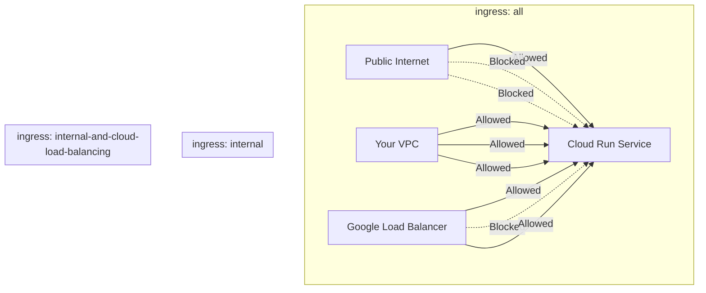

# How to Configure Cloud Run Ingress Settings to Allow Only Internal Traffic from Your VPC

Author: [nawazdhandala](https://www.github.com/nawazdhandala)

Tags: GCP, Cloud Run, Ingress, VPC, Network Security, Google Cloud

Description: Learn how to configure Cloud Run ingress settings to restrict access to only internal traffic from your VPC, blocking all public internet access.

---

By default, Cloud Run services are publicly accessible. Anyone on the internet can hit the URL. For backend microservices, internal APIs, and processing workers, that is not what you want. These services should only be reachable from within your VPC - from other Cloud Run services, GKE clusters, Compute Engine instances, or through a load balancer.

Cloud Run's ingress settings let you lock this down. This guide covers how to configure ingress restrictions, the different options available, and how they interact with IAM authentication.

## Ingress Options

Cloud Run offers three ingress settings:

**All traffic (default)**: Anyone on the internet can reach the service. Requests still need to pass IAM authentication if you have not enabled `--allow-unauthenticated`.

**Internal traffic only**: Only traffic from within your GCP project's VPC network, other GCP services in the same project, and Cloud Load Balancing can reach the service. Public internet traffic is blocked at the network level.

**Internal and Cloud Load Balancing**: Same as internal, plus traffic from Google Cloud Load Balancing. This is useful when you want public-facing traffic to go through a load balancer but block direct access to the Cloud Run URL.

Here is how traffic flows under each setting:



## Setting Ingress to Internal Only

### Using gcloud CLI

```bash
# Set ingress to internal-only during deployment
gcloud run deploy my-internal-service \
  --image=us-central1-docker.pkg.dev/MY_PROJECT/my-repo/my-app:latest \
  --region=us-central1 \
  --ingress=internal

# Update an existing service
gcloud run services update my-internal-service \
  --region=us-central1 \
  --ingress=internal
```

### Using Service YAML

```yaml
# service.yaml - Internal-only Cloud Run service
apiVersion: serving.knative.dev/v1
kind: Service
metadata:
  name: my-internal-service
  annotations:
    # Restrict to internal traffic only
    run.googleapis.com/ingress: internal
spec:
  template:
    spec:
      containers:
        - image: us-central1-docker.pkg.dev/MY_PROJECT/my-repo/my-app:latest
          ports:
            - containerPort: 8080
          resources:
            limits:
              cpu: "1"
              memory: 512Mi
```

### Using Terraform

```hcl
# Internal-only Cloud Run service
resource "google_cloud_run_v2_service" "internal_service" {
  name     = "my-internal-service"
  location = "us-central1"

  # Set ingress to internal only
  ingress = "INGRESS_TRAFFIC_INTERNAL_ONLY"

  template {
    containers {
      image = "us-central1-docker.pkg.dev/my-project/my-repo/my-app:latest"
    }
  }
}
```

The Terraform ingress values are:
- `INGRESS_TRAFFIC_ALL` - All traffic
- `INGRESS_TRAFFIC_INTERNAL_ONLY` - Internal only
- `INGRESS_TRAFFIC_INTERNAL_LOAD_BALANCER` - Internal and Cloud Load Balancing

## What Counts as "Internal" Traffic

Understanding what Cloud Run considers internal is important. Internal traffic includes:

1. **VPC traffic via Serverless VPC Access or Direct VPC Egress**: If another Cloud Run service, GKE pod, or Compute Engine VM sends a request through a VPC connector or Direct VPC Egress, it is internal.

2. **Same-project GCP services**: Requests from Pub/Sub push subscriptions, Cloud Tasks, Cloud Scheduler, and Eventarc within the same project are internal.

3. **Shared VPC traffic**: If you are using a Shared VPC, traffic from other projects in the same Shared VPC network counts as internal.

What is NOT internal:
- Direct requests from the internet, even with authentication
- Requests from other GCP projects (unless using Shared VPC)
- Requests from Cloud Functions or Cloud Run in other projects without VPC connectivity

## Calling an Internal Service from Another Cloud Run Service

If you have two Cloud Run services and one needs to call the other, the calling service needs VPC egress configured:

```bash
# Service A (caller) - needs VPC egress to reach internal Service B
gcloud run deploy service-a \
  --image=us-central1-docker.pkg.dev/MY_PROJECT/my-repo/service-a:latest \
  --region=us-central1 \
  --network=default \
  --subnet=cloud-run-subnet \
  --vpc-egress=private-ranges-only

# Service B (internal) - only accepts internal traffic
gcloud run deploy service-b \
  --image=us-central1-docker.pkg.dev/MY_PROJECT/my-repo/service-b:latest \
  --region=us-central1 \
  --ingress=internal
```

The calling service also needs to authenticate:

```python
# call_internal_service.py - Call an internal Cloud Run service from another service
import google.auth.transport.requests
import google.oauth2.id_token
import requests

def call_internal_service(url, payload):
    """
    Call an internal Cloud Run service with proper authentication.
    The calling service must have invoke permissions on the target.
    """
    # Get an ID token for the target service
    auth_req = google.auth.transport.requests.Request()
    id_token = google.oauth2.id_token.fetch_id_token(auth_req, url)

    # Make the request with the ID token
    headers = {
        "Authorization": f"Bearer {id_token}",
        "Content-Type": "application/json",
    }

    response = requests.post(url, json=payload, headers=headers)
    return response.json()
```

## Combining Ingress with IAM Authentication

Ingress settings and IAM authentication are two separate layers of security:

- **Ingress**: Controls WHERE traffic can come from (network level)
- **IAM**: Controls WHO can invoke the service (identity level)

For maximum security on internal services, use both:

```bash
# Deploy with internal ingress AND require authentication
gcloud run deploy my-internal-service \
  --image=us-central1-docker.pkg.dev/MY_PROJECT/my-repo/my-app:latest \
  --region=us-central1 \
  --ingress=internal \
  --no-allow-unauthenticated
```

This means:
1. Traffic must come from within the VPC (ingress check)
2. The caller must present a valid identity with the `roles/run.invoker` role (IAM check)

Both checks must pass for the request to succeed.

## Using Internal Services with Cloud Load Balancing

A common pattern is to put a global load balancer in front of Cloud Run for public access while blocking direct access to the Cloud Run URL:

```bash
# Set ingress to internal and load balancing
gcloud run services update my-service \
  --region=us-central1 \
  --ingress=internal-and-cloud-load-balancing
```

This way:
- Users access the service through the load balancer (public access works)
- Direct access to the `*.run.app` URL is blocked
- Internal VPC traffic can still reach the service directly

This is useful for adding Cloud CDN, Cloud Armor WAF, or custom domains through the load balancer while preventing anyone from bypassing those protections by hitting the Cloud Run URL directly.

## Calling Internal Services from Cloud Scheduler

Cloud Scheduler can invoke internal Cloud Run services directly because it is treated as internal traffic within the same project:

```bash
# Create a scheduled job targeting an internal Cloud Run service
gcloud scheduler jobs create http my-cron-job \
  --location=us-central1 \
  --schedule="*/5 * * * *" \
  --uri="https://my-internal-service-xxxxx-uc.a.run.app/cron" \
  --http-method=POST \
  --oidc-service-account-email="scheduler-sa@MY_PROJECT.iam.gserviceaccount.com"
```

The same applies to Cloud Tasks and Pub/Sub push subscriptions within the same project.

## Verifying Ingress Configuration

Check the current ingress setting:

```bash
# Describe the service and check ingress
gcloud run services describe my-internal-service \
  --region=us-central1 \
  --format="yaml(metadata.annotations['run.googleapis.com/ingress'])"
```

Test that external access is blocked:

```bash
# This should fail with a 403 if ingress is internal-only
curl -I https://my-internal-service-xxxxx-uc.a.run.app/

# Expected response:
# HTTP/2 403
```

## Troubleshooting

**"Permission denied" even from internal traffic**: Make sure the calling service has VPC egress configured. Without it, the traffic goes over the public internet and gets blocked by ingress rules.

**Cloud Scheduler or Pub/Sub cannot reach the service**: These services need to be in the same GCP project. Cross-project invocations require VPC connectivity.

**Load balancer traffic blocked**: If using a load balancer, make sure ingress is set to `internal-and-cloud-load-balancing`, not just `internal`.

```bash
# Fix: change ingress to allow load balancer traffic
gcloud run services update my-service \
  --region=us-central1 \
  --ingress=internal-and-cloud-load-balancing
```

## Summary

Cloud Run ingress settings give you network-level control over who can reach your service. For internal microservices and backend APIs, set ingress to `internal` to block all public traffic. Combine it with IAM authentication for defense in depth. For services behind a load balancer, use `internal-and-cloud-load-balancing` to allow the load balancer through while still blocking direct access. The configuration is a single flag, but the security improvement is significant.
