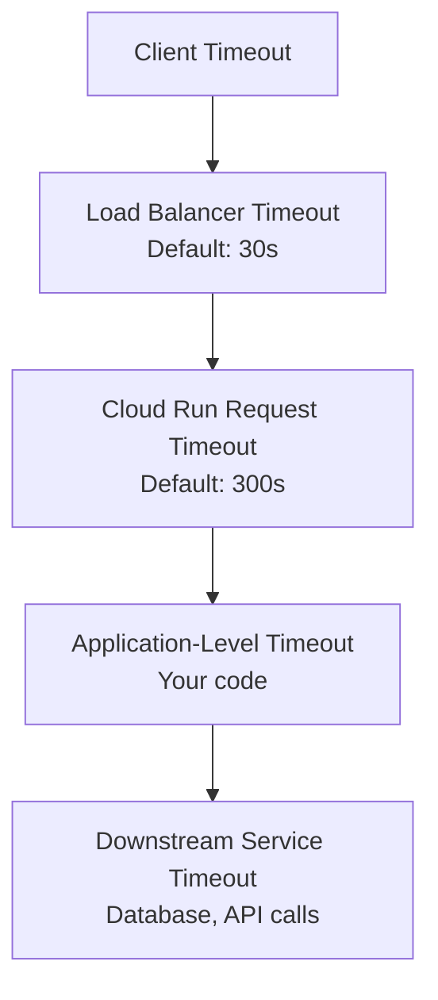

# How to Configure Cloud Run Request Timeout and Retry Policies for Long-Running Tasks

Author: [nawazdhandala](https://www.github.com/nawazdhandala)

Tags: GCP, Cloud Run, Timeout, Retry Policies, Long-Running Tasks, Google Cloud

Description: Learn how to configure Cloud Run request timeout settings and retry policies to handle long-running tasks without premature termination.

---

The default Cloud Run request timeout is 300 seconds (5 minutes). For a typical API call, that is more than enough. But if your service processes large files, runs complex reports, or handles long-running computations, 5 minutes can be too short. Your request gets killed mid-processing, the client gets a 504 error, and whatever work was done is lost.

This guide covers how to extend timeouts, set up retry policies for resilience, and design your service to handle long-running work properly.

## Understanding Cloud Run Timeouts

There are several timeout values that affect your Cloud Run service, and they interact with each other:

**Request timeout**: How long Cloud Run waits for your container to respond to a single request. Default is 300 seconds, maximum is 3600 seconds (1 hour).

**Container startup timeout**: How long Cloud Run waits for your container to start and begin listening for requests. Default is 300 seconds, configurable up to 3600 seconds.

**Idle timeout**: How long Cloud Run keeps an instance alive after it finishes processing its last request. This is not configurable - Cloud Run manages it automatically.

The request timeout is the one you usually need to adjust for long-running tasks.

## Configuring Request Timeout

### Using gcloud CLI

```bash
# Set the request timeout to 30 minutes (1800 seconds)
gcloud run deploy my-service \
  --image=us-central1-docker.pkg.dev/MY_PROJECT/my-repo/my-app:latest \
  --region=us-central1 \
  --timeout=1800

# Update timeout on an existing service
gcloud run services update my-service \
  --region=us-central1 \
  --timeout=1800
```

### Using Service YAML

```yaml
# service.yaml - Cloud Run service with extended timeout
apiVersion: serving.knative.dev/v1
kind: Service
metadata:
  name: report-generator
spec:
  template:
    spec:
      # Request timeout in seconds (max 3600)
      timeoutSeconds: 1800
      containers:
        - image: us-central1-docker.pkg.dev/MY_PROJECT/my-repo/report-generator:latest
          resources:
            limits:
              cpu: "2"
              memory: 2Gi
```

### Using Terraform

```hcl
# Cloud Run service with custom timeout
resource "google_cloud_run_v2_service" "report_generator" {
  name     = "report-generator"
  location = "us-central1"

  template {
    # Request timeout in seconds
    timeout = "1800s"

    containers {
      image = "us-central1-docker.pkg.dev/my-project/my-repo/report-generator:latest"
      resources {
        limits = {
          cpu    = "2"
          memory = "2Gi"
        }
      }
    }
  }
}
```

## CPU Allocation for Long-Running Tasks

By default, Cloud Run only allocates CPU while handling a request. For long-running tasks, make sure CPU stays allocated for the full duration:

```bash
# Combine extended timeout with always-on CPU
gcloud run deploy report-generator \
  --image=us-central1-docker.pkg.dev/MY_PROJECT/my-repo/report-generator:latest \
  --region=us-central1 \
  --timeout=3600 \
  --cpu-always-allocated \
  --cpu=2 \
  --memory=2Gi
```

Without `--cpu-always-allocated`, your long-running request might get throttled or slowed during processing.

## Retry Policies with Cloud Tasks

Cloud Run itself does not have a built-in retry mechanism for HTTP requests. If a request fails, it fails. For retry logic, you integrate with Cloud Tasks, which provides configurable retry policies:

```bash
# Create a Cloud Tasks queue with retry configuration
gcloud tasks queues create report-queue \
  --location=us-central1 \
  --max-attempts=5 \
  --min-backoff=10s \
  --max-backoff=300s \
  --max-doublings=4
```

These settings mean:
- Up to 5 attempts per task
- First retry after 10 seconds
- Backoff doubles each time (10s, 20s, 40s, 80s) up to 300s max
- After 4 doublings, wait time stays at the max

Create tasks that target your Cloud Run service:

```python
# create_task.py - Create a Cloud Task that targets Cloud Run with retries
from google.cloud import tasks_v2
import json

def create_report_task(report_id, parameters):
    """Create a Cloud Task to generate a report with automatic retries."""
    client = tasks_v2.CloudTasksClient()

    project = "MY_PROJECT"
    location = "us-central1"
    queue = "report-queue"

    parent = client.queue_path(project, location, queue)

    # Build the task
    task = {
        "http_request": {
            "http_method": tasks_v2.HttpMethod.POST,
            "url": "https://report-generator-xxxxx-uc.a.run.app/generate",
            "headers": {
                "Content-Type": "application/json",
            },
            "body": json.dumps({
                "report_id": report_id,
                "parameters": parameters,
            }).encode(),
            # Use OIDC token for authentication
            "oidc_token": {
                "service_account_email": "cloud-tasks-sa@MY_PROJECT.iam.gserviceaccount.com",
            },
        },
        # Task-level timeout (how long the task runner waits)
        "dispatch_deadline": "1800s",
    }

    response = client.create_task(parent=parent, task=task)
    print(f"Created task: {response.name}")
    return response
```

The `dispatch_deadline` on the task should match or exceed your Cloud Run request timeout. If the task deadline is shorter than the request timeout, Cloud Tasks might consider the task failed while Cloud Run is still processing.

## Retry Policies with Pub/Sub Push Subscriptions

If you are using Pub/Sub to trigger Cloud Run, the subscription has its own retry policy:

```bash
# Create a push subscription with retry settings
gcloud pubsub subscriptions create my-sub \
  --topic=my-topic \
  --push-endpoint="https://my-service-xxxxx-uc.a.run.app/" \
  --ack-deadline=600 \
  --min-retry-delay=10 \
  --max-retry-delay=600 \
  --push-auth-service-account=pubsub-sa@MY_PROJECT.iam.gserviceaccount.com
```

The `ack-deadline` defines how long Pub/Sub waits for an acknowledgment before retrying. Set it to at least as long as your expected processing time.

## Handling Timeouts Gracefully

Your application should handle timeouts gracefully rather than just dying when the clock runs out. Here is a pattern using signal handlers:

```python
# main.py - Graceful timeout handling for long-running tasks
import signal
import sys
import os
from flask import Flask, request, jsonify

app = Flask(__name__)

class TimeoutHandler:
    """Handle SIGTERM and request timeouts gracefully."""

    def __init__(self):
        self.shutting_down = False
        # Cloud Run sends SIGTERM before killing the instance
        signal.signal(signal.SIGTERM, self.handle_shutdown)

    def handle_shutdown(self, signum, frame):
        """Handle shutdown signal from Cloud Run."""
        print("Received SIGTERM - saving progress and cleaning up")
        self.shutting_down = True

timeout_handler = TimeoutHandler()

@app.route("/generate", methods=["POST"])
def generate_report():
    """Generate a report with progress tracking and graceful timeout handling."""
    data = request.get_json()
    report_id = data["report_id"]
    total_pages = data.get("total_pages", 100)

    for page in range(total_pages):
        if timeout_handler.shutting_down:
            # Save progress so the next attempt can resume
            save_progress(report_id, page)
            return jsonify({
                "status": "interrupted",
                "progress": page,
                "total": total_pages
            }), 503  # Return 503 so the retry mechanism kicks in

        # Process one page at a time
        process_page(report_id, page)

    return jsonify({"status": "complete", "report_id": report_id}), 200

def save_progress(report_id, last_page):
    """Save progress to allow resumption on retry."""
    # Store in Firestore, Redis, or Cloud Storage
    print(f"Saved progress for report {report_id} at page {last_page}")

def process_page(report_id, page_num):
    """Process a single page of the report."""
    import time
    time.sleep(0.5)  # Simulate work
    print(f"Processed page {page_num} for report {report_id}")
```

## Streaming Responses for Long Tasks

For tasks that take a long time, consider streaming the response so the client knows the request is still alive:

```python
# streaming.py - Stream progress updates during long processing
from flask import Flask, Response, stream_with_context, request
import json
import time

app = Flask(__name__)

@app.route("/process", methods=["POST"])
def process_with_streaming():
    """Process data and stream progress updates to keep the connection alive."""
    data = request.get_json()
    items = data.get("items", [])

    def generate():
        for i, item in enumerate(items):
            # Do the actual processing
            result = process_item(item)

            # Stream a progress update as a JSON line
            progress = {
                "progress": i + 1,
                "total": len(items),
                "item_result": result,
            }
            yield json.dumps(progress) + "\n"

        # Final completion message
        yield json.dumps({"status": "complete"}) + "\n"

    return Response(
        stream_with_context(generate()),
        content_type="application/x-ndjson",
    )

def process_item(item):
    """Process a single item. Replace with real logic."""
    time.sleep(1)
    return {"id": item.get("id"), "processed": True}
```

Streaming keeps the HTTP connection alive and gives the client visibility into progress. Each streamed chunk resets the client's timeout counter.

## Timeout Hierarchy

Keep this hierarchy in mind when setting timeouts:



Each layer should have a timeout that is shorter than the layer above it. If your Cloud Run timeout is 1800s but the load balancer timeout is 30s, the load balancer will kill the connection before Cloud Run finishes.

If using a global load balancer in front of Cloud Run, configure its timeout:

```bash
# Set load balancer backend timeout to match Cloud Run
gcloud compute backend-services update my-backend \
  --global \
  --timeout=1800
```

## Best Practices

1. **Use async patterns for very long tasks**: If processing takes more than 15-20 minutes, consider accepting the request immediately, processing in the background, and letting the client poll for results.

2. **Implement idempotency**: Since retries can cause duplicate processing, make sure your handler produces the same result when called multiple times with the same input.

3. **Set appropriate concurrency**: Long-running requests tie up container resources. Lower the concurrency setting so a single instance does not get overloaded.

4. **Monitor timeout rates**: Track how often requests hit the timeout limit. If it happens frequently, either increase the timeout or optimize the processing.

```bash
# Check for timeout-related errors in logs
gcloud logging read "resource.type=cloud_run_revision \
  AND resource.labels.service_name=my-service \
  AND httpRequest.status=504" \
  --limit=20
```

## Summary

For long-running tasks on Cloud Run, extend the request timeout up to 3600 seconds, pair it with always-on CPU allocation, and use Cloud Tasks or Pub/Sub for retry policies. Design your application to handle interruptions gracefully by saving progress and supporting resumption. For tasks that truly cannot fit within the 1-hour limit, switch to an async pattern where the client submits the job and polls for completion.
