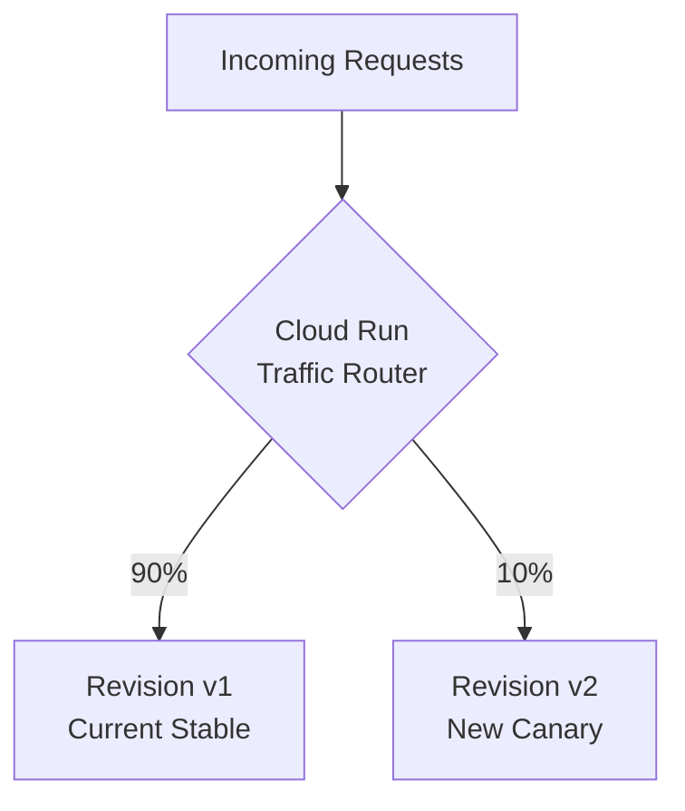

# How to Configure Cloud Run Traffic Splitting to Gradually Roll Out a New Revision

Author: [nawazdhandala](https://www.github.com/nawazdhandala)

Tags: GCP, Cloud Run, Traffic Splitting, Canary Deployment, DevOps

Description: A practical guide to using Cloud Run traffic splitting for canary deployments, gradual rollouts, and A/B testing by directing percentages of traffic to different service revisions.

---

Deploying a new version of your application to production is always a bit nerve-wracking. Even with thorough testing, real production traffic can expose issues you did not catch. Cloud Run's traffic splitting feature lets you gradually shift traffic from the old version to the new one, giving you time to monitor for problems before committing fully.

This is essentially a canary deployment strategy built right into the platform.

## How Cloud Run Traffic Splitting Works

Every time you deploy a new container image to a Cloud Run service, it creates a new **revision**. By default, Cloud Run routes 100% of traffic to the latest revision immediately. Traffic splitting changes this behavior so you can control exactly how much traffic goes to each revision.



## Step 1: Deploy Without Routing Traffic

The first step in a canary deployment is to deploy the new revision without sending any traffic to it:

```bash
# Deploy a new revision but do not route traffic to it
gcloud run deploy my-service \
  --image=us-central1-docker.pkg.dev/my-project/repo/my-app:v2 \
  --region=us-central1 \
  --no-traffic \
  --tag=canary
```

The `--no-traffic` flag deploys the revision but keeps all traffic on the current revision. The `--tag=canary` flag creates a dedicated URL for the new revision so you can test it directly.

## Step 2: Test the New Revision Directly

The tagged revision gets its own URL that you can use for testing:

```bash
# Get the canary revision URL
gcloud run services describe my-service \
  --region=us-central1 \
  --format="yaml(status.traffic)"
```

The canary URL looks like `https://canary---my-service-abc123.a.run.app`. Test it:

```bash
# Test the canary revision directly
CANARY_URL=$(gcloud run services describe my-service \
  --region=us-central1 \
  --format="value(status.traffic[tag=canary].url)")

curl "${CANARY_URL}"
```

This lets you verify the new revision works correctly before sending any production traffic to it.

## Step 3: Gradually Increase Traffic

Once you are confident the canary looks good, start sending a small percentage of production traffic to it:

```bash
# Send 5% of traffic to the canary revision
gcloud run services update-traffic my-service \
  --region=us-central1 \
  --to-tags=canary=5
```

This sends 5% of requests to the canary revision and the remaining 95% to the current stable revision. Monitor your application's error rates, latency, and logs at this point.

If everything looks good, increase the percentage:

```bash
# Increase canary traffic to 25%
gcloud run services update-traffic my-service \
  --region=us-central1 \
  --to-tags=canary=25
```

Continue ramping up:

```bash
# Increase to 50%
gcloud run services update-traffic my-service \
  --region=us-central1 \
  --to-tags=canary=50

# Increase to 75%
gcloud run services update-traffic my-service \
  --region=us-central1 \
  --to-tags=canary=75
```

## Step 4: Complete the Rollout

When you are satisfied that the new revision is stable, route 100% of traffic to it:

```bash
# Send all traffic to the canary revision
gcloud run services update-traffic my-service \
  --region=us-central1 \
  --to-tags=canary=100
```

Or, if you want to set it as the default serving revision:

```bash
# Make the canary the default revision and remove the tag
gcloud run services update-traffic my-service \
  --region=us-central1 \
  --to-latest
```

## Rolling Back

If the canary shows problems at any point, roll back by sending all traffic back to the stable revision:

```bash
# Immediate rollback - send all traffic back to the previous revision
gcloud run services update-traffic my-service \
  --region=us-central1 \
  --to-tags=canary=0
```

This is instant. Traffic stops going to the canary revision immediately. This is one of the biggest advantages of traffic splitting over traditional deployments - rollbacks take seconds, not minutes.

## Splitting Traffic Between Specific Revisions

You can also split traffic by specifying revision names directly instead of using tags:

```bash
# List all revisions to find their names
gcloud run revisions list \
  --service=my-service \
  --region=us-central1 \
  --format="table(name, active, traffic)"
```

```bash
# Split traffic between two specific revisions
gcloud run services update-traffic my-service \
  --region=us-central1 \
  --to-revisions=my-service-00005-abc=90,my-service-00006-def=10
```

## A/B Testing with Traffic Splitting

Traffic splitting is also useful for A/B testing. Deploy two versions with different features and split traffic between them:

```bash
# Deploy version A with a specific tag
gcloud run deploy my-service \
  --image=us-central1-docker.pkg.dev/my-project/repo/my-app:feature-a \
  --region=us-central1 \
  --no-traffic \
  --tag=version-a

# Deploy version B with a different tag
gcloud run deploy my-service \
  --image=us-central1-docker.pkg.dev/my-project/repo/my-app:feature-b \
  --region=us-central1 \
  --no-traffic \
  --tag=version-b

# Split traffic 50/50 between the two versions
gcloud run services update-traffic my-service \
  --region=us-central1 \
  --to-tags=version-a=50,version-b=50
```

Each version gets its own tagged URL for direct testing, and production traffic is split evenly between them.

## Automating Canary Deployments

For CI/CD pipelines, you can script the entire canary process:

```bash
#!/bin/bash
# Automated canary deployment script with health checks

SERVICE_NAME="my-service"
REGION="us-central1"
IMAGE="us-central1-docker.pkg.dev/my-project/repo/my-app:${BUILD_ID}"
HEALTH_ENDPOINT="/health"

# Step 1: Deploy the canary with no traffic
echo "Deploying canary revision..."
gcloud run deploy "${SERVICE_NAME}" \
  --image="${IMAGE}" \
  --region="${REGION}" \
  --no-traffic \
  --tag=canary

# Step 2: Get the canary URL and run smoke tests
CANARY_URL=$(gcloud run services describe "${SERVICE_NAME}" \
  --region="${REGION}" \
  --format="value(status.traffic[tag=canary].url)")

echo "Running smoke tests against ${CANARY_URL}..."
HTTP_STATUS=$(curl -s -o /dev/null -w "%{http_code}" "${CANARY_URL}${HEALTH_ENDPOINT}")

if [ "${HTTP_STATUS}" != "200" ]; then
  echo "Smoke test failed with status ${HTTP_STATUS}. Aborting canary."
  exit 1
fi

# Step 3: Gradually increase traffic with monitoring
for PERCENT in 5 25 50 75 100; do
  echo "Setting canary traffic to ${PERCENT}%..."
  gcloud run services update-traffic "${SERVICE_NAME}" \
    --region="${REGION}" \
    --to-tags=canary=${PERCENT}

  if [ "${PERCENT}" -lt 100 ]; then
    echo "Waiting 5 minutes to monitor for errors..."
    sleep 300

    # Check error rate using Cloud Monitoring
    # (simplified - in practice you'd query the monitoring API)
    ERROR_COUNT=$(gcloud logging read \
      "resource.type=cloud_run_revision AND severity>=ERROR AND timestamp>=\"$(date -u -d '-5 min' +%Y-%m-%dT%H:%M:%SZ)\"" \
      --limit=1 --format="value(severity)" | wc -l)

    if [ "${ERROR_COUNT}" -gt 10 ]; then
      echo "Error rate too high (${ERROR_COUNT} errors). Rolling back..."
      gcloud run services update-traffic "${SERVICE_NAME}" \
        --region="${REGION}" \
        --to-tags=canary=0
      exit 1
    fi
  fi
done

echo "Canary deployment complete - 100% traffic on new revision"
```

## Monitoring During Rollout

While traffic is split, you can compare metrics between revisions in Cloud Monitoring:

```bash
# Compare request latency between revisions
gcloud monitoring time-series list \
  --filter='metric.type="run.googleapis.com/request_latencies" AND resource.labels.service_name="my-service"' \
  --interval-start-time=$(date -u -d '-1 hour' +%Y-%m-%dT%H:%M:%SZ)
```

Check error rates by revision:

```bash
# Check error logs for the canary revision specifically
gcloud logging read \
  'resource.type="cloud_run_revision" AND resource.labels.service_name="my-service" AND resource.labels.revision_name~"canary" AND severity>=ERROR' \
  --limit=20
```

## Viewing Current Traffic Configuration

Always check the current traffic split before making changes:

```bash
# View the current traffic configuration
gcloud run services describe my-service \
  --region=us-central1 \
  --format="yaml(status.traffic)"
```

This shows you exactly which revisions are receiving traffic and at what percentages.

## Key Things to Remember

Traffic splitting is session-based, not request-based. Once a user is routed to a revision, subsequent requests from the same user tend to go to the same revision (though this is not guaranteed). This is good for user experience but means your canary might not catch issues that only affect specific user segments.

Also, both revisions run simultaneously, so you are paying for the compute resources of both. For cost-sensitive environments, try to complete canary rollouts within a reasonable timeframe rather than leaving traffic split for days.

Traffic splitting turns deployments from a binary event into a gradual process. That alone makes it one of the most valuable features Cloud Run offers.
