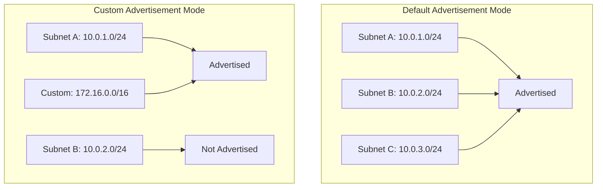

# How to Configure Cloud VPN with Custom Route Advertisements Using Cloud Router in GCP

Author: [nawazdhandala](https://www.github.com/nawazdhandala)

Tags: GCP, Cloud VPN, Cloud Router, BGP, Route Advertisements

Description: Control exactly which routes your Cloud Router advertises to VPN peers by configuring custom route advertisements, including subnet routes, custom ranges, and default routes.

---

By default, Cloud Router advertises all subnet routes in your VPC to BGP peers. This is convenient but not always what you want. Maybe you have subnets that should not be reachable from on-premises. Maybe you need to advertise a summary route instead of individual subnets. Or maybe you need to advertise routes for IP ranges that are not even in your VPC, like addresses from another VPC peered to yours. Custom route advertisements give you precise control over what your Cloud Router tells the other side of the VPN.

## How Cloud Router Route Advertisement Works

Cloud Router has two advertisement modes:

**Default mode:** Automatically advertises all subnets in the VPC where the Cloud Router lives. Simple but coarse-grained.

**Custom mode:** You explicitly define which routes to advertise. Can include a mix of subnet routes and custom IP ranges.



## When to Use Custom Route Advertisements

Common scenarios where custom advertisements are needed:

- **Security isolation:** Do not advertise database or management subnets to on-premises
- **Route summarization:** Advertise a single /16 instead of dozens of individual /24 subnets
- **Multi-VPC peering:** Advertise routes from peered VPCs that Cloud Router would not otherwise know about
- **Default route injection:** Advertise 0.0.0.0/0 to on-premises to route their internet traffic through GCP
- **Overlapping ranges:** When you need to be selective about which side of overlapping ranges to advertise

## Step 1: View Current Route Advertisements

Check what your Cloud Router is currently advertising:

```bash
# Check the current advertisement mode and advertised routes
gcloud compute routers describe your-router \
  --region=us-central1 \
  --format="yaml(bgp.advertiseMode, bgp.advertisedGroups, bgp.advertisedIpRanges)" \
  --project=your-project-id
```

Also check what routes the peer is actually receiving:

```bash
# View the status including advertised routes
gcloud compute routers get-status your-router \
  --region=us-central1 \
  --format="yaml(result.bgpPeerStatus)" \
  --project=your-project-id
```

## Step 2: Switch to Custom Advertisement Mode

### Option A: Custom Mode at the Router Level

Setting custom mode at the router level affects all BGP peers on that router:

```bash
# Switch to custom advertisement mode on the router
gcloud compute routers update your-router \
  --region=us-central1 \
  --advertisement-mode=CUSTOM \
  --set-advertisement-groups=ALL_SUBNETS \
  --set-advertisement-ranges="172.16.0.0/16=peered-vpc-range,192.168.100.0/24=shared-services" \
  --project=your-project-id
```

This configuration:
- `--advertisement-mode=CUSTOM`: Enables custom mode
- `--set-advertisement-groups=ALL_SUBNETS`: Still includes all VPC subnets (you can remove this to not advertise any subnets)
- `--set-advertisement-ranges`: Adds custom IP ranges with optional descriptions

### Option B: Custom Mode at the Peer Level

You can also set custom advertisements per BGP peer. This is useful when different peers should receive different routes:

```bash
# Set custom advertisements for a specific BGP peer
gcloud compute routers update-bgp-peer your-router \
  --peer-name=your-bgp-peer \
  --region=us-central1 \
  --advertisement-mode=CUSTOM \
  --set-advertisement-groups=ALL_SUBNETS \
  --set-advertisement-ranges="172.16.0.0/16=peered-vpc,10.100.0.0/16=custom-range" \
  --project=your-project-id
```

Peer-level settings override router-level settings for that specific peer.

## Step 3: Advertise Only Specific Subnets

To advertise only specific subnets (not all), remove the ALL_SUBNETS group and list only the ranges you want:

```bash
# Advertise only specific IP ranges (no automatic subnet advertisement)
gcloud compute routers update your-router \
  --region=us-central1 \
  --advertisement-mode=CUSTOM \
  --remove-advertisement-groups=ALL_SUBNETS \
  --set-advertisement-ranges="10.0.1.0/24=frontend-subnet,10.0.2.0/24=api-subnet" \
  --project=your-project-id
```

Now only the frontend and API subnets are advertised. The database subnet at 10.0.3.0/24 (for example) is not reachable from on-premises via this VPN.

## Step 4: Advertise a Summary Route

Instead of advertising individual subnets, advertise a summary:

```bash
# Advertise a summary route instead of individual subnets
gcloud compute routers update your-router \
  --region=us-central1 \
  --advertisement-mode=CUSTOM \
  --remove-advertisement-groups=ALL_SUBNETS \
  --set-advertisement-ranges="10.0.0.0/16=gcp-vpc-summary" \
  --project=your-project-id
```

This advertises a single /16 route that covers all your /24 subnets. The on-premises router sees one route instead of many, simplifying its routing table.

## Step 5: Advertise the Default Route

To send all on-premises internet traffic through GCP (useful for centralized internet egress with Cloud NAT or a proxy):

```bash
# Advertise the default route (0.0.0.0/0) to on-premises
gcloud compute routers update your-router \
  --region=us-central1 \
  --advertisement-mode=CUSTOM \
  --set-advertisement-groups=ALL_SUBNETS \
  --set-advertisement-ranges="0.0.0.0/0=default-route-to-internet" \
  --project=your-project-id
```

Be careful with this. Advertising a default route means on-premises traffic to the internet will flow through GCP, which adds latency and GCP egress costs. Make sure this is intentional.

## Step 6: Advertise Routes from Peered VPCs

If your VPC is peered with another VPC and you want on-premises to reach the peered VPC through the VPN:

```bash
# Advertise routes from a peered VPC
gcloud compute routers update your-router \
  --region=us-central1 \
  --advertisement-mode=CUSTOM \
  --set-advertisement-groups=ALL_SUBNETS \
  --set-advertisement-ranges="10.100.0.0/16=peered-vpc-services,10.200.0.0/16=peered-vpc-data" \
  --project=your-project-id
```

Note: For traffic to actually flow, the VPC peering must also be configured to export and import custom routes.

```bash
# Enable custom route export on the peering
gcloud compute networks peerings update your-peering \
  --network=your-vpc \
  --export-custom-routes \
  --project=your-project-id
```

## Different Advertisements for Different Peers

If you have multiple VPN connections to different on-premises sites, you might want to advertise different routes to each:

```bash
# Peer 1: Office network - gets all routes
gcloud compute routers update-bgp-peer your-router \
  --peer-name=office-peer \
  --region=us-central1 \
  --advertisement-mode=CUSTOM \
  --set-advertisement-groups=ALL_SUBNETS \
  --set-advertisement-ranges="172.16.0.0/16=peered-vpc" \
  --project=your-project-id

# Peer 2: Partner network - gets only specific routes
gcloud compute routers update-bgp-peer your-router \
  --peer-name=partner-peer \
  --region=us-central1 \
  --advertisement-mode=CUSTOM \
  --remove-advertisement-groups=ALL_SUBNETS \
  --set-advertisement-ranges="10.0.5.0/24=partner-api-subnet" \
  --project=your-project-id
```

## Verifying Route Advertisements

After making changes, verify what is being advertised:

```bash
# Check what routes are being advertised to each peer
gcloud compute routers get-status your-router \
  --region=us-central1 \
  --project=your-project-id \
  --format=yaml
```

Look at the `advertisedRoutes` section for each BGP peer to confirm the correct routes are being sent.

You can also verify from the on-premises side by checking the BGP routing table on your router.

## Updating Advertisements Without Disruption

Route advertisement changes take effect without dropping the BGP session. The Cloud Router sends a BGP UPDATE message to add or withdraw routes. However, if you remove a route that is actively in use, traffic will be disrupted until the on-premises router converges.

```bash
# Add a new advertised range (does not remove existing ones)
gcloud compute routers update your-router \
  --region=us-central1 \
  --add-advertisement-ranges="10.0.10.0/24=new-subnet" \
  --project=your-project-id

# Remove a specific advertised range
gcloud compute routers update your-router \
  --region=us-central1 \
  --remove-advertisement-ranges="10.0.5.0/24" \
  --project=your-project-id
```

Using `--add-advertisement-ranges` and `--remove-advertisement-ranges` is safer than `--set-advertisement-ranges` because it modifies the list incrementally rather than replacing it entirely.

## Monitoring Route Advertisement Changes

Set up logging to track when route advertisements change:

```bash
# View Cloud Router audit logs for configuration changes
gcloud logging read \
  'resource.type="gce_router" AND protoPayload.methodName:"routers"' \
  --project=your-project-id \
  --freshness=7d \
  --format="table(timestamp, protoPayload.methodName, protoPayload.authenticationInfo.principalEmail)"
```

This shows who changed the router configuration and when, which is useful for auditing and troubleshooting.

## Common Mistakes

1. **Forgetting ALL_SUBNETS:** When switching to custom mode, if you do not include ALL_SUBNETS, your existing subnet routes stop being advertised. This can cause an outage.

2. **Advertising too broad a range:** Advertising 10.0.0.0/8 when you only use a few /24s can cause routing conflicts if the on-premises network also uses 10.x.x.x ranges.

3. **Not considering return traffic:** Advertising a route to on-premises means on-premises can send traffic to that range. Make sure firewall rules allow the expected traffic.

4. **Overlapping custom ranges:** If you advertise overlapping ranges (like 10.0.0.0/16 and 10.0.1.0/24), the more specific route wins on the peer side. Make sure this is what you intend.

## Wrapping Up

Custom route advertisements transform Cloud Router from a simple "advertise everything" tool into a precise routing control plane. By choosing exactly which routes to advertise to each BGP peer, you can implement security isolation, route summarization, multi-VPC connectivity, and selective route distribution. The key is to start with a clear picture of what on-premises should be able to reach, configure accordingly, and verify with the router status command. Changes take effect without disrupting the BGP session, so you can adjust as your network evolves.
